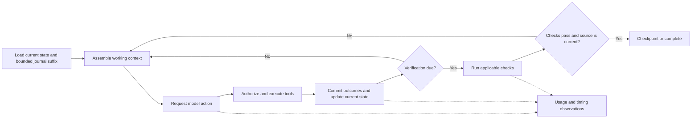

# Execution architecture review and implementation plan

Date: October 4, 2026 (America/Denver)

Status: complete proposal for owner review; implementation has not started.
Working branch: `feature/execution-engine-refinements`.

## 1. Decision and scope

Refine VCP around a short, observable execution loop: assemble useful context,
request a model action, execute authorized tools, verify changes, feed failures
back, and checkpoint progress. Make current-state access fast and context easy
for the model to use before adding more recovery policies.

The owner requested this plan after more than six hours of A/B scenario repair.
The current code and this document are to be committed locally as a checkpoint.
There is no authorization in this increment to implement this proposal, restart
scenario attempts, push, create a PR, or merge. Review comes first.

The owner also directed that deadline enforcement, billing restrictions and
cleanup be suspended during the forthcoming execution-data collection phase.
Section 3 defines that experimental policy explicitly. Older agent guidance and
design documents do not override this direction. This commit documents the
change; it does not enable it in the runtime.

The hypothesis is that the requirements are compatible, but the current
implementation couples too many independent concerns on the critical path.
Success means completed, verified work with explainable recovery and practical
latency. Preserving every existing internal mechanism is not an objective.

This is an execution-engine refinement, not a rewrite of the CLI, providers,
tools, storage formats, SDK, or product. Use the existing controller and module
boundaries. Introduce the simpler path through a narrow experimental execution
policy, not a second permanent orchestrator or a new daemon by default.

## 2. Evidence and limits of the diagnosis

The retained campaign is documented in [A/B campaign evidence](../test-plans/ab-campaign.md).
Local candidate 0.2.24 is the checkpoint for this review. Neither full scenario
was complete when the owner stopped execution.

| Observation | Architectural implication | Confidence / limitation |
|---|---|---|
| A repeatedly read seven files while compaction retained six recent pairs. One T3 attempt cost USD 4.056476 without edits. | Context organized only by recent tool pairs can destroy the working set for an ordinary edit. | Captured requests retain the original objective; this was not loss of the task prompt. Model behavior also contributes. |
| The capacity-aware twelve-pair change subsequently passed A T3 at USD 0.938990. Eleven live projections used twelve pairs; encoded inputs were 113,625–137,611 against capacity 191,296. | Preserve useful working context and measure the actual request before compacting it. | One recovered scenario stage is evidence, not a universal retention-window optimum. |
| A verbose B tool result made an otherwise compacted request too large. Bounding oversized pairs repaired the captured request. | Tool-output volume needs its own handling; a recent result is not automatically worth retaining in full. | Keep raw output available by reference. |
| B's repaired suite passed 15 tests, but native completion failed after the model did not repeat verification following an instruction refresh. | Verification scheduling and refresh handling belong to the controller. | Passing subprocess output alone is still insufficient completion evidence. |
| Later A inspection, reconciliation and resume commands took minutes around a small feature task. | State reconstruction and repeated validation must leave the ordinary command path. | Timings include startup, reconstruction and command work. Instrument these separately before attributing every delay to one function. |
| A's short deadline interrupted a provider response while tool arguments were streaming. The call was not applied. Metadata later settled the charge at USD 0.034369. | Task scheduling, provider transport, effect execution and financial observation have different lifetimes. | Earlier interrupted requests did not yield usable receipts. Receipt availability is not guaranteed. |
| Full paid runs repeatedly rediscovered lifecycle, fixture and harness problems. | Use deterministic faults and small live probes before broad scenario qualification. | Offline passing tests do not substitute for later live A/B acceptance. |

A reached successful T1–T4 qualification, including protected regressions,
legacy labels, real UI interaction tests, typechecking and builds. B had fifteen
passing tests and earlier passing SQL Server/API/Razor runtime checks; its later
regression and concurrency stages remained unqualified. A's successful deadline
cost reconciliation preceded the user-requested stop during the resume flow.
Do not report that resume or the full run as completed.

## 3. Temporary data-collection policy

Implement this policy only after plan review, as a named, durably recorded
experimental mode. Existing production/default behavior remains distinguishable.
Do not implement suspension by supplying huge fake budgets or far-future dates:
record that enforcement is disabled and retain the original observations.

| Concern | During execution-data collection | Still required |
|---|---|---|
| VCP-imposed deadlines | Suspend task/scenario elapsed-time limits, deadline-driven provider cancellation and forced short-deadline scenario probes. Do not inherit the current 150-second deadline through another layer. | Explicit user stop/cancel, process ownership, provider/platform limits and observable transport failure handling. |
| Billing restrictions | Suspend monetary admission ceilings, worst-case reservation gates, price-based route rejection and unknown-charge blockers. Financial uncertainty alone must not prevent useful execution or completion of correctness checks. | Record observed usage, tariffs, estimated cost, confirmed cost and unknown amounts separately. Never turn missing cost into zero. Only explicitly approved models/endpoints may receive data. |
| Billing cleanup | Remove synchronous receipt polling, settlement repair and billing quarantine/release work from the execution loop. Defer financial reconciliation until there is useful engine data. | Preserve request identities and evidence for later reconciliation; clearly label accounting as incomplete where applicable. |
| Artifact and history cleanup | Suspend automatic pruning, compaction of durable evidence, garbage collection and scenario-directory recycling that would erase observations. | Close handles and reap owned processes on explicit stop; contain live processes. Context projection is allowed because it does not delete source evidence. |

There is no automatic dollar cutoff in this experimental engine policy. The
earlier USD 100 campaign and its reservations remain historical records; they
must not be silently rewritten or represented as permission for additional
spending in this documentation-only increment. Before a later live collection
starts, its launch record must identify the approved mode, provider/model, scope
and operator stop mechanism. Cost observations remain visible without becoming
new blocking restrictions under another name.

Inventory every effective timeout and financial check, including inherited
profiles, transport adapters, campaign wrappers and tool/check runners. Specify
which values are removed by this mode and which limits originate outside VCP.
Use inactivity/progress observations to alert the operator; do not introduce a
hidden replacement task deadline. Retain provider context/output limits and
tool authorization. Explicit cancellation still fences new work immediately.

Unknown **billing** is different from an unknown **tool effect**. A process or
write with an uncertain outcome still requires containment and reconciliation
before conflicting work can execute. Suspension does not authorize duplicate
effects, credential exposure, cross-workspace access, modification of protected
tests, unrestricted routing, or false completion claims.

The suspension ends through an explicit policy decision after EE-07 produces a
reviewed execution-data report. EE-08 proposes calibrated controls from that
data. Do not silently restore the old controls midway through collection or make
their redesign a prerequisite for EE-02/EE-03. Disk exhaustion, host failure or
explicit user stop must produce truthful stopped/incomplete evidence; they are
not reasons to delete retained campaign data automatically.

## 4. Target execution loop

One controller owns execution transitions and publishes events after durable
commit. Provider and tool workers return typed outcomes with scope, operation ID
and starting revisions. They do not independently decide that the task is done.
Inspection reads a coherent current view without starting workers or replaying
old scheduling intents. Telemetry records what happened without creating a
second task-state authority.

Track execution state, verification state, accounting observation state and
cleanup eligibility separately. A task can have verified application results
and incomplete financial observations in collection mode. Its output must say
both. An unresolved tool mutation cannot be hidden by that separation.

## 5. Priority one: fast state access

### 5.1 Reuse the storage already present

`vcp-store` already contains materialized SQLite records, a file journal, replay
bases, commitment metadata and transaction validation. Start with those rather
than introducing another store. Inspect `backend.rs`, `store.rs`, `contract.rs`
and `replay_base.rs` for the exact cost of open, replay, materialized-state
verification and append. The owned replay changes in this checkpoint are useful
but do not establish acceptable scaling.

Keep durable history for audit and recovery. Ordinary operations should use a
validated current state at a specific watermark:

- SQLite: read the current materialized records and relevant indexes inside a
  coherent transaction, bound to the committed head and validation version.
- Files: load a sealed, non-destructive checkpoint and replay only the committed
  suffix. A checkpoint must not require pruning the old journal or artifacts.
- In-process controller: apply committed deltas to its validated state instead
  of reconstructing the workspace for each action.
- Read-only CLI commands: open the current read view directly. Provide bounded
  paging and lazy artifact reads, without constructing the entire coding owner.

A snapshot is an optimization, not a new authority. Its schema/validator version,
scope, watermark, source commitments and publication state must match the durable
head. Missing or stale caches may trigger bounded suffix recovery or an explicit
rebuild. Corruption must never fall through to trusting an unverified projection.
Preserve existing corruption detection and current access checks.

### 5.2 Validate changed state without quadratic work

Replace repeated full-state scans and serialization on each historical commit
with validation of the transaction's affected records and maintained invariants.
Maintain byte/record counts and relationship indexes transactionally. Keep a
full validator as the reference implementation and recovery/audit path. Verify
that fast and reference paths agree after every generated transaction, including
rejections; never infer correctness from matching only the final state.

Append cost should depend on the mutation and affected index entries, not all
prior events. Cold reopen after a valid checkpoint should depend on current-state
size and the suffix, not the lifetime journal. Full historical audit may remain
linear and explicitly expensive. Do not promise constant-time loading of an
arbitrarily large current state.

Retain owner fencing, revision conflicts, idempotent command receipts and atomic
publication. Recovery from interrupted checkpoint/index publication must choose
a valid committed boundary. A checksum-valid but semantically invalid interior
transaction must not become acceptable because a later transaction repairs its
visible result. No old pending intent may execute during a read or reopen.

### 5.3 Performance acceptance

Benchmark retained A/B traces and synthetic histories of 1k, 3k, 10k and 30k
commits on both backends, within supported storage bounds. Include a corpus with
fixed current-state size and growing history, and one with growing current state.
Report cold/warm open, status, task inspection, append, checkpoint and recovery
p50/p95, CPU, allocations, bytes read, records validated and suffix length.

Initial engineering targets on the recorded Windows reference host are ordinary
status p95 under 250 ms, task-summary inspection under one second, and cold open
of the retained campaign-sized state under two seconds. These are proposed
targets, not measurements. When history grows tenfold with fixed current state
and bounded suffix, ordinary open/inspection should stay within roughly twice
the measured latency; structural counters must also prove historical work is
bounded. Explain any misses with profiles and revise targets explicitly, rather
than repeatedly accepting constant-factor improvements to a superlinear path.

## 6. Priority two: simpler context management

Build a deterministic working-context packet with five parts:

1. Current objective, user corrections, source instructions and protected paths.
2. Current task position, edits/checkpoint, unresolved tool effects and required
   verification. Keep financial observations concise and non-blocking in
   collection mode; explicitly mark deadline/budget enforcement as suspended.
3. The working files and relevant ranges, identified by normalized path and
   content revision. Preserve a base reference and current diff for edited files.
4. Recent actions plus the latest useful failures and check results. Coalesce
   repeated reads of unchanged ranges; preserve multiple relevant ranges of one
   file rather than blindly replacing one read with another.
5. References to older history and large artifacts, available on demand.

Organize working context around files, edits and unresolved work, not only the
last N tool pairs. Keep full chronological evidence outside the prompt. Preserve
tool-call/result pairing required by the provider adapter; do not manufacture
tool results or promote historical output into trusted instructions.

Start with a simple deterministic working-set policy. Protect the current
objective, explicit instructions, pending operations, recent edits and latest
failure evidence. Use an explicit byte allocation and recency for the remaining
file ranges. Record why material is omitted. The correct working set is an
experiment to measure; twelve pairs is the current patch, not the architecture.

Cache packet components by content and authority revision. Invalidate on source
edits, external workspace changes, instructions/skills, root rebinding, steering,
access changes, pruning, tool schema, provider envelope and new relevant
effect/verification outcomes. A late cost observation should update its compact
status, not force rereading every application file. No stale authorized content
may be sent merely because a cache entry exists.

Encode and measure the actual provider request once at the admission boundary.
Project history only when the request needs space or a measured projection
materially improves it. Separate oversized-output handling from working-file
retention: retain actionable failure lines and an artifact reference, not tens
of kilobytes of repeated successful build output. Continue to enforce the actual
model context/output limits. Suspension of billing and deadlines does not change
those capabilities or justify removing a smaller approved fallback silently.

Acceptance includes a deterministic seven-file read/edit fixture, oversized
compiler output, repeated unchanged reads, edits to previously read ranges,
user steering, reopen, and capacity changes. Retain the captured A/B exact-codec
regressions and verify source applicability. Measure rereads, repeated identical
actions, useful context bytes, projection work, cache hits, tokens and completed
repair cycles. Do not require a model success claim to prove structural context
preservation; test that directly, then measure model outcomes separately.

### 6.1 Adaptive request and response token limits

Replace the fixed response allowance and one-size input allocation with a
controller policy that selects both for each request. Base the decision on the
current context, planned activity, recent actual usage and model capabilities.
This is an explicit part of EE-03, not a later cost-optimization feature.

Distinguish four quantities: the provider's hard capacity, the controller's
target input size, the requested response ceiling, and actual observed usage.
Use the provider adapter's qualified estimator/tokenizer and record its method
and uncertainty. The current conservative byte estimator is not an exact token
count; do not relabel byte measurements as tokens. Include instructions, schemas,
tool framing and any provider-specific reasoning allowance in capacity checks.

For each approved candidate, require the estimated encoded input plus requested
output and the justified safety margin to fit that model's real context window.
The input target is a soft working-set target within that hard boundary. A large
window is not a reason to fill it. Conversely, never drop mandatory instructions,
relevant edits or current failure evidence merely to hit a small target.

| Current activity | Input selection | Response allowance |
|---|---|---|
| Discovery / reading | Objective, current file map, requested ranges and latest observation | Small tool-call allowance; avoid paying for a large unused narrative budget. |
| Focused repair | Failing check, affected source, current diff and relevant interfaces | Enough for the expected patch and tool-call framing; grow for larger necessary edits. |
| Multi-file implementation | Coherent working set and relevant dependencies | Larger allowance when the planned edit needs it; split work at valid operation boundaries if necessary. |
| Verification / diagnostic follow-up | Current check results, changed paths and unresolved failures | Small for scheduling checks; larger only for substantive failure analysis. |
| Planning / engineering review | Scoped design context and source evidence | Size for the requested analysis, with a separate allowance for supported reasoning controls. |
| Resume | Current objective, checkpoint diff, pending work and refreshed observations | Size for the next activity, rather than inheriting the previous task's maximum. |

Choose an initial allowance from a deterministic activity class and expected
output shape, then calibrate it with recent observations for the same model and
activity. Prefer simple bounded rules before predictive machinery. Record any
estimated patch size, historical usage sample and fallback used. Unknown or new
activities receive a documented conservative allowance, not a fabricated precise
prediction. Initial numerical ranges are provisional until EE-00/EE-06 data is
available; do not declare the existing 8,192-token ceiling universally optimal.

Increase the next response allowance after a genuine token-limit stop or when a
known required patch cannot fit. Decrease it after sustained low utilization,
using hysteresis so adjacent requests do not oscillate. Preserve headroom for
tool serialization and provider reasoning where applicable. Apply changes to the
next request; never truncate an already received response to manufacture savings.

Handle capacity pressure by first removing redundant historical material and
oversized output from the prompt, then selecting relevant file ranges. If the
required working set and output still cannot fit, split the operation or choose
another already-approved capable endpoint. Do not silently shrink output below
the necessary edit size, discard mandatory context, or exclude a smaller fallback
because the packet was assembled only for the primary model. Recompute a valid
input/output allocation at provider selection without changing its real metadata.

A length-limited response is not successful completion. Preserve its evidence,
reject incomplete tool arguments and malformed partial patches, and request an
appropriately sized continuation or a smaller valid operation. Before retrying,
inspect committed tool outcomes to avoid applying a completed edit twice. Missing
usage remains unknown and must not be used as a zero-length feedback sample.

Record per request: activity and classifier version, input target and encoded
estimate, selected file/range bytes, response ceiling, estimator/margin, supported
reasoning settings, actual input/output usage when available, stop reason,
truncation, subsequent retry and useful work completed. Compare token utilization
and completed repairs, not only smaller prompts or lower output counts. Token
adaptation must not recreate monetary admission restrictions during collection.

Acceptance requires deterministic traces for short tool calls, a large patch,
repeated underuse, a length-limited response, missing usage, activity changes,
resume and a smaller approved fallback. Assert bounded adaptation, preserved
mandatory context, exact adapter limits, truthful evidence and no duplicated tool
effects. Use a small live probe to test whether the policy reduces wasted tokens
and rereads without increasing failed edits or repair cycles. Publish the result
even if a fixed allowance performs better for a particular activity.

## 7. Controller-owned verification and repair

Treat model completion as a request to finalize. The controller determines
whether applicable checks are current and successful. After a coherent edit
batch or completion request, run the declared checks through existing authorized
tool profiles. Cache results by source fingerprint, instructions, check definition
and relevant environment. Reuse them only when those inputs still match.

An instruction/scope refresh should refresh the verification plan internally and
schedule the check again when authority remains valid. The model should not need
to issue a second identical tool call. A genuine permission change still stops
the affected action for authorization.

On failure, return a concise failure packet: command/check identity, exit code,
failing cases, relevant output, affected paths and an artifact reference. Continue
the same task's repair loop. Do not launch a fresh task merely to obtain a missing
verification ritual or to reset counters. Existing `vcp_verify` remains supported
as an explicit request; it ceases to be the sole route to completion verification.

Keep independent scenario gates outside model control. Baseline acceptance,
protected tests, HTTP behavior and source-bound native checks must still pass.
Record blocked, skipped and failed checks distinctly. Duplicate errors without
source progress should produce a visible stalled status and operator notification;
do not silently loop, switch models or impose a disguised new deadline.

## 8. Later deadline, billing and cleanup design

These mechanisms are deferred from the initial optimization work. Once real
traces exist, evaluate a cooperative task deadline that stops new admission,
separate transport liveness limits, and a bounded accounting drain for requests
already admitted. Discard newly arriving tool proposals after a stop boundary;
receiving usage evidence must not grant fresh execution authority.

Keep explicit user cancellation responsive even during store work, model I/O or
verification. Fence stale workers and terminate owned processes where requested.
If evidence cannot establish an effect outcome, preserve uncertainty and prevent
conflicting side effects. Do not require a financial receipt to acknowledge the
user's stop.

For restored billing enforcement, evaluate per-request bounds based on the actual
encoded input and permitted output, with observable quoted/actual differences.
Unknown charges remain unknown and must be represented in any restored admission
calculation. Avoid making every ordinary command perform settlement work. A
separate reconciler can append authoritative observations without executing tools
or silently resuming a task. Provider-specific behavior stays behind its adapter.

Reintroduce artifact cleanup only after proving reference tracking, active-reader
pins and recoverable publication. Keep checkpoint creation separate from deletion
of old history. The data review must decide control thresholds and ownership;
this document does not preselect a replacement hard deadline, spend cap or cleanup
schedule before measurement.

## 9. Implementation work items and order

`EE-*` identifiers are proposed work items owned by this document. They refine
existing items rather than claiming that P1/P2 acceptance is already complete.
All are **planned**, with implementation gated on the owner's review.

| ID | Increment | Dependencies | Main boundaries | Acceptance / handoff |
|---|---|---|---|---|
| EE-00 | Freeze evidence and instrument the current path | Plan review | CLI, lifecycle, store, scenario harness | Reproducible baseline and phase timings; no model calls for storage replay benchmarks; measurement schema and reference host recorded. |
| EE-01 | Explicit collection policy | EE-00 | CLI profiles, lifecycle admission, model transport, campaign harness | Deadline and financial gates actually disabled in this mode; cleanup deferred; costs still observed; cancellation and security regressions pass; old enforced mode remains identifiable. |
| EE-02 | Fast current state and bounded reopen | EE-00; EE-01 for live collection | P1-04/P1-06, `vcp-store`, CLI read paths | Differential validation, crash/corruption tests and scaling targets; existing snapshot/materialization primitives reused. |
| EE-03 | Working-context packet, caching and adaptive request/response limits | EE-00; integrate with EE-02 | P2-08, `vcp-context`, lifecycle coding continuity, provider request adapters | Seven-file/oversized-output fixtures, invalidation matrix, activity-based token adaptation, truncation recovery and exact provider encoding pass; every sizing decision is explainable. |
| EE-04 | Controller-owned verification loop | EE-02, EE-03 | P2-05/P2-06, lifecycle verification, `vcp-tools` | Edit → check → failure → repair → current verification → completion works without a model verification ritual; stale results never complete a task. |
| EE-05 | Checkpoint, stop and resume through the refined path | EE-02–EE-04 | P2-07, lifecycle owner, CLI execution | Explicit pause/stop, process containment, source refresh and resume preserve scope and completed effects; no duplicate writes or provider dispatch on reopen. |
| EE-06 | Small deterministic and live vertical slice | EE-01–EE-05 | Qualification fixtures and scenario runner | Scripted faults pass; one small real edit/test/repair/reopen task produces useful timing/context data before broad paid scenarios. |
| EE-07 | A/B collection and architecture decision report | EE-06 | Existing A/B applications and independent gates | End-to-end traces, behavior results, failure taxonomy and cost observations; distinguish checkpoint reuse from fresh scaffold runs; explicit review of controls to restore. |
| EE-08 | Calibrated controls and migration | EE-07 data review | P1-05/P2-07, provider reconciliation, retention | Approved deadline/billing/cleanup policy, fault coverage, migration/rollback and operational documentation. No guessed controls made mandatory in earlier items. |

Implement EE-02 before spending effort on further billing recovery. EE-03 design
and deterministic fixtures can proceed alongside EE-02 with bounded file
ownership; integrate against the same validated-state interface. Use small
reviewable local commits per item. Future delivery actions require the owner's
scope at that time; this plan does not authorize a push or PR.

## 10. Data collection and qualification

Every run should identify candidate version/hash, dirty-source provenance,
backend, hardware, project/checkpoint hash, policy mode, provider/model/endpoint,
tool/check definitions and scenario stage. Record correlations for task, model
request, tool operation, verification and store watermark. Keep credentials and
authentication headers out of retained output and committed evidence.

Measure separate spans for process startup, store open/replay, validation,
context assembly/encoding, provider wait/streaming, tool execution, verification,
checkpoint publication and inspection. Report percentiles and sample counts,
not a single blended wall-clock number. Include execution work versus controller
overhead, bytes read/written, context composition, output truncation, cache hits,
repeated tool calls, useful edits, checks passed and financial unknowns. Include
requested versus consumed tokens by activity, response-limit stops, adaptation
decisions and their effect on task completion and repair count.

Run the qualification ladder in this order:

1. Deterministic store/context tests with captured traces and both backends.
2. Scripted provider/tool faults: partial stream, missing usage, rejection,
   disconnect, stale worker, crash boundaries, external edit and failed checks.
   Confirm collection mode continues through financial uncertainty without
   treating an unknown write as safe. Exercise enforced-mode boundaries separately.
3. One small live task using an explicitly approved capable model and exact
   endpoint. Compare end-to-end progress and observed cost, not token price alone.
4. A/B stage collection using retained checkpoints for targeted diagnosis.
5. Full A and B qualification, with separate fresh-scaffold runs before claiming
   the refined engine can create both applications from scratch.

During collection, replace the mandatory forced-deadline exercise with explicit
pause/resume coverage at a recorded checkpoint. Preserve the original deadline
tests and historical scorecards; mark that deadline-enforced full qualification
is deferred to EE-08. Label results **collection-mode qualification**, never
retroactively turn the stopped enforced-mode campaign into a pass.

Do not automatically repeat an unchanged paid failure. Diagnose its class,
change one justified variable, run the relevant deterministic check, then retry
the affected stage. A run with no progress should alert the operator and retain
the evidence. No arbitrary universal run count or comparative model campaign is
required; repeat experiments when an observed variance or unresolved question
justifies them.

EE-07's data package is sufficient for review when it includes scaling results,
context composition, adaptive token utilization and reread behavior, at least one actual edit/test/repair
cycle, explicit stop/reopen evidence, and both full A/B collection outcomes.
If a scenario remains blocked, record the cause and missing evidence; do not
claim completion or restore policy automatically to hide the gap. Report actual
cost where known and uncertainty where it is not.

## 11. Compatibility, decisions and review gates

The relevant existing contracts are [engine execution](engine-execution-design.md),
[storage and portability](storage-portability-design.md),
[context/provider design](context-provider-design.md),
[context continuity](../development/p2-context-continuity.md),
[verification](../development/p2-verification.md), and
[model rotation](model-rotation-plan.md). Existing P1-04/P1-06 and P2-05–P2-08
remain the source of reusable invariants and tests.

On implementation approval, add a superseding ADR for the experimental policy
and lifecycle separation. Update affected active plan sections and interface
documentation together; leave historical ADRs and evidence intact. Explicitly
resolve the older hard-deadline, financial-admission and pending-charge assembly
requirements for collection mode. Do not accidentally keep those blockers via
shared routing or resume helpers after documenting their suspension.

Version snapshot/index formats and validators. Prefer additive, recoverable
changes and preserve old evidence. Do not silently reopen an old enforced task
under relaxed policy: record an explicit transition or start a separately
identified collection task from a verified source checkpoint. Once a task has
run without financial enforcement, returning to enforced mode requires a
truthful admission decision about its outstanding liabilities.

Initial implementation choices are deliberately bounded: reuse the stores, use
deterministic file/range context selection, keep provider adapters, and preserve
existing tool authority. A new storage engine, long-lived background service,
model-driven context summarizer or generalized workflow framework requires
measured evidence that the simpler approach is insufficient.

The review should approve or amend the temporary policy, EE ordering, provisional
latency targets and the definition of sufficient live data. Detailed thresholds
for restored controls remain an EE-07/EE-08 decision. After review, implement one
complete increment at a time and report what changed, what was measured, which
checks passed and what remains unresolved.

## 12. Current checkpoint and stop condition

The feature-branch checkpoint includes the existing uncommitted model-rotation,
native runtime, verification, scenario harness and test repairs, plus this plan.
It preserves pre-existing work rather than presenting the entire diff as a new
architecture implementation. Candidate 0.2.24 and retained campaign artifacts
remain local; generated executables, scenario data and credentials are not part
of the source commit.

Previously run focused checks and live stage results remain evidence for their
specific changes. This documentation/checkpoint operation does not claim a new
full-workspace test pass, completed A/B acceptance or implemented policy changes.
No new distributable is being produced, so it does not increment the candidate
version. A later new binary must follow synchronized candidate-version rules.

Stop after completing this document and the requested local commit. Keep scenario
attempts and architecture implementation suspended until the owner reviews the
plan and directs the next increment.
