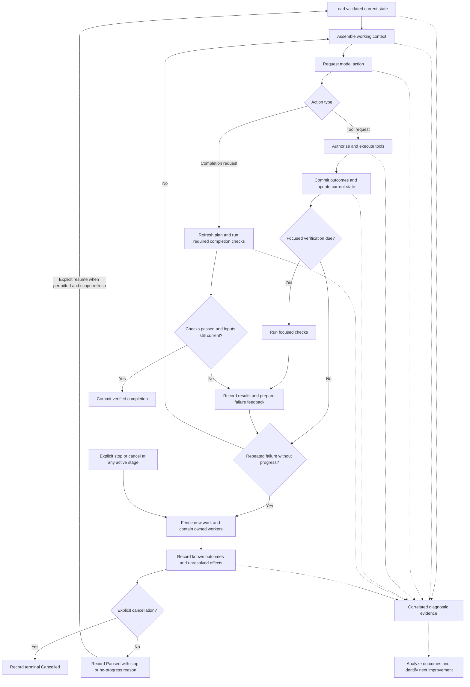

# Execution architecture review and implementation plan

Date: October 4, 2026 (America/Denver)

Status: approved for local implementation on October 4, 2026; phase evidence and commits are tracked in [the execution work ledger](../plan/25-execution-engine-refinements.md). Working branch: `feature/execution-engine-refinements`.

## 1. Decision and scope

Refine VCP around a short, observable execution loop: assemble useful context, request a model action, execute authorized tools, verify changes, feed failures back, and checkpoint progress. The primary priority is the quality of completed work: correct, complete results that satisfy the user's intent and independent acceptance checks. A secondary but very important priority is collecting and understanding sufficient diagnostics to guide continuing improvements.

This priority order governs tradeoffs, not whether the planned engineering work proceeds. Fast state access, simpler context management, adaptive limits and the other planned refinements remain active implementation goals. Pursue and measure their improvements while preserving result quality and necessary diagnostic evidence. Additional performance and cost tuning can follow later; a slower or more expensive run can still be the better outcome when it produces better verified work and more useful evidence.

The owner requested this plan after the A/B scenario repair campaign and initially authorized implementation with local phase commits. On October 5, the owner authorized correcting B's model/verification gap, pushing this feature branch, opening a PR, merging after green CI, and building and publishing the next limited beta. This delivery decision does not mark full A/B or larger-engagement acceptance complete. The retained campaign and source checkpoints remain evidence of their actual outcomes.

The owner also directed that deadline enforcement, billing restrictions and cleanup be suspended during the forthcoming execution-data collection phase. Section 3 records those suspensions for the existing execution path on this feature branch. Older agent guidance and design documents do not override this direction. This proposal documents the change; it does not enable it in the runtime.

The hypothesis is that the requirements are compatible, but the current implementation couples too many independent concerns on the critical path. Success means high-quality, verified work with explainable recovery and enough understood evidence to identify the next improvements. Preserving every existing internal mechanism is not an objective.

Implement these refinements directly in the existing execution path on `feature/execution-engine-refinements`. Update the existing execution driver and canonical worker, state access, context assembly, provider dispatch, verification and resume behavior in place. The resulting behavior is the branch's ordinary execution behavior. Do not introduce an alternative execution path, opt-in collection mode, legacy-versus-new engine selector or parallel orchestrator.

Keep useful module boundaries and durable evidence while simplifying the mechanisms that obstruct the stated goals. Preserving the old restrictive behavior as a runnable compatibility path is not an acceptance requirement. Preserve the ability to add selected constraints later through clear execution boundaries and retained observations; designing their restoration must not shape or delay the improved execution loop.

### Decisions for this review

- Review the direct changes to the existing execution path in section 3, including suspension of deadlines, financial restrictions and evidence cleanup, and checkpointed pause on repeated failure without progress.
- Confirm the priority order: result quality first and sufficient diagnostic collection and analysis second. Continue planned state-access, context and execution improvements; resolve tradeoffs in favor of quality and understanding rather than suspending that work.
- Review the real schema/ownership boundaries and subdivided sequence in section 9, including early per-request allocation, shared-driver verification repair and evidence-gated caching.
- Review the quality and diagnostic acceptance criteria in section 10 alongside measured engineering improvements. Provisional latency targets guide state-access work; speed or cost alone does not establish success or justify a quality regression.
- Confirm fail-closed checkpoint integrity and the Paused-with-reason intervention design; no change to historical validation or new public Stalled status is implicit.
- Confirm the evidence required from A/B and larger full-engagement tests in EE-07. Any selective restoration of constraints is deferred follow-up work after sufficient execution data, not a prerequisite for improving or qualifying the engine.

## 2. Evidence and limits of the diagnosis

The retained campaign is documented in [A/B campaign evidence](../test-plans/ab-campaign.md). Local candidate 0.2.24 is the checkpoint for this review. Neither full scenario was complete when the owner stopped execution.

| Observation | Architectural implication | Confidence / limitation |
|---|---|---|
| A repeatedly read seven files while compaction retained six recent pairs. One T3 attempt cost USD 4.056476 without edits. | Context organized only by recent tool pairs can destroy the working set for an ordinary edit. | Captured requests retain the original objective; this was not loss of the task prompt. Model behavior also contributes. |
| The capacity-aware twelve-pair change subsequently passed A T3 at USD 0.938990. Eleven live projections used twelve pairs; encoded inputs were 113,625–137,611 against capacity 191,296. | Preserve useful working context and measure the actual request before compacting it. | One recovered scenario stage is evidence, not a universal retention-window optimum. |
| A verbose B tool result made an otherwise compacted request too large. Bounding oversized pairs repaired the captured request. | Tool-output volume needs its own handling; a recent result is not automatically worth retaining in full. | Keep raw output available by reference. |
| B's repaired suite passed 15 tests, but native completion failed after the model did not repeat verification following an instruction refresh. | Verification scheduling and refresh handling belong to the controller. | Passing subprocess output alone is still insufficient completion evidence. |
| Later A inspection, reconciliation and resume commands took minutes around a small feature task. | Profile startup, store loading, validation, lifecycle reconstruction and reconciliation separately; remove measured avoidable work from ordinary commands. | Timings include startup, reconstruction and command work. Instrument these separately before attributing every delay to one function. |
| A's short deadline interrupted a provider response while tool arguments were streaming. The call was not applied. Metadata later settled the charge at USD 0.034369. | Task scheduling, provider transport, effect execution and financial observation have different lifetimes. | Earlier interrupted requests did not yield usable receipts. Receipt availability is not guaranteed. |
| Full paid runs repeatedly rediscovered lifecycle, fixture and harness problems. | Use deterministic faults and small live probes before broad scenario qualification. | Offline passing tests do not substitute for later live A/B acceptance. |

A reached successful T1–T4 qualification, including protected regressions, legacy labels, real UI interaction tests, typechecking and builds. B had fifteen passing tests and earlier passing SQL Server/API/Razor runtime checks; its later regression and concurrency stages remained unqualified. A's successful deadline cost reconciliation preceded the user-requested stop during the resume flow. Do not report that resume or the full run as completed.

### 2.1 Current code facts and implementation gaps

These are source observations at the feature-branch checkpoint, not measured attribution of elapsed time. Later sections describe changes still to implement.

| Boundary | Current implementation | Consequence for this plan |
|---|---|---|
| Execution ownership | [Engine controller](../../src/crates/vcp-engine/src/controller.rs) is a session lease. The retained Codex thread runs model/tool work, the canonical worker owns durable transitions, and [RetainedExecution](../../src/crates/vcp-cli/src/execution.rs) owns the event consumer and lifecycle jobs. | Add scheduling policy to the existing shared execution driver; do not assume a unified controller already implements the target loop. |
| Completion and checks | Batch [execution](../../src/crates/vcp-cli/src/app/execute.rs) fails rejected completion; [local execution](../../src/crates/vcp-cli/src/local/execution.rs) pauses. [Verification discovery](../../src/crates/vcp-tools/src/verification.rs) visits every configured requirement; [candidates](../../src/crates/vcp-lifecycle/src/foundation/worker/verification.rs) are in-memory capabilities invalidated by the effect digest, including reads. | Typed retry outcomes, focused-check selection and freshness changes are distinct work. The first repair uses the existing full requirement set. |
| Financial identity | [Budget service](../../src/crates/vcp-budget/src/service.rs) records attempt/reservation transitions; [store validation](../../src/crates/vcp-store/src/contract.rs) also enforces accounting invariants. | Removing a monetary refusal alone is insufficient. Preserve attempt identity, no-send/uncertain-send state and duplicate-send protection while changing affordability enforcement. |
| Public limits and resume | [Protocol Budget](../../src/crates/vcp-protocol/src/methods.rs) has required numeric fields; [profile settings](../../src/crates/vcp-cli/src/settings.rs) require a finite deadline. CLI resume checks and [coding configuration](../../src/crates/vcp-lifecycle/src/foundation/worker/coding.rs) reapply original limits. | Explicit unlimited semantics require coordinated protocol, domain, settings, store, generated TypeScript, SDK and extension work. |
| Harness versus runtime | [Scenario harness](../test-plans/VcpScenarioHarness.psm1) supplies the short deadline and also has process supervision and spend guards. Rust has separate task and derived bounds. | Track harness, profile and runtime suspension separately. A harness-only probe does not prove full suspension. |
| Store open | [Both backends](../../src/crates/vcp-store/src/backend.rs) replay the retained journal from the active replay base and validate whole state after each commit; SQLite then compares materialized rows. | Work amplification is confirmed; EE-00 measures its contribution to actual latency. Materialized rows currently validate state rather than serve current queries. |
| State and checkpoints | [State](../../src/crates/vcp-store/src/contract.rs) contains events, commands and transaction receipts as well as records; its serialized limit is 64 MiB. The file checkpoint is verified after replay; [replay bases](../../src/crates/vcp-store/src/replay_base.rs) are retention/redaction boundaries. | A bounded current-state representation, new digests and a non-destructive verified checkpoint are implementation work, not existing facilities to enable. |
| Read and resume costs | Read-only commands already bypass the execution owner when opening directly, but take the store lock; active-owner queries delegate. CLI resume can open the store twice before the canonical host opens it again. | Consolidating opens is an early EE-02 improvement; preserve ownership and revision fences. SQLite has primary/unique indexes, but no query indexes designed for this new read path. |
| Context baseline | [Coding assembly](../../src/crates/vcp-lifecycle/src/foundation/worker/coding.rs) permits capacity-aware twelve-pair retention only for the fixed-provider path; routing retains its configured window, six in the campaign. [Retained regressions](../../src/crates/vcp-context/tests/retained_recent_pair.rs) are ignored unless external spools are supplied. | Add routed/fixed fixtures and reduced, self-contained CI regressions. Do not claim the live retention change covers both paths or that ignored tests already protect CI. |
| Limits and encoding | Startup output defaults to 4,096, capped by profile validation at 16,384 and provider capacity. [Provider validation](../../src/crates/vcp-lifecycle/src/foundation/worker/provider.rs) requires the sealed output to equal the effective ceiling. Compaction, routing, assembly and validation encode repeatedly. | Per-request allocation changes persisted/admission contracts and ordering. It is not a small replacement of an 8,192-token constant. |
| Working-set inputs | [Read tools](../../src/crates/vcp-tools/src/read.rs) already return source version, range and continuation metadata; call arguments contain the path. History retains call/result pairs rather than an indexed file working set. | Reuse that structured metadata to build the missing index. The review's characterization of all reads as opaque strings is too strong. |
| Artifact access and truncation | [Tool schemas](../../src/crates/vcp-tools/src/schema.rs) expose workspace-file reads, not arbitrary artifact dereferencing. Incomplete responses pause the root before entering ordinary coding history. | Add a scoped artifact-read capability and an explicit safe continuation transition; neither exists merely because raw evidence is retained. |
| Prompt stability | Coding assembly captures fresh artifacts for some text parts; [request encoding](../../src/crates/vcp-models/src/request.rs) embeds artifact identities in text messages, and volatile task context precedes history. | Prompt-cache experiments need stable content/provenance representation and layout changes, not just adapter switches. Some parts are reused, so do not assume every message changes or every prefix always misses. |
| Existing diagnostics | [Inspection bundles](../../src/crates/vcp-cli/src/inspection_bundle.rs), campaign failure bundles and [event causation](../../src/crates/vcp-protocol/src/event.rs) already exist. An opt-in [store replay benchmark](../../src/crates/vcp-store/tests/replay_validation.rs) exists; it is not full phase profiling. | Extend these facilities. Complete phase instrumentation and generated differential sequences are new work; new dependencies are not inherently required. |
| Pause and observation | [TaskState](../../src/crates/vcp-domain/src/task.rs) has Paused, not Stalled. Task reason is text. [ADR-067](../adr/067-bounded-local-observation-tasks.md) permits observation without intervention. | Use Paused plus versioned reason evidence; explicitly change the observer-to-intervention contract before automatic stall pauses. |

## 3. Existing-path changes for data collection

After plan review, suspend the specified restrictions directly in the existing execution path on this feature branch. Apply the changes consistently to ordinary task execution, provider dispatch, scenario runners and resume. No separate mode or preserved enforced path is required. Record the actual constraint state and implementation revision as evidence, rather than selecting a second behavior. Do not simulate suspension with huge budgets or far-future dates.

| Concern | During execution-data collection | Still required |
|---|---|---|
| VCP-imposed deadlines | Suspend task/scenario elapsed-time limits, deadline-driven provider cancellation and forced short-deadline scenario probes. Do not inherit the current 150-second deadline through another layer. | Explicit user stop/cancel, process ownership, provider/platform limits and observable transport failure handling. |
| Billing restrictions | Suspend monetary admission ceilings, worst-case reservation gates, price-based route rejection and unknown-charge blockers. Financial uncertainty alone must not prevent useful execution or completion of correctness checks. | Record observed usage, tariffs, estimated cost, confirmed cost and unknown amounts separately. Never turn missing cost into zero. Only explicitly approved models/endpoints may receive data. |
| Billing cleanup | Remove synchronous receipt polling, settlement repair and billing quarantine/release work from the execution loop. Defer financial reconciliation until there is useful engine data. | Preserve request identities and evidence for later reconciliation; clearly label accounting as incomplete where applicable. |
| Artifact and history cleanup | Suspend saved-policy retention and resumed cleanup that would retire/delete evidence. Preserve scenario directories throughout collection; no automatic scenario-recycling implementation was found in the inspected harness. | Close handles and reap owned processes on explicit stop; contain live processes. Context projection is allowed because it does not delete source evidence. |

There is no automatic dollar cutoff in the branch's revised execution path during data collection. The earlier USD 100 campaign and its reservations remain historical records; they must not be silently rewritten or represented as permission for additional spending in this documentation-only increment. Before a later live collection starts, its launch record must identify the owner's authorization, implementation revision, suspended constraints, approved provider/model/endpoint, scope and operator stop mechanism. Recording authorization does not introduce a new mandatory spend envelope. Cost observations remain visible without becoming new blocking restrictions under another name.

Inventory every effective timeout and financial check, including inherited profiles, transport adapters, campaign wrappers and tool/check runners. Separate enforcement branches from shared schema, request identity and safety invariants; changing timer or monetary call sites alone is not a complete implementation. Use inactivity observations for diagnostics and the explicit EE-04c repeated-failure rule in section 7 to pause unproductive dispatch; neither is an elapsed-time task deadline. Retain provider context/output limits and tool authorization. Explicit cancellation still fences new work immediately.

All runs and resumes using the revised branch use the same improved execution path. Status, run summaries and structured events must identify the candidate revision and effective suspended constraints. When resuming a task created by an older candidate, retain its original observations and record the new execution revision and constraint state. Historical task metadata must not silently reactivate removed deadline or financial gates.

Unknown **billing** is different from an unknown **tool effect**. A process or write with an uncertain outcome still requires containment and reconciliation before conflicting work can execute. Suspension does not authorize duplicate effects, credential exposure, cross-workspace access, modification of protected tests, unrestricted routing, or false completion claims.

Keep these restrictions suspended while collecting small-task, full A/B and larger full-engagement execution data. EE-07 evaluates whether the evidence is sufficient; its completion does not automatically restore constraints. EE-08 is deferred, selectively scoped follow-up only if the owner decides that particular restrictions are useful. No restoration framework, old-mode compatibility matrix or dual-path test suite is required before EE-02/EE-03 or full-engagement testing. Disk exhaustion, host failure or explicit user stop must produce truthful stopped/incomplete evidence and preserve retained campaign data.

### 3.1 Financial suspension preserves request identity

Keep reserve/submit/release/uncertain transitions as the durable attempt lifecycle. They bind request capture/digest, task revisions, predecessor attempts and no-send versus possibly-sent outcomes. Remove cap-exhaustion, worst-case-affordability and unknown-cost refusal decisions while preserving attempt identity, exactly-once release, duplicate-send fencing and structural accounting validation. “Unbounded spending” must never mean “attempt without reservation.”

Update both `vcp-budget` and `vcp-store::accounting_contract`: the store independently rejects missing/mismatched reservation records and enforces ledger, daily and child caps. Define unbounded-ledger totals and overrun semantics explicitly: retain known/estimated/unknown amounts, with no fabricated finite-cap comparison. Remove monetary-affordability and missing-price eligibility gates, representing unavailable prices as unknown observations. Retain malformed-cost, currency/unit/overflow and record-identity checks alongside capacity, provider capability, data-policy and authorization checks.

### 3.2 Explicit representation and older records

Introduce a versioned `Finite(value)` / `Unbounded` representation for task monetary and elapsed-time limits. This is data shared by the existing path, not a collection-mode flag or engine selector. New branch execution records use Unbounded for the suspended constraints; finite legacy values remain decodable evidence. Cover domain ledgers, public `Budget`, profile settings, generated JSON schema/TypeScript, SDK calls, VS Code start forms and usage displays. “No cap” must display distinctly from zero and unknown cost.

Current protocol, profile and host schemas require finite values. Change their validators and consumers together; do not hide unlimited behavior behind a huge number or silently change old numeric field meanings. Preserve original accepted constraints and append an auditable execution-revision/constraint transition when resuming older tasks. Update CLI equality checks, original expiration reconstruction and worker coding-config clamps so these records cannot reapply the suspended cap/deadline. This is shared protocol/schema work, not a configuration-only task.

### 3.3 Derived bounds and the three enforcement layers

| Layer or consumer | Required change | Boundary that remains |
|---|---|---|
| Scenario harness | Remove the forced 150-second probe, scenario dollar gates and elapsed-time process-tree kill for the VCP execution being observed. Inventory helper invocations separately. | Explicit stop, owned-process containment and clearly identified diagnostic/helper failures; no hidden replacement scenario deadline. |
| Profiles and Rust task scheduling | Represent no task deadline/cap explicitly; remove expiration/exhaustion decisions and historical re-clamping on start/resume. | Current authority, state integrity and external provider/platform limits. |
| Provider response lifetime | Remove min(remaining task time, response timeout) and finite task-derived cancellation. Specify adapter transport/connect/read-failure handling independently; a total response duration is not a task deadline substitute. | Explicit cancellation and observable network/provider termination; justify any remaining transport liveness bound and record its origin. |
| Pacing queue | Preserve rate/concurrency pacing, but remove the remaining-task-time admission horizon. Queued work remains cancellable and reports actual pacing/provider failure. | Request identity and no dispatch after cancellation; no monetary or task-duration gate disguised as pacing. |
| Native process admission | Stop comparing the authorized process duration with remaining task time in both coding path selection and execution admission. | Existing per-tool process-profile ceilings, command authorization and cancellation/containment remain explicit independent contracts. |
| Verification checks | Remove check-duration-versus-task-deadline validation. Schedule checks under their authorized process-profile bounds. | Full required check results, process safety and truthful timeout/failure evidence; no task deadline inferred from suite duration. |
| MCP setup/transport | Replace inherited task deadline in MCP setup with explicit connection/transport semantics. | Existing server/tool scope, setup failures, cancellation and transport safety. |
| Reconciliation and retention | Remove synchronous financial settlement dependencies; suspend saved-policy startup retention and resumed cleanup while retaining evidence. | Financial observations and uncertain-effect handling remain distinct. Record platform-specific hooks; Windows receipt registration does not prove all accounting paths are Windows-only. |

EE-01a can support an early diagnostic probe by changing only the harness, before the representation and Rust changes. Such a probe must record all still-effective finite profile/runtime limits and cannot qualify the suspension, unbounded execution or larger-engagement acceptance. Do not simulate a missing schema with large values. Full collection under the intended behavior depends on EE-01b–e as well.

### 3.4 Test and contract disposition

Inventory actual tests at each changed boundary rather than adopting grep counts as reviewed coverage. For every affected test, record its owning contract and one disposition: retain unchanged, revise for the superseding finite/unbounded contract, or preserve as a legacy/deferred constraint fixture with an explicit qualification status. Keep active tests for attempt identity, uncertain send, duplicate dispatch, accounting consistency, corruption, permissions, cancellation and owned-process cleanup. Replace obsolete expectations that a suspended monetary/task-duration gate must fire with tests of the new branch behavior; do not merely skip failures.

Add serialization/migration and public-client tests for Unbounded, legacy numeric records, resume conversion, generated-schema agreement and UI rendering. Add route-exclusion tests proving that removing cost gates does not admit a forbidden or incapable candidate. Test derived bounds independently so no profile, wrapper or helper restores a suspended restriction. Platform-specific receipt/pacing entry points need their own targeted coverage. This inventory belongs to EE-01e and is required before claiming full suspension.

## 4. Target execution loop

The diagram is the target logical loop, not a description of a single controller object already present. Put verification/repair scheduling in the existing shared CLI execution driver, `RetainedExecution` and its lifecycle jobs in `vcp-cli/src/execution.rs`, used by batch, terminal and local-server pumps. The retained Codex thread still executes model/tool work; `CanonicalHost` and its canonical worker remain authoritative for admission, durable transitions and verification capabilities. Keep one retained event consumer and serialized scheduling decisions under the existing owner. Do not turn the engine controller lease into another orchestrator. Publish events after durable commit; workers return typed outcomes with scope, operation identity and starting revisions. Inspection reads current state without scheduling work. Diagnostics correlate what happened with the context, controller decisions, tool effects and verification evidence that explain the outcome, without creating a second task-state authority. Analysis of those records is a required part of each experiment; emitting logs alone does not satisfy this priority.

Track execution state, verification state, accounting observation state and cleanup eligibility separately. A task can have verified application results and incomplete financial observations while financial restrictions are suspended. Its output must say both. An unresolved tool mutation cannot be hidden by that separation.

## 5. Fast, reliable state access and diagnosis

Fast state access remains a concrete deliverable of this plan, together with correct current state, dependable inspection/resume and visibility into their behavior. Continue profiling and implementing measured improvements without requiring a delay to block execution first. EE-00 selects the mechanism: storage, validation, lifecycle reconstruction, synchronous reconciliation or a combination. Quality and diagnostic requirements constrain how the optimization is implemented; they do not defer EE-02. Storage optimization remains independent of controller-owned verification so both can progress.

### 5.1 Deliver the inexpensive state-access improvements first

EE-02a consolidates the sequential opens during resume and avoids repeated reconstruction across task selection, configuration and worker startup. Reuse or hand off one validated view only where owner, selected task, source revision and watermark checks remain valid; do not close a lock and later assume the view is still current. Read-only commands already avoid constructing the lifecycle execution owner, so profile their store open and lock costs rather than reimplementing that separation.

The store currently replays all retained commits and validates growing state repeatedly on both backends. SQLite's materialized tables are checked against that replay and are not the current query source. The file checkpoint is verified after full replay and can replay its prefix again; its production writer is currently conversion. Reusing those formats is useful evidence, not an already implemented fast-open mechanism. Start with measured open consolidation and validation reductions before redesigning checkpoint hydration.

### 5.2 Separate validation, representation and checkpoint trust

EE-02b reduces repeated scans and serialization while retaining the full validator as the reference. The current size check traverses serialization into a counting writer, so avoid describing it as necessarily allocating a complete serialized buffer. Maintain exact affected-record indexes and counts transactionally. Add deterministic generated valid/invalid transaction sequences and compare fast/reference acceptance, state and receipts after every step, including rejected and duplicate transactions. Seeded fixture generation and existing dependencies suffice initially; evaluate a new property-testing dependency only for a demonstrated gap.

EE-02c separates the hot current-state projection from retained events, command receipts and transaction history. Those currently live in serialized `State`, so this is a format, digest, lookup and migration increment. Keep history available and preserve idempotency, fencing, receipt identity, redaction semantics and evidence references. Define which representation each old/new digest commits to, how old state is read and verified, and how crash-safe publication works. No retention or deletion is needed to reduce the hot representation. A fixed business-record set is possible today; fixed serialized `State` with growing history is not. Benchmark those corpora under their correct names.

EE-02d introduces non-destructive checkpoint/index hydration and suffix replay only after its integrity contract is established. Existing replay bases change the active retention boundary and exclude older transaction bodies; old bytes can remain pending cleanup, but that does not make this the non-destructive snapshot required here. SQLite hydration needs explicit query/index design; file snapshots need a new publication/read contract, not simply the current conversion checkpoint.

**Integrity decision:** preserve fail-closed semantic validation on reopen. A local checksum or final-state digest alone does not prove that every earlier transition was valid. The current regression rejects a checksum-valid semantically invalid final commit; add an interior-invalid/later-valid case to ensure later state cannot conceal the violation. A snapshot shortcut must explain its trusted validation provenance, binding to immutable committed history, corruption detection and interrupted-publication behavior, and demonstrate equivalent guarantees. Full audit can be an explicit additional operation, but cannot silently replace required reopen validation.

If equivalent guarantees are not established, retain the relevant historical validation and deliver EE-02a/b/c benefits independently. Report the bounded-reopen target as outstanding. Changing to “trust the sealed head and audit history only on request” is a separate integrity decision requiring owner review; suspension of deadlines and financial caps does not authorize it. This does not defer fast-state work as a whole.

### 5.3 State-access measurements and engineering targets

Measure retained A/B traces first. Use synthetic histories of 1k, 3k, 10k and 30k commits on the campaign backend when they answer a concrete scaling or reliability question, within supported storage bounds; completing the full sweep is not a prerequisite for useful engagement data. Keep correctness and recovery tests on both backends. Extend the full performance sweep to the second backend when shared-path changes affect it or the measurements justify backend-specific work; record any unmeasured backend explicitly. Before EE-02c, use fixed business-record count with growing historical state, and a separate growing-business-state corpus. After EE-02c, add genuinely fixed hot-current-state size with growing retained history. Report cold/warm open, status, task inspection, append, checkpoint and recovery p50/p95, CPU, allocations, bytes read, records validated and suffix length.

Record cold/warm behavior and structural work as history and current state grow. Retain the provisional engineering targets on the recorded Windows host: status p95 below 250 ms, task-summary inspection below one second, and cold open of campaign-sized state below two seconds. After EE-02c/d establish the required representation and integrity contract, investigate more than roughly twofold latency growth across tenfold history growth with fixed hot state and a bounded suffix. Until then, label that target unqualified rather than using a misleading fixed-state corpus. These are targets for the active EE-02 work, not reasons to compromise correctness, discard diagnostics or delay all useful engagement testing. Report misses and remaining work honestly; revise mechanisms or targets from evidence rather than declaring speed improvements unnecessary.

## 6. Simpler context management for better results

Build a deterministic working-context packet that preserves the evidence needed for good decisions and correct edits. Smaller prompts and fewer rereads are supporting observations, not quality objectives by themselves. Use five parts:

1. Current objective, user corrections, source instructions and protected paths.
2. Current task position, edits/checkpoint, unresolved tool effects and required verification. Keep financial observations concise and non-blocking while financial restrictions are suspended; explicitly mark deadline/budget enforcement as suspended.
3. The working files and relevant ranges, identified by normalized path and content revision. Preserve a base reference and current diff for edited files.
4. Recent actions plus the latest useful failures and check results. Coalesce repeated reads of unchanged ranges; preserve multiple relevant ranges of one file rather than blindly replacing one read with another.
5. References to older history and large artifacts, backed by a scoped, bounded model-callable artifact reader implemented in EE-03a. An ID alone is not usable context.

Organize working context around files, edits and unresolved work, not only the last N tool pairs. Keep full chronological evidence outside the prompt. Preserve tool-call/result pairing required by the provider adapter; do not manufacture tool results or promote historical output into trusted instructions.

Start with a simple deterministic working-set policy. Protect the current objective, explicit instructions, pending operations, recent edits and latest failure evidence. Use an explicit byte allocation and recency for the remaining file ranges. Record why material is omitted. The correct working set is an experiment to measure. The twelve-pair patch applies only when the fixed-provider envelope permits it; routed requests still use their configured retention window. Test both explicitly.

Build the first packet directly from current validated inputs. Defer local component caching until EE-00 or an EE-06 experiment shows assembly or encoding is a material cost. Local caching is a separate optional increment with its own invalidation acceptance, not a prerequisite for preserving useful working files. Section 6.3 separates it from provider prompt caching and verification-result reuse.

Measure encoding calls and work across compaction, candidate routing, assembly and sealed-request validation. Preserve exact final request validation first; repeated encoding currently exists and cannot safely be removed by deleting checks. Reuse deterministic encoding results only when all content, schema, candidate, reasoning and envelope inputs are identical. “Encode once” is a later measured optimization, not an assumed current property. Project history when capacity requires it or evidence shows it improves the useful working context; token reduction alone is insufficient justification. Preserve the existing oversized-pair repair and its exact-codec regressions. Refine output selection to retain actionable failure lines and an artifact reference instead of repeated successful build output; keep this work separate from working-file retention. Continue to enforce the actual model context/output limits. Suspension of billing and deadlines does not change those capabilities or justify removing a smaller approved fallback silently.

Acceptance includes a deterministic seven-file read/edit fixture, oversized compiler output, repeated unchanged reads, edits to previously read ranges, user steering, reopen, and capacity changes. Keep the opt-in captured-spool regressions as historical replay tools, and add reduced, redacted or synthetic self-contained fixtures that exercise the production codec in ordinary CI without external spools. Cover fixed and routed capacity/retention behavior and verify source applicability. Measure rereads, repeated identical actions, useful context bytes, projection work, cache hits, tokens and completed repair cycles. Do not require a model success claim to prove structural context preservation; test that directly, then measure model outcomes separately.

### 6.1 Adaptive request and response token limits

Audit the coding request path, provider serialization, routing capacity checks and associated conformance fixtures before changing limit semantics. Coding currently obtains ceilings through `foundation/worker/routing.rs` and constructs the envelope in `foundation/worker/coding.rs`. The `CONVENTIONAL_OUTPUT_LIMIT` checks in `foundation/decision/admission.rs` apply to the optional decision evaluator; they do not establish a fixed coding-request limit. Keep evaluator changes outside this increment unless a traced dependency requires them.

Replace the fixed response allowance and one-size input allocation with a controller policy that selects both for each request. Base the decision on the current context, planned activity, recent actual usage and model capabilities. A bounded first policy remains an early increment, EE-03c, but its request/admission integration is substantive work. More activity classes and tuning require execution evidence; adaptive limits are not deferred wholesale until A/B qualification.

Distinguish four quantities: the provider's hard capacity, the controller's target input size, the requested response ceiling, and actual observed usage. Use the provider adapter's qualified estimator/tokenizer and record its method and uncertainty. The current conservative byte estimator is not an exact token count; do not relabel byte measurements as tokens. Include instructions, schemas, tool framing and any provider-specific reasoning allowance in capacity checks.

For each approved candidate, require the estimated encoded input plus requested output and the justified safety margin to fit that model's real context window. The input target is a soft working-set target within that hard boundary. A large window is not a reason to fill it. Conversely, never drop mandatory instructions, relevant edits or current failure evidence merely to hit a small target.

| Current activity | Input selection | Response allowance |
|---|---|---|
| Discovery / reading | Objective, current file map, requested ranges and latest observation | Allowance suited to tool-call framing, with a conservative fallback when the next output shape is unknown. |
| Focused repair | Failing check, affected source, current diff and relevant interfaces | Enough for the expected patch and tool-call framing; grow for larger necessary edits. |
| Multi-file implementation | Coherent working set and relevant dependencies | Larger allowance when the planned edit needs it; split work at valid operation boundaries if necessary. |
| Verification / diagnostic follow-up | Current check results, changed paths and unresolved failures | Small for scheduling checks; larger only for substantive failure analysis. |
| Planning / engineering review | Scoped design context and source evidence | Size for the requested analysis, with a separate allowance for supported reasoning controls. |
| Resume | Current objective, checkpoint diff, pending work and refreshed observations | Size for the next activity, rather than inheriting the previous task's maximum. |

Implement three initial controller states: ordinary work, repair after a failed check, and verification follow-up. The table describes possible refinements, not six mandatory initial classifiers. Resume derives the next state from refreshed task evidence. Select activity from explicit controller state and known work requirements; do not infer it from a guess about the model's next action. Choose the input working-set target and initial output allowance together, then calibrate with observations for the same model and activity. Prefer simple bounded rules before predictive machinery. Record any estimated patch size, historical usage sample and fallback used. Unknown or new activities receive a documented conservative allowance, not a fabricated precise prediction. Initial numerical ranges are provisional until EE-00/EE-06 data is available; use the actual startup baseline: 4,096 by default, with profile selection limited to 16,384 and clamped to provider capacity. The retained campaign used other selected values; 8,192 is not a universal code default.

Implement a per-request allocation record bound to task/activity revision, selected candidate, context manifest, schemas and reasoning settings. Distinguish host/provider hard maxima from the request's selected allowance. Replace the current equality-to-effective-host-ceiling fence with exact equality to this immutable authorized request allocation plus checks against hard maxima; do not remove the integrity fence. Update routing decision/replay evidence, reservation/attempt records, manifests and sealed-request conformance together. Add a versioned controller activity record; the proposed activity states are not already implemented.

Build the semantic working set first, then compute allocation and exact encoding for each eligible candidate before sealing the selected request. Today compaction begins with the primary codec and one output ceiling; per-candidate fitting is an assembly-order change. Retain capacity, data-policy and authorization exclusions for every candidate and record rejected allocations. Stage a fixed-provider allocation first, then routed candidates and continuation; do not claim routed acceptance from fixed-provider results.

Increase the next response allowance after a genuine token-limit stop or when a known required patch cannot fit. Decrease it after sustained low utilization, using hysteresis so adjacent requests do not oscillate. Preserve headroom for tool serialization and provider reasoning where applicable. Apply changes to the next request; never truncate an already received response to manufacture savings.

Handle capacity pressure by first removing redundant historical material and oversized output from the prompt, then selecting relevant file ranges. If the required working set and output still cannot fit, split the operation or choose another already-approved capable endpoint. Do not silently shrink output below the necessary edit size, discard mandatory context, or exclude a smaller fallback because the packet was assembled only for the primary model. Recompute a valid input/output allocation at provider selection without changing its real metadata.

A length-limited response is not successful completion. Today incomplete responses pause the root and do not enter ordinary coding history. Add an explicit typed recovery transition that retains the incomplete response and stop reason as non-executable evidence, refreshes authority and effect outcomes, and schedules a larger next request or a smaller valid operation. Distinguish capacity truncation from filtering, transport loss and unknown causes; automatic continuation is not appropriate for all incomplete responses. Reject incomplete tool arguments and malformed patches. Before retrying, inspect committed tool outcomes to avoid applying a completed edit twice. Missing usage remains unknown and must not be used as a zero-length feedback sample.

Record per request: activity and classifier version, input target and encoded estimate, selected file/range bytes, response ceiling, estimator/margin, supported reasoning settings, actual input/output usage when available, stop reason, truncation, subsequent retry and useful work completed. An unused response ceiling alone is not evidence of wasted generated tokens or spending. Evaluate correctness, completeness and quality of resulting edits first, then use actual usage, capacity pressure, truncation and retries to explain those outcomes. Smaller ceilings, prompts or output counts are not independent success criteria. Token adaptation must not recreate monetary admission restrictions during collection.

Acceptance requires deterministic traces for short tool calls, a large patch, repeated underuse, a length-limited response, missing usage, activity changes, resume and a smaller approved fallback. Assert bounded adaptation, preserved mandatory context, exact adapter limits, truthful evidence and no duplicated tool effects. Use a small live probe to test whether the policy preserves or improves result quality and supports complete edits within real capacity limits. Larger allocations are acceptable when they improve the result; investigate truncation, failed edits and repeated repairs as quality signals rather than pursuing token savings. Publish the result even if a fixed allowance performs better for a particular activity.

### 6.2 Working-set and artifact contracts

EE-03b adds a file/range index from existing tool-call arguments, read results and source probes. Store normalized root/path, full source revision, returned range, artifact identity, origin call and current applicability; preserve multiple useful ranges and invalidate them on the declared boundaries. Rebuild the index from retained evidence on reopen or persist a versioned projection if measurement justifies it. Existing reads already expose range/version metadata, but indexing those pairs and keeping them current is new work.

EE-03a adds a narrow model-callable artifact reader using the existing authorized history/artifact read boundary. Define schema, registration/allowlist identity, bounded offset/length, scope, current access and redaction/pruning checks, and tool-call/result provenance. Artifact identity must not grant filesystem access or cross-task authority. Preserve the workspace-only meaning of `vcp_read`; use a distinct scoped artifact operation. A missing or unavailable artifact returns explicit evidence, not a fabricated result. Until this tool exists, descriptions must not promise arbitrary on-demand access.

### 6.3 Separate caching experiments

| Cache | Initial policy | Evidence and acceptance before expanding |
|---|---|---|
| Local packet/component cache | Deferred; assemble from current validated inputs. | Demonstrate material assembly/encoding cost, then measure latency benefit and test every relevant invalidation boundary. |
| Provider prompt cache | Test a stable request layout through existing adapters; do not assume support or benefit across endpoints. | Record provider-reported cache reads/writes and their units where available, request-layout revision, latency, actual usage and observed task cost. Missing cache usage stays unknown. |
| Verification-result cache | Omit general reuse in the first controller loop. | Consider reuse only for checks with complete declared inputs and explicit freshness rules; external mutable dependencies are non-cacheable by default. |

Provider caching requires work on provenance identity as well as message order. Some freshly captured text artifacts change IDs on every assembly, and those IDs are encoded into messages. Introduce stable scoped content references or safely reuse unchanged artifacts while retaining a durable mapping to current authority, source hashes and capture evidence. Do not strip provenance or reuse stale instructions to obtain a matching prefix. Test request-prefix stability offline before attributing live cache changes to layout.

For provider caching experiments, place stable instructions, objective and protected-path declarations before slowly changing working-file ranges and recent actions where the adapter contract permits. Preserve deterministic order for unchanged components, instruction precedence and required tool-call/result pairing. Refresh or remove obsolete content even if doing so reduces cache reuse. Compare equivalent task outcomes; a higher cache-hit rate alone does not establish a better execution policy.

If local packet caching later earns its complexity, key components by content and authority revision. Cover source/external edits, instructions/skills, root rebinding, steering, access, tool schemas, provider envelopes and relevant effect/verification changes. Recheck current applicability before dispatch; a cached component never grants continuing authorization.

## 7. Controller-owned verification and repair

### 7.1 First slice: typed completion repair under the existing owner

EE-04a adds scheduling to shared `RetainedExecution`, while canonical verification/admission stays in the lifecycle worker. Introduce typed outcomes for missing/stale verification, genuine failed checks, instruction-scope refresh, required approval and unresolved effects. Do not infer retry permission by matching error strings. Batch currently fails rejected completion and local execution pauses; replace those unconditional outcomes only for the explicitly recoverable categories.

On a completion request with missing/stale verification, quiesce model/tool dispatch under the existing owner, discover and execute the current full configured requirement set through `CanonicalHost::verify`, then attempt completion once with the fresh capability. If a check fails, feed its result back into the same retained task for repair. If authority is missing or an effect remains uncertain, retain the existing corresponding boundary. Repeated refresh/rejection with no progress enters the bounded pause policy, rather than an unbounded verify loop. Preserve hooks, process authorization and source/current-effect completion fences.

Instruction refresh is a separate case. Today path selection returns `executed:false` deliberately so newly discovered guidance reaches the model before it reissues an operation. Preserve that rule for model-proposed tools. Record a typed refresh, deliver the refreshed context and continue through the existing owner. For controller-owned verification, build a new verification plan under the refreshed instructions and current authority; do not automatically execute the rejected tool request. This makes checks independent of a second model ritual without bypassing new guidance.

### 7.2 Focused checks and candidate freshness

The first slice uses every owner-configured requirement. Discovery does not mean arbitrary project commands, and there is currently no focused/completion selector. EE-04b may add explicit requirement identifiers and a deterministic mapping from affected paths or failed requirement IDs to a focused subset of that configured set. When mapping is absent or ambiguous, run the full set. Focused success is diagnostic feedback only; final completion requires the complete applicable requirement set. Ordinary edits need not trigger an expensive full suite.

The EE-04b implementation exposes diagnostic selection through `vcp_verify_focused`, using explicit `affected_paths` and `failed_checks` arrays. The existing strict `vcp_verify` schema and full-completion behavior remain unchanged. The focused tool uses the existing verification ceiling, respects denials for either verification name, runs alone, refreshes instructions before a model reissues a request, and retains selector/fallback evidence. It does not authorize arbitrary commands, expand child process permissions, cache a completion capability or replace full completion checks. This is an explicit request through the same owner; there is no automatic verifier after every edit. Qualification status is recorded in the implementation ledger.

Verification candidates are currently in-memory owner capabilities and their workspace-wide effect digest includes reads. Preserve that conservative behavior in EE-04a: schedule checks last and attempt completion before unrelated effects; after reopen, reverify. Narrowing invalidation is separate work requiring a dependency contract for relevant mutation, source/instruction, check-definition and environment revisions. Do not persist or reuse capabilities simply because a source hash matches. SQL Server state, dependencies and toolchains can change independently; external-state checks need fresh execution and their existing isolation rules.

On failed checks, retain command/check identity, exit code, failing cases, affected paths, excerpts and raw artifact references, then continue repair in the same task. Keep independent scenario gates outside model control and record blocked, skipped, unexecuted and failed checks distinctly. Existing `vcp_verify` remains an explicit request, but is no longer the only scheduling route.

### 7.3 Progress-based pause without a new task status

Use existing `TaskState::Paused` for lack of progress, with human-readable reason and a versioned bounded diagnostic linked to its transition, for example reason code `execution.no_progress`. The structured reason is new schema/projection work to expose consistently through protocol, SDK and extension; do not add a public `Stalled` enum variant in the first increment. Add decoding, rendering and older-record fallback tests.

Reuse `CheckObservation.failure_signature` for exact check-failure identity and extend only where another operation needs an identity. An identical signature or an advancing event watermark alone is neither a stall diagnosis nor action authority. Combine it with versioned relevant file/range evidence, changed failures, committed effects, check results and completed task steps. Repeating unchanged reads or appending logs does not reset the no-progress count.

EE-04c defines and tests the repeated-failure threshold and pause transition under the same owner. Fence dispatch, contain owned work, retain uncertain effects and checkpoint the reason; resume remains deliberate and refreshes scope/effects. Extend/supersede the non-intervening observer decision in [ADR-067](../adr/067-bounded-local-observation-tasks.md), reconcile [ADR-016](../adr/016-history-and-pause.md) and [ADR-045](../adr/045-owned-local-execution.md), and preserve the evidence/signature contracts of [ADR-029](../adr/029-retained-transition-evidence.md) and [ADR-030](../adr/030-causal-action-observations.md). This is a declared controller-policy change, not permission inferred from observation.

## 8. Preserve future options without designing restoration now

The primary work is improving results through the existing execution path, supported by sufficient diagnostics and their analysis. Selected deadline, billing or cleanup constraints can be added to that improved path later, after sufficient data from full A/B and larger engagements. Their old behavior, thresholds and machinery do not need to survive as an alternative engine.

Preserve only what makes later additions straightforward: clear boundaries for admitting a model request, authorizing a tool effect, committing an outcome, observing usage and managing retained artifacts. Keep request identities, actual/unknown financial observations, timestamps and artifact references. Reuse existing boundaries where sufficient; do not build a generalized constraint framework or new extension system for hypothetical restoration.

Explicit user cancellation, worker fencing, process containment, tool authorization and uncertain-effect handling remain current execution requirements. Keep them responsive and test them throughout the refinements. They are separate from the suspended task deadlines and financial gates; a financial receipt is never required to acknowledge a stop.

Once larger engagements provide enough evidence, a later scoped decision can select which restrictions, if any, to restore and define their semantics and tests. That work should attach to the improved execution path without reinstating the old orchestration. Detailed deadline algorithms, financial admission formulas, reconciliation services, retention schedules and transition machinery are outside the initial implementation scope. Retained evidence and clear boundaries preserve the option to implement them without making them a present priority.

## 9. Implementation work items and order

`EE-*` identifiers are proposed work items owned by this document. EE-00–EE-07 are approved for implementation, with actual progress recorded separately; EE-03d is conditional on measured benefit, and EE-08 is deferred follow-up. Umbrella IDs group independently reviewable increments below. Schema, protocol, integrity and scheduler changes are explicit scope; “first slice” does not mean they are all small.

| ID | Increment | Dependencies | Boundaries and acceptance |
|---|---|---|---|
| EE-00a | Evidence and quality definitions | Plan review | Define expected results, baseline provenance, diagnostic questions and required causal joins using existing campaign evidence; no new runtime assumed. |
| EE-00b | Phase instrumentation | EE-00a | CLI/lifecycle/store/context spans and counters using existing facilities; extend the opt-in benchmark; distinguish confirmed code work from measured latency. |
| EE-00c | Bundle integration and reconstruction | EE-00a/b | Extend inspect-bundle and harness index; demonstrate observable-chain reconstruction for scripted success/failure, preserve gaps and produce an analysis. |
| EE-01a | Harness deadline/spend removal | EE-00a/b | Remove forced short probe, execution kill timeout and scenario cost guard; retain explicit stop and evidence. Any interim runtime limits remain labeled. |
| EE-01b | Versioned explicit limit representation | EE-00a | P1-05 and public protocol/domain/profile/generated TS/SDK/extension: Unbounded plus legacy decoding, ledger semantics and client agreement. |
| EE-01c | Financial admission with durable attempt fences | EE-01b | P1-05 budget/store/routing: remove affordability gates, retain reserve/send/release/uncertain identity, integrity and nonfinancial exclusions; tests prove both. |
| EE-01d | Derived bounds and start/resume conversion | EE-01b/c | P1-05/P2-07 CLI/worker/provider/pacing/process/check/MCP: independent operational bounds, auditable older-record transition and no restored historical constraints. |
| EE-01e | Settlement/retention separation and test disposition | EE-01a–d | Remove actual critical-path financial waits and saved-policy cleanup; map changed versus retained contracts and platform coverage. Full suspension requires all EE-01 slices. |
| EE-02a | Consolidate opens and reconstruction | EE-00b | P1-04/P1-06 CLI/store/owner handoff: reduce resume opens with selection, revision and ownership fences intact; measure latency. |
| EE-02b | Incremental validation | EE-00b | P1-04 store/accounting indexes: fast/reference agreement after every generated accepted/rejected transaction; corruption and idempotency remain enforced. |
| EE-02c | Separate hot state and retained history | EE-02b | P1-04/P1-06 formats/digests/receipt lookups: explicit migration and crash publication; preserve all evidence and historical identity. |
| EE-02d | Verified checkpoint/index hydration | EE-02c and documented integrity design | Both stores: non-destructive publication and bounded suffix only with equivalent reopen guarantees. If not established, retain validation and report this target outstanding while delivering earlier improvements. |
| EE-03a | Bounded output, CI fixtures and artifact access | EE-00a | P2-08/context/tools/history: retain B repair, add normal-CI fixed/routed fixtures, and a scoped artifact-read schema/registration; artifact references become usable. |
| EE-03b | File/range working-set index | EE-03a | P2-08 context/lifecycle: index existing path/range/version evidence, invalidate/rebuild on edits and reopen, preserve authority and multiple useful ranges. |
| EE-03c1 | Per-request allocation contract | EE-01b/c, EE-03a | P1-05/P2-08 manifests/provider/admission: activity/allocation record, fixed-provider request equality and hard-bound checks, persisted attempt agreement. |
| EE-03c2 | Routed allocation and encoding order | EE-03c1 | Routing/context/providers: candidate-specific fitting before sealing; routing replay and fallback fixtures preserve capacity/data-policy exclusions. |
| EE-03c3 | Truncation evidence and continuation | EE-03c1; integrate c2 | Existing lifecycle/driver: typed incomplete outcomes, safe historical evidence, larger/smaller next operation, no execution of partial or duplicate effects. |
| EE-03d | Conditional caching/encoding refinements | Measured EE-06 need and applicable EE-03 inputs | Stable provenance/layout before prompt-cache experiments; local cache and encoding reuse need separate benefit/invalidation evidence. Not an EE-07 gate. |
| EE-04a | Shared-driver completion repair | EE-00a/c; current full requirement set | P2-05/P2-06 and P1-05 admission: typed completion/refresh outcomes, one owner-run fresh verification/recompletion attempt, failed checks return to the same task; preserve hooks and authority. |
| EE-04b | Focused selection and freshness refinement | EE-04a | Explicit mapping to configured requirement IDs; full set still required at completion; dependency-based invalidation only with proof, no persisted capability shortcut. |
| EE-04c | Progress pause and reason evidence | EE-04a, EE-00c | Paused plus versioned diagnostic/protocol projection; exact failure signature plus real progress evidence; ADR-067/016/045 reconciled and intentional resume tested. |
| EE-05 | Integrated stop and resume | EE-01, EE-04; integrate adopted EE-02/03 changes | P2-07: record effective constraints/revisions, preserve outcomes and instruction refresh, no duplicated effect or dispatch on read-only reopen. |
| EE-06 | Recurring execution experiment and analysis | First diagnostic slice: EE-00a–c, EE-01a, EE-03a, EE-04a; intended full collection: all EE-01 | Scripted faults then a small real repair; distinguish harness-only evidence from full suspension; every material increment has an analyzed comparison. |
| EE-07 | Full A/B and larger-engagement evidence review | All EE-01; scoped EE-02 acceptance; EE-03a/b/c, EE-04, EE-05 and corresponding EE-06 evidence | Independent quality assessment and causal analysis of sustained work; explicit incomplete checkpoint targets/other gaps cannot be reported as passed. No restored restrictions or cost savings required. |
| EE-08 | Deferred selective constraints, if needed | Sufficient EE-07 data and separate owner decision | Add only selected restrictions to the same improved execution path; outside initial engine-refinement completion criteria. |

Start with EE-00a/b, then integrate EE-00c and the first harness, context-fixture and completion-repair slices. A harness-only EE-06 probe can answer a narrow question before Rust limit work, but full suspension remains EE-01b–e work and must precede claims of unrestricted collection. Use scripted fixtures without paid calls for schema, accounting and instruction-refresh behavior.

Keep fast-state work active: deliver EE-02a and EE-02b independently while designing the explicit representation and checkpoint contracts for EE-02c/d. In parallel where ownership is independent, build the working-set index and request-allocation contract. Their ordering reflects real prerequisites rather than making all work wait for storage or for a universal telemetry system. An unresolved integrity design leaves that checkpoint target open; it does not stop the other state improvements or evidence collection.

Deliver EE-03c in its named slices and compare quality after each, then integrate routed continuation. Complete focused verification, declared no-progress intervention and stop/resume before full engagement qualification. Keep one existing execution path throughout. Instrument each changed boundary as it is implemented; EE-00 does not end the diagnostic work.

On approval, register subitems, dependencies and P1/P2 mappings in a dedicated `docs/plan/` file and `docs/plan/20-traceability.md`, linked to this design. Include P1-05 for EE-01, EE-03c and EE-04 admission interactions. Record the protocol/schema revisions and superseding ADRs before implementing the affected contracts. Use small reviewable increments; this plan does not authorize a push or PR.

## 10. Diagnostic collection, understanding and quality qualification

Diagnostics are a required engineering output alongside the application result. Collect enough evidence to understand both successful and unsuccessful behavior, and turn that evidence into explicit findings and follow-up decisions. Log volume, dashboard availability, token totals or timings alone do not establish understanding.

Every run should identify candidate version/hash, dirty-source provenance, backend, hardware, project/checkpoint hash, effective constraint state, provider/model/endpoint, tool/check definitions and scenario stage. Record correlations for task, model request, tool operation, verification and store watermark. Keep credentials and authentication headers out of retained output and committed evidence.

Measure separate spans for process startup, store open/replay, validation, context assembly/encoding, provider wait/streaming, tool execution, verification, checkpoint publication and inspection. Report percentiles and sample counts, not a single blended wall-clock number. Include execution work versus controller overhead, bytes read/written, context composition, output truncation, repeated tool calls, useful edits, checks passed and financial unknowns. Report local assembly-cache measurements separately from provider-reported cache read/write usage and any future verification-result reuse. Include requested versus consumed tokens by activity, response-limit stops, adaptation decisions and their effect on task completion and repair count.

Run the qualification ladder for each changed boundary in this order; the first small experiment does not require implementing all later store/context refinements:

1. Relevant deterministic tests with captured traces; exercise both backends when storage or shared state contracts change.
2. Scripted provider/tool faults: partial stream, missing usage, rejection, disconnect, stale worker, crash boundaries, external edit and failed checks. Confirm ordinary execution continues through financial uncertainty without treating an unknown write as safe, including resume of older task records. Exercise the retained authorization, cancellation and effect-safety boundaries; maintaining a separate enforced execution mode is not required.
3. A small live edit/check/failure/repair/completion task using an explicitly approved capable model and exact endpoint. Repeat the relevant slice after meaningful changes; add checkpoint/resume coverage when EE-05 is integrated. Assess result quality and explain the execution from retained evidence; observe time and cost without requiring reductions.
4. A/B stage collection using retained checkpoints for targeted diagnosis.
5. Full A and B qualification on the modified existing path, with separate fresh-scaffold runs before claiming the refined engine can create both applications from scratch.
6. Larger full engagements with sustained multi-step work, a broader file working set, repeated edit/verify/repair cycles and cross-session resume. Select concrete project scope and independent acceptance checks from what A/B has not established. Record the workload before execution; run it through the same branch engine without a special execution mode.

During collection, replace the mandatory forced-deadline exercise with explicit pause/resume coverage at a recorded checkpoint. Preserve historical deadline evidence and document which acceptance expectations are superseded by the branch's suspended constraints; retain reusable deadline fixtures for any future EE-08 work. Label current results **execution qualification with deadline, billing and cleanup restrictions suspended**, including the candidate revision. This is a description of the tested branch behavior, not a selectable engine mode. Historical failures remain failures, and current results do not claim qualification of restrictions that were not exercised.

Do not automatically repeat an unchanged paid failure. Diagnose its class, change one justified variable, run the relevant deterministic check, then retry the affected stage. An equivalent repeated failure without progress follows the checkpoint-and-pause policy in section 7; retain its evidence and require explicit resume. No arbitrary universal run count or comparative model campaign is required; repeat experiments when an observed variance or unresolved question justifies them.

EE-07's data package is sufficient for the engine review when it includes independently assessed result quality, analyzed diagnostic evidence as specified in section 10.2, state-access observations, context and adaptive-allocation decisions, actual edit/test/repair cycles, explicit stop/reopen evidence, both full A/B outcomes and the larger full-engagement results defined above. Include enough workload description and trace coverage to show whether the small-task improvements survive sustained use; do not infer that from a single successful repair. If a scenario or engagement remains blocked, record the cause and missing acceptance without claiming completion. Report actual cost where known and uncertainty where it is not. The owner may request further engagement data before considering any restored restrictions; no elapsed time, test count or EE milestone restores them automatically.

### 10.1 Quality baselines and rejection criteria

Define each engagement's expected behavior and quality criteria before running it: required functionality, correctness of changes, regression preservation, completeness and relevant user-visible behavior. Include application or artifact review where automated checks do not establish usability or fulfillment of intent; a passing command alone is not a complete quality assessment. Record evaluator/check versions and link findings to concrete outputs.

Use retained 0.2.24 evidence where it contains the required measurements. Mark missing baseline spans as missing; collect an instrumented equivalent baseline only after implementation authorization. Do not compare a resumed checkpoint run with a fresh scaffold as if they had identical work. Record candidate, provider/model/settings, project state, SQL fixtures, toolchain and relevant cache conditions for each comparison.

Define controller overhead as critical-path startup, state, assembly/encoding, scheduling and checkpoint work, excluding provider/network wait and tool/check execution. Avoid double-counting overlapping spans. Report per-turn and end-to-end overhead, total scenario wall time, time to first useful edit, unchanged rereads, repair cycles and completion outcomes. Report sample counts; a single live run does not establish a stable p95.

For matched A/B work, compare correctness, completeness, regressions and user-visible quality first, while continuing to measure the engineering improvements being implemented. State-access targets remain in section 5.3; end-to-end overhead, rereads, token usage, repair counts and cost explain tradeoffs rather than outweighing quality. More time, more context or more checks can be justified by a better result. Do not accept a quality regression because a run is cheaper or faster, or reject a quality improvement solely because it costs more. Report quality acceptance, diagnostic adequacy and performance progress separately so none conceals unfinished work in another.

| Hypothesis | Measurement | Condition that rejects or limits the change |
|---|---|---|
| Faster current-state access preserves reliable execution and diagnosis. | Correct state, recovery/inspection evidence, before/after latency, scaling and structural work counters. | Stale state, failed recovery or lost evidence rejects the optimization. Missing measured improvement leaves EE-02 work open for investigation; quality remains mandatory throughout. |
| File/range context supports better decisions and edits. | Required-range fixtures, concrete edit correctness/completeness and context-selection evidence. | Required evidence is lost or result quality regresses: revise selection. Fewer rereads or tokens cannot compensate for worse results. |
| Adaptive limits support correct, complete work within capacity. | Result quality, allocation decisions, encoded input, actual output and truncation/recovery evidence. | Allocation causes missing context, incomplete edits or degraded results: revise it or retain fixed settings for that activity. Savings are not required. |
| Controller verification closes the completion gap. | Failed check → repair → fresh required checks → completion; refresh and external-change faults. | Any stale, skipped or unexecuted required check permits completion: block qualification and fix the controller. |
| Caching justifies its additional state. | Separate local/provider cache experiments, freshness checks, latency and total task cost. | Stale content/results appear or measured benefit is absent: omit the optimization; a hit-rate increase alone is insufficient. |
| Diagnostics explain outcomes and guide improvements. | Correlated successful/failed traces, evidence-linked analysis, declared gaps and tested failure reconstruction. | A result lacks the evidence needed to investigate it, or a claimed cause is unsupported: mark diagnostic acceptance incomplete, improve capture/analysis and do not claim understanding. |
| The modified existing loop supports complete engagements. | Full independent A/B gates, larger-engagement acceptance, stop/resume evidence and classified failures. | Either scenario or a declared engagement remains incomplete: report missing acceptance and the responsible mechanism; do not declare the architecture qualified. |

Reject a mechanism when its correctness criterion fails. For performance or model-behavior comparisons, distinguish repeatable regression from sampling noise and run another bounded experiment only when it resolves a specific uncertainty. One unsuccessful run does not prove the overall requirements irreconcilable. EE-07 must state which hypotheses are supported, rejected or still untested, and recommend the next smallest change for unresolved causes.

### 10.2 Diagnostic evidence and the improvement loop

Extend `inspect-bundle` and its validated-watermark projections as the canonical diagnostic base; use the harness `failure-bundle.json` as the attempt-to-evidence index. Session export can include retained artifact bytes but omits arbitrary event/fact payloads, so it is not a substitute for the inspection bundle. Add missing phase spans, request/context links and an analysis manifest rather than starting a new telemetry service.

Use existing scope, command correlation, event causation, attempt IDs and artifact references to build an explicit join index. No universal end-to-end correlation ID exists today and one is not required for the first slice. These joins suffice only when the fixture reconstruction demonstrates the complete observable chain; missing links remain named gaps and receive a narrowly scoped identifier if necessary. Never infer causal order solely from timestamps.

EE-00 separates evidence/quality definitions from instrumentation and bundle integration. Start with monotonic `Instant` spans, existing serialization and bounded counters. Extend the existing opt-in replay benchmark; add deterministic generated fixtures for differential checks. A tracing or property-testing dependency is optional and must be justified, not assumed absent infrastructure makes it mandatory.

For each meaningful run, produce one inspectable evidence bundle with a manifest and stable references:

- **Intent and result:** task requirements, independent acceptance criteria, starting checkpoint, final diff/artifacts, check outcomes and application-quality findings.
- **Causal timeline:** correlated task, request, tool, check, controller revision and store-watermark identifiers; retries, refreshes, pauses and resumes linked to the operations that caused them. Distinguish proposed, authorized, started, committed and uncertain effects.
- **Context and request decisions:** selected/omitted file ranges and revisions, omission reasons, instruction/schema versions, effective encoded request or sufficient retained artifacts to reconstruct it, activity classification, token allocation and provider selection. Record explicit controller reasons; do not invent model reasoning.
- **Observed outcomes:** provider stop reasons and supported response evidence, applied/rejected tool calls, source changes, check failures and their later disposition, unresolved effects, and actual/estimated/unknown usage. Preserve useful output and raw artifact references beyond the bounded prompt excerpts.
- **Evidence integrity and gaps:** schema version, artifact hashes, redaction/omission markers, incomplete streams, unavailable measurements and any dropped or failed diagnostic writes. Keep credentials and sensitive authentication material out of diagnostics; mark evidence unavailable where safe retention is not possible.

Retain successful-run evidence as well as failures so improvements can be distinguished from accidental success or provider variability. Do not sample away the only explanation of a failure or remove diagnostic detail merely to hit a latency target. Record collection overhead for later tuning. Diagnostic failures must be visible, must not fabricate task outcomes or trigger duplicate effects, and must not prevent explicit user cancellation. A run can have a verified application result while its diagnostic acceptance remains incomplete; report those separately.

After each EE-06 experiment and each full-engagement stage, inspect the bundle and write a short analysis: what met or missed the quality criteria, where behavior diverged from expectation, the evidence supporting that conclusion, competing explanations and uncertainty, and the next targeted change or experiment. Prioritize follow-ups by expected quality improvement and by what they will clarify while continuing the planned engineering work. Distinguish active state/context improvements from additional performance/cost opportunities that can wait. If the evidence is insufficient, improve the collection before repeating a broad run blindly.

Validate diagnostic usefulness in EE-00c/EE-06 with a scripted successful repair and representative failures, including a context omission, a verification refresh and an interrupted tool/provider operation. An engineer should be able to reconstruct the observable sequence and distinguish a confirmed cause from a hypothesis using retained evidence, without relying on the original live session or rerunning paid calls. Link that reconstruction to the fixture's known outcome. Unexplained outcomes remain explicit investigation gaps.

EE-07 consolidates these analyses into a quality assessment and prioritized improvement backlog with evidence links, confidence and outstanding questions. Collecting the data and understanding it are separate acceptance conditions; both are required for the review package. This is a continuing feedback loop through the same execution engine, not a one-time benchmark report.

## 11. Compatibility, decisions and review gates

The relevant existing contracts are [engine execution](engine-execution-design.md), [storage and portability](storage-portability-design.md), [context/provider design](context-provider-design.md), [context continuity](../development/p2-context-continuity.md), [verification](../development/p2-verification.md), and [model rotation](model-rotation-plan.md). Existing P1-04–P1-06 and P2-05–P2-08 remain the source of reusable invariants and tests.

On implementation approval, add a superseding ADR for the direct refinement of the existing execution path, suspended restrictions and lifecycle separation. Update affected active plan sections and interface documentation together; leave historical ADRs and evidence intact. Replace the older hard-deadline, financial-admission and pending-charge assembly requirements for this branch's execution behavior. Shared routing, wrappers and resume helpers must not preserve those blockers indirectly.

Version changed snapshot/index formats and validators, preserve recoverable state and retain old evidence. Reading older records must not require preserving their old execution engine: use the branch's current execution behavior and record the revision and suspended constraints when continuing a task. Do the compatibility work necessary for correct state, effects and evidence; do not build old/new engine switching or constraint-restoration migration machinery. Any later restoration must use truthful retained observations, including unresolved charges, but its admission and transition design belongs to the separately scoped follow-up.

Initial implementation choices are deliberately bounded: reuse the stores, use deterministic file/range context selection, keep provider adapters, and preserve existing tool authority. A new storage engine, long-lived background service, model-driven context summarizer or generalized workflow framework requires measured evidence that the simpler approach is insufficient.

The review should approve or amend the existing-path changes, EE ordering, quality criteria and the definition of sufficient diagnostic collection and understanding across full engagements. The current review includes explicit unlimited schema, scheduler ownership, pause-policy and checkpoint-integrity decisions; it does not need to select restored constraints or their thresholds; EE-08 remains optional follow-up after that evidence exists. After review, implement one complete increment at a time and report what changed, what was measured, which checks passed and what remains unresolved.

## 12. Review handoff

The source checkpoint and historical campaign results remain in git history and the linked campaign evidence. This document is the proposed implementation contract, not a running session log.

The owner approved implementation on October 4, 2026. Complete phases on this feature branch with local commits and evidence in the work ledger. The plan itself is not proof of implemented behavior or passing qualification. No push, PR, release or publication is authorized.

## Implementation obstacles and continuation

The [progress blocker record](execution-engine-progress-blockers.md) documents concrete implementation dependencies, their evidence, alternatives, safe workarounds and completion conditions. Consult it with the [implementation ledger](../plan/25-execution-engine-refinements.md); neither component test results nor resolved permissions establish full scenario acceptance.
