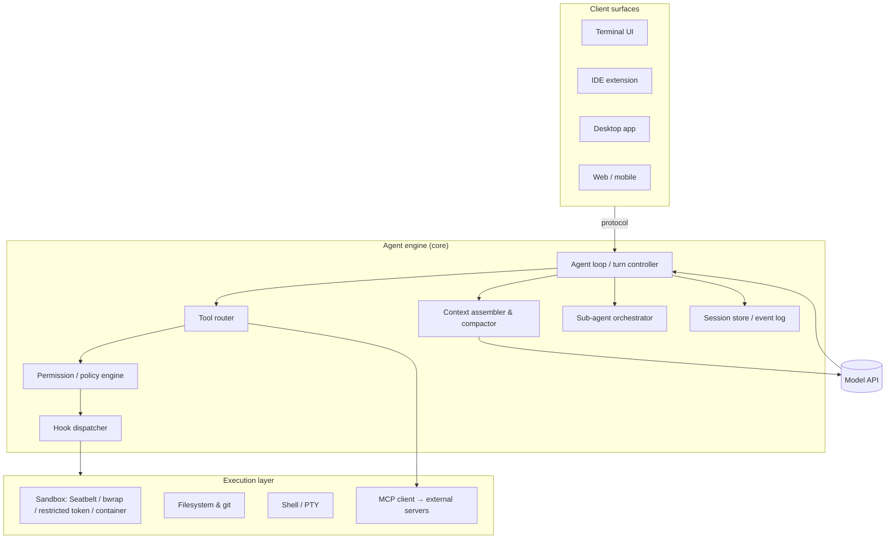
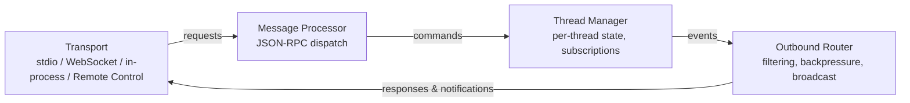
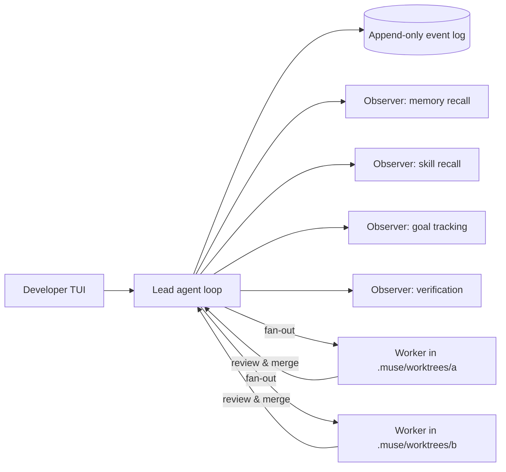
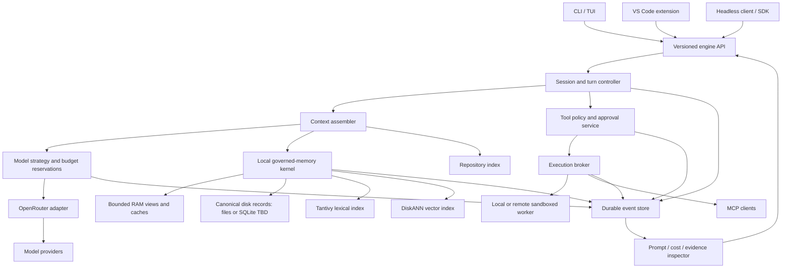

# Architectural Deconstruction of Leading AI Coding Agents

**Claude Code · OpenAI Codex · Google Gemini CLI / Antigravity CLI · Meta Muse Code · Cursor · GitHub Copilot · OpenCode · and the wider field**

*Technical architecture reference and VCP research/design workbook — expanded September 16, 2026*

---

## 0. How to read this document

This document deconstructs the leading AI coding agents ("harnesses") as software systems: process topology, agent loop, tool layer, context and memory management, permission and sandbox model, extension surfaces, multi-agent orchestration, persistence, and observability. It is written for architects who want to understand *how these tools are built*, not how to use them.

The VCP-specific research starts in [section 14](#14-vcp-requirements-and-evidence-rules), with a common investigation template in [section 15](#15-the-dossier-required-for-every-tool), individual tool investigations in [section 16](#16-tool-by-tool-deep-dive-workbooks), [Munarium memory](#17-munarium-and-the-vcp-memory-design), [OpenRouter and cost routing](#18-openrouter-and-the-vcp-model-strategy), and a [proposed VCP architecture](#19-proposed-vcp-architecture). [Section 20](#20-evaluation-plan-and-acceptance-evidence) defines experiments; [section 21](#21-decisions-deliverables-and-implementation-order) turns their results into a design. All VCP interfaces and defaults below are proposals, not implemented features.

**Reuse direction updated September 16, 2026:** the owner's subsequent instruction authorizes borrowing from the projects in [open-source.md](open-source.md), especially Codex and Gemini CLI. The current [architecture reuse policy](vcp-what.md#02-open-source-reuse-policy), component mappings, and E/M/R acceptance gates supersede the earlier no-code-borrowing constraint. Retain attribution and source revisions for reused code, ports, prompts, and fixtures; VCP's OpenRouter and local-memory requirements remain in force.

**Current product scope:** the owner's design answers are recorded in [vcp-what.md section 0.4](vcp-what.md#04-owner-decisions-and-their-design-consequences). They supersede older VCP proposals here: native Windows CLI first; API/editor/other platforms and hooks/imports later; Apache-2.0; maximum reasonable Codex reuse plus selected Munarium code; local embeddings; full history and automatic scoped memory; required MCP/skills/visible delegation; project optimization; pause/resume; and portable cloud-folder snapshots with storage choice. Use that design's current backlog and U01–U09 acceptance suites rather than treating this workbook's earlier implementation order as binding.

**Encryption clarification, September 17:** active local files, SQLite/files history and memory/indexes need no VCP encryption. Every cloud-bound VCP backup payload, manifest and index must be encrypted locally before entering the sync folder, with a developer-held recovery key stored separately. Decryption occurs on the destination machine. Provider-managed encryption or HTTPS alone is insufficient. [The current encryption/key design](vcp-what.md#1211-local-plaintext-encrypted-vaults-and-developer-keys) and ADR-019 supersede earlier encryption proposals here.

Three caveats apply throughout:

1. **Source visibility differs.** Codex, Gemini CLI, OpenCode, Cline, and Aider are open source, so their internals are directly inspectable. Claude Code, Antigravity CLI, Muse Code, Cursor, and Copilot are closed source (Claude Code ships a native binary; its documentation and Agent SDK expose the loop's semantics in detail). For closed tools, the deconstruction relies on official documentation, protocol schemas, vendor engineering posts, and reputable third-party teardowns; those sections are labelled accordingly.
2. **Evidence has different confidence levels.** Sections 1–13 preserve the original survey, which mixes vendor documentation, secondary reports, and architectural interpretation. This expansion does not certify every original version number, price, adoption statistic, internal implementation detail, or feature matrix cell. Use the directly linked primary sources and explicit evidence rules in sections 14–21 before relying on a claim in VCP's design. No competitor runtime benchmarks or crash-recovery experiments were performed for this document.
3. **Agent = model + harness + environment.** Tool design, context selection, execution policy, and model capability all affect results. Their relative contribution must be measured on comparable tasks; model quality convergence and universal superiority of one harness are not assumptions for VCP.

---

## 1. Landscape and adoption (September 2026)

| Tool | Vendor | Primary surface(s) | Language / runtime | License | Model policy |
|---|---|---|---|---|---|
| Claude Code | Anthropic | Terminal, VS Code/JetBrains, desktop app, web (claude.ai/code), iOS, GitHub Action, Agent SDK | Native binary (formerly Node/TypeScript) | Proprietary | Claude models; multiple documented hosting options (section 14.3) |
| Codex | OpenAI | Terminal (TUI), VS Code, desktop app, web (chatgpt.com/codex), mobile, cloud sandboxes, SDK | Rust (`codex-rs` Cargo workspace) with thin npm wrapper | Apache-2.0 | OpenAI default; configurable providers on supported surfaces (section 14.3) |
| Gemini CLI | Google | Terminal, IDE via ACP, GitHub Action | TypeScript / Node.js monorepo | Apache-2.0 | Gemini (API key or enterprise license only after June 18, 2026) |
| Antigravity CLI (`agy`) | Google | Terminal; shares harness with Antigravity 2.0 desktop | Go | Proprietary | Curated Gemini (plus other vendors, reported) |
| Muse Code | Meta Superintelligence Labs | Terminal and CI | Single ~97 MB static binary | Proprietary | Muse Spark 1.3 (co-trained) |
| Cursor | Anysphere | AI-first IDE (VS Code fork), CLI, Cloud Agents | Electron + TypeScript, Rust services | Proprietary | Curated multi-vendor + in-house Composer models |
| GitHub Copilot | GitHub / Microsoft | IDE extensions, CLI (`@github/copilot`), cloud "coding agent" | TypeScript | Proprietary | Curated multi-vendor with automatic routing |
| OpenCode | Anomaly (formerly SST) | Terminal TUI, headless server, IDE | TypeScript (Bun) | MIT | Bring-your-own-model, 75+ providers |

**Adoption signals.** JetBrains' August 2026 developer research found Claude Code used by roughly 39% of professional developers worldwide in May–July 2026 (47% in the US), about twice the rate of GitHub Copilot [[F2]](#references). OpenAI reports more than 5 million weekly Codex users [[F1]](#references). Copilot retains the largest installed base by seat count (20M+ users, reported) and is the enterprise default [[F3]](#references). OpenCode is the most-starred open-source harness (roughly 165–200k GitHub stars depending on the count date), ahead of the Claude Code, Codex, and Gemini CLI repositories [[F4]](#references)[[F5]](#references). The dominant workflow pattern is multi-tool: a majority of developers report using three or more agents in parallel, routing by task type [[F3]](#references).

**Structural shifts since 2025.**
- **Client/server splits.** Codex (app-server), OpenCode (`opencode serve`), Gemini CLI (cli/core packages), and Antigravity (shared harness across CLI and desktop) all separate the agent engine from the UI so that one engine serves terminal, IDE, desktop, web, and mobile clients.
- **Sub-agent fan-out with git worktree isolation** has become table stakes; Muse Code makes it the default parallelism model [[M3]](#references).
- **Durable event logs** for replay and crash recovery (Codex rollouts, Muse Code event log, Claude Code JSONL transcripts).
- **Convergent extension vocabulary.** `AGENTS.md`/`CLAUDE.md`/`GEMINI.md` instruction files, `SKILL.md` skills, lifecycle hooks, MCP servers, and plugin bundles are now implemented by nearly every harness, and cross-harness bundlers exist to render one canonical package into each vendor's layout [[F6]](#references).
- **Google's retirement of Gemini CLI.** On June 18, 2026 Gemini CLI stopped serving free, AI Pro, and AI Ultra users in favour of the closed-source, Go-based Antigravity CLI; enterprise Gemini Code Assist licenses and paid API keys retain access [[G4]](#references)[[G5]](#references).

---

## 2. A reference anatomy for coding-agent harnesses

Every tool in this document can be decomposed into the same eleven subsystems. This section defines them so that the per-tool sections can be compared directly. The framing is consistent with recent source-code taxonomies of coding-agent scaffolds [[X1]](#references)[[X2]](#references).



| # | Subsystem | What it decides |
|---|---|---|
| 1 | **Client/engine protocol** | Is the UI in-process with the loop, or a client speaking a wire protocol (JSON-RPC, ACP, HTTP/SSE)? |
| 2 | **Agent loop** | Turn semantics, stop conditions, parallel vs sequential tool dispatch, steering/interruption, loop detection |
| 3 | **Context assembly** | System prompt composition, instruction-file hierarchy, tool-schema loading (eager vs deferred), prompt caching |
| 4 | **Context compaction** | When and how history is summarized; who decides (threshold, model, user); what is pinned |
| 5 | **Tool layer** | Built-in tool set, edit primitive (search/replace vs patch vs whole-file), shell execution model |
| 6 | **Permission model** | Allow/deny rules, approval modes, classifiers, "auto" modes |
| 7 | **Sandbox** | OS-level isolation for command execution and filesystem writes |
| 8 | **Extension surfaces** | Instruction files, skills, hooks, sub-agent definitions, MCP, plugins/marketplaces |
| 9 | **Multi-agent orchestration** | Sub-agent spawning, context inheritance, worktree isolation, background/persistent agents |
| 10 | **Persistence & memory** | Session transcripts, resume/fork, cross-session memory |
| 11 | **Observability & governance** | Event logs, cost accounting, tracing, enterprise controls |

---

## 3. Claude Code (Anthropic)

*Closed source; native binary. Architecture reconstructed from official Claude Code and Agent SDK documentation, which describe the loop, message types, permission evaluation order, and context accounting in detail [[C1]](#references)[[C2]](#references), plus independent analyses [[C3]](#references)[[C4]](#references).*

### 3.1 Topology

Claude Code began (Feb 2025) as a Node.js/TypeScript CLI rendered with the Ink React-for-terminal library. By 2026 Anthropic's recommended distribution is a **native installer** (`curl … install.sh | bash` / PowerShell equivalent) that ships a self-contained binary; the same binary is bundled inside the TypeScript and Python **Agent SDKs**, so an SDK-driven agent runs literally the same loop as the interactive CLI [[C1]](#references)[[C5]](#references).

Surfaces: terminal; VS Code and JetBrains extensions; a standalone desktop app; a web app (claude.ai/code) with **Remote Control** (drive a local session from the browser or phone); iOS; a GitHub Action; and a headless `-p`/print mode for CI and scripting. **Channels** (research preview, 2026) let MCP servers push events *into* a running session — Telegram, Discord, webhooks — so external triggers can wake the agent [[C4]](#references).

Unlike Codex, there is no published client/server wire protocol; embedding is done through the Agent SDK, which spawns the binary as a subprocess and exchanges typed messages over stdio. The SDK's `sessionStore` adapter implements a **dual-write** design: the subprocess writes transcripts to local disk first, then mirrors them to a caller-supplied backend so a different host can resume the session [[C1]](#references).

### 3.2 The agent loop

The loop is deliberately simple and is the same in CLI and SDK [[C1]](#references):

1. **Receive prompt** — user input plus system prompt, tool definitions, and conversation history. An `init` system message carries session metadata; `SessionStart`/`Setup` hooks fire before it.
2. **Evaluate** — the model returns text, tool calls, or both (`AssistantMessage`).
3. **Execute tools** — hooks may intercept; results feed back as a `UserMessage`.
4. **Repeat** until a response contains no tool calls.
5. **Result** — a `ResultMessage` with final text, token usage, cost, `num_turns`, `stop_reason`, and session ID. Subtypes: `success`, `error_max_turns`, `error_max_budget_usd`, `error_during_execution`, `error_max_structured_output_retries`.

A **turn** is one round trip that includes tool calls; only tool-use turns count toward `max_turns`. Budgets (`max_budget_usd`) cover the whole sub-agent tree; on breach, spawning fails with `Budget limit reached` and background sub-agents are stopped. **Effort** (`low`/`medium`/`high`/`xhigh`/`max`) is a per-session or per-sub-agent knob independent of extended thinking [[C1]](#references).

**Parallel dispatch.** When the model requests several tools in one turn, read-only tools (`Read`, `Glob`, `Grep`, MCP tools annotated `readOnlyHint`) run concurrently; state-mutating tools (`Edit`, `Write`, `Bash`) run sequentially [[C1]](#references).

### 3.3 Tool layer

| Category | Tools |
|---|---|
| File ops | `Read`, `Edit` (exact-string replace), `Write` |
| Search | `Glob`, `Grep` (ripgrep-backed) |
| Execution | `Bash` (persistent shell, background jobs) |
| Web | `WebSearch`, `WebFetch` |
| Discovery | `ToolSearch` — loads tool schemas on demand rather than preloading |
| Orchestration | `Agent` (spawn sub-agent), `Skill`, `AskUserQuestion`, `TaskCreate`/`TaskUpdate` |

`ToolSearch` is architecturally significant: MCP tool schemas are **deferred by default**, so a session with many MCP servers no longer pays their full schema cost on every request; the model searches for and loads tools as needed, falling back to eager loading on unsupported models/platforms [[C1]](#references).

### 3.4 Context assembly and compaction

Context accumulates across turns and never resets within a session. Stable prefixes — system prompt, tool definitions, `CLAUDE.md` — are **prompt-cached**. The documented context accounting is [[C1]](#references):

| Source | Load timing | Cost profile |
|---|---|---|
| System prompt | every request | fixed, cached |
| `CLAUDE.md` hierarchy | session start | full content every request, cached |
| Built-in tool schemas | every request | fixed |
| MCP tool schemas | deferred via ToolSearch | on demand |
| Skill descriptions | session start | short summaries; body loads only on invocation |
| Conversation history | accumulates | dominant cost in long sessions |

**Compaction** is automatic when the window nears its limit: older history is replaced with a model-written summary, emitting a `compact_boundary` system message. Three customization points exist: summarization instructions inside `CLAUDE.md` (the compactor reads it), a `PreCompact` hook (receives `trigger: manual|auto`, commonly used to archive the full transcript), and manual `/compact`. Because compaction can drop early instructions, durable rules belong in `CLAUDE.md`, which is re-injected every request [[C1]](#references).

**`CLAUDE.md` hierarchy.** Managed (organization) → user (`~/.claude/CLAUDE.md`) → project (`./CLAUDE.md`, committed) → local (`CLAUDE.local.md`) → subdirectory files loaded lazily as the agent touches those paths. `@path` imports are supported. Settings follow a parallel `settings.json` hierarchy with the same precedence [[C6]](#references).

### 3.5 Permission model

Permissions are evaluated in a fixed order combining rule lists and a mode [[C1]](#references):

- `allowedTools` / `disallowedTools`, with scoped rules such as `Bash(npm *)`, `Edit(src/**)`, `mcp__server__tool`.
- **Modes:** `default` (unlisted tools go to a `canUseTool` callback / interactive prompt), `acceptEdits` (auto-approve file edits and benign filesystem commands), `plan` (read-only exploration; edits always prompt), `dontAsk` (hard deny for anything not pre-approved — for headless agents), `auto` (a **model-based classifier** approves or denies prompts), and `bypassPermissions` (no prompts; refuses to run as root on Unix; SDK requires `allowDangerouslySkipPermissions`).
- Organization controls can force `ask` on connector tools; MCP tools can declare `requiresUserInteraction`.

Longitudinal telemetry cited in an April 2026 analysis shows auto-approve rates rising from ~20% for new users to over 40% by 750 sessions, which is why the permission system is designed as a trust ramp rather than a fixed gate [[C3]](#references).

### 3.6 Sandbox

Since late 2025 Claude Code can run `Bash` inside an OS sandbox — Seatbelt on macOS, bubblewrap on Linux — with filesystem and network restrictions, so that the permission prompt for shell commands can be relaxed without giving the agent host-wide access. Sandbox and permission are complementary layers: permission decides *whether* a tool runs; sandbox bounds *what it can touch* [[C6]](#references).

### 3.7 Extension surfaces

Claude Code's extension model is the most differentiated of the group and has been widely cloned [[C3]](#references)[[C4]](#references):

| Surface | Form | Loads into context? | Purpose |
|---|---|---|---|
| `CLAUDE.md` | Markdown | Always | Standing project rules |
| **Skills** | `SKILL.md` + support files, frontmatter controls auto-invocation, `/` visibility, and whether to run in a sub-agent | Description only until invoked | Reusable procedures; every skill is also a slash command |
| **Sub-agents** | `.claude/agents/*.md` with own system prompt, tool allow-list, model, effort | Never — isolated context; only the final message returns to the parent | Delegated research, review, implementation |
| **Hooks** | Shell commands or SDK callbacks bound to ~30 lifecycle events (`PreToolUse`, `PostToolUse`, `UserPromptSubmit`, `Stop`, `SubagentStart/Stop`, `PreCompact`, `SessionStart/End`, `Notification`, `PermissionRequest`, …) | Never — run in the host process | Deterministic guardrails, audit, context injection |
| **MCP** | stdio / HTTP / SSE servers; tools named `mcp__<server>__<tool>` | Deferred via ToolSearch | External systems |
| **Plugins** | Versioned bundle of skills, agents, commands, hooks, output styles, MCP definitions; distributed via marketplaces (`/plugin`) | Depends | Team/vendor distribution |
| **Output styles / status line** | Config | — | UX |

Hooks are the deterministic counterweight to the probabilistic loop: a `PreToolUse` hook that rejects a call short-circuits execution and the model receives the rejection as the tool result [[C1]](#references).

### 3.8 Multi-agent orchestration

- **Sub-agents** start with a fresh conversation (they load their own system prompt and project `CLAUDE.md` but not the parent's turns); the parent's context grows only by the child's final summary. Each sub-agent can pin a different model and effort — the "expensive planner, cheap executors" pattern [[C1]](#references)[[F7]](#references).
- **Background sub-agents** run asynchronously; `SubagentStop` hooks aggregate results.
- **Worktrees** (`--worktree`) give a session its own git worktree; **agent teams** (2026) coordinate several top-level sessions with a shared task list.
- Cost accounting distinguishes `usage` (main loop) from `modelUsage` (whole tree) [[C1]](#references).

### 3.9 Persistence and memory

Sessions are JSONL transcripts under `~/.claude/projects/<hash>/`; `--continue`/`--resume` restore full context, and sessions can be **forked** to branch an approach. Cross-session memory is file-based: `CLAUDE.md` and an auto-memory directory that the agent updates. The SDK's session store adapters extend this to stateless hosts [[C1]](#references).

### 3.10 Observability and governance

`ResultMessage` carries per-session cost; OpenTelemetry metrics/logs export is available; enterprise deployments get managed settings, SCIM, and policy lock-down (which permission modes and marketplaces are allowed). Headless mode reuses the same settings, hooks, and permission rules as interactive mode, which is what makes the GitHub Action and CI integrations behave identically to a developer's terminal [[C6]](#references).

### 3.11 Architectural assessment

Strengths: the richest and most orthogonal extension model (six mechanisms at distinct points of the loop, each with a documented context cost); deferred tool loading; hooks that run outside the context window; a documented permission-evaluation order; SDK/CLI parity. Weaknesses: closed source and no public wire protocol (the SDK is the only embedding path); vendor-locked models; the persistent-shell/edit-by-exact-string design places a burden on the model to reproduce file text verbatim.

---

## 4. OpenAI Codex

*Open source (Apache-2.0), `github.com/openai/codex`. The engine is Rust; architecture below is drawn from the repository, OpenAI's app-server documentation and engineering post, and source-level teardowns [[O1]](#references)[[O2]](#references)[[O3]](#references)[[O4]](#references).*

### 4.1 Topology: the Rust workspace

Codex CLI launched (April 2025) in TypeScript and was rewritten in Rust by early 2026. The stated motives were zero-dependency installation, first-class OS sandbox bindings (Seatbelt, Landlock/bubblewrap) instead of FFI shims, no GC pauses, and a wire protocol that lets TypeScript, Python, and other languages extend the agent [[O4]](#references). The npm package `@openai/codex` remains as a wrapper that downloads the native binary.

`codex-rs` is a layered Cargo workspace (~65 crates, reported [[O4]](#references)):

```
codex-rs/
├── protocol/            codex-protocol — SQ/EQ (submission queue / event queue) types
├── core/                codex-core — session state, model streaming, tool dispatch,
│                        sandboxing, approvals, rollouts, config
├── tui/                 ratatui terminal UI
├── exec/                `codex exec` headless one-shot runner
├── app-server/          JSON-RPC 2.0 server (the engine's public face)
├── app-server-protocol/ generated schema (TS / JSON Schema)
├── exec-server/         sandboxed command/filesystem service
├── mcp-server/          legacy: expose Codex *as* an MCP server (deprecated 2026)
├── linux-sandbox/, seatbelt/, windows-sandbox/ …
└── sdk/ (python, typescript)
```

The internal contract between any front end and the engine is a **queue pair**: clients submit `Op`s onto a submission queue and consume `Event`s from an event queue — a design that made the later app-server extraction natural [[O5]](#references).

### 4.2 The app-server protocol

Codex's defining architectural move (v0.117+, February 2026) was extracting the agent core into a standalone **bidirectional JSON-RPC 2.0 service**. OpenAI first tried exposing Codex as an MCP server for the VS Code extension but found MCP's request/response tool model unable to express streaming diffs, approval round-trips, thread persistence, or server-initiated requests [[O1]](#references)[[O6]](#references). Every surface — TUI, VS Code, desktop, chatgpt.com/codex, mobile, SDKs — now drives the same process.

**Process structure** (four async tasks connected by bounded `mpsc` channels of capacity 128; saturation returns JSON-RPC `-32001 Server overloaded`) [[O2]](#references):



**Three primitives** [[O2]](#references)[[O7]](#references):
- **Thread** — durable conversation container (`thread/start|resume|fork|list|read|archive|rollback|compact/start|memoryMode/set`). Threads unload after 30 idle minutes and persist as rollout files.
- **Turn** — one user input plus all agent work (`turn/start|steer|interrupt`). `turn/start` accepts per-turn overrides for model, reasoning effort, cwd, sandbox policy, and output schema. `turn/steer` injects guidance mid-turn without cancelling.
- **Item** — atomic streamed unit with lifecycle `item/started → item/*/delta* → item/completed`. Item types: user message, agent message, reasoning, shell command, file change, tool call, context compaction.

The wire format is "JSON-RPC lite" (the `"jsonrpc":"2.0"` header is omitted). **Server-initiated requests** implement approvals: `item/commandExecution/requestApproval` and `item/fileChange/requestApproval` carry command, cwd, reason, optional `additionalPermissions`, and a `proposedExecpolicyAmendment`; clients answer `accept | decline | cancel | acceptWithExecpolicyAmendment`. Approvals may be delegated to a **Guardian** sub-agent — a risk-scoring automated reviewer [[O2]](#references).

Transports: stdio (JSONL, single client — used by VS Code, desktop, and SDKs as a child process); WebSocket (multi-client, `/readyz`/`/healthz`, Origin-header CSRF rejection, capability-token or HMAC-signed JWT auth); in-process (bounded in-memory channels when the TUI hosts the server); and **Remote Control**, where the local server dials out to OpenAI's relay (`wss://…/wham/remote/control/server`) with acknowledged, cursor-resumable delivery so the web/mobile UI can drive a developer's machine [[O2]](#references)[[O8]](#references).

Additional RPC families: `command/exec*` (PTY, streaming, output caps, timeouts), `fs/*`, `config/*`, `model/list`, `skills/list`, `plugin/*`, `marketplace/add`, `mcpServer/*`, `review/start`, and experimental `thread/realtime/*` (voice). Schemas are generated with `codex app-server generate-ts | generate-json-schema` [[O2]](#references).

### 4.3 exec-server

A companion `codex exec-server` process owns the lower layer — sandboxed command execution, file I/O, filesystem watching — over its own JSON-RPC link. The split enables **app-server local, exec-server remote**: reasoning close to the user, execution on a cloud VM or devcontainer [[O2]](#references)[[O9]](#references).

### 4.4 Agent loop and tool layer

The loop lives in `codex-core`: stream a model response over the Responses API, route tool calls through a `ToolRouter` that enforces approval policy and sandbox before execution, feed results back, repeat. Built-in tools center on `shell`/`exec_command` (with PTY and background terminals), `apply_patch` (a **structured patch format** — add/delete/update hunks with context lines — rather than exact-string replacement), file reading, web search, `view_image`, and MCP tool calls. Sub-agents (`spawn_agent`-style tooling) and plugins matured through 2026, and `codex exec` supports `--output-schema` for structured JSON results in CI [[O2]](#references)[[O5]](#references).

Instruction files follow the vendor-neutral **`AGENTS.md`** convention (repo root plus nested overrides), which Codex originated and most other harnesses now honour [[O10]](#references).

### 4.5 Permission and sandbox model

Two orthogonal axes [[O11]](#references):

| Approval policy | Sandbox policy |
|---|---|
| `untrusted` — approve everything except a known-safe read set | `readOnly` |
| `on-request` — model asks when it needs elevation | `workspaceWrite` (writable roots, optional network) |
| `never` — no prompts, rely on sandbox | `dangerFullAccess` |
| | `externalSandbox` — host provides isolation (containers, CI) |

Enforcement: **macOS Seatbelt**, **Linux bubblewrap** (Landlock earlier), **Windows** a native restricted-token sandbox (synthetic SIDs) or WSL2 [[O2]](#references)[[O12]](#references). A "secure devcontainer" profile shipped in v0.121 (April 2026). An `execpolicy` layer allows fine-grained rules over specific commands, amendable at approval time.

### 4.6 Context and memory

Threads persist as JSONL **rollout files** under `~/.codex/sessions`, enabling resume, fork, rollback, and archive. Compaction is a first-class item type and can be triggered per thread (`thread/compact/start`). A per-thread **memory mode** and `memory/reset` RPC exist for cross-thread memory. Prompt caching is exploited by keeping the tool/instruction prefix stable across turns [[O2]](#references).

### 4.7 Surfaces beyond the terminal

Codex cloud runs tasks in OpenAI-hosted containers with per-repo environment setup and returns PRs; **automations** schedule recurring tasks; the desktop app adds worktree-per-task parallelism and voice; the IDE extension and web UI are thin app-server clients. OpenAI has stated the TUI itself will become an app-server client so that the server is the single source of truth [[O8]](#references).

### 4.8 Architectural assessment

Strengths: the cleanest client/server separation in the field, with a schema-generated protocol, multiple transports, auth, backpressure, and W3C trace-context; native OS sandboxes on all three platforms; open source; a patch-based edit primitive. Weaknesses: vendor-locked models; protocol churn (methods gated behind `experimentalApi`); the four-process topology (client, app-server, exec-server, MCP servers) is more operationally complex than a monolith.

---

## 5. Google Gemini CLI → Antigravity CLI

### 5.1 Gemini CLI (open source, Apache-2.0; maintenance mode for most users)

*Source: `github.com/google-gemini/gemini-cli`; architecture from official docs [[G1]](#references)[[G2]](#references)[[G3]](#references).*

**Topology.** A TypeScript/Node monorepo with two principal packages plus tools:

- `packages/cli` — the React/Ink terminal UI: input processing, history, rendering, themes, settings.
- `packages/core` — the "local server": Gemini API client, prompt construction, tool registry and execution, session state, the **policy engine**, and the agent loop. The docs describe the CLI as "a client-side application that communicates with a local server," although in practice both packages run in one Node process [[G2]](#references)[[G3]](#references).
- `packages/core/src/tools/` — `read_file`, `write_file`, `replace` (edit), `read_many_files`, `glob`, `grep`/`search_file_content`, `shell`, `web_fetch`, `google_web_search`, `save_memory`, and MCP-bridged tools.

**Loop.** A classic ReAct thought→action→observation loop. Two Gemini-specific mechanisms are worth noting: a **next-speaker check** (after a model reply, a lightweight classifier decides whether the model should continue on its own or hand control back — disabled in ACP mode after it caused runaway "thought" loops [[G6]](#references)) and **LLM-based loop detection** to catch the agent repeating itself [[G7]](#references).

**Context.** `GEMINI.md` files (global, project, subdirectory) with a **memory import processor** that expands `@file.md` references; a `/memory` command and `save_memory` tool for cross-session facts; automatic conversation compression when history exceeds a threshold; **checkpointing** via a shadow git repository so file changes made by tools can be rolled back (`/restore`).

**Policy and sandbox.** A **Policy Engine** provides rule-based allow/deny/ask decisions per tool with pattern matching; approval modes range from prompt-per-tool to YOLO. Sandboxing uses Docker/Podman containers or macOS Seatbelt profiles, toggled with `--sandbox` [[G2]](#references).

**Extensions.** Hooks (modelled on Claude Code's, mid-2025), skills, sub-agents, slash commands (TOML), and **extensions** — a `gemini-extension.json` manifest bundling `GEMINI.md`, MCP servers, commands, and hooks — distributed through a public gallery. **ACP (Agent Client Protocol)** support lets editors such as Zed and JetBrains host Gemini CLI as an agent; **A2A** (Agent-to-Agent) support with authenticated agent-card discovery lets it call remote agents [[G7]](#references)[[G8]](#references). Experimental **local model routing** uses a small on-device Gemma model to pick which Gemini model to call [[G2]](#references).

**Status.** Google announced at I/O (May 19, 2026) that Gemini CLI would stop serving free, AI Pro, and AI Ultra users on June 18, 2026; enterprise Gemini Code Assist Standard/Enterprise licenses and paid Gemini API keys keep working, and the repository remains public [[G4]](#references)[[G5]](#references)[[G9]](#references).

### 5.2 Antigravity CLI (`agy`) — closed source, Go

*Architecture from Google's transition announcement and early third-party teardowns; treat internals as reported.*

- **Runtime.** Rewritten in **Go** for faster cold start and lower memory. It shares one **agent harness** with the Antigravity 2.0 desktop app (an Open VSX–based IDE with a multi-agent "manager" surface) and an Antigravity Python SDK, so improvements to core agents land on every surface at once [[G4]](#references)[[G10]](#references).
- **Asynchronous workflows.** The headline architectural change: the CLI orchestrates multiple agents in the background (async sub-agent mode returns diffs when done), so long refactors or parallel research do not block the terminal [[G4]](#references)[[G10]](#references).
- **Continuity.** Retains Agent Skills, Hooks, Subagents, and Extensions (renamed **plugins**); reuses the `~/.gemini/` settings tree and `settings.json` hooks configuration, which is why third-party hook-based memory tools ported with minimal change [[G11]](#references)[[G12]](#references). Project conventions moved toward `AGENTS.md` at the repo root and `.agents/skills/`, `.agents/rules/`, `.agents/workflows/` directories; MCP is configured in `mcp_config.json` with stdio and HTTP transports and bundled Google Workspace servers (reported) [[G10]](#references)[[G13]](#references).
- **Managed Agents API.** Antigravity 2.0 adds a cloud-managed agents API for deploying agents outside the developer's machine (reported) [[G10]](#references).
- **Trade-off.** The community's principal objection is the loss of source visibility: Gemini CLI's policy engine and tool code were inspectable; Antigravity's are not [[G5]](#references).

---

## 6. Meta Muse Code

*Closed source; beta August 5, 2026, GA August 31, 2026; Muse Spark 1.3 replaced 1.2 as its model on September 2, 2026. Architecture from Meta's product documentation and launch materials plus independent deep dives [[M1]](#references)[[M2]](#references)[[M3]](#references)[[M4]](#references)[[M5]](#references).*

### 6.1 Positioning

Muse Code is the first coding product from Meta Superintelligence Labs. It is terminal- and CI-only (no desktop app, no Windows installer; WSL required), installed as a single ~97 MB static binary with browser-based auth at dev.meta.ai. The strategic claims are (a) a **1M-token context** that holds a whole repository, (b) a model **co-trained with the harness**, and (c) a pricing model in which a "Contributor" tier trades dramatically lower token prices for the right to train on sessions [[M1]](#references)[[M2]](#references)[[M5]](#references).

### 6.2 Model/harness co-training

Muse Spark 1.2/1.3 were trained inside the Muse Code runtime on rejection-sampled harness trajectories, with recipe work specifically for goal conditioning, context compaction, and sub-agent use. A self-improvement loop used Spark 1.1 to generate coding environments and instruction templates and to grade candidate solutions. Spark 1.3 is reported to finish equivalent work with ~20% fewer tool calls and ~25% fewer tokens than 1.2 and to ask clarifying questions rather than guess when stuck [[M2]](#references)[[M5]](#references). This is the most explicit example in the field of the "harness is part of the model" thesis.

### 6.3 Runtime topology



- **Persistent background observers.** Alongside the lead session, Muse Code runs four long-lived observer agents — memory recall, skill recall, goal tracking, and verification — the first three on by default. They persist for the whole session rather than being respawned per task, so repository knowledge accumulates; each makes its own model calls and bills separately, toggled in a `runtime_capabilities` settings block [[M3]](#references)[[M6]](#references).
- **Worktree-isolated fan-out.** For large jobs the lead spawns write-capable child agents, each in a git worktree the runtime creates and owns under `.muse/worktrees/` (detached HEAD from the parent's HEAD). Changes merge only after the lead reviews them. Fan-out is opt-in and requires a git repository; in a non-git workspace the isolation flag is silently ignored and children share the lead's workspace [[M4]](#references)[[M5]](#references).
- **Event-sourced runtime.** Every model call, tool run, approval, and edit is appended to a local event log *before* it executes. Meta describes the result as "replay-exact and restart-safe": an effect with an intent record but no terminal record is treated as unknown on resume, so the agent inspects real state instead of blindly re-running. Runs can be watched live, paused, redirected, and replayed step by step [[M2]](#references)[[M4]](#references)[[M5]](#references).
- **Skills and goals.** Bundled skills include `/plan` (approval-gated plan), `/grilling` and `/grill-with-docs` (adversarial stress-testing of the plan), and `/taste`; `/goal` is a separate command backed by the goal-tracking observer that drives the agent toward a stated objective across many turns [[M4]](#references).
- **Hooks.** Shell commands bound to lifecycle events: session start, prompt submission, tool use, permission requests, model calls, context compaction, sub-agent start/stop, and session stop [[M4]](#references).
- **MCP and computer use.** MCP is supported; Meta's cookbooks demonstrate driving a disposable Linux desktop or a real macOS desktop through a small MCP bridge exposing screenshot/click/type/shell tools, delegating to short-lived sub-agents to stay under the API's per-request image limit — a capability of the model, not of the `muse` binary [[M4]](#references).

### 6.4 Pricing and data model

Subscription tiers (Everyday $5, High $15, Power $50 per month, reported) or per-token via the Meta Model API. The Contributor tier (reported $0.10–$0.30 per 1M input tokens across sources) permits training on sessions; the Standard tier does not [[M5]](#references)[[M7]](#references).

### 6.5 Architectural assessment

Strengths: event sourcing as the runtime's spine (the strongest auditability/resumability story in the field); persistent observers that avoid re-gathering context; worktrees as the default parallelism model; large context. Weaknesses: closed source and new (benchmarks vendor-reported); observer agents make token spend harder to predict; no Windows or IDE surface; `curl | sh` installation; the Contributor tier's data terms require careful enterprise review.

---

## 7. Cursor (Anysphere)

*Closed source. Architecture from Cursor documentation, release notes, and industry coverage [[U1]](#references)[[U2]](#references).*

- **Topology.** An AI-first fork of VS Code (Electron/TypeScript) backed by Cursor's cloud services: a codebase **indexing/embedding service** (Merkle-tree-synced file hashes, server-side vector index, per-file privacy filtering), a request router that fans prompts to multiple model vendors, and in-house models — **Composer** (a fast agent model) and speculative-edit/"Tab" models for inline completion.
- **Cursor 3 (April 2026)** replaced the Composer sidebar with a full-screen **Agents Window** for running many agents in parallel across local, cloud, SSH, and git-worktree targets, and added Design Mode and Composer 2 [[U1]](#references).
- **Cursor CLI** (January 2026) exposes the same agent in the terminal, with **Cloud Handoff**: prefixing a prompt with `&` pushes a local session to a **Cloud Agent** that runs in a hosted VM and returns a PR [[U1]](#references)[[U2]](#references).
- **Extension surfaces.** `.cursor/rules` (MDC rules with glob scoping), `AGENTS.md`, MCP (stdio/SSE/HTTP), hooks, skills, sub-agents, and a `.cursor-plugin/` plugin layout compatible with cross-harness bundlers [[F6]](#references).
- **Architectural note.** Cursor's distinguishing property is that the editor and the agent share one event loop and one index: edits stream into the buffer with inline diff review, and the same index serves Tab, chat, and agent. Its weakness is the inverse — heavy dependence on proprietary cloud services for indexing and routing, and less scriptability than terminal-native tools.

---

## 8. GitHub Copilot (agent mode, CLI, coding agent)

*Closed source. Architecture from GitHub documentation and coverage [[H1]](#references)[[H2]](#references).*

Copilot is three architecturally distinct products under one brand:

1. **IDE agent mode** (VS Code, JetBrains, Visual Studio, Xcode) — an in-editor loop with a curated tool set (file edits, terminal, tests, MCP) and `.github/copilot-instructions.md` / `AGENTS.md` instruction files.
2. **Copilot CLI** (`npm i -g @github/copilot`) — a terminal agent that **auto-routes across Claude, GPT, and Gemini models** by task and inherits GitHub's permission and PR-review context; supports a `plugin.json` + `hooks.json` + `skills/` + `agents/` layout. In May 2026 GitHub moved to **token-based billing** for CLI/agent usage, replacing flat premium-request pricing [[H1]](#references).
3. **Copilot coding agent** — an asynchronous, cloud-hosted agent that runs in an ephemeral **GitHub Actions** environment: assign an issue or comment on a PR, and the agent clones the repo, works in a sandbox with policy-controlled network egress, pushes commits, and opens a draft PR for human review. Its architecture is "issue-to-PR" rather than "developer-in-the-loop," and it is the model for the async agents that Codex cloud, Cursor Cloud Agents, and Devin also implement [[H2]](#references).

Copilot's strength is distribution and GitHub-native governance (org policies, audit logs, content exclusion); its weakness by comparison with Claude Code and Codex is a shallower, less inspectable harness with fewer lifecycle hooks and model choices constrained to the curated set.

---

## 9. OpenCode (Anomaly, formerly SST)

*Open source (MIT), `github.com/anomalyco/opencode` [[P1]](#references)[[P2]](#references).*

- **Topology.** A **client/server** architecture in TypeScript on Bun: `opencode serve` starts a headless server with an OpenAPI-described HTTP/SSE interface; the terminal TUI, IDE extensions, a desktop app, and remote clients are all clients of it. This is why it can run on a remote box or inside CI and be driven from anywhere [[P2]](#references).
- **Model layer.** Provider-agnostic via the Vercel AI SDK and a `models.dev` catalogue: 75+ providers including Anthropic, OpenAI, Google, OpenRouter, Bedrock, Vertex, Groq, and local models via Ollama/LM Studio; a GitHub Copilot authentication partnership (January 2026) allows Copilot subscriptions as a backend. Anthropic prohibits using Claude Pro/Max subscriptions in third-party harnesses, so Claude works only via API key [[P2]](#references)[[F5]](#references).
- **Harness.** Primary agents (`build`, `plan`) and sub-agents defined in JSON or Markdown, each with its own model and permission set; `AGENTS.md`; `SKILL.md` skills sharing the Claude Code/Codex standard; MCP; **LSP integration** so the agent receives diagnostics from real language servers rather than re-parsing output; session persistence and sharing via `/share` links [[P2]](#references).
- **Assessment.** A useful reference when model independence or headless embedding is required. Its OpenAPI server provides a documented integration surface. Compare model quality together with context, tool, retry, and execution behavior; performance and ease of embedding require task-specific evaluation.

---

## 10. Other high-usage tools (brief deconstructions)

| Tool | Architecture in one paragraph |
|---|---|
| **Cline** (Apache-2.0) | VS Code-native extension with explicit **Plan/Act** modes (separate models per mode allowed), approval before each change, full BYOM across vendors and local models, MCP, an SDK and CLI. Notable for giving the LLM agency over compaction: a `condense` tool lets the model request summarization when it judges context unwieldy [[X1]](#references)[[F5]](#references). |
| **Aider** (Apache-2.0, Python) | Git-native pair programmer: every edit is auto-committed with a generated message; a **repository map** (tree-sitter symbol graph ranked by PageRank) gives the model a compact view of a large repo; edit formats (whole-file, diff, udiff) are chosen per model. Minimal loop, no sub-agents. |
| **Pi** (MIT, TypeScript) | 2026 entrant from Mario Zechner and Armin Ronacher; a deliberately minimal harness whose system prompt is under 1,000 tokens (vs 7–10k for Claude Code/OpenCode) via **lazy skills** that load full instructions only on invocation; unified LLM API, TUI, MCP [[F8]](#references). |
| **OpenHands** (formerly OpenDevin, MIT) | Event-sourced agent runtime: actions and observations are appended to an immutable event stream; **condensation** inserts markers at the view level rather than deleting events, so sessions replay even after aggressive compaction — nine pluggable condensers composable via a registry. Sandboxed Docker runtime; CLI and web entry points [[X1]](#references). |
| **Devin / Windsurf** (Cognition) | Devin runs fully autonomous agents in cloud VMs that open PRs; Windsurf (acquired December 2025) is an agentic IDE whose 2.0 release (April 2026) added an Agent Command Center and Devin Cloud integration, converging IDE and cloud-agent surfaces [[F9]](#references). |
| **Crush** (Charm, FSL-1.1-MIT, Go) | TUI-first multi-model agent with MCP and LSP; representative of the Go-based harness generation alongside Antigravity CLI [[F9]](#references). |
| **Amazon Q Developer CLI / Kiro** | AWS's terminal agent and spec-driven IDE; Kiro's distinguishing architecture is **spec-first** (requirements → design → tasks documents) with agent hooks bound to file events. |
| **Claw Code** | Research lead with unresolved project identity and provenance; the original survey's clean-room characterization is not established. Complete the provenance gate in section 16.17 before using it as a VCP reference. |

---

## 11. Comparative matrix

| Dimension | Claude Code | Codex | Gemini CLI | Antigravity CLI | Muse Code | Cursor | Copilot | OpenCode |
|---|---|---|---|---|---|---|---|---|
| Engine language | Native binary | Rust | TypeScript | Go | Native binary | TS/Electron + Rust svcs | TypeScript | TypeScript/Bun |
| Open source | No | Yes | Yes | No | No | No | No | Yes |
| Client/engine protocol | SDK over stdio | App-server protocol (version/surface dependent) | In-process cli↔core; ACP for editors | Shared harness w/ desktop (details require verification) | MSP and public SDK in developer preview | Proprietary | Surface-dependent | OpenAPI HTTP/SSE server |
| Edit primitive | Exact-string `Edit`/`Write` | Structured `apply_patch` | `replace`/`write_file` | (inherited) | Reported search/replace | Inline diff streaming | Diff | Search/replace |
| Shell sandbox | Seatbelt / bwrap | Seatbelt / bwrap / Win restricted token | Docker/Podman / Seatbelt | Reported | Reported; hooks on permissions | Cloud VM for cloud agents | GitHub Actions runner | Host permissions; container optional |
| Permission modes | default/acceptEdits/plan/dontAsk/auto (classifier)/bypass | untrusted/on-request/never × readOnly/workspaceWrite/full; Guardian | Policy engine + approval modes | Inherited | Approval-gated plan; permission hooks | Per-action approvals | Per-action + org policy | Per-agent permission sets |
| Instruction file | `CLAUDE.md` (+ `AGENTS.md`) | `AGENTS.md` | `GEMINI.md` (+`AGENTS.md`) | `AGENTS.md` | Reported `AGENTS.md` | `.cursor/rules`, `AGENTS.md` | `copilot-instructions.md`, `AGENTS.md` | `AGENTS.md` |
| Skills / hooks / sub-agents | ✓ / ✓ (~30 events) / ✓ | ✓ / ✓ / ✓ | ✓ / ✓ / ✓ | ✓ / ✓ / ✓ | ✓ / ✓ / ✓ | ✓ / ✓ / ✓ | ✓ / ✓ / ✓ | ✓ / ✓ / ✓ |
| Tool-schema loading | Deferred (ToolSearch) | Eager + MCP | Eager | — | — | — | — | Eager |
| Compaction control | Auto + `PreCompact` hook + CLAUDE.md instructions | Auto + `thread/compact/start` item | Auto threshold | — | Model co-trained for it; hookable | Auto | Auto | Auto |
| Worktree isolation | `--worktree`, agent teams | Desktop worktree-per-task | Shadow-git checkpoints | — | Default fan-out mechanism | Agents Window (local/cloud/SSH/worktree) | Actions runner | — |
| Persistent background agents | Background sub-agents | Automations, cloud tasks | — | Async sub-agent mode | Four session-long observers | Cloud Agents | Coding agent | — |
| Durable event log | JSONL transcripts | Rollout files + W3C trace ctx | Session logs | — | Append-only, replay-exact | — | Actions logs | Sessions, `/share` |
| Model choice | Claude family; hosting varies | OpenAI default; configurable providers | Gemini | Curated | Muse Spark | Curated + in-house | Curated; routing varies | Multiple providers; capability dependent |

---

## 12. Cross-cutting architectural patterns

### 12.1 The engine wants to be a server
The strongest 2026 trend is separating the loop from the UI. Codex did it with a documented JSON-RPC protocol, OpenCode with an OpenAPI server, Google by sharing one Go harness across CLI and desktop, Anthropic by bundling the binary into SDKs with a session-store adapter. The consequence is that "CLI vs IDE vs web" is no longer an architectural distinction — it is a client choice — and that remote execution (exec-server, Remote Control, Cloud Handoff) is a transport concern.

### 12.2 Context is the scarce resource, and harnesses are learning to budget it
Three techniques now separate mature harnesses from naive ones: **deferred tool loading** (Claude Code's ToolSearch; Pi's lazy skills), **isolated sub-agent contexts** whose transcripts never enter the parent, and **controllable compaction** (hooks, instructions, model-invoked condensation, view-level condensation that preserves the raw event stream). Muse Code's co-training on compaction and OpenHands' non-destructive condensers represent the two ends — learned versus engineered — of the same problem [[X1]](#references)[[X2]](#references).

### 12.3 Determinism wraps probability
Every harness now offers a deterministic control plane around the stochastic loop: hooks that run outside the context window, policy engines with pattern rules, OS sandboxes, and (Codex's Guardian, Claude Code's `auto` mode) model-based classifiers positioned as a *second* probabilistic layer that is cheaper and more constrained than the main model. Architecturally, the correct mental model is defense in depth: permission rule → hook → classifier → sandbox.

### 12.4 Event sourcing is becoming the substrate for trust
Codex rollouts, Claude Code transcripts, OpenHands event streams, and Muse Code's documented event log make durable execution records an important research topic. Recording intent separately from confirmed effects supports recovery, but does not guarantee it: external side effects, lost acknowledgements, and non-idempotent commands require reconciliation. Section 19.7 defines VCP's proposed distinction between trace replay, state reconstruction, and task re-execution.

### 12.5 Git worktrees are the parallelism primitive
Rather than inventing new isolation mechanisms, the leading tools reach for git's own: one worktree per agent, detached from the lead's HEAD, merged after review. This keeps the developer's working copy untouched, makes conflicts explicit at merge time, and composes with existing CI.

### 12.6 The extension vocabulary has standardized, the semantics have not
`AGENTS.md`, `SKILL.md`, hooks, MCP, and plugin bundles are near-universal, and cross-harness bundlers exist. But hook events, permission rule syntax, and sub-agent context inheritance differ enough that "portability" is semantic, not syntactic [[F6]](#references). Teams standardizing on multiple harnesses should treat the canonical package, not any vendor's layout, as the source of truth.

### 12.7 Model/harness co-design is the next axis of competition
Meta trained Muse Spark inside Muse Code; Anthropic and OpenAI train their models on their own harness trajectories; Cursor trains Composer for its editor loop. Open harnesses (OpenCode, Cline, Pi) counter with model choice and inspectability. Expect vendor harnesses to keep pulling ahead on tool-use efficiency (fewer calls, fewer retries) while open harnesses keep the advantage on governance, cost control, and air-gapped deployment.

---

## 13. Selection guidance by architectural requirement

| Requirement | Best architectural fit |
|---|---|
| Deepest programmable terminal harness; richest hook/skill/sub-agent model | Claude Code |
| Embeddable engine with a documented, schema-generated wire protocol; remote exec split | Codex app-server + exec-server |
| Auditable, replay-exact runs; long-horizon tasks that must survive crashes | Muse Code (with the caveat that it is new and closed) |
| Inspectable source with a rule-based policy engine (enterprise license or API key) | Gemini CLI |
| Google ecosystem, async multi-agent, shared CLI/desktop harness | Antigravity CLI / Antigravity 2.0 |
| Editor-integrated agent with shared index and inline review; parallel agents across local/cloud | Cursor 3 |
| GitHub-native issue-to-PR automation with org governance | Copilot coding agent |
| Model independence, self-hosting, air-gapped, or headless HTTP embedding | OpenCode (or Cline/Aider for IDE/git-first variants) |
| Minimal context overhead, hackable harness | Pi |

---

## 14. VCP requirements and evidence rules

### 14.1 What this research must produce

[vcp-what.md](vcp-what.md) supplies the product direction, refined by the owner's clarification that memory will use local RAM and disk, Tantivy and DiskANN, with files versus SQLite still TBD. The purpose of studying other harnesses is to turn that direction into explicit contracts, measurable trade-offs, and an implementation sequence.

| ID | Requirement from the VCP brief | Information needed to design it | Required design output |
|---|---|---|---|
| R1 | Build local memory inspired by Ioka Munarium Server, using RAM/disk, Tantivy, and DiskANN; files or SQLite TBD | Fact lifecycle, provenance, contradictions, historical views, lexical/vector retrieval, index consistency, durable writes and recovery | Original memory kernel, storage/index contracts, and a files-versus-SQLite decision |
| R2 | Intelligently combine models through OpenRouter | Model capabilities, provider differences, task-specific quality, fallback behavior, context portability, latency and cost | Capability registry, routing policy, evaluation dataset, and provider adapter contract |
| R3 | Expose more prompts, data, and operational detail | What the harness can actually observe; prompt assembly; tool inputs/results; model selection; compaction; redaction | Inspectable event schema, prompt manifests, cost ledger, and export/replay semantics |
| R4 | Provide a CLI, VS Code extension, and API | Process ownership, streaming, cancellation, approvals, reconnect, editor state, remote workspace paths | One engine contract, three clients, compatibility/versioning rules |
| R5 | Borrow suitable licensed open-source components, especially Codex and Gemini CLI | Component source/revision/license, dependency closure, integration boundaries, retained tests, maintenance burden | VCP contracts plus reuse/port decisions, source notices, and VCP-specific acceptance evidence; see architecture ADR-013/014 |
| R6 | Familiar workflows with VCP-specific behavior | Session commands, planning, edits, reviews, checkpoints, steering, task completion | CLI grammar and equivalent editor/API workflows |
| R7 | Offer low, med, and high cost goals | Per-task budgets, all child-agent costs, quality thresholds, escalation triggers, estimates versus actual charges | Versioned cost profiles with explicit limits and an explanation for each routing decision |

Native Windows support, remote workers, team memory, and enterprise administration are **design candidates**, not requirements already settled by the brief. Local RAM/disk memory with Tantivy and DiskANN is the clarified direction; files versus SQLite remains open. Include Windows in the evaluation because the current VCP workspace is on Windows; explicitly decide the supported platform matrix before committing to a sandbox implementation.

### 14.2 Evidence labels and source discipline

Use these labels in future dossiers and architecture decision records (ADRs):

| Label | Meaning | Suitable use |
|---|---|---|
| Documented | A directly inspected, attributable primary source describes the behavior | Establish the vendor's public contract; do not imply independent runtime validation |
| Observed | A reproducible experiment demonstrates behavior for a pinned version/configuration | Support a narrowly scoped implementation decision |
| Inferred | A plausible explanation derived from public behavior | Generate an experiment; do not present it as an internal implementation fact |
| Unverified | Original survey, secondary report, inaccessible source, or unresolved contradiction | Research backlog only |
| Proposed | VCP-specific choice or interface designed here | Candidate for an ADR and prototype |

For each consequential claim, record the product surface, source URL and section, access date, product version or documentation revision if available, configuration, evidence label, and competing interpretations. A documentation access date is not a pinned software release. A public repository does not make every commercial surface open source.

The investigation packets in section 16 contain **documented starting points, open questions, and proposed experiments**. They are not completed runtime audits. Exact module paths should be resolved at the selected release; a current branch name is insufficient evidence of a historical implementation.

The owner's later reuse instruction supersedes the original no-code-borrowing rule. Inspect and reuse suitable licensed implementations, or make attributed ports, when they satisfy VCP's contracts with a manageable dependency and maintenance burden. Pin source revisions, preserve applicable notices, and retain provenance for code, prompts, fixtures, and assets actually selected. Closed-source products remain behavioral references. Refer to a protocol with attribution if compatibility is chosen; do not assume a similarly named command provides compatibility. The governing integration and update process is in [vcp-what.md](vcp-what.md#02-open-source-reuse-policy).

### 14.3 Corrections and qualifications to the original survey

These observations take precedence over conflicting summaries or matrix cells in sections 1–13.

| Original shorthand | Qualification for VCP research |
|---|---|
| Codex is OpenAI-hosted only | Current advanced configuration documents custom model providers. Investigate each surface separately and test protocol compatibility; custom provider configuration is not a promise that every model works. [Official configuration](https://learn.chatgpt.com/docs/config-file/config-advanced) |
| Claude Code is Anthropic-hosted only | Model family and inference host are different dimensions. Anthropic documents third-party enterprise deployment options. Record the actual model, endpoint, authentication, and feature availability. [Enterprise deployment](https://code.claude.com/docs/en/third-party-integrations) |
| Muse Code has an undocumented client protocol | Meta publishes a developer-preview SDK and Muse Session Protocol declarations. The engine remains separate from the public SDK, and preview APIs carry a stability caveat. [Muse Code SDK](https://github.com/meta-models/muse-code-sdk) |
| Gemini CLI is simply retired | Google's announcement distinguishes individual access from continuing enterprise/API-key access and explicitly says Antigravity does not initially have complete feature parity. [Google announcement](https://developers.googleblog.com/an-important-update-transitioning-gemini-cli-to-antigravity-cli/) |
| Amazon Q CLI and Kiro CLI are independent current targets | AWS documentation says Q CLI has become Kiro CLI. Study historical migration behavior separately from the current Kiro interface. [AWS command-line documentation](https://docs.aws.amazon.com/amazonq/latest/qdeveloper-ug/command-line.html) |
| Pi has a fixed tiny prompt and a universal extension/security model | The current project has moved to `earendil-works/pi`. Its README explicitly says it has no built-in access-restricting permission system. Pin the release and measure prompt size and extension behavior. [Pi repository](https://github.com/earendil-works/pi) |
| An append-only log guarantees restart safety | Logging alone cannot make shell commands or external writes exactly-once. Recovery needs durable intent, effect reconciliation, idempotency where available, and an explicit unknown-outcome state. This is a VCP design constraint. |
| A worktree is a sandbox | A worktree isolates Git working state. It does not isolate credentials, processes, network access, shared Git metadata, or all external files. Evaluate those boundaries independently. |
| OpenCode performance depends entirely on the chosen model | This is not a valid experimental assumption: prompt assembly, edit tools, search, permissions, retries, and environment also affect outcomes. |
| Every checkmark means equivalent skills/hooks/sub-agents | Names are insufficient. Compare activation, inheritance, authority, side effects, failure behavior, and lifecycle separately. |
| Claw Code is established as a clean-room reference | Treat identity and provenance as unresolved until the intended project and source history are established. Popularity does not establish source rights or suitability for reuse. |

Adoption numbers, subscription prices, model rankings, binary sizes, crate counts, and undocumented queue capacities are not design requirements. Retain them as historical context only until separately verified.

## 15. The dossier required for every tool

### 15.1 Capture a complete vertical slice

For each tool, trace one task from user request to verified change. Document both the successful path and the paths for denial, timeout, cancellation, process failure, stale context, and budget exhaustion.

| Investigation area | Questions that must be answered | Artifact to capture |
|---|---|---|
| Identity and scope | Which release, distribution, surface, OS, account tier, provider, and experimental flags? | Version/configuration manifest; documentation revision |
| Process topology | Who owns the session, credentials, filesystem, subprocesses, and network connections? | Process/deployment diagram and trust boundaries |
| Client protocol | Commands versus events; streaming units; acknowledgements; request IDs; reconnect cursors; approval ownership? | Message sequence diagram and redacted protocol transcript |
| Agent loop | What constitutes a user turn or model step? Who decides to continue, stop, retry, or escalate? | State machine and terminal-reason taxonomy |
| Prompt assembly | Which instructions apply, in which order, and with what trust? When do tools, skills, memory, files, and diagnostics load? | Ordered context manifest with byte/token counts and source hashes |
| Context maintenance | Truncation versus compaction; preservation of tool-call pairs, goals, approvals, file versions, and unresolved work? | Before/after compaction manifest and information-loss cases |
| Model adapter | Tool schemas, streaming fragments, structured output, reasoning metadata, caching, multimodal input, provider errors? | Capability matrix and adapter conformance cases |
| Edit/execution tools | Patch preconditions, partial edits, encoding, line endings, shell state, PTY behavior, output caps, process-tree cancellation? | Tool contracts and filesystem/process observations |
| Permissions/isolation | What is enforced outside the model? Can a hook rewrite inputs? What invalidates an approval? | Decision table and adversarial boundary cases |
| Memory/search | Session versus durable facts; retrieval filters; provenance; deletion; stale branches; contradictory facts? | Data model and retrieval quality examples |
| Parallelism | Shared state, child authority, cancellation propagation, depth limits, scheduling, merge responsibility? | Task graph and conflict/recovery transcript |
| Persistence | What is durable before execution? What happens after an incomplete write or interrupted external effect? | Crash-point matrix and reconciled event trace |
| Extensions | Discovery, lazy loading, trust, permissions, schema changes, hook timeout, plugin upgrade/uninstall? | Lifecycle contract and compatibility table |
| Observability | Can a user reconstruct the prompt, tool result, model choice, spend, and omitted data? | Trace export plus documented visibility gaps |
| Distribution | Install/update/rollback, offline startup, native dependencies, signing, credential storage, migration behavior? | Reproducible setup and rollback procedure |

Do not fill gaps with invented internals. For closed products, document the observable contract and leave the mechanism unknown. For a feature requiring unavailable account access, record that limitation and continue with other evidence.

### 15.2 Shared research fixtures

Prepare small disposable repositories with known expected results:

1. A single-file defect with a failing test, a pre-existing user edit, and an unrelated untracked file.
2. A multi-package change with a generated file, dependency boundary, and tests that catch a partial fix.
3. Nested instruction files with conflicting scopes, an untrusted document containing tool-like instructions, and a deliberately stale memory claim.
4. A large repository slice with repeated symbol names, long tool output, and enough conversation to require compaction.
5. A concurrent-edit fixture: two workers touch overlapping code while the editor holds an unsaved change.
6. A controlled local service with idempotent and non-idempotent operations, delayed responses, disconnects, and duplicate deliveries.
7. Path fixtures for spaces, Unicode, CRLF/LF, symlinks, Windows junctions, and paths outside the workspace.

Use synthetic secrets and local mock endpoints. Preserve the initial Git state, dataset seed, environment manifest, expected behavior, and final diff. Do not benchmark against a developer's active workspace.

### 15.3 Deliverable and stopping rule

Each dossier must end with: **pattern/component worth adopting; evidence; limitations; VCP contract and reuse/port decision; alternatives; measured cost/quality effect; and a recommended ADR**. For selected code, add the source revision, license/notice manifest, dependency closure, adaptation tests, and maintenance owner. Stop researching a feature when there is enough evidence to choose and test VCP's contract. Do not reverse-engineer every hidden implementation detail merely to complete a comparison table.

## 16. Tool-by-tool deep-dive workbooks

The experiments below are future research tasks. Each tool also inherits the common dossier requirements in section 15.

### 16.1 Claude Code: context economy and extensibility

**Documented starting point.** Anthropic describes the agent loop, local session transcripts, compaction, deferred MCP tool definitions, and independently scoped sub-agents. Its permission documentation describes rule enforcement outside the model. These are useful references for context and authority boundaries. [How Claude Code works](https://code.claude.com/docs/en/how-claude-code-works), [permissions](https://code.claude.com/docs/en/permissions).

**Investigate in depth:**

- Trace instruction discovery and configuration precedence independently. Determine how nested files, imports, changed instructions, manual skills, and forked sub-agents affect the next request.
- Measure schema and skill-description overhead with zero, ten, and one hundred available tools. Determine what is retained after tool discovery and compaction.
- Map documented SDK messages to user turns, model steps, tool runs, permission decisions, and child sessions. Identify which usage totals overlap before summing them.
- Determine hook ordering, input-rewrite behavior, timeouts, denial propagation, and whether modified tool arguments receive a fresh policy check.
- Compare session resume, conversation fork, filesystem checkpoint restore, and Git rollback. Capture exactly which external effects each operation cannot undo.

**Experiment/output.** Run a scoped-instruction task with a lazy skill, deferred tool, child investigation, forced compaction, and denied command. Produce a prompt-cost waterfall and a permission/lifecycle sequence diagram.

**VCP decision.** Adopt small discovery manifests and explicit hook contracts if they reduce context cost without hiding provenance. Keep authoritative policy separate from model-visible instructions; avoid assuming a skill, hook, and sub-agent are interchangeable.

### 16.2 OpenAI Codex: engine protocol and execution boundaries

**Documented starting point.** The app-server documentation exposes session/thread operations, streamed items, turn control, and client responses to server requests. Use the documented protocol to study engine/client separation. Record version-specific fields rather than treating all methods in the original survey as stable. [Codex app server](https://learn.chatgpt.com/docs/app-server).

**Investigate in depth:**

- Trace initialization, capability negotiation, session start/resume, turn start, tool approval, cancellation, and completion. Distinguish server requests from notifications and client commands.
- Establish behavior when a client disconnects during approval, two clients respond, or an event consumer is slow. Determine what can be recovered from persisted state.
- Compare the boundaries among the terminal interface, core session runtime, app-server, and execution service using public architecture documents. Do not infer deployment topology from a crate directory alone.
- Test patch failures against changed files, shell process-tree cancellation, timeout semantics, and path policy on each supported OS.
- Review custom-provider configuration separately from the default OpenAI workflow, including supported wire APIs, tool formats, authentication, and missing model capabilities. [Advanced configuration](https://learn.chatgpt.com/docs/config-file/config-advanced)

**Experiment/output.** Drive one disposable session through a terminal-like client and an editor-like client; interrupt a command, detach/reconnect, and reconstruct the final state. Produce VCP's transport comparison and approval correlation contract.

**VCP decision.** Favor a shared engine and typed protocol with explicit state ownership. Choose VCP's own stable subset before implementing transport adapters; do not inherit every experimental RPC family.

### 16.3 Gemini CLI: core separation, policy, and context imports

**Documented starting point.** Google's core documentation is an entry point for API interaction, tool management, and agent responsibilities. The transition announcement defines continuing access conditions; it does not establish parity with Antigravity. [Gemini CLI core](https://geminicli.com/docs/core/), [transition announcement](https://developers.googleblog.com/an-important-update-transitioning-gemini-cli-to-antigravity-cli/).

**Investigate in depth:**

- Trace the CLI/core boundary and distinguish an in-process API from a network server. Locate public contracts for settings, tool registration, and session persistence.
- Examine the policy engine's precedence, argument matching, and approval modes. Test conflicting rules and whether repository configuration can broaden authority.
- Determine import resolution, circular-import detection, nested instruction scope, and context compression behavior.
- Investigate loop detection through observable repeated-tool and repeated-text cases. Separate deterministic repetition checks from any model-based continuation judgment.
- Evaluate checkpoint restoration, including shell-generated files and external effects; compare ACP session behavior with the terminal workflow.

**Experiment/output.** Use conflicting scoped instructions, a repeated failing tool, a large output, and a checkpoint restore. Produce a policy decision table and a context/import dependency graph.

**VCP decision.** Reuse the architectural idea of a UI-independent core and transparent policy evaluation. Treat loop detection as bounded recovery with a visible stop reason, not an invitation to keep retrying.

### 16.4 Antigravity CLI: asynchronous work across surfaces

**Documented starting point.** Google describes a Go CLI sharing a harness with Antigravity desktop and supporting asynchronous agent workflows. The announcement establishes product direction, not a full wire contract or execution guarantee. [Google's architecture and transition announcement](https://developers.googleblog.com/an-important-update-transitioning-gemini-cli-to-antigravity-cli/).

**Investigate in depth:**

- Establish current CLI, desktop, and SDK feature availability from their own versioned documentation. Track migration compatibility separately from new features.
- Identify who owns background jobs when a terminal closes, how progress is delivered, and whether credentials and workspaces belong to the local or remote host.
- Test steering, pause, cancel, attach, and result review while several jobs are active. Determine whether cancellation affects children and external commands.
- Examine worktree support, shared mutable files, artifact handoff, plugin configuration migration, and missing equivalents for Gemini features.

**Experiment/output.** Start two independent tasks, disconnect one client, steer the other, and resume observation. Produce a job lifecycle and surface-parity matrix.

**VCP decision.** Treat background execution as a durable engine capability. Keep transport and UI changes from silently changing the task's execution environment or authority.

### 16.5 Muse Code: observers, goal persistence, and recoverable execution

**Documented starting point.** Meta's launch material describes persistent background agents and an append-only execution record. The public SDK repository adds MSP declarations, generated types, and conformance transcripts, while identifying its API as developer preview. Runtime guarantees still require fault-injection tests. [Meta launch description](https://research.meta.ai/blog/introducing-muse-code-and-muse-spark-1-2), [SDK and protocol](https://github.com/meta-models/muse-code-sdk).

**Investigate in depth:**

- Study MSP session ownership, host spawning/attachment, event ordering, approval messages, cancellation, and protocol version negotiation. Record schema fingerprints.
- Determine each observer's trigger, input view, result-delivery mechanism, deduplication, and spend. Verify which agents are actually enabled for the pinned release.
- Trace goal persistence through compaction and user steering. Distinguish an explicit user goal from an observer's inferred task.
- Test worktree fan-out, dirty-parent handling, merge conflicts, child failure, and behavior outside Git. Never infer safe isolation from the presence of an isolation flag.
- Kill a disposable host before tool dispatch, after dispatch, and after an effect but before result recording. Determine how unknown outcomes are presented and reconciled.

**Experiment/output.** Compare an observer-free run with recall, goal tracking, and verification added individually. Collect useful interventions, false interventions, duplicated context, latency, and total cost.

**VCP decision.** Evaluate event-triggered observers before paying for session-long model activity. Specify replay of recorded observations separately from re-execution; never promise exactly-once external effects from logging alone.

### 16.6 Cursor: editor context and review

**Documented starting point.** Cursor documents search tools and codebase context at the user-facing boundary. That does not establish the original survey's assertion that the editor and agent share one process or event loop. Investigate observable synchronization rather than assuming internal topology. [Cursor search documentation](https://cursor.com/docs/agent/tools/search).

**Investigate in depth:**

- Determine whether the agent sees disk content, unsaved buffers, selections, diagnostics, and recently edited files; identify version markers for each.
- Compare lexical search and indexed search for recently changed, renamed, ignored, deleted, generated, and large files. Capture indexing lag and stale results.
- Test streamed edit review when the developer types into the same file. Establish when a proposed diff is applied, rebased, rejected, or invalidated.
- Separate local agents, CLI sessions, and cloud execution: credentials, filesystem location, environment setup, task continuation, and result transfer.
- Investigate what users can export about context selection, routing, and billable work, and document visibility gaps rather than attributing hidden behavior.

**Experiment/output.** Introduce an unsaved conflicting edit and rename an indexed symbol during a task. Produce an editor-context contract and a disk-versus-buffer conflict matrix.

**VCP decision.** Make editor context explicit and versioned. The extension should report selected text and buffer versions to the engine; every write needs a freshness check.

### 16.7 GitHub Copilot: three separate investigations

**Documented starting point.** GitHub distinguishes local IDE agent mode from its cloud agent, which uses an ephemeral GitHub Actions environment and can work on a branch before creating a PR. This distinction matters for session ownership and external side effects. [About Copilot cloud agent](https://docs.github.com/en/copilot/concepts/agents/coding-agent/about-coding-agent).

Treat IDE, CLI, and cloud behavior as separate dossiers:

| Surface | Deep-dive questions | Experiment and design artifact |
|---|---|---|
| IDE agent mode | Which editor context is supplied? How are terminal tools approved? How do instruction files, diagnostics, and MCP affect requests? | Dirty-buffer edit and approval interruption; editor/tool sequence |
| CLI | Which model choices and automatic routing are documented for the selected release? How do shell permissions, session resume, plugins, and cost reporting work? | Same task in interactive and headless modes; command/output and authority contract |
| Cloud agent | What identity can read, push, or open a PR? Which setup steps and network rules apply? What triggers workflow execution and final publication? | Disposable issue-to-branch-to-draft-PR task; identity/effect graph and environment manifest |

For all three, capture cancellation limits, account-dependent availability, instruction precedence, model attribution, and how human review changes the task. Verify billing against the applicable current documentation rather than retaining the survey's historical pricing shorthand.

**VCP decision.** Separate local execution from external publication in the task model. A completed patch, a pushed branch, an opened PR, and a merged PR are different durable effects with different authority.

### 16.8 OpenCode: provider portability and a headless service

**Documented starting point.** OpenCode exposes a server API and documents multiple model providers. Its server documentation is a useful comparator for an HTTP-based engine API; provider breadth does not imply identical behavior across models. [Server API](https://opencode.ai/docs/server/), [providers](https://opencode.ai/docs/providers/).

**Investigate in depth:**

- Trace session creation, prompt submission, event streaming, approvals, and reconnect through documented HTTP endpoints. Examine authentication and binding defaults separately from remote deployment examples.
- Compare provider capability discovery with actual tool-call success, structured output, context limits, and error normalization.
- Establish how model changes affect prior tool messages, reasoning metadata, caching, and compaction. Determine whether a fallback is visible in the session record.
- Examine per-agent configuration, planning versus execution permissions, LSP diagnostics, and lazy instruction/skill loading.
- Study session storage, migrations, export/sharing, and how sharing affects source-code and credential exposure.

**Experiment/output.** Run the same task using two providers through the same client, induce one provider failure, and reconnect the event consumer. Produce an adapter matrix and HTTP/SSE protocol trade-off report.

**VCP decision.** Keep the provider adapter replaceable and the normalized event stream stable. Use explicit capability checks rather than treating an OpenAI-compatible endpoint as full semantic compatibility.

### 16.9 Cline: planning boundaries and human review

**Documented starting point.** Cline documents distinct Plan and Act modes with conversation continuity between them. The mode transition is a useful reference for separating exploration from execution while preserving context. [Plan and Act](https://docs.cline.bot/core-workflows/plan-and-act).

**Investigate in depth:**

- Determine which tools are available in each mode, how the restriction is enforced, and what changes when different models are assigned to planning and execution.
- Trace the extension/UI-to-task boundary, approval messages, streamed edits, and interaction with unsaved editor buffers.
- Verify the current checkpoint and context-condensation behavior from release-specific documentation; do not assume the earlier survey's named `condense` tool is present everywhere.
- Examine task history, auto-approval scope, tool output limits, browser/MCP effects, and whether cost totals include retries and summary calls.

**Experiment/output.** Build a plan with one model, execute with another, force context reduction, and interrupt a pending edit. Capture retained constraints and extra tokens required by the handoff.

**VCP decision.** Define a model-independent task brief and explicit execution authority. A model switch should not reset approved scope or erase unresolved questions.

### 16.10 Aider: compact repository context and edit reliability

**Documented starting point.** Aider documents a repository map that selects useful code structure within a token budget. It is a concrete alternative to sending large file sets or requiring a semantic index for every task. [Repository map](https://aider.chat/docs/repomap.html).

**Investigate in depth:**

- Determine how symbols, references, selected files, and query relevance affect the map. Test unsupported languages, generated code, and monorepo boundaries.
- Compare edit formats on the same model and task: malformed edits, ambiguous matches, stale content, retry cost, and partial application.
- Investigate Git integration and checkpoint behavior with staged changes, untracked files, existing user edits, and repositories where automatic commits are disabled.
- Study planner/editor separation where documented, including the context passed to an editing model and how errors return to the planner.

**Experiment/output.** Compare lexical search alone, a symbol map, and retrieval-assisted context on multi-file fixes. Report task success, context tokens, wrong-file edits, and patch repair attempts.

**VCP decision.** Start with inexpensive repository structure and exact source references. Choose edit primitives through model-specific conformance tests while keeping a single transactional write layer.

### 16.11 Pi: minimal core and extensible policies

**Documented starting point.** Pi separates a multi-provider model API, agent runtime, coding CLI, and terminal UI. Its current README states that access restriction is not a built-in permission feature. [Pi project](https://github.com/earendil-works/pi).

**Investigate in depth:**

- Measure the baseline prompt and built-in tool schema footprint for a pinned release; compare additions from skills, extensions, and project instructions.
- Trace the runtime's state/events, model-switch normalization, session branching, compaction, and extension callbacks through public documentation.
- Determine which behaviors are core, optional extensions, examples, or user-supplied code, especially MCP, delegation, and approval behavior.
- Test extension failure, reentrancy, state mutation, and terminal rendering under heavy output.

**Experiment/output.** Compare a minimal single-agent run with progressively added retrieval, skills, and review. Produce an overhead breakdown and a core-versus-extension boundary.

**VCP decision.** Keep optional features out of the default prompt and execution path. Retain enforcement in VCP's trusted core even when workflow customization is extension-driven.

### 16.12 OpenHands: durable sessions and remote execution

**Documented starting point.** OpenHands documents a Software Agent SDK with agent, tool, conversation, persistence, and workspace concepts. Distinguish the current SDK from historical monolithic runtime designs and hosted product features. [Software Agent SDK](https://docs.openhands.dev/sdk).

**Investigate in depth:**

- Trace action/observation identity and durable conversation storage. Determine whether compaction changes stored history, a prompt projection, or both.
- Investigate remote workspace creation, image/environment definitions, resource limits, credential injection, and artifact retrieval.
- Establish what survives an agent-process failure versus a sandbox/container failure; distinguish a restored conversation from restored execution state.
- Test asynchronous tool results, pending work, cancellation propagation, and session attachment from multiple clients.

**Experiment/output.** Force compaction, terminate a disposable worker, resume the session, and compare artifacts with the pre-failure filesystem manifest.

**VCP decision.** Separate the immutable record from its model-visible projection, and separate conversation recovery from workspace recovery. Remote execution should implement the same worker contract as local execution.

### 16.13 Devin: long-running task lifecycle

**Documented starting point.** Devin's guidance provides task-selection and delegation entry points. Use its documented workflow to study long-running task management; do not infer VM internals or hidden planning mechanisms. [When to use Devin](https://docs.devin.ai/essential-guidelines/when-to-use-devin).

**Investigate in depth:**

- Capture task specification, environment setup, progress states, human questions, intervention, and final review artifacts.
- Determine how repository knowledge, reusable instructions, credentials, and environment snapshots persist across tasks.
- Test time/cost limits, an unreachable dependency, user steering after a plan changes, and partial completion.
- Distinguish task acceptance from successful tests, published branch, reviewed PR, and merged change.

**Experiment/output.** Run a bounded multi-step task with a deliberately blocked dependency. Produce a lifecycle with explicit blocked, cancelled, partial, and complete outcomes.

**VCP decision.** Make long-running goals inspectable through evidence and intermediate artifacts. Require checks tied to the current diff before marking implementation work complete.

### 16.14 Windsurf / Cascade: editor continuity and workspace memory

**Documented starting point.** The Windsurf Cascade documentation URL currently redirects into Devin Desktop documentation. Pin the product and release under investigation; historical names and current packaging should not be conflated. [Cascade documentation](https://docs.devin.ai/desktop/cascade/cascade).

**Investigate in depth:**

- Observe how editor activity, terminal output, diagnostics, selected code, and persistent workspace information influence the next step.
- Compare user-authored rules with automatically retained memories: scope, visibility, editability, provenance, and staleness.
- Test checkpoint behavior across agent edits, human edits, terminal commands, and a branch change.
- Identify where workflow state lives when the editor reloads or a task is handed to another execution surface.

**Experiment/output.** Change a coding convention in the repository after a previous session learned the old one. Produce a stale-memory behavior report and recovery UX.

**VCP decision.** Surface retained knowledge and its evidence in the editor. Current authoritative files and explicit user corrections need a defined relationship to earlier memory.

### 16.15 Crush: terminal UX and distribution

**Documented starting point.** Crush's project documentation provides a multi-model terminal-agent reference with tool and integration configuration. Treat its current license and runtime dependencies as release-specific facts. [Crush repository](https://github.com/charmbracelet/crush).

**Investigate in depth:**

- Measure startup time, idle memory, rendering responsiveness, and terminal behavior on Windows, macOS, Linux, narrow windows, and non-interactive output.
- Trace model/provider configuration, context limits, session storage, LSP diagnostics, MCP discovery, and approval behavior.
- Test terminal resize, Unicode, pasted multiline input, huge command output, interrupted subprocesses, and loss of terminal attachment.
- Inspect documented installation/update paths, native dependencies, and config migration.

**Experiment/output.** Exercise a long build while streaming model output and accepting user steering. Produce a terminal accessibility/performance checklist and release packaging comparison.

**VCP decision.** Keep rendering work independent of durable event production. A responsive TUI, a machine-readable stream, and a recoverable session are separate acceptance criteria.

### 16.16 Amazon Q Developer CLI / Kiro: durable specifications

**Documented starting point.** AWS says Q CLI has become Kiro CLI. Kiro documents specifications that organize requirements, design, and tasks; inspect current CLI and IDE capabilities separately. [Q-to-Kiro transition](https://docs.aws.amazon.com/amazonq/latest/qdeveloper-ug/command-line.html), [Kiro specs](https://kiro.dev/docs/specs/).

**Investigate in depth:**

- Determine how requirements connect to design decisions, task dependencies, implementation evidence, and changed requirements.
- Distinguish editable Markdown from authoritative workflow state. Test manual changes to a specification while an agent is running.
- Examine steering documents and event-triggered hooks: debouncing, recursion prevention, repeated events, permissions, and cost limits.
- Verify migration behavior for existing Q settings, credentials, commands, and sessions rather than assuming transparent compatibility.

**Experiment/output.** Change a requirement after two implementation tasks finish. Produce a traceability graph showing invalidated tasks, stale verification, and the required replanning.

**VCP decision.** Offer specification-driven work as an explicit workflow with versioned artifacts. Avoid imposing requirements/design/task documents on every small edit.

### 16.17 Claw Code: identity and provenance gate

**Starting point with unresolved provenance.** Multiple projects use similar names. The original survey's broad clean-room claim should not be a design premise. The currently discoverable repository is an identity/research lead, not an approved implementation reference. [Project README](https://github.com/ultraworkers/claw-code).

**Investigate before any architecture study:**

- Identify the exact owner, repository, release, license, claimed origin, and relationship to similarly named projects.
- Establish whether the public architectural descriptions are independently authored and suitable for VCP's stated method.
- Separate popularity claims and screenshots from attributable protocol or behavioral documentation.
- If provenance remains unresolved, stop this track and obtain the same architectural evidence from Claude's official docs or another established public contract.

**Experiment/output.** First produce a provenance note with an include/exclude decision. Only an included reference proceeds to the generic tool dossier.

**VCP decision.** No unique VCP subsystem depends on this project. Reuse requires attributable source history and a suitable license for the selected components; unresolved provenance keeps it outside the implementation dependency graph.

## 17. Munarium and the VCP memory design

### 17.1 Confirmed reference and local storage direction

**Confirmed reference:** [Ioka Munarium](https://github.com/iokaio/munarium), specifically its Server memory concepts. The owner's clarification sets VCP's direction: an independently designed memory layer using **RAM and local disk, Tantivy for lexical retrieval, and DiskANN for vector retrieval**. The authoritative persistence choice remains **files without a database, or embedded SQLite — TBD**. “Tantavi” is interpreted here as the [Tantivy search library](https://github.com/quickwit-oss/tantivy).

Munarium supplies architectural inspiration. Running Munarium Server, adopting its PostgreSQL/pgvector persistence, and implementing its REST/gRPC protocol are not requirements of this VCP design. The no-direct-code-borrowing rule still applies to the harness and memory governance implementation; Tantivy and DiskANN are the specifically requested search-library building blocks.

The Server README documents append-only supersession, governance on writes, retained disputes, a common sequence pin for historical reconstruction, provenance-bearing retrieval, and versioned runbook/index publication. These are the reference behaviors to study. [Munarium Server README](https://github.com/iokaio/munarium/blob/main/server/README.md).

| Munarium-inspired concept | Proposed VCP adaptation | Independent acceptance evidence |
|---|---|---|
| Append-only claims and supersession chains | Corrections create a new claim version and an explicit predecessor link | Reconstruct both the original and corrected fact without rewriting history |
| Governance on the write path | Validate scope, schema, evidence, chronology, and conflicting claims before acceptance | Every accepted claim has validation evidence; rejected conflicts remain inspectable |
| Recorded disputes | Retain a disputed proposal and machine-readable findings | Explain why a memory proposal was not accepted |
| One sequence pin for a historical view | Resolve claims, evidence links, decisions, and applicable index generations against a VCP memory sequence | A historical inspection cannot mix newer facts into an older view |
| Provenance-bearing retrieval | Return stable claim/chunk IDs, source revisions, ranks, and index-generation IDs | Trace a prompt passage back to its evidence and selection |
| Versioned build/verify/publish workflow | Build replacement indexes alongside the active generation; validate before switching readers | Interrupted rebuild leaves a valid active generation |
| Scoped collections | Use repository/user scopes in canonical records and retrieval partitions/filters | Restricted records never become model-visible evidence |

These adaptations are VCP proposals, not claims of Munarium compatibility. The complete set of governance checks, supported historical queries, and publication policy needs its own contract and tests.

**Research entry points:** the public Server README, protocol descriptions, conformance scenarios, runbook lifecycle, and retrieval/governance documentation. Record the reference revision used, extract the behavioral requirements, and design original VCP contracts. Study Tantivy and DiskANN independently for their library APIs, storage responsibilities, release compatibility, and native packaging.

### 17.2 Keep four different kinds of state separate

| State | Purpose | Authority and retention |
|---|---|---|
| Session event history | What the user, model, tools, and policy engine actually did | Durable operational evidence; append events, with separately governed payload retention |
| Working context | The bounded view assembled for one model request | Disposable projection; can be rebuilt from source artifacts and event references |
| Repository index | Symbols, lexical matches, embeddings, file relationships | Derived cache; tied to content hashes and invalidated when files change |
| Durable memory | Accepted project facts, decisions, preferences, and lessons with evidence | Versioned claims with scope, provenance, correction, and expiry rules |

A compaction summary is not automatically an accepted memory. A retrieved passage is evidence, not an instruction. A model assertion is a proposal, not proof. A successful test describes the tested repository state and environment, not every future revision.

### 17.3 Proposed coding-memory schema

These names describe VCP's domain model; they are **not Munarium endpoint names or an asserted mapping to its wire format**.

| Field group | Required information |
|---|---|
| Identity | Stable claim ID, version, claim type, creation event, proposing actor/model |
| Scope | Tenant/user, repository identity, branch or commit applicability, optional path/symbol scope |
| Content | Structured subject/predicate/value where possible; readable statement; units and conditions |
| Evidence | Source URI/path, revision/content hash, passage/line range, tool-run or decision ID, observed time |
| Governance | Proposed/accepted/disputed/superseded/expired state; validation results; actor responsible for acceptance |
| Change | Supersedes/superseded-by IDs; contradiction group; valid-from/valid-to; reason for correction |
| Retrieval | Tags, language, task category, lexical/vector index version, embedding model if used |
| Trust and access | Origin class, visibility scope, sensitivity label, access policy, retention/tombstone state |

Useful claim classes include build/test commands with working directory, module ownership, dependency constraints, architectural decisions, verified incident fixes, user preferences, and known environmental limitations. Avoid retaining credentials, entire transcripts by default, or inferred personal preferences as confirmed facts.

Example: “The package tests run with command X from directory Y” should cite the relevant configuration hash or successful tool run. If that configuration changes, the memory becomes a candidate for revalidation. “The tests passed” should reference a specific diff/revision, command, exit result, and environment.

### 17.4 Proposed memory lifecycle and adapter

1. **Propose:** extract a small claim with evidence from a completed tool run or explicit user statement.
2. **Validate:** check schema, source existence, repository scope, access rights, and evidence freshness. Apply deterministic checks where possible; model scoring may assist but does not establish truth.
3. **Resolve:** accept, dispute, decline, or request review according to the claim class. A conflicting proposal should not silently replace an accepted claim.
4. **Commit:** persist a versioned result and link it to the originating session event.
5. **Retrieve:** filter by trusted identity, repository, applicability, and state before selecting evidence for the prompt.
6. **Revalidate:** compare source revisions and applicability when the repository or task changes.
7. **Correct/forget:** supersede legitimate changes; separately enforce deletion and retention requests across payloads, indexes, caches, and exports.

Conceptual adapter operations:

```text
query(scope, question, revision, as_of, token_budget)
  -> evidence[], claims[], retrieval_version, exclusions
propose(claim, evidence_refs, originating_event_id, idempotency_key)
  -> proposal_id, validation_findings
resolve(proposal_id, decision, actor, expected_version)
  -> accepted_or_disputed_version
supersede(claim_id, replacement_proposal_id, reason, expected_version)
  -> new_version
forget(scope, selector, retention_policy)
  -> tombstones, payload_deletion_status, index_invalidation_status
health()
  -> availability, protocol_version, supported_operations
```

Map these operations to the original local memory kernel and its selected persistence backend. Specify serialization, concurrency, idempotency, durable acknowledgement, historical visibility, and errors independently of Munarium's API. Keep storage and search adapters replaceable so the files/SQLite decision does not change claim semantics.

**Consistency boundary.** A canonical memory commit, session event, Tantivy commit, and DiskANN update do not automatically share a transaction. Persist claim changes and durable indexing intent together in the authoritative store; if session storage is separate, correlate and reconcile using a stable proposal ID. Track durable sequence and searchable sequence separately. Report “saved, indexing pending” only after the canonical write is durable; RAM-only proposals remain explicitly unsaved. Section 17.9 defines the proposed publication and recovery protocol.

### 17.5 Retrieval and context assembly

Proposed retrieval order:

- Apply identity and scope restrictions in the trusted memory boundary.
- Select applicable accepted claims and source passages; include disputed claims only when relevant and clearly labelled.
- Retrieve lexical candidates through Tantivy and semantic candidates through DiskANN; compare their contribution and fusion strategy during evaluation.
- Revalidate repository-derived facts against current content or mark them stale.
- Rerank and deduplicate under a memory token budget.
- Return evidence references, index/ledger version, selection reasons, and exclusions for the prompt manifest.

A branch name alone is not a stable revision. Capture the commit and a dirty-workspace fingerprint; unsaved editor buffers need their own version. Historical “as of” views are useful for explanation, but a current tool action still requires current authorization and file freshness.

Memory results must enter the model context as attributed data. A retrieved instruction to run a shell command cannot grant permission. For shared memory, test both cross-repository leakage and revoked access to previously cached results.

### 17.6 Failure modes and evaluation

| Case | Required VCP behavior to test |
|---|---|
| Contradictory build commands | Preserve both evidence chains; resolve using applicable source revisions and validation, not recency alone |
| Source deleted or branch changed | Invalidate/revalidate the claim; show why it was omitted or marked stale |
| Duplicate write after timeout | Reconcile proposal identity; avoid duplicate accepted facts |
| Local store unavailable, read-only, or disk full | Preserve the last durable view, report unsaved proposals, and continue only work that permits degraded memory |
| Memory scope denies access | Preserve the denial; do not retry with broader scope or expose cached restricted passages |
| Embedding model/index changed | Rebuild derived retrieval state with versioned rollout and comparable retrieval tests |
| Forget request | Verify payload removal and index/cache invalidation; explain remaining permitted audit metadata |
| Malicious content in a memory passage | Keep it as untrusted evidence; enforce tool authority independently |

Measure retrieval precision and recall on held-out coding questions, useful-memory rate, stale-claim rate, contradiction detection, source coverage, retrieval latency, prompt tokens, storage growth, and end-to-end task success. Compare **no durable memory**, **plain Markdown memory**, and **governed memory**. Added memory complexity is justified only by demonstrated improvement.

### 17.7 Storage tiers and search responsibilities

Tantivy is an embedded full-text search library with BM25, configurable tokenization, incremental indexing, and memory-mapped directories. It is the lexical search component, not VCP's fact-governance layer. [Tantivy project](https://github.com/quickwit-oss/tantivy), [architecture guide](https://github.com/quickwit-oss/tantivy/blob/main/ARCHITECTURE.md).

The current DiskANN repository describes a composable vector-indexing library with a `DataProvider` boundary and example memory/disk providers. Pin the exact release and provider: “DiskANN” alone does not specify persistence, crash recovery, update semantics, bindings, or platform support. A VCP storage adapter may be required. [DiskANN project](https://github.com/microsoft/DiskANN).

| Layer | Responsibility | Persistence and authority |
|---|---|---|
| RAM | Active claim views, recent evidence, bounded embedding/query caches, pending work | Reconstructible caches; proposals awaiting durable commit are not accepted persistent memory |
| Canonical store | Claims, versions, evidence references, disputes, policies, sequences, tombstones, idempotency keys, indexing intents | Authoritative disk state; custom files or SQLite, TBD |
| Evidence/embedding artifacts | Source snapshots where retention permits, extracted chunks, embedding payloads and model/configuration metadata | Durable according to retention policy; file versus SQLite BLOB placement is part of the decision |
| Tantivy | Lexical index over selected claims and source chunks, with scope/version fields | Derived index; recoverable from canonical records and retained evidence |
| DiskANN | Similarity search over embeddings with stable vector-to-record mappings | Derived index; recoverable from retained vectors or rebuilt as a new generation with a recorded embedding configuration |
| Generation manifest | Links canonical sequence, lexical generation, vector generation, schema/tokenizer/embedding versions | Authoritatively published record; readers pin a compatible view |

Both persistence options still have on-disk search artifacts where the selected libraries/providers require them. SQLite is an option for VCP's canonical records and metadata; it does not imply replacing Tantivy with SQLite FTS or DiskANN with a SQLite vector extension. “No DB” means no database for canonical storage, not no disk writes or no structured index files.

**RAM budget:** set explicit limits for hot claims, loaded chunks, vector caches, in-flight embedding batches, and index-building buffers. Account for mapped-file resident pages as well as heap memory. Eviction must not discard an acknowledged durable write. Measure cold start, warm queries, and rebuild peaks independently.

### 17.8 Files versus SQLite: the decision still to make

| Concern | Files, without a database | Embedded SQLite |
|---|---|---|
| Canonical records | Framed append-only journal plus checkpoints and manifests | Versioned claim/event rows and related tables |
| Atomic changes | VCP defines commit records, checksums, flush order, writer locking, and recovery from partial writes | Use transactions for records, sequence allocation, idempotency, and indexing intent |
| Current-state queries | Replay or maintain derived maps/snapshots | Indexed queries over current/historical records |
| Payload storage | Content-addressed files with durable references | BLOBs or referenced external artifacts; choice remains open |
| Concurrency | Initially one authoritative writer per store; define reader snapshots and process ownership | Specify writer ownership, connection lifecycle, transaction duration, and contention behavior |
| Cleanup and migration | VCP designs journal compaction, manifest upgrade, tombstone propagation, and recovery | Schema migration plus retention/cleanup; external indexes still need their own lifecycle |
| Recovery burden | More original storage-engine logic and fault-injection work | Less custom record-transaction machinery; durability configuration and filesystem assumptions still need testing |
| Search consistency | Journal/checkpoint publication coordinates Tantivy and DiskANN | SQLite transaction coordinates canonical metadata, but does not atomically commit external index files |

SQLite documents its own atomic-commit behavior and the filesystem assumptions behind it. Those guarantees do not extend a database transaction to unrelated Tantivy or DiskANN files. [SQLite atomic commit](https://www.sqlite.org/atomiccommit.html).

Prototype both options behind the same memory contract. Choose using measured startup/replay time, ingestion throughput, query latency, write contention, memory/disk usage, recovery correctness, migration burden, deletion behavior, and implementation complexity. Do not commit to either before the evidence exists.

### 17.9 Proposed write, index, and recovery protocol

1. Validate a proposal, assign stable claim/chunk IDs, and check its idempotency key and expected predecessor version.
2. Commit the canonical change and indexing intent together at memory sequence `N`. A files backend requires a recoverable journal transaction; a SQLite backend uses a database transaction.
3. Acknowledge durable acceptance, then update the current RAM view. Keep `durable_seq` distinct from `searchable_seq`.
4. Generate or reuse embeddings using a cache key that includes content hash, embedding model/version, dimensions, preprocessing, and distance/normalization choices. Persist vector artifacts if they are needed for reproducible rebuilds.
5. Update or build the Tantivy and DiskANN generations through a declared sequence watermark. Record stable-ID mappings, deletions, tombstones, and each component's completion status.
6. Validate generation compatibility and publish one durable manifest referring to completed lexical/vector artifacts and their common canonical view. Use an OS-tested publication protocol; individual library commits do not establish cross-index atomicity.
7. Let existing readers finish on their pinned generation. New queries use the published generation; dispose of retired files only after readers and retention policy release them.
8. On restart, recover canonical committed records first, reconcile incomplete index work by stable ID/sequence, and rebuild untrusted derived artifacts. Never promote partially built indexes merely because files exist.

The implementation may use incremental updates or generation rebuilds according to the selected providers, but must preserve these observable guarantees. A current-state recheck must suppress deleted, superseded, or newly restricted candidates even while indexes lag. Strict read-after-write queries either wait for the required watermark or use a bounded canonical/RAM overlay; ordinary queries may use a labelled older view.

An `as_of` claim lookup and historical full-text/vector search are separate capabilities. Accurate historical search requires an appropriate retained index generation or reconstruction of the historical corpus. The current index alone cannot guarantee retrieval of all records that were relevant before an update. Define retention and report unsupported historical queries explicitly.

### 17.10 Hybrid retrieval and library-specific deep dives

**Proposed query path:** resolve identity/repository scope and the requested memory view; search Tantivy and DiskANN within supported scope filters/partitions; recheck eligibility against the canonical view; fuse ranks; deduplicate; optionally rerank; then load authorized evidence and fit it to the prompt budget.

Use rank fusion, such as reciprocal rank fusion, as an initial experiment rather than adding raw BM25 scores to vector distances with incompatible scales. Log each candidate's lexical/vector rank, fusion parameters, eligibility checks, and final inclusion reason. Exact identifier/path matches deserve their own evaluation alongside natural-language recall.

| Component | Required deep-dive information and experiments |
|---|---|
| Tantivy | Schema/field design; code-aware tokenization for identifiers and paths; exact versus analyzed fields; BM25/phrase behavior; scope/version filters; commit/reload visibility; delete/merge behavior; writer memory and locking; segment compatibility across upgrades |
| DiskANN | Exact implementation/release and provider; graph/vector persistence; RAM/SSD split; dimensions and distance metrics; normalization/quantization; insert/update/delete semantics; filtering support and recall; build/update memory; crash/reopen behavior; supported bindings and OS/CPU requirements |
| Canonical records | Stable IDs across reindex/segment merges; version and tombstone resolution; scope changes; evidence retention; source/embedding integrity; reconstruction under a sequence pin |
| Fusion | Lexical-only, vector-only, and combined retrieval; rank parameters; duplicate chunks; candidate budgets; reranking cost; recall loss under filters and narrow scopes |
| Runtime integration | In-process library versus local worker/FFI if the engine is not Rust; ownership of buffers, crashes, cancellation, and index handles; packaging and upgrade compatibility |

Never expose library-internal document ordinals as durable claim identities. For restricted scopes, enforce filtering or partitioning inside the trusted search boundary and reauthorize before returning text. If a chosen ANN path lacks adequate filtering, test partitioned search or an exact authorized-subset fallback; do not silently broaden access or hide poor filtered recall.

### 17.11 Storage-specific experiments and decision outputs

| ID | Experiment | Required result |
|---|---|---|
| M01 | Same governance scenarios against files and SQLite prototypes | Equivalent claims, disputes, supersession, idempotency, and historical claim views |
| M02 | Kill the process between canonical commit, each index update, and manifest publication | Recover acknowledged records; reconcile/rebuild indexes without exposing an invalid generation |
| M03 | Cold start and bounded-RAM operation across increasing corpus sizes | Measured startup, p50/p95 query latency, resident memory, mapped pages, disk footprint, and build peaks |
| M04 | Exact symbols/paths, semantic questions, and narrow-scope queries | Lexical/vector/fused recall and provenance; compare ANN with exact vector search on a small truth set |
| M05 | Supersede, delete, revoke scope, then query during index lag | No stale or restricted text returned; explicit watermark/overlay behavior |
| M06 | Change tokenizer, embedding model, dimensions, or index-library version | Versioned rebuild, compatibility validation, safe reader handover, and supported rollback |
| M07 | Full disk, corrupt segment, incomplete journal, locked database, or missing artifact | Distinguish canonical loss from recoverable index loss; report unsaved writes and degraded capabilities |
| M08 | Back up and restore while queries and writes run | Restore a consistent canonical snapshot and matching generation, or explicitly rebuild derived indexes |

Feed these results into ADR-008 and the event/artifact-storage ADR. The decision must preserve the confirmed RAM/disk plus Tantivy/DiskANN direction while resolving **files versus SQLite**, exact library/provider versions, artifact placement, memory limits, indexing visibility, historical-search scope, and backup/retention rules.

## 18. OpenRouter and the VCP model strategy

### 18.1 Separate three kinds of routing

| Layer | Decision | Owner |
|---|---|---|
| Task strategy | One model, planner/editor pair, selective reviewer, or parallel workers? | VCP |
| Model selection | Which model has the necessary capabilities and best measured quality/cost for this step? | VCP |
| Provider selection | Which endpoint can serve that model under the required capability, privacy, availability, and price constraints? | VCP constraints plus OpenRouter routing |

OpenRouter documents provider ordering/filtering and model fallback as separate mechanisms. Provider fallback does not by itself implement VCP's task-level quality escalation. If VCP also retries, it must bound the combined attempt count and preserve the actually served model/provider in its record. [Provider routing](https://openrouter.ai/docs/guides/routing/provider-selection), [model fallbacks](https://openrouter.ai/docs/guides/routing/model-fallbacks).

Start with an explicit selected model and a constrained provider policy. Introduce automatic model fallback only after its capability, context, cost, and attribution effects are tested. Do not assume a model available in a vendor's own product is available through OpenRouter.

### 18.2 Capability registry and model evidence

OpenRouter's model API exposes model metadata, pricing fields, context information, and supported parameters. Treat advertised capabilities as inputs to compatibility checks; VCP still needs observed tool/edit reliability. [Model metadata API](https://openrouter.ai/docs/api/api-reference/models/list-all-models-and-their-properties).

Persist a dated catalog snapshot with:

- Exact model identifier, provider endpoint identity where available, version/alias behavior, availability, and fetch time.
- Context and output limits, supported input/output modalities, tool calling, parallel calls, JSON schema support, reasoning controls, and caching features.
- Decimal prices with explicit units/currency, cached-input/write distinctions if available, request/tool charges, and relevant limits.
- Task-specific measured quality, patch validity, tool-call validity, latency distribution, retry rate, language/framework coverage, and confidence interval/sample count.
- Compatibility exceptions and unsupported parameters. Unknown capability is distinct from false.

Model strengths should come from VCP's repeatable evaluations, with external benchmarks used only as prior evidence. Record the harness configuration, prompt version, environment, and dataset split so a score is not mistaken for an intrinsic permanent model property.

Refresh catalog data on a bounded schedule and record the snapshot used for a run. Expired or missing prices must produce an explicit policy decision; they should not silently become zero-cost estimates.

### 18.3 Proposed low, med, and high profiles

Profiles change resource allocation, not security policy or the definition of a correct result.

| Dimension | low | med | high |
|---|---|---|---|
| Default strategy | One capable economical model | Same baseline, with selective planning/review | Stronger model or bounded parallel exploration for difficult work |
| Escalation | One bounded escalation when evidence justifies it | Escalation for failed verification, complexity, or repeated tool-format trouble | Wider bounded escalation; independent review for selected tasks |
| Observers | Disabled by default | Event-triggered recall/verification when useful | Additional observers only when measured benefit fits budget |
| Parallel workers | Normally one writer | Small cap for disjoint tasks | Larger configured cap with explicit ownership and merge plan |
| Context | Targeted files, symbols, and compact evidence | Larger evidence allocation when useful | More context only when it improves task quality |
| Verification | Relevant deterministic checks | Same checks; selective second-model review | Same checks plus justified independent review |
| Spend control | Lowest configured task cap | Intermediate configured cap | Highest configured cap; still bounded |

Dollar limits, concurrency caps, token allocations, and escalation counts remain configurable and need calibration. “High” is not unlimited and “low” must not mean skipping a necessary test. If no affordable candidate meets the required capabilities, stop with a clear budget/capability reason.

### 18.4 Proposed selection algorithm

1. Classify the step using task metadata and deterministic signals where possible: research, planning, editing, diagnosis, review, or summarization.
2. Derive hard constraints: tool support, context fit, output format, modalities, allowed providers, data policy, latency ceiling if required, and remaining budget.
3. Filter candidates before ranking. A cheap model that cannot execute the tool protocol is not eligible.
4. Rank eligible candidates using measured probability of verified success and expected total cost, including likely retries and downstream verification.
5. Reserve a conservative maximum cost for the next bounded request, select the model/provider policy, and record the decision.
6. Execute and normalize the response. Validate complete tool arguments before dispatch; stream fragments are not executable calls.
7. Observe test results, patch validity, loop detection, and user feedback. Escalate only for defined signals and within the task budget.
8. Record outcome data for later offline evaluation; do not silently alter production routing from one anecdotal success.

An illustrative objective is:

```text
choose the lowest expected total cost
subject to:
  required capabilities and data policy
  estimated probability of verified success >= task threshold
  expected latency <= configured limit, if present
  committed spend + reservations + request bound <= task cap
```

Model self-confidence alone is not a reliable escalation trigger. Useful signals include repeated invalid patches, failed tests after a bounded repair, unsupported tool arguments, unresolved cross-module dependencies, and a task-specific evaluation score.

### 18.5 Budget accounting and concurrency

OpenRouter documents token usage and cost reporting, including total account charge and upstream inference cost. Preserve those fields distinctly; do not add overlapping totals. [Usage accounting](https://openrouter.ai/docs/cookbook/administration/usage-accounting).

Proposed accounting rules:

- Maintain one root-task ledger across the main agent, children, reviewers, observers, compaction, memory extraction, embeddings, and retries. Track non-model infrastructure costs separately.
- Use fixed-precision decimal or integer microcurrency amounts. Keep estimated, reserved, reported, reconciled, and unknown charges distinct.
- Reserve cost atomically before concurrent requests start. An output token bound and applicable price ceilings are necessary to make a meaningful reservation.
- Settle against provider-reported usage; retain an uncertainty reserve after an interrupted stream or missing usage response.
- Stop scheduling new billable work when the cap would be exceeded. Cancellation may not prevent charges for already-started requests.
- Retry unknown-billing requests only under a bounded policy; record possible duplicate charges. A local budget is a scheduling guarantee, not an absolute promise about a provider's final invoice.

**Hypothetical arithmetic, not current pricing:** with input at $1/million tokens and output at $4/million, a request containing 20,000 input tokens and bounded to 5,000 output tokens reserves $0.04 before other charges. If it actually produces 2,000 output tokens, that token-only estimate is $0.028. If $0.10 remains and $0.08 is already reserved for two concurrent requests, a third $0.04 reservation must fail.

### 18.6 Provider adapter and handoff contract

Normalize at least these provider events:

```text
response.started
text.delta
tool_call.delta
tool_call.completed
usage.updated
response.completed
response.failed
```

The adapter owns authentication, request serialization, timeout/retry classification, stream assembly, tool-call ID mapping, and vendor-specific fields. The engine owns authorization, tool execution, budgets, and task state.

For model handoff, supply an explicit task packet: user objective, constraints, accepted decisions, relevant file versions, evidence references, current diff, tool results needed for continuation, unresolved issues, and remaining budget. Preserve tool-call/result pairing. Do not forward provider-specific opaque reasoning blocks to an incompatible model or fabricate unavailable reasoning.

Record every normalization, omission, truncation, compaction, and capability downgrade in the context manifest. Switching to a smaller context window requires reassembly before sending the request; it cannot be handled by blindly truncating the transcript.

### 18.7 Routing experiments required before adopting multi-model defaults

Compare the same tasks under:

1. One economical model.
2. One stronger model.
3. Economical execution with bounded escalation.
4. Planner/editor separation.
5. Independent review only after selected triggers.
6. Parallel workers for disjoint changes.

Measure verified completion rate, total dollars including failures, wall time, tool-call validity, context transfer cost, conflicting changes, and human intervention. Select a strategy per task class and profile. Multi-model orchestration should earn its complexity through measured outcomes.

## 19. Proposed VCP architecture

Everything in this section is a design proposal. Names, schemas, commands, and defaults are illustrative contracts for review, not existing VCP functionality.

### 19.1 One engine with explicit ownership



The engine owns sessions, permissions, model calls, budgets, and durable events. Clients submit commands and render the same state. Workers own execution resources and report observed effects. VCP's local memory kernel owns accepted claims and canonical persistence; Tantivy and DiskANN own derived search structures behind its adapters. The choice of canonical files versus SQLite remains TBD.

Begin with a local engine launched by the CLI or extension. Support a reconnectable local service when multiple clients or background tasks require it. Keep the execution broker as a code boundary from the start, but make a separate worker process mandatory only where isolation or lifecycle management requires it.

### 19.2 Components and contracts

| Component | Owns | Must not silently own |
|---|---|---|
| Session controller | User turns, step scheduling, steering, completion and cancellation | Provider-specific serialization or UI state |
| Context assembler | Ordered prompt manifest, scoped instructions, retrieval, compaction | Permission grants |
| Strategy router | Candidate filtering, role assignment, escalation, routing explanation | Filesystem writes |
| Provider adapter | Wire requests, streaming, errors, usage normalization | Tool authorization |
| Tool registry/executor | Validated tool schemas, dispatch, result normalization | Trust decisions based only on model assertions |
| Policy service | Scope, grants, denials, approval correlation, policy versions | UI-only enforcement |
| Execution broker | Process lifecycle, sandbox capabilities, file preconditions, output artifacts | Unbounded host access by default |
| Session store | Ordered durable events, recoverable projections, migrations | Assuming a stored intent proves an external effect |
| Memory kernel and adapters | Governance, canonical RAM/disk views, evidence queries, Tantivy/DiskANN indexing and generation publication | Promoting every summary to accepted truth or treating a search index as the claim ledger |
| Repository service | Workspace identity, content hashes, symbol/search cache, Git state | Treating ignored files as authorization policy |
| Orchestrator | Task dependencies, child budgets, ownership, merge/review | Silent shared-write fallback |
| Clients | Input, display, diff review, explicit editor context | Direct bypass of engine policy or competing session state |

**Runtime decision:** evaluate TypeScript/Node for rapid CLI/extension/API development against Rust for process control, packaging, and OS integration. Go is a useful third comparator from terminal-oriented tools. Score actual startup, PTY behavior, distribution, developer productivity, and sandbox implementation effort. Do not select a language solely because a reference tool uses it, or assume VCP must use Rust because Munarium does.

**Local storage decision still open:** compare a files-based journal/checkpoint store with embedded SQLite for authoritative events, task state, reservations, and memory records. Tantivy and DiskANN remain separate derived search components. Decide whether large evidence/vector artifacts use files or database BLOBs, and whether memory and session records share a commit boundary. Either backend must implement the same durability and recovery contracts; SQLite is not yet selected. A JSONL export is useful for interoperability, but need not be the authoritative store.

### 19.3 Terminology and state transitions

Use distinct names to avoid confusing vendor definitions of “turn”:

- **Workspace:** a repository or directory plus execution location and policy scope.
- **Session:** a durable conversation and configuration history.
- **Task:** a user objective with acceptance evidence and a root budget.
- **Turn:** one accepted user input and the work it initiates.
- **Step:** one model request/response cycle.
- **Tool run:** one authorized invocation with a separately tracked effect.
- **Artifact:** a versioned file, diff, output, prompt manifest, test result, or report.

Proposed turn states:

```text
queued -> assembling_context -> requesting_model -> processing_response
processing_response -> awaiting_approval -> executing_tools
processing_response -> executing_tools -> assembling_context
processing_response -> verifying -> completed

Any active state may enter:
  paused | cancelling | blocked | budget_exhausted | failed
cancelling -> cancelled, after workers report termination or unresolved effects
paused/blocked -> queued, through an explicit resume event
```

An empty tool-call list is not sufficient evidence that an implementation task is complete. Completion records must identify the current artifact/diff, applicable checks, outcomes, and any explicitly accepted limitations. A failed verification may lead to another bounded repair step.

Steering is a durable user-input event processed at a defined boundary. Cancellation stops new scheduling and propagates to running requests and process trees. If a remote effect may already have happened, record an unresolved outcome even if the UI shows the turn as cancelled.

### 19.4 A versioned client API

Compare JSON-RPC over stdio with HTTP commands plus SSE events using the protocol experiments. A reasonable initial proposal is JSON-RPC over stdio for local child-process clients, with an authenticated local service transport added for reconnect/multiple clients. Business semantics and event types must be transport-independent.

| Proposed operation family | Minimum behavior |
|---|---|
| `initialize`, `capabilities/read` | Negotiate protocol/schema versions, supported transports, event types, tools, and execution capabilities |
| `workspace/open`, `workspace/status` | Return canonical workspace identity, execution host, repository state, and effective policy |
| `session/create`, `read`, `list`, `resume`, `fork` | Durable identity and explicit fork ancestry; no implied filesystem rollback |
| `turn/start`, `steer`, `cancel` | Idempotent command identity; accepted state and eventually a terminal event |
| `approval/respond` | Match an outstanding request, argument hash, policy version, identity, and expiry |
| `events/subscribe` | Resume after a durable sequence cursor; report gaps and provide a snapshot when needed |
| `artifact/read`, `diff/read` | Fetch versioned content with access checks and size limits |
| `context/inspect`, `routing/explain`, `usage/read` | Expose prompt inputs, selection decisions, reservations, and reconciled usage |
| `memory/query`, `memory/proposals` | Inspect evidence and proposed changes within authorized scope |
| `session/export` | Produce a redaction-aware trace and artifact manifest |

**Protocol invariants:**

- Every command has a request ID and, for retryable mutations, an idempotency key. Reusing a key with a different payload is an error.
- Every session event has a monotonic sequence assigned by its authoritative engine. Distributed workers supply causal IDs; wall-clock timestamps alone do not establish order.
- Multiple observers may attach; only an authorized controller can answer a particular approval. Concurrent responses resolve atomically.
- A slow client cannot lose terminal state. It may receive coalesced display deltas, but must be able to fetch durable artifacts and a current snapshot.
- Disconnection is different from cancellation. Document whether a task continues and where the user can reattach.
- Unknown capabilities are negotiated; incompatible major versions fail clearly. Generated schemas, examples, and conformance tests derive from the same VCP contract.

MCP and ACP solve different integration problems: MCP provides tool/resource integration, while ACP defines an editor-agent interaction protocol. Evaluate ACP as a future client adapter; do not substitute an MCP tool endpoint for the whole session lifecycle. [MCP specification](https://modelcontextprotocol.io/specification/2025-11-25), [ACP overview](https://agentclientprotocol.com/protocol/v1/overview).

### 19.5 CLI and VS Code behavior

Illustrative command surface:

```text
vcp
vcp run "fix the failing parser test" --cost med --budget-usd 2.00
vcp run --file task.md --format jsonl
vcp serve --stdio
vcp sessions list
vcp sessions resume <session-id>
vcp inspect <session-id> --view prompts
vcp inspect <session-id> --view costs
vcp memory search "test command"
vcp doctor
```

The $2.00 example is a user-supplied cap, not a recommended default. Interactive controls such as `/plan`, `/model`, `/cost`, `/context`, `/memory`, and `/compact` should map to engine commands rather than TUI-only behavior.

For headless use, reserve stdout for structured output and stderr for diagnostics; specify exit codes for success, failed verification, missing approval, budget exhaustion, cancellation, and engine failure. If user input is required and no interactive client exists, return a durable pending state or fail according to explicit policy rather than hanging.

The VS Code extension should provide:

- A session/task view with streaming progress and visible model/cost profile.
- Proposed diff review bound to exact document versions.
- A prompt/context inspector showing included files, instructions, memory, tool schemas, and omissions.
- A routing and spend view covering the whole task tree.
- An approval UI showing action, scope, reason, and grant duration.
- Session resume/attach, cancellation, and outstanding questions.

Use versioned buffer snapshots for unsaved text. If the engine edits disk while a dirty buffer exists, it must detect the conflict and coordinate with the extension before applying the change. Multi-root workspaces and remote development need explicit workspace-to-execution-host mappings; a local path must not be interpreted on the wrong machine.

### 19.6 Transparent prompts and event records

Transparency means showing the information VCP assembled, sent, received, transformed, and acted on. It cannot expose inaccessible provider internals or guarantee visibility into a model's private reasoning.

| Record | Required content |
|---|---|
| Context manifest | Ordered parts, origin/trust, file/claim revisions, token estimates, include/exclude reasons, truncation and compaction links |
| Routing decision | Task role, profile, candidate set, hard exclusions, quality evidence version, chosen model, provider constraints, escalation reason |
| Model exchange | Serialized request/response artifacts where permitted, endpoint metadata, model actually served, timing, stop/error reason, usage |
| Tool proposal | Tool/schema version, normalized arguments, relevant file hashes, proposed effect class |
| Policy decision | Matched rules, policy version, scope, approver identity if applicable, grant expiry, decision reason |
| Tool outcome | Start/end, execution host, exit/error, output artifact references, observed file changes, cancellation or unknown-effect status |
| Memory activity | Retrieval scope/version, evidence selected, proposals, findings, accepted/superseded IDs, synchronization status |
| Verification | Command/check, environment, tested diff/revision, result, evidence artifact |
| Task conclusion | Completed, blocked, cancelled, partial, failed, or budget exhausted; supporting evidence and outstanding work |

Illustrative event envelope:

```json
{
  "schema_version": "1",
  "event_id": "evt_example_42",
  "session_id": "ses_example",
  "task_id": "task_example",
  "turn_id": "turn_example",
  "step_id": "step_example",
  "agent_id": "agent_main",
  "sequence": 42,
  "occurred_at": "2026-09-16T12:00:00Z",
  "type": "tool.completed",
  "caused_by": "evt_example_41",
  "policy_version": "policy_example",
  "payload": {
    "tool_run_id": "tool_example",
    "outcome": "succeeded",
    "result_artifact_id": "artifact_example"
  },
  "redactions": []
}
```

All identifiers are placeholders. Causal relationships should connect routing, model requests, tool proposals, approvals, outcomes, and verification; do not force users to infer that relationship from adjacent log lines.

**Retention and privacy:** separate safe metadata from protected content. Strip authentication headers and known credentials before ordinary logging; use local OS access controls for captured artifacts without requiring local file/database encryption. Encrypt all cloud-bound VCP exports/backups, including their manifests and indexes, with developer-controlled recovery material before publication; no plaintext fallback or secret key in the vault. Record which parts were omitted or redacted, by which rule, and how that limits replay. Do not claim that heuristic secret detection finds every secret.

“Exact prompt” should mean the exact VCP-serialized request available under the selected capture policy. If content was not retained, say so. A provider may transform a request internally, and VCP cannot reconstruct an unobserved transformation. Store safe artifact references and protected integrity metadata; avoid publishing plain hashes of low-entropy secrets as a substitute for redaction.

### 19.7 Durability, replay, and unknown effects

Use a transactional event/state write for local decisions, with a durable dispatch record before invoking a worker. Record tool execution states such as:

```text
proposed -> authorized -> dispatch_recorded -> running
running -> succeeded | failed | cancelled | outcome_unknown
```

On restart:

1. Recover the latest consistent session projection and unapplied events.
2. Reconnect to workers where possible and query known execution IDs.
3. Reconcile incomplete file edits using before/after hashes and transaction records.
4. Query external systems using documented operation identities where available.
5. Mark unresolved actions as unknown; never replay a non-idempotent effect solely because its success record is missing.
6. Resume scheduling only after required ambiguity is resolved or explicitly handled by policy.

Distinguish three operations in the API and UI:

- **Trace replay:** display recorded events and outputs; it executes nothing.
- **State reconstruction:** rebuild VCP projections from recorded events; it does not claim to restore external systems.
- **Task re-execution:** run new model/tool calls in a specified environment; it has new costs, effects, and potentially different results.

A stored event plus a local file write cannot generally form a single transaction with a remote API. Exact replay of the event display is feasible; identical model output and exactly-once external effects require stronger assumptions and should not be promised.

### 19.8 Tools, execution, and policy

Start with a small set of versioned tools: bounded file reads, lexical search, directory listing, transactional patches, command execution/status/cancel, and explicit user questions. Add LSP, image, web, and MCP capabilities as needed by evaluated workflows.

Each tool definition should include input/output schema, effect class, required capabilities, timeout, maximum output, cancellation behavior, retry/idempotency classification, and artifacts produced. Classify a shell command conservatively: the name of an executable or a “read only” annotation is not proof of harmless behavior.

File changes need canonical paths, workspace checks, expected content hashes or document versions, encoding/line-ending preservation, and a defined all-or-partial application policy. Reject stale patches with actionable context instead of silently applying fuzzy changes to the wrong location.

Command execution needs an explicit shell/executable, working directory, environment policy, process ID/group, stdin handling, timeout, output spooling, and process-tree cancellation. Shells differ across platforms; avoid implementing Windows execution by assuming Bash quoting.

Proposed authority rules:

| Boundary | VCP rule |
|---|---|
| Instructions versus authorization | Project instructions guide behavior; grants and denials are enforced by trusted code |
| Deny versus allow | Applicable hard constraints remain effective even if a model, hook, plugin, or child asks for broader access |
| Approval reuse | Bind grants to operation/scope, arguments or safe pattern, execution location, policy version, and expiry |
| Changed arguments | Revalidate authorization after any hook or adapter rewrites an operation |
| Filesystem isolation | Resolve traversal, symlinks/junctions, and canonical roots; check again at execution to reduce race conditions |
| Network/credentials | Constrain independently from filesystem scope; keep provider keys out of ordinary worker environments |
| Unavailable sandbox | Advertise missing isolation explicitly and apply configured policy; never claim a worktree provides OS isolation |
| External publication | Track push, PR creation, deployment, messaging, and similar effects separately from local changes |

Cost profiles must not broaden permissions. Permission mode and execution isolation are separate settings, with their effective values visible in every session.

### 19.9 Multi-agent scheduling and merge responsibility

Begin with a single agent. Add delegation only where task decomposition and evaluation show a benefit.

- Every child receives a bounded task packet, acceptance criteria, allowed tools/scope, cancellation linkage, and a reservation from the root budget.
- Record a dependency graph; schedule independent reads concurrently and serialize conflicting writes. A “reviewer” that only proposes findings should not need write access.
- Use separate worktrees for independent write tasks when Git is available, and separate sandbox identities where required. Handle a non-Git workspace with an explicit supported alternative or reject isolated writing.
- Record parent base revision and initial dirty state. A worktree from HEAD does not automatically include the user's uncommitted changes.
- Return structured findings, evidence, changed-file lists, patch/base revision, verification, and cost. Keep full child transcripts inspectable without loading them into the parent prompt.
- Merge through an explicit integration step that checks current state, reports conflicts, and reruns relevant verification. Child success does not imply integrated-task success.
- Stop children on parent cancellation or budget exhaustion; record any running operation whose outcome remains unknown.

Observers should consume bounded events such as “new task,” “repeated verification failure,” or “context about to compact.” Debounce triggers and cap their spend. A recall observer should not repeatedly query unchanged memory; a verification observer should not repeatedly review an unchanged diff.

### 19.10 Skills, hooks, MCP, and plugins

Define separate contracts rather than a single “extension” abstraction:

| Mechanism | Loads or executes | Required controls |
|---|---|---|
| Instruction files | Scoped text added to context | Discovery/precedence rules, source hashes, trust labels, import-cycle detection |
| Skills | Small discovery description; body/resources on activation | Versioned manifest, explicit activation record, token cost, allowed capability requests |
| Hooks | Code at named lifecycle events | Timeouts, input/output schema, recursion limits, failure policy, argument reauthorization |
| Sub-agent definitions | Task-role configuration | Inheritance rules, permissions, budget, depth/concurrency caps |
| MCP servers | External tools/resources | Server identity, transport/authentication, schema version, discovery cache, timeout/cancel, per-tool policy |
| Plugin bundles | A versioned package of the above | Dependency manifest, provenance, installation scope, upgrades, disable/uninstall, capability review |

Keep tool annotations as hints, not authority. A dynamically changed tool schema or hook must invalidate affected cached decisions. Repository-local extensions require a workspace-trust decision before their executable parts run.

The first VCP release need not support a public plugin marketplace. Start with local, explicitly configured capabilities and a clear manifest so distribution can evolve without changing core authority semantics.

## 20. Evaluation plan and acceptance evidence

### 20.1 Run controlled comparisons

Use the fixtures from section 15, supplemented with representative VCP work: small bug fixes, multi-file refactors, unfamiliar-repository questions, test repair, dependency diagnosis, and long tasks that require compaction.

Record the full experimental manifest: repository revision and initial dirty state, task text, expected outcome, OS/runtime, environment image where applicable, tool/harness version, model/provider identity, reasoning settings, prompt and policy versions, cost profile, catalog snapshot, memory/index state, and network conditions.

Separate three comparisons:

1. **Model comparison:** hold the VCP harness, tools, task, and context strategy constant.
2. **Harness comparison:** hold the model and environment constant where the tools permit it; otherwise clearly label confounding factors.
3. **Strategy comparison:** hold the task pool and total budget constant while comparing single-model, routed, multi-agent, and memory-assisted approaches.

Start with a pilot, for example twenty tasks and several repetitions per configuration, to identify major failures and estimate variance. This is a proposed pilot size, not evidence of statistical sufficiency. Expand the sample according to the observed variance and the decision being made. Reserve held-out tasks for final comparison and keep task-level results, including failures.

### 20.2 Required experiment matrix

| ID | Experiment | Evidence to collect | Acceptance question |
|---|---|---|---|
| E01 | Same simple fix through CLI, API, and VS Code | Event sequence, diff, test artifact, effective policy | Do all clients drive the same engine behavior? |
| E02 | Nested instructions, imports, and hostile retrieved text | Context manifests and attempted tool decisions | Are source precedence and authority boundaries explicit? |
| E03 | Lazy tools/skills at increasing catalog sizes | Schema tokens, discovery failures, latency, task success | Does deferred loading save cost without hiding necessary capabilities? |
| E04 | Forced compaction during a long task | Before/after manifests and retained goal/constraints | Can work continue without losing critical state or tool-result pairing? |
| E05 | Stale patch and concurrent dirty editor buffer | File hashes, document versions, conflict event | Are human changes preserved and stale edits rejected? |
| E06 | Denial, expired approval, and rewritten tool arguments | Policy version and correlated approval trace | Can any execution occur under a stale or mismatched grant? |
| E07 | Path traversal, symlink/junction, shell/process boundary | OS-level filesystem/process observations | Are claimed isolation guarantees true on each supported platform? |
| E08 | Cancel during model stream, command, and external request | Process-tree termination and unknown-effect records | Does cancellation stop scheduling and honestly describe residual effects? |
| E09 | Disconnect and duplicate client command | Idempotency result, event cursor, reconstructed state | Can a client reconnect without duplicating work or approvals? |
| E10 | Crash at each durable-dispatch boundary | Store recovery, worker identity, reconciled effects | Are incomplete effects inspected instead of blindly replayed? |
| E11 | Provider timeout, rate limit, invalid tool call, and fallback | Attempt tree, actual model/provider, normalized error | Are retries bounded and capability/data policies preserved? |
| E12 | Concurrent child/observer budget exhaustion | Atomic reservations and settled/unknown charges | Does the scheduler refuse unaffordable new work across the entire tree? |
| E13 | Stale, contradictory, missing, and restricted memory | Claims, findings, retrieval scope, exclusions | Is memory evidence reliable and correctly scoped? |
| E14 | Local memory-store failure, lost acknowledgement, and indexing lag | Durable/indexed sequences, pending indexing intents, reconciliation, degraded-mode events | Can VCP preserve accepted facts without duplicate promotions or invalid search generations? |
| E15 | Two worktrees with overlapping changes | Base revisions, conflicts, integrated diff, tests | Is integration explicit and verification tied to the merged result? |
| E16 | Plugin/hook failure and changed MCP schema | Timeouts, reauthorization, error events | Can extensions fail without bypassing policy or wedging the session? |
| E17 | Trace export with synthetic secrets and omitted content | Redaction manifest, artifact access, replay limitations | Does the inspector reveal useful evidence without claiming missing data exists? |
| E18 | Install, upgrade, store migration, and rollback | Version manifest, recovery/export, startup checks | Can users recover their sessions and understand incompatible versions? |
| E19 | Single-model versus routed strategies | Verified success, total cost, latency, intervention | Does routing improve the measured quality/cost trade-off? |
| E20 | No memory versus Markdown versus governed memory | Held-out recall, source coverage, stale-claim and task-success rates | Is the added memory system justified by useful outcomes? |

These are acceptance tests for future prototypes. No “pass” is implied by their inclusion in this document. The local memory/storage decision additionally requires M01–M08 in section 17.11, including files/SQLite parity and Tantivy/DiskANN publication recovery.

### 20.3 Metrics that support decisions

| Metric | Definition or reporting rule |
|---|---|
| Verified completion rate | Tasks meeting predeclared acceptance criteria divided by attempted tasks; distinguish partial completion |
| Total cost per successful task | All evaluation spend, including failed attempts and supporting agents, divided by successful tasks |
| Latency | End-to-end wall time plus model, tool, approval, retrieval, and queue components; report distributions |
| Human intervention | Clarifications, permission decisions, corrections, manual patch repair, and reruns reported separately |
| Edit/tool reliability | Invalid calls, stale patches, partial writes, repair attempts, and unauthorized attempts/executions |
| Context efficiency | Tokens by instructions, schemas, files, memory, history, summaries, and handoff |
| Routing value | Success/cost/latency change against a fixed-model baseline, broken down by task class |
| Memory value | Evidence-grounded useful recall, stale or unsupported claims, access-scope violations, and cost |
| Trace completeness | Actions linked to proposals, decisions, outcomes, costs, and artifacts; unavailable fields explicitly marked |
| Recovery correctness | Duplicated effects, unresolved outcomes, lost events, and preservation of user changes after fault injection |
| Operational footprint | Startup, idle memory, disk growth, install size, update effort, and dependency burden |

Use deterministic tests and artifact checks as primary task graders. Human review is still needed for maintainability and requirements not captured by tests. Model-based graders may assist, but should be blinded to the candidate where feasible and calibrated against independent review.

### 20.4 Gates and comparison scorecard

Before ranking convenience or cost, require the selected implementation to pass the declared authority, user-edit preservation, crash recovery, and budget-reservation tests. Any unauthorized execution, silent data loss, or fabricated completion in the test suite is a release blocker for that implementation.

A **proposed** scorecard for candidates that pass those gates is:

| Dimension | Initial weight | Notes |
|---|---|---|
| Verified task quality | 35% | Include difficult and long-context cases |
| Total cost | 20% | Include retries, memory, review, and unsuccessful tasks |
| Transparency and recovery | 20% | Audit trail usefulness and fault recovery evidence |
| Latency and interaction | 15% | User steering, cancellation, and client responsiveness |
| Implementation/operational simplicity | 10% | Dependency load, deployment, migrations, maintainability |

Weights are product decisions, not measured results. Keep raw metrics and Pareto trade-offs visible so a single score cannot hide a serious weakness.

## 21. Decisions, deliverables, and implementation order

### 21.1 Provisional synthesis from the tool studies

| VCP concern | Most relevant references | Candidate pattern | Condition for adoption |
|---|---|---|---|
| Shared CLI/editor/API engine | Codex, OpenCode, Muse SDK | Typed commands, correlated events, durable sessions | E01, E09 and protocol-version tests |
| Efficient prompt assembly | Claude Code, Aider, Pi | Lazy capabilities, bounded repository map, explicit context manifest | E02–E04 and task-quality comparison |
| Model independence | OpenCode, Cline, Pi | Provider adapter plus capability-tested normalized messages | E11 and E19 |
| Governed memory | Ioka Munarium Server; Tantivy and DiskANN | Original local governance with versioned claims, RAM/disk state, hybrid indexes; files/SQLite TBD | E13, E14, E20 and M01–M08 |
| Transparent execution | Muse Code, Codex, OpenHands | Durable event record and inspectable prompt/artifact projections | E10 and E17 |
| Editor correctness | Cursor, Cline, Cascade, Copilot IDE | Versioned buffer context and conflict-aware diff application | E05 |
| Parallel changes | Muse Code, Antigravity, worktree-based workflows | Bounded delegation with explicit integration | E12 and E15 |
| Long-running work | Devin, OpenHands, Copilot cloud | Durable tasks, environment manifests, partial/blocked outcomes | E08–E10 |
| Optional specification workflow | Kiro | Requirements/design/tasks with traceable verification | Requirement-change experiment in section 16.16 |
| Terminal product quality | Crush, Pi, Aider | Responsive rendering over engine events | Cross-platform terminal and packaging checks |

This is a research-priority map, not a ranking of products or a claim that each listed tool implements the proposed VCP contract exactly.

### 21.2 ADR backlog

| ADR | Decision | Evidence required before acceptance |
|---|---|---|
| ADR-001 | Engine runtime and process topology | Installation/startup spike, PTY behavior, sandbox feasibility, extension integration |
| ADR-002 | Client protocol and versioning | Codex/OpenCode/MSP comparison, E01/E09, streaming/approval/reconnect contract |
| ADR-003 | Event and artifact store | Files/SQLite transaction boundaries, payload placement, migration/retention, E10/E17/E18 and M02/M08 |
| ADR-004 | Tool/edit/execution contract | Edit-format evaluation, file freshness, shell cancellation, E05/E07/E08 |
| ADR-005 | Policy and sandbox model | Supported OS matrix, threat boundaries, approval semantics, E06/E07 |
| ADR-006 | OpenRouter adapter and capability registry | Catalog/error/streaming contract, provider compatibility, E11 |
| ADR-007 | Cost profiles and routing strategy | Budget math, complete accounting, held-out E12/E19 results |
| ADR-008 | Local memory persistence and governance | Munarium-inspired invariants, files versus SQLite, pinned Tantivy/DiskANN providers, index publication, E13/E14/E20 and M01–M08 |
| ADR-009 | Context and compaction | Instruction precedence, prompt manifests, E02–E04 |
| ADR-010 | Multi-agent ownership and integration | Task graph, worktree/non-Git policy, cancellation, E12/E15 |
| ADR-011 | Extension contract | Hook/skill/MCP semantics, trust, schema upgrades, E16 |
| ADR-012 | CLI/editor experience and distribution | Command parity, dirty-buffer behavior, headless exit codes, E01/E05/E18 |

Every ADR should state: problem, constraints, alternatives, selected choice, supporting evidence, rejected trade-offs, compatibility implications, operational cost, tests, and conditions that would reopen the decision.

### 21.3 Design package required before full implementation

The research is ready to become a VCP design when the following artifacts exist:

1. Product requirements with explicit supported platforms, deployment model, users, and non-goals.
2. A component/deployment diagram with state ownership and trust boundaries.
3. Versioned domain models for sessions, tasks, events, tools, policies, routing, cost, memory, and artifacts.
4. Client and worker protocol schemas with streaming, approval, cancellation, reconnect, and error examples.
5. A provider capability/price registry format and a reproducible model-evaluation report.
6. A local memory contract with Munarium-inspired governance, RAM budgets, files/SQLite persistence, Tantivy/DiskANN adapters, provenance, scope, conflicts, deletion, index publication, and recovery behavior.
7. Prompt assembly and compaction rules with an inspectable manifest.
8. CLI/API/VS Code flow designs for starting, steering, approving, reviewing, inspecting, resuming, and cancelling.
9. An execution/isolation plan per supported OS, including degraded capabilities.
10. Storage, migration, retention, export, and recovery procedures.
11. Completed high-priority ADRs, an implementation backlog with dependencies, and an acceptance matrix linked to evidence.

These artifacts can initially remain sections of this workbook. Split them into dedicated design documents when they become stable enough to version independently.

### 21.4 Implementation sequence and exit criteria

| Stage | Build or investigate | Exit criterion |
|---|---|---|
| 0. Evidence and decisions | Pin primary references; resolve product boundaries; run small protocol, edit, and memory spikes | ADR-001 through ADR-006 have enough evidence for a minimal vertical slice |
| 1. Transparent single-agent engine | One OpenRouter-backed model, basic tools, policy, bounded spend, event/artifact store, headless API | A fix can be executed, verified, inspected, cancelled, and recovered without losing user edits |
| 2. CLI and VS Code clients | Terminal experience, editor context/diffs, approval UI, prompt and cost inspection | E01/E05/E09 pass; equivalent work has the same engine semantics across clients |
| 3. Durable memory | Original local memory kernel, files/SQLite comparison, Tantivy/DiskANN adapters, evidence UI, scoped retrieval and durable indexing | E13/E14/E20 and M01–M08 establish benefit, recovery correctness, and the persistence choice |
| 4. Measured routing | Capability registry, cost profiles, bounded escalation, usage reconciliation | E11/E12/E19 justify routing defaults for selected task classes |
| 5. Delegation and extensions | Child tasks, worktrees, integration, event-triggered observers, skills/hooks/MCP | E15/E16 pass and measured gains justify added complexity |
| 6. Operational hardening | Packaging, migrations, remote execution if required, retention, compatibility | Declared platform and recovery matrix passes; unsupported cases are explicit |

Do not delay transparency, policy, or cost accounting until after multi-agent orchestration. Their records are necessary to evaluate the orchestration itself.

### 21.5 Open questions to settle without blocking all research

| Question | Working assumption for this workbook | When it must be resolved |
|---|---|---|
| Which authoritative local persistence backend should VCP use? | Files without a database, or embedded SQLite; both remain candidates | Before ADR-003/008 are accepted |
| Which Tantivy/DiskANN releases, providers, and bindings fit VCP? | Lexical and vector roles are selected; exact integrations need measured prototypes | Before native packaging and index-format commitments |
| How much historical search and evidence retention is required? | Versioned claims and provenance are required design concepts; historical index retention is TBD | Before ADR-008 and backup/retention design |
| Which OSes are first-class, especially native Windows versus WSL? | Include Windows in evaluation; advertise only tested guarantees | Before ADR-001/005/012 |
| Is the first product personal/local or a shared team service? | Local engine with explicit identities and future scope boundaries | Before shared storage or remote access design |
| What are actual low/med/high dollar and latency targets? | Configurable caps, with values calibrated from representative tasks | Before ADR-007 and default profiles |
| Which languages and repositories define “good at coding”? | Start with representative user workloads and held-out tasks | Before model selection and performance claims |
| What prompt/content retention should be enabled by default? | Safe metadata plus explicitly governed content capture | Before ADR-003 and shipping the inspector |
| How much command/plugin compatibility is required? | Familiar concepts; VCP-native semantics unless compatibility is explicitly specified | Before promising imports or drop-in operation |
| Does “transparent” include remote provider internals? | Only observable request/response data and exposed metadata | Document in the product contract |

The design is sufficiently grounded when the major decisions have evidence, the failure paths have contracts, and a single task can be traced from user intent through model selection, execution, verification, memory, and cost. Remaining product choices should be visible ADR inputs, not assumptions hidden in implementation.

## References

The identifiers below belong to the original survey. The expansion in sections 14–21 cites primary documentation directly at the relevant claims and research entry points; those sources were consulted on September 16, 2026. A referenced source is not evidence that its product was installed or its runtime behavior tested.

**Cross-cutting / field**
- [F1] Firecrawl, "Best AI Coding Agents in 2026: Harness, Cost, and Accuracy Compared," Aug 3, 2026. https://www.firecrawl.dev/blog/best-ai-coding-agents
- [F2] JetBrains Research, "AI Coding Agents: Adoption Trends," Aug 2026. https://blog.jetbrains.com/research/2026/08/ai-coding-agent-adoption-2026/
- [F3] andrew.ooo, "AI Coding Agent Market Share 2026: Cursor vs Claude Code vs GitHub Copilot," Jul 5, 2026. https://andrew.ooo/answers/ai-coding-agent-market-share-cursor-claude-code-copilot-july-2026/
- [F4] bradAGI, "awesome-cli-coding-agents" (star counts, Sept 2026). https://github.com/bradagi/awesome-cli-coding-agents
- [F5] Morph, "Best AI Coding Agent (2026): Ranked by Terminal-Bench, Price, and Source." https://www.morphllm.com/ai-coding-agent
- [F6] Agent Bundler (multi-harness plugin renderer; documents each vendor's plugin layout). https://pkg.go.dev/github.com/alexei-led/agentbundler
- [F7] MightyBot, "Best AI Coding Agents in 2026, Ranked," Jul 24, 2026. https://mightybot.ai/blog/coding-ai-agents-for-accelerating-engineering-workflows/
- [F8] Pinggy, "Top 5 CLI coding agents in 2026," Aug 4, 2026. https://pinggy.io/blog/top_cli_based_ai_coding_agents/
- [F9] cleverhack, "AI Coding Landscape 2026." https://cleverhack.com/ai-coding-landscape
- [F10] Artificial Analysis, "Coding Agents Comparison." https://artificialanalysis.ai/agents/coding

**Academic taxonomies**
- [X1] "Inside the Scaffold: A Source-Code Taxonomy of Coding Agent Architectures," arXiv:2604.03515 (2026). https://arxiv.org/abs/2604.03515
- [X2] "Code as Agent Harness," arXiv:2605.18747 (2026). https://arxiv.org/abs/2605.18747

**Claude Code**
- [C1] Anthropic, "How the agent loop works," Claude Agent SDK docs. https://code.claude.com/docs/en/agent-sdk/agent-loop
- [C2] Anthropic, Claude Code documentation index. https://code.claude.com/docs
- [C3] "Dive into Claude Code: The Design Space of Today's and Future AI Agent Systems," arXiv:2604.14228 (2026). https://arxiv.org/abs/2604.14228
- [C4] A. Lichter, "Understanding Claude Code's Full Stack: MCP, Skills, Subagents, and Hooks Explained." https://alexop.dev/posts/understanding-claude-code-full-stack/
- [C5] Okhlopkov, "My Claude Code Setup After 4 Months of Daily Use (2026)," Aug 1, 2026. https://okhlopkov.com/claude-code-setup-mcp-hooks-skills-2026/
- [C6] H. Konishi, "Claude Code Features and Settings Reference 2026." https://hidekazu-konishi.com/entry/claude_code_features_settings_reference_2026.html
- [C7] Anthropic, "Building Agents with the Claude Agent SDK." https://code.claude.com/docs/en/agent-sdk/overview

**OpenAI Codex**
- [O1] OpenAI, "Unlocking the Codex Harness: How We Built the App Server," Feb 2026. https://openai.com/index/unlocking-the-codex-harness/
- [O2] D. Vaughan, "The Codex App Server: A Complete Guide to the Protocol That Powers Every Surface," Apr 15, 2026 (updated Sept 16, 2026). https://codex.danielvaughan.com/2026/04/15/codex-app-server-complete-guide/
- [O3] OpenAI, `codex-rs/app-server/README.md`. https://github.com/openai/codex/blob/main/codex-rs/app-server/README.md
- [O4] D. Vaughan, "The codex-rs Architecture: How OpenAI Rewrote Codex CLI in Rust," Mar 28, 2026. https://codex.danielvaughan.com/2026/03/28/codex-rs-rust-rewrite-architecture/
- [O5] "Codex Rust CLI (codex-rs) codebase overview" (workspace layout: protocol/core/tui/exec/app-server). https://gist.github.com/ziyunli/d02df7a49846f4040cb76bb77e92d09c
- [O6] InfoQ, "OpenAI Publishes Codex App Server Architecture," Feb 2026. https://www.infoq.com/news/2026/02/opanai-codex-app-server/
- [O7] OpenAI, "App Server — Codex Developer Documentation." https://developers.openai.com/codex/app-server
- [O8] D. Vaughan, "Codex CLI App Server: Remote Access, WebSocket Transport, and Headless Deployment," Mar 31, 2026. https://codex.danielvaughan.com/2026/03/31/codex-cli-app-server-remote-websocket/
- [O9] D. Vaughan, "Codex CLI Remote Development: App Server Architecture, SSH Connections, and Multi-Environment Workflows," May 2, 2026. https://codex.danielvaughan.com/2026/05/02/codex-cli-remote-development-app-server-ssh-multi-environment/
- [O10] OpenAI, `AGENTS.md` in openai/codex. https://github.com/openai/codex/blob/main/AGENTS.md
- [O11] OpenAI, "Sandboxing — Codex Developer Documentation." https://developers.openai.com/codex/concepts/sandboxing
- [O12] D. Vaughan, "Remote SSH and the App-Server Architecture," Apr 17, 2026. https://codex.danielvaughan.com/2026/04/17/codex-remote-ssh-app-server-architecture/
- [O13] OpenAI Codex repository. https://github.com/openai/codex

**Gemini CLI / Antigravity**
- [G1] Google, Gemini CLI repository. https://github.com/google-gemini/gemini-cli
- [G2] Google, "Gemini CLI core (packages/core)." https://geminicli.com/docs/core/
- [G3] Google, "Gemini CLI Architecture Overview." https://geminicli.com/docs/architecture
- [G4] Google Developers Blog, "An important update: Transitioning Gemini CLI to Antigravity CLI," May 19, 2026. https://developers.googleblog.com/an-important-update-transitioning-gemini-cli-to-antigravity-cli/
- [G5] The Register, "Bye-bye, Gemini CLI; Google nudges devs toward Antigravity," May 20, 2026. https://www.theregister.com/ai-ml/2026/05/20/bye-bye-gemini-cli-google-nudges-devs-toward-antigravity/
- [G6] gemini-cli PR #26874, "prevent infinite thought loop in ACP mode by disabling nextSpeakerCheck," May 2026. https://github.com/google-gemini/gemini-cli/pull/26874
- [G7] gemini-cli changelog (loop detection, sub-agents, A2A auth, hooks), via openSUSE package changes. https://build.opensuse.org/projects/openSUSE:Slowroll/packages/gemini-cli/files/gemini-cli.changes?expand=0
- [G8] K. Tanaike, "A developer's guide to building Gemini CLI extensions." https://tanaikech.github.io/2025/10/16/a-developers-guide-to-building-gemini-cli-extensions
- [G9] gemini-cli Discussion #27274, transition summary. https://github.com/google-gemini/gemini-cli/discussions/27274
- [G10] BuildMVPFast, "Google Antigravity 2.0: CLI, SDK & Managed Agents Guide," May 29, 2026. https://www.buildmvpfast.com/blog/google-antigravity-2-framework-cli-agent-deployment-2026
- [G11] K. Tanaike, "A Developer's Guide to Agent Hooks in Antigravity CLI," Jun 26, 2026. https://medium.com/google-cloud/a-developers-guide-to-agent-hooks-in-antigravity-cli-4c1440febd11
- [G12] claude-mem docs, "Antigravity CLI Setup" (config-tree reuse). https://docs.claude-mem.ai/antigravity-cli/setup
- [G13] AG Kit (Antigravity `.agents/` workspace conventions). https://github.com/vudovn/ag-kit
- [G14] L. Berton, "Gemini CLI Guide 2026," Jun 5, 2026. https://lucaberton.com/blog/gemini-cli-complete-guide-commands-automation-2026/

**Meta Muse Code**
- [M1] Meta for Developers, "Muse Code." https://developer.meta.com/ai/products/muse-code/
- [M2] Meta AI Developers Blog, "Meet Muse Spark 1.2 and Muse Code," Aug 5, 2026. https://developer.meta.com/ai/resources/blog/build-with-muse-code/
- [M3] VentureBeat, "Meta enters the AI coding wars with Muse Spark 1.2 and Muse Code with persistent async background agents," Aug 5, 2026. https://venturebeat.com/orchestration/meta-enters-the-ai-coding-wars-with-muse-spark-1-2-and-muse-code-with-persistent-async-background-agents
- [M4] Digital Applied, "Inside Muse Code: Subagent Fan-Out, Skills, Event Logs," Aug 6, 2026. https://www.digitalapplied.com/blog/muse-code-deep-dive-fan-out-event-log-skills
- [M5] musecodes.io product summary (Spark 1.3 changeover, tiers). https://musecodes.io/
- [M6] Composio, "Muse Code vs Claude Code: Should you switch?" Aug 12, 2026. https://composio.dev/content/muse-code-vs-claude-code
- [M7] eWeek, "Meta Launches Muse Code AI Coding Agent," Aug 11, 2026. https://www.eweek.com/news/meta-muse-code-ai-coding-agent-2026/
- [M8] CNBC, "Meta debuts first AI coding agent," Aug 5, 2026. https://www.cnbc.com/2026/08/05/meta-debuts-muse-code-to-take-on-anthropic-and-openai-.html
- [M9] TechCrunch, "Meta launches Muse Code," Aug 5, 2026. https://techcrunch.com/2026/08/05/meta-launches-muse-code-an-ai-agent-for-large-code-bases/
- [M10] Verdent, "What Is Meta Muse Code?" Aug 6, 2026. https://www.verdent.ai/guides/agents/what-is-muse-code

**Cursor**
- [U1] cleverhack, "AI Coding Landscape 2026" (Cursor 3 Agents Window, Cursor CLI, Cloud Handoff). https://cleverhack.com/ai-coding-landscape
- [U2] Pinggy, "Top 5 CLI coding agents in 2026" (Cursor CLI `&` cloud handoff). https://pinggy.io/blog/top_cli_based_ai_coding_agents/

**GitHub Copilot**
- [H1] Pinggy, "Top 5 CLI coding agents in 2026" (Copilot CLI routing and May 2026 billing change). https://pinggy.io/blog/top_cli_based_ai_coding_agents/
- [H2] Faros AI, "Best AI Coding Agents for 2026: Real-World Developer Reviews." https://www.faros.ai/blog/best-ai-coding-agents-2026

**OpenCode and other open harnesses**
- [P1] OpenCode repository. https://github.com/anomalyco/opencode
- [P2] Firecrawl [F1] (OpenCode client/server, agents, LSP, skills) and OpenCode docs. https://opencode.ai/docs
- [P3] Cline repository. https://github.com/cline/cline
- [P4] OpenHands repository. https://github.com/All-Hands-AI/OpenHands
- [P5] Aider. https://aider.chat/

---

*Prepared as a point-in-time architecture survey and VCP design workbook. Apply the evidence labels in section 14: documented vendor behavior, original survey reports, open research questions, and proposed VCP contracts have different status. Runtime experiments and implementation decisions remain future work; version numbers, prices, and model availability must be rechecked for the release being evaluated.*
