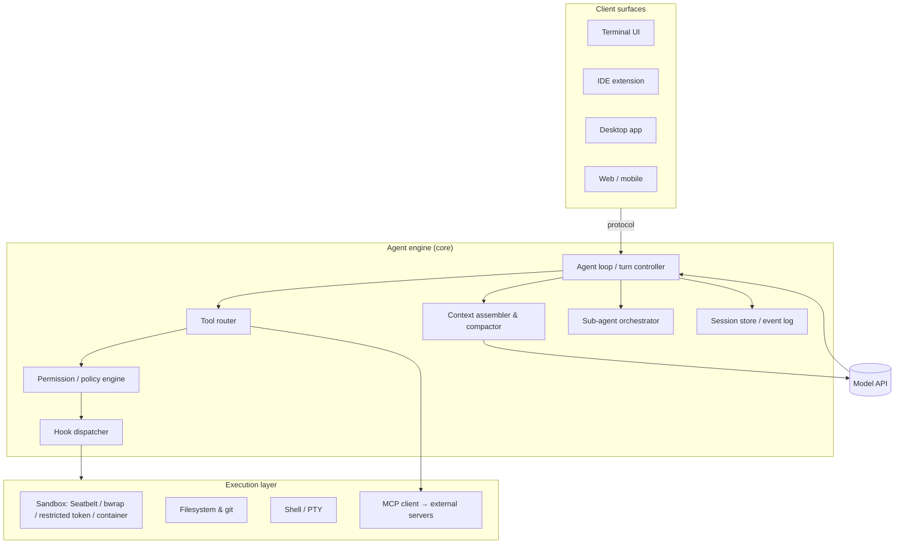
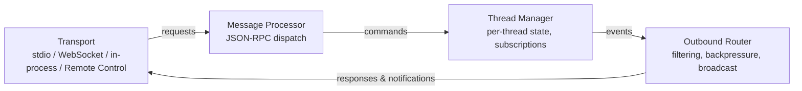
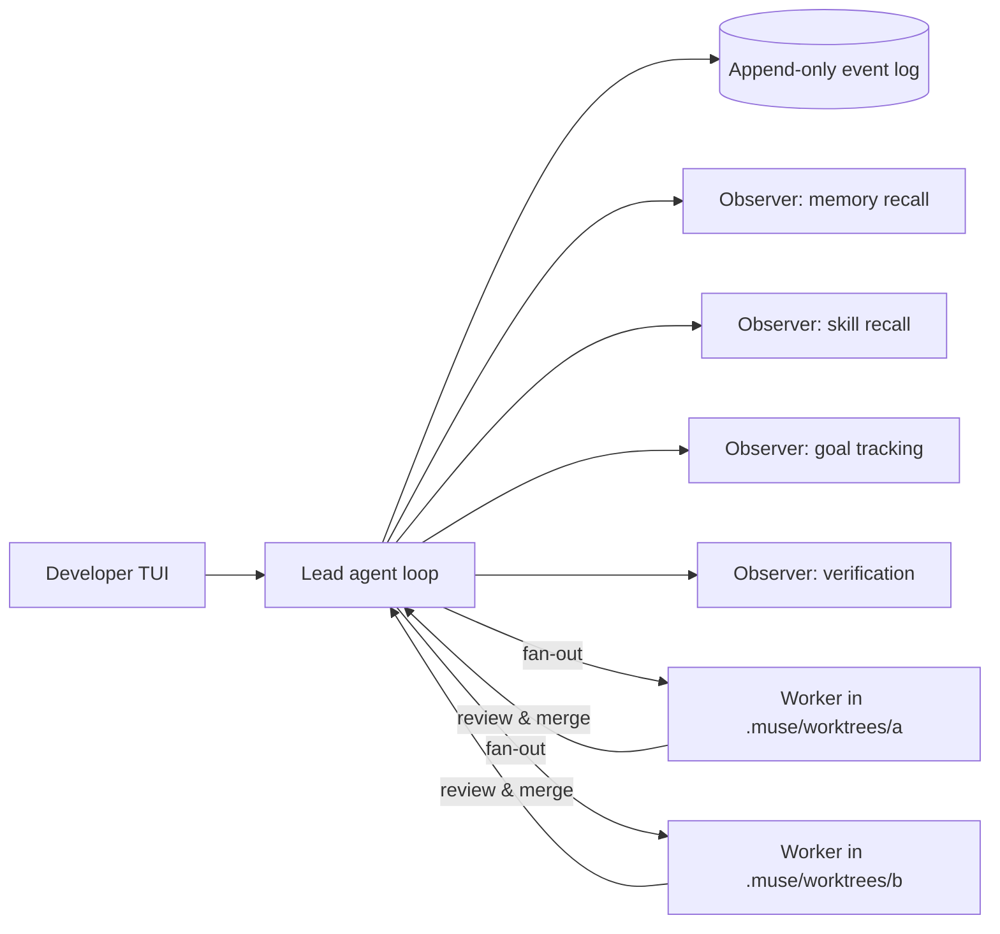

# Architectural Deconstruction of Leading AI Coding Agents

**Claude Code · OpenAI Codex · Google Gemini CLI / Antigravity CLI · Meta Muse Code · Cursor · GitHub Copilot · OpenCode · and the wider field**

*Technical architecture reference — compiled September 16, 2026*

---

## 0. How to read this document

This document deconstructs the leading AI coding agents ("harnesses") as software systems: process topology, agent loop, tool layer, context and memory management, permission and sandbox model, extension surfaces, multi-agent orchestration, persistence, and observability. It is written for architects who want to understand *how these tools are built*, not how to use them.

Three caveats apply throughout:

1. **Source visibility differs.** Codex, Gemini CLI, OpenCode, Cline, and Aider are open source, so their internals are directly inspectable. Claude Code, Antigravity CLI, Muse Code, Cursor, and Copilot are closed source (Claude Code ships a native binary; its documentation and Agent SDK expose the loop's semantics in detail). For closed tools, the deconstruction relies on official documentation, protocol schemas, vendor engineering posts, and reputable third-party teardowns; those sections are labelled accordingly.
2. **The field moves monthly.** Version numbers, model names, and pricing in this document were checked against sources dated May–September 2026 and should be treated as a snapshot. Items marked *(reported)* come from secondary sources and have not been independently verified against source code.
3. **Agent = model + harness.** Since mid-2025 the industry consensus has been that frontier model quality has largely converged and that the harness — the loop, the tools, the context strategy, the safety envelope — now determines most of the observable differences between tools [[F1]](#references). Meta's decision to co-train Muse Spark inside the Muse Code harness makes this explicit [[M2]](#references).

---

## 1. Landscape and adoption (September 2026)

| Tool | Vendor | Primary surface(s) | Language / runtime | License | Model policy |
|---|---|---|---|---|---|
| Claude Code | Anthropic | Terminal, VS Code/JetBrains, desktop app, web (claude.ai/code), iOS, GitHub Action, Agent SDK | Native binary (formerly Node/TypeScript) | Proprietary | Anthropic-hosted only |
| Codex | OpenAI | Terminal (TUI), VS Code, desktop app, web (chatgpt.com/codex), mobile, cloud sandboxes, SDK | Rust (`codex-rs` Cargo workspace) with thin npm wrapper | Apache-2.0 | OpenAI-hosted only |
| Gemini CLI | Google | Terminal, IDE via ACP, GitHub Action | TypeScript / Node.js monorepo | Apache-2.0 | Gemini (API key or enterprise license only after June 18, 2026) |
| Antigravity CLI (`agy`) | Google | Terminal; shares harness with Antigravity 2.0 desktop | Go | Proprietary | Curated Gemini (plus other vendors, reported) |
| Muse Code | Meta Superintelligence Labs | Terminal and CI | Single ~97 MB static binary | Proprietary | Muse Spark 1.3 (co-trained) |
| Cursor | Anysphere | AI-first IDE (VS Code fork), CLI, Cloud Agents | Electron + TypeScript, Rust services | Proprietary | Curated multi-vendor + in-house Composer models |
| GitHub Copilot | GitHub / Microsoft | IDE extensions, CLI (`@github/copilot`), cloud "coding agent" | TypeScript | Proprietary | Curated multi-vendor with automatic routing |
| OpenCode | Anomaly (formerly SST) | Terminal TUI, headless server, IDE | TypeScript (Bun) | MIT | Bring-your-own-model, 75+ providers |

**Adoption signals.** JetBrains' August 2026 developer research found Claude Code used by roughly 39% of professional developers worldwide in May–July 2026 (47% in the US), about twice the rate of GitHub Copilot [[F2]](#references). OpenAI reports more than 5 million weekly Codex users [[F1]](#references). Copilot retains the largest installed base by seat count (20M+ users, reported) and is the enterprise default [[F3]](#references). OpenCode is the most-starred open-source harness (roughly 165–200k GitHub stars depending on the count date), ahead of the Claude Code, Codex, and Gemini CLI repositories [[F4]](#references)[[F5]](#references). The dominant workflow pattern is multi-tool: a majority of developers report using three or more agents in parallel, routing by task type [[F3]](#references).

**Structural shifts since 2025.**
- **Client/server splits.** Codex (app-server), OpenCode (`opencode serve`), Gemini CLI (cli/core packages), and Antigravity (shared harness across CLI and desktop) all separate the agent engine from the UI so that one engine serves terminal, IDE, desktop, web, and mobile clients.
- **Sub-agent fan-out with git worktree isolation** has become table stakes; Muse Code makes it the default parallelism model [[M3]](#references).
- **Durable event logs** for replay and crash recovery (Codex rollouts, Muse Code event log, Claude Code JSONL transcripts).
- **Convergent extension vocabulary.** `AGENTS.md`/`CLAUDE.md`/`GEMINI.md` instruction files, `SKILL.md` skills, lifecycle hooks, MCP servers, and plugin bundles are now implemented by nearly every harness, and cross-harness bundlers exist to render one canonical package into each vendor's layout [[F6]](#references).
- **Google's retirement of Gemini CLI.** On June 18, 2026 Gemini CLI stopped serving free, AI Pro, and AI Ultra users in favour of the closed-source, Go-based Antigravity CLI; enterprise Gemini Code Assist licenses and paid API keys retain access [[G4]](#references)[[G5]](#references).

---

## 2. A reference anatomy for coding-agent harnesses

Every tool in this document can be decomposed into the same eleven subsystems. This section defines them so that the per-tool sections can be compared directly. The framing is consistent with recent source-code taxonomies of coding-agent scaffolds [[X1]](#references)[[X2]](#references).



| # | Subsystem | What it decides |
|---|---|---|
| 1 | **Client/engine protocol** | Is the UI in-process with the loop, or a client speaking a wire protocol (JSON-RPC, ACP, HTTP/SSE)? |
| 2 | **Agent loop** | Turn semantics, stop conditions, parallel vs sequential tool dispatch, steering/interruption, loop detection |
| 3 | **Context assembly** | System prompt composition, instruction-file hierarchy, tool-schema loading (eager vs deferred), prompt caching |
| 4 | **Context compaction** | When and how history is summarized; who decides (threshold, model, user); what is pinned |
| 5 | **Tool layer** | Built-in tool set, edit primitive (search/replace vs patch vs whole-file), shell execution model |
| 6 | **Permission model** | Allow/deny rules, approval modes, classifiers, "auto" modes |
| 7 | **Sandbox** | OS-level isolation for command execution and filesystem writes |
| 8 | **Extension surfaces** | Instruction files, skills, hooks, sub-agent definitions, MCP, plugins/marketplaces |
| 9 | **Multi-agent orchestration** | Sub-agent spawning, context inheritance, worktree isolation, background/persistent agents |
| 10 | **Persistence & memory** | Session transcripts, resume/fork, cross-session memory |
| 11 | **Observability & governance** | Event logs, cost accounting, tracing, enterprise controls |

---

## 3. Claude Code (Anthropic)

*Closed source; native binary. Architecture reconstructed from official Claude Code and Agent SDK documentation, which describe the loop, message types, permission evaluation order, and context accounting in detail [[C1]](#references)[[C2]](#references), plus independent analyses [[C3]](#references)[[C4]](#references).*

### 3.1 Topology

Claude Code began (Feb 2025) as a Node.js/TypeScript CLI rendered with the Ink React-for-terminal library. By 2026 Anthropic's recommended distribution is a **native installer** (`curl … install.sh | bash` / PowerShell equivalent) that ships a self-contained binary; the same binary is bundled inside the TypeScript and Python **Agent SDKs**, so an SDK-driven agent runs literally the same loop as the interactive CLI [[C1]](#references)[[C5]](#references).

Surfaces: terminal; VS Code and JetBrains extensions; a standalone desktop app; a web app (claude.ai/code) with **Remote Control** (drive a local session from the browser or phone); iOS; a GitHub Action; and a headless `-p`/print mode for CI and scripting. **Channels** (research preview, 2026) let MCP servers push events *into* a running session — Telegram, Discord, webhooks — so external triggers can wake the agent [[C4]](#references).

Unlike Codex, there is no published client/server wire protocol; embedding is done through the Agent SDK, which spawns the binary as a subprocess and exchanges typed messages over stdio. The SDK's `sessionStore` adapter implements a **dual-write** design: the subprocess writes transcripts to local disk first, then mirrors them to a caller-supplied backend so a different host can resume the session [[C1]](#references).

### 3.2 The agent loop

The loop is deliberately simple and is the same in CLI and SDK [[C1]](#references):

1. **Receive prompt** — user input plus system prompt, tool definitions, and conversation history. An `init` system message carries session metadata; `SessionStart`/`Setup` hooks fire before it.
2. **Evaluate** — the model returns text, tool calls, or both (`AssistantMessage`).
3. **Execute tools** — hooks may intercept; results feed back as a `UserMessage`.
4. **Repeat** until a response contains no tool calls.
5. **Result** — a `ResultMessage` with final text, token usage, cost, `num_turns`, `stop_reason`, and session ID. Subtypes: `success`, `error_max_turns`, `error_max_budget_usd`, `error_during_execution`, `error_max_structured_output_retries`.

A **turn** is one round trip that includes tool calls; only tool-use turns count toward `max_turns`. Budgets (`max_budget_usd`) cover the whole sub-agent tree; on breach, spawning fails with `Budget limit reached` and background sub-agents are stopped. **Effort** (`low`/`medium`/`high`/`xhigh`/`max`) is a per-session or per-sub-agent knob independent of extended thinking [[C1]](#references).

**Parallel dispatch.** When the model requests several tools in one turn, read-only tools (`Read`, `Glob`, `Grep`, MCP tools annotated `readOnlyHint`) run concurrently; state-mutating tools (`Edit`, `Write`, `Bash`) run sequentially [[C1]](#references).

### 3.3 Tool layer

| Category | Tools |
|---|---|
| File ops | `Read`, `Edit` (exact-string replace), `Write` |
| Search | `Glob`, `Grep` (ripgrep-backed) |
| Execution | `Bash` (persistent shell, background jobs) |
| Web | `WebSearch`, `WebFetch` |
| Discovery | `ToolSearch` — loads tool schemas on demand rather than preloading |
| Orchestration | `Agent` (spawn sub-agent), `Skill`, `AskUserQuestion`, `TaskCreate`/`TaskUpdate` |

`ToolSearch` is architecturally significant: MCP tool schemas are **deferred by default**, so a session with many MCP servers no longer pays their full schema cost on every request; the model searches for and loads tools as needed, falling back to eager loading on unsupported models/platforms [[C1]](#references).

### 3.4 Context assembly and compaction

Context accumulates across turns and never resets within a session. Stable prefixes — system prompt, tool definitions, `CLAUDE.md` — are **prompt-cached**. The documented context accounting is [[C1]](#references):

| Source | Load timing | Cost profile |
|---|---|---|
| System prompt | every request | fixed, cached |
| `CLAUDE.md` hierarchy | session start | full content every request, cached |
| Built-in tool schemas | every request | fixed |
| MCP tool schemas | deferred via ToolSearch | on demand |
| Skill descriptions | session start | short summaries; body loads only on invocation |
| Conversation history | accumulates | dominant cost in long sessions |

**Compaction** is automatic when the window nears its limit: older history is replaced with a model-written summary, emitting a `compact_boundary` system message. Three customization points exist: summarization instructions inside `CLAUDE.md` (the compactor reads it), a `PreCompact` hook (receives `trigger: manual|auto`, commonly used to archive the full transcript), and manual `/compact`. Because compaction can drop early instructions, durable rules belong in `CLAUDE.md`, which is re-injected every request [[C1]](#references).

**`CLAUDE.md` hierarchy.** Managed (organization) → user (`~/.claude/CLAUDE.md`) → project (`./CLAUDE.md`, committed) → local (`CLAUDE.local.md`) → subdirectory files loaded lazily as the agent touches those paths. `@path` imports are supported. Settings follow a parallel `settings.json` hierarchy with the same precedence [[C6]](#references).

### 3.5 Permission model

Permissions are evaluated in a fixed order combining rule lists and a mode [[C1]](#references):

- `allowedTools` / `disallowedTools`, with scoped rules such as `Bash(npm *)`, `Edit(src/**)`, `mcp__server__tool`.
- **Modes:** `default` (unlisted tools go to a `canUseTool` callback / interactive prompt), `acceptEdits` (auto-approve file edits and benign filesystem commands), `plan` (read-only exploration; edits always prompt), `dontAsk` (hard deny for anything not pre-approved — for headless agents), `auto` (a **model-based classifier** approves or denies prompts), and `bypassPermissions` (no prompts; refuses to run as root on Unix; SDK requires `allowDangerouslySkipPermissions`).
- Organization controls can force `ask` on connector tools; MCP tools can declare `requiresUserInteraction`.

Longitudinal telemetry cited in an April 2026 analysis shows auto-approve rates rising from ~20% for new users to over 40% by 750 sessions, which is why the permission system is designed as a trust ramp rather than a fixed gate [[C3]](#references).

### 3.6 Sandbox

Since late 2025 Claude Code can run `Bash` inside an OS sandbox — Seatbelt on macOS, bubblewrap on Linux — with filesystem and network restrictions, so that the permission prompt for shell commands can be relaxed without giving the agent host-wide access. Sandbox and permission are complementary layers: permission decides *whether* a tool runs; sandbox bounds *what it can touch* [[C6]](#references).

### 3.7 Extension surfaces

Claude Code's extension model is the most differentiated of the group and has been widely cloned [[C3]](#references)[[C4]](#references):

| Surface | Form | Loads into context? | Purpose |
|---|---|---|---|
| `CLAUDE.md` | Markdown | Always | Standing project rules |
| **Skills** | `SKILL.md` + support files, frontmatter controls auto-invocation, `/` visibility, and whether to run in a sub-agent | Description only until invoked | Reusable procedures; every skill is also a slash command |
| **Sub-agents** | `.claude/agents/*.md` with own system prompt, tool allow-list, model, effort | Never — isolated context; only the final message returns to the parent | Delegated research, review, implementation |
| **Hooks** | Shell commands or SDK callbacks bound to ~30 lifecycle events (`PreToolUse`, `PostToolUse`, `UserPromptSubmit`, `Stop`, `SubagentStart/Stop`, `PreCompact`, `SessionStart/End`, `Notification`, `PermissionRequest`, …) | Never — run in the host process | Deterministic guardrails, audit, context injection |
| **MCP** | stdio / HTTP / SSE servers; tools named `mcp__<server>__<tool>` | Deferred via ToolSearch | External systems |
| **Plugins** | Versioned bundle of skills, agents, commands, hooks, output styles, MCP definitions; distributed via marketplaces (`/plugin`) | Depends | Team/vendor distribution |
| **Output styles / status line** | Config | — | UX |

Hooks are the deterministic counterweight to the probabilistic loop: a `PreToolUse` hook that rejects a call short-circuits execution and the model receives the rejection as the tool result [[C1]](#references).

### 3.8 Multi-agent orchestration

- **Sub-agents** start with a fresh conversation (they load their own system prompt and project `CLAUDE.md` but not the parent's turns); the parent's context grows only by the child's final summary. Each sub-agent can pin a different model and effort — the "expensive planner, cheap executors" pattern [[C1]](#references)[[F7]](#references).
- **Background sub-agents** run asynchronously; `SubagentStop` hooks aggregate results.
- **Worktrees** (`--worktree`) give a session its own git worktree; **agent teams** (2026) coordinate several top-level sessions with a shared task list.
- Cost accounting distinguishes `usage` (main loop) from `modelUsage` (whole tree) [[C1]](#references).

### 3.9 Persistence and memory

Sessions are JSONL transcripts under `~/.claude/projects/<hash>/`; `--continue`/`--resume` restore full context, and sessions can be **forked** to branch an approach. Cross-session memory is file-based: `CLAUDE.md` and an auto-memory directory that the agent updates. The SDK's session store adapters extend this to stateless hosts [[C1]](#references).

### 3.10 Observability and governance

`ResultMessage` carries per-session cost; OpenTelemetry metrics/logs export is available; enterprise deployments get managed settings, SCIM, and policy lock-down (which permission modes and marketplaces are allowed). Headless mode reuses the same settings, hooks, and permission rules as interactive mode, which is what makes the GitHub Action and CI integrations behave identically to a developer's terminal [[C6]](#references).

### 3.11 Architectural assessment

Strengths: the richest and most orthogonal extension model (six mechanisms at distinct points of the loop, each with a documented context cost); deferred tool loading; hooks that run outside the context window; a documented permission-evaluation order; SDK/CLI parity. Weaknesses: closed source and no public wire protocol (the SDK is the only embedding path); vendor-locked models; the persistent-shell/edit-by-exact-string design places a burden on the model to reproduce file text verbatim.

---

## 4. OpenAI Codex

*Open source (Apache-2.0), `github.com/openai/codex`. The engine is Rust; architecture below is drawn from the repository, OpenAI's app-server documentation and engineering post, and source-level teardowns [[O1]](#references)[[O2]](#references)[[O3]](#references)[[O4]](#references).*

### 4.1 Topology: the Rust workspace

Codex CLI launched (April 2025) in TypeScript and was rewritten in Rust by early 2026. The stated motives were zero-dependency installation, first-class OS sandbox bindings (Seatbelt, Landlock/bubblewrap) instead of FFI shims, no GC pauses, and a wire protocol that lets TypeScript, Python, and other languages extend the agent [[O4]](#references). The npm package `@openai/codex` remains as a wrapper that downloads the native binary.

`codex-rs` is a layered Cargo workspace (~65 crates, reported [[O4]](#references)):

```
codex-rs/
├── protocol/            codex-protocol — SQ/EQ (submission queue / event queue) types
├── core/                codex-core — session state, model streaming, tool dispatch,
│                        sandboxing, approvals, rollouts, config
├── tui/                 ratatui terminal UI
├── exec/                `codex exec` headless one-shot runner
├── app-server/          JSON-RPC 2.0 server (the engine's public face)
├── app-server-protocol/ generated schema (TS / JSON Schema)
├── exec-server/         sandboxed command/filesystem service
├── mcp-server/          legacy: expose Codex *as* an MCP server (deprecated 2026)
├── linux-sandbox/, seatbelt/, windows-sandbox/ …
└── sdk/ (python, typescript)
```

The internal contract between any front end and the engine is a **queue pair**: clients submit `Op`s onto a submission queue and consume `Event`s from an event queue — a design that made the later app-server extraction natural [[O5]](#references).

### 4.2 The app-server protocol

Codex's defining architectural move (v0.117+, February 2026) was extracting the agent core into a standalone **bidirectional JSON-RPC 2.0 service**. OpenAI first tried exposing Codex as an MCP server for the VS Code extension but found MCP's request/response tool model unable to express streaming diffs, approval round-trips, thread persistence, or server-initiated requests [[O1]](#references)[[O6]](#references). Every surface — TUI, VS Code, desktop, chatgpt.com/codex, mobile, SDKs — now drives the same process.

**Process structure** (four async tasks connected by bounded `mpsc` channels of capacity 128; saturation returns JSON-RPC `-32001 Server overloaded`) [[O2]](#references):



**Three primitives** [[O2]](#references)[[O7]](#references):
- **Thread** — durable conversation container (`thread/start|resume|fork|list|read|archive|rollback|compact/start|memoryMode/set`). Threads unload after 30 idle minutes and persist as rollout files.
- **Turn** — one user input plus all agent work (`turn/start|steer|interrupt`). `turn/start` accepts per-turn overrides for model, reasoning effort, cwd, sandbox policy, and output schema. `turn/steer` injects guidance mid-turn without cancelling.
- **Item** — atomic streamed unit with lifecycle `item/started → item/*/delta* → item/completed`. Item types: user message, agent message, reasoning, shell command, file change, tool call, context compaction.

The wire format is "JSON-RPC lite" (the `"jsonrpc":"2.0"` header is omitted). **Server-initiated requests** implement approvals: `item/commandExecution/requestApproval` and `item/fileChange/requestApproval` carry command, cwd, reason, optional `additionalPermissions`, and a `proposedExecpolicyAmendment`; clients answer `accept | decline | cancel | acceptWithExecpolicyAmendment`. Approvals may be delegated to a **Guardian** sub-agent — a risk-scoring automated reviewer [[O2]](#references).

Transports: stdio (JSONL, single client — used by VS Code, desktop, and SDKs as a child process); WebSocket (multi-client, `/readyz`/`/healthz`, Origin-header CSRF rejection, capability-token or HMAC-signed JWT auth); in-process (bounded in-memory channels when the TUI hosts the server); and **Remote Control**, where the local server dials out to OpenAI's relay (`wss://…/wham/remote/control/server`) with acknowledged, cursor-resumable delivery so the web/mobile UI can drive a developer's machine [[O2]](#references)[[O8]](#references).

Additional RPC families: `command/exec*` (PTY, streaming, output caps, timeouts), `fs/*`, `config/*`, `model/list`, `skills/list`, `plugin/*`, `marketplace/add`, `mcpServer/*`, `review/start`, and experimental `thread/realtime/*` (voice). Schemas are generated with `codex app-server generate-ts | generate-json-schema` [[O2]](#references).

### 4.3 exec-server

A companion `codex exec-server` process owns the lower layer — sandboxed command execution, file I/O, filesystem watching — over its own JSON-RPC link. The split enables **app-server local, exec-server remote**: reasoning close to the user, execution on a cloud VM or devcontainer [[O2]](#references)[[O9]](#references).

### 4.4 Agent loop and tool layer

The loop lives in `codex-core`: stream a model response over the Responses API, route tool calls through a `ToolRouter` that enforces approval policy and sandbox before execution, feed results back, repeat. Built-in tools center on `shell`/`exec_command` (with PTY and background terminals), `apply_patch` (a **structured patch format** — add/delete/update hunks with context lines — rather than exact-string replacement), file reading, web search, `view_image`, and MCP tool calls. Sub-agents (`spawn_agent`-style tooling) and plugins matured through 2026, and `codex exec` supports `--output-schema` for structured JSON results in CI [[O2]](#references)[[O5]](#references).

Instruction files follow the vendor-neutral **`AGENTS.md`** convention (repo root plus nested overrides), which Codex originated and most other harnesses now honour [[O10]](#references).

### 4.5 Permission and sandbox model

Two orthogonal axes [[O11]](#references):

| Approval policy | Sandbox policy |
|---|---|
| `untrusted` — approve everything except a known-safe read set | `readOnly` |
| `on-request` — model asks when it needs elevation | `workspaceWrite` (writable roots, optional network) |
| `never` — no prompts, rely on sandbox | `dangerFullAccess` |
| | `externalSandbox` — host provides isolation (containers, CI) |

Enforcement: **macOS Seatbelt**, **Linux bubblewrap** (Landlock earlier), **Windows** a native restricted-token sandbox (synthetic SIDs) or WSL2 [[O2]](#references)[[O12]](#references). A "secure devcontainer" profile shipped in v0.121 (April 2026). An `execpolicy` layer allows fine-grained rules over specific commands, amendable at approval time.

### 4.6 Context and memory

Threads persist as JSONL **rollout files** under `~/.codex/sessions`, enabling resume, fork, rollback, and archive. Compaction is a first-class item type and can be triggered per thread (`thread/compact/start`). A per-thread **memory mode** and `memory/reset` RPC exist for cross-thread memory. Prompt caching is exploited by keeping the tool/instruction prefix stable across turns [[O2]](#references).

### 4.7 Surfaces beyond the terminal

Codex cloud runs tasks in OpenAI-hosted containers with per-repo environment setup and returns PRs; **automations** schedule recurring tasks; the desktop app adds worktree-per-task parallelism and voice; the IDE extension and web UI are thin app-server clients. OpenAI has stated the TUI itself will become an app-server client so that the server is the single source of truth [[O8]](#references).

### 4.8 Architectural assessment

Strengths: the cleanest client/server separation in the field, with a schema-generated protocol, multiple transports, auth, backpressure, and W3C trace-context; native OS sandboxes on all three platforms; open source; a patch-based edit primitive. Weaknesses: vendor-locked models; protocol churn (methods gated behind `experimentalApi`); the four-process topology (client, app-server, exec-server, MCP servers) is more operationally complex than a monolith.

---

## 5. Google Gemini CLI → Antigravity CLI

### 5.1 Gemini CLI (open source, Apache-2.0; maintenance mode for most users)

*Source: `github.com/google-gemini/gemini-cli`; architecture from official docs [[G1]](#references)[[G2]](#references)[[G3]](#references).*

**Topology.** A TypeScript/Node monorepo with two principal packages plus tools:

- `packages/cli` — the React/Ink terminal UI: input processing, history, rendering, themes, settings.
- `packages/core` — the "local server": Gemini API client, prompt construction, tool registry and execution, session state, the **policy engine**, and the agent loop. The docs describe the CLI as "a client-side application that communicates with a local server," although in practice both packages run in one Node process [[G2]](#references)[[G3]](#references).
- `packages/core/src/tools/` — `read_file`, `write_file`, `replace` (edit), `read_many_files`, `glob`, `grep`/`search_file_content`, `shell`, `web_fetch`, `google_web_search`, `save_memory`, and MCP-bridged tools.

**Loop.** A classic ReAct thought→action→observation loop. Two Gemini-specific mechanisms are worth noting: a **next-speaker check** (after a model reply, a lightweight classifier decides whether the model should continue on its own or hand control back — disabled in ACP mode after it caused runaway "thought" loops [[G6]](#references)) and **LLM-based loop detection** to catch the agent repeating itself [[G7]](#references).

**Context.** `GEMINI.md` files (global, project, subdirectory) with a **memory import processor** that expands `@file.md` references; a `/memory` command and `save_memory` tool for cross-session facts; automatic conversation compression when history exceeds a threshold; **checkpointing** via a shadow git repository so file changes made by tools can be rolled back (`/restore`).

**Policy and sandbox.** A **Policy Engine** provides rule-based allow/deny/ask decisions per tool with pattern matching; approval modes range from prompt-per-tool to YOLO. Sandboxing uses Docker/Podman containers or macOS Seatbelt profiles, toggled with `--sandbox` [[G2]](#references).

**Extensions.** Hooks (modelled on Claude Code's, mid-2025), skills, sub-agents, slash commands (TOML), and **extensions** — a `gemini-extension.json` manifest bundling `GEMINI.md`, MCP servers, commands, and hooks — distributed through a public gallery. **ACP (Agent Client Protocol)** support lets editors such as Zed and JetBrains host Gemini CLI as an agent; **A2A** (Agent-to-Agent) support with authenticated agent-card discovery lets it call remote agents [[G7]](#references)[[G8]](#references). Experimental **local model routing** uses a small on-device Gemma model to pick which Gemini model to call [[G2]](#references).

**Status.** Google announced at I/O (May 19, 2026) that Gemini CLI would stop serving free, AI Pro, and AI Ultra users on June 18, 2026; enterprise Gemini Code Assist Standard/Enterprise licenses and paid Gemini API keys keep working, and the repository remains public [[G4]](#references)[[G5]](#references)[[G9]](#references).

### 5.2 Antigravity CLI (`agy`) — closed source, Go

*Architecture from Google's transition announcement and early third-party teardowns; treat internals as reported.*

- **Runtime.** Rewritten in **Go** for faster cold start and lower memory. It shares one **agent harness** with the Antigravity 2.0 desktop app (an Open VSX–based IDE with a multi-agent "manager" surface) and an Antigravity Python SDK, so improvements to core agents land on every surface at once [[G4]](#references)[[G10]](#references).
- **Asynchronous workflows.** The headline architectural change: the CLI orchestrates multiple agents in the background (async sub-agent mode returns diffs when done), so long refactors or parallel research do not block the terminal [[G4]](#references)[[G10]](#references).
- **Continuity.** Retains Agent Skills, Hooks, Subagents, and Extensions (renamed **plugins**); reuses the `~/.gemini/` settings tree and `settings.json` hooks configuration, which is why third-party hook-based memory tools ported with minimal change [[G11]](#references)[[G12]](#references). Project conventions moved toward `AGENTS.md` at the repo root and `.agents/skills/`, `.agents/rules/`, `.agents/workflows/` directories; MCP is configured in `mcp_config.json` with stdio and HTTP transports and bundled Google Workspace servers (reported) [[G10]](#references)[[G13]](#references).
- **Managed Agents API.** Antigravity 2.0 adds a cloud-managed agents API for deploying agents outside the developer's machine (reported) [[G10]](#references).
- **Trade-off.** The community's principal objection is the loss of source visibility: Gemini CLI's policy engine and tool code were inspectable; Antigravity's are not [[G5]](#references).

---

## 6. Meta Muse Code

*Closed source; beta August 5, 2026, GA August 31, 2026; Muse Spark 1.3 replaced 1.2 as its model on September 2, 2026. Architecture from Meta's product documentation and launch materials plus independent deep dives [[M1]](#references)[[M2]](#references)[[M3]](#references)[[M4]](#references)[[M5]](#references).*

### 6.1 Positioning

Muse Code is the first coding product from Meta Superintelligence Labs. It is terminal- and CI-only (no desktop app, no Windows installer; WSL required), installed as a single ~97 MB static binary with browser-based auth at dev.meta.ai. The strategic claims are (a) a **1M-token context** that holds a whole repository, (b) a model **co-trained with the harness**, and (c) a pricing model in which a "Contributor" tier trades dramatically lower token prices for the right to train on sessions [[M1]](#references)[[M2]](#references)[[M5]](#references).

### 6.2 Model/harness co-training

Muse Spark 1.2/1.3 were trained inside the Muse Code runtime on rejection-sampled harness trajectories, with recipe work specifically for goal conditioning, context compaction, and sub-agent use. A self-improvement loop used Spark 1.1 to generate coding environments and instruction templates and to grade candidate solutions. Spark 1.3 is reported to finish equivalent work with ~20% fewer tool calls and ~25% fewer tokens than 1.2 and to ask clarifying questions rather than guess when stuck [[M2]](#references)[[M5]](#references). This is the most explicit example in the field of the "harness is part of the model" thesis.

### 6.3 Runtime topology



- **Persistent background observers.** Alongside the lead session, Muse Code runs four long-lived observer agents — memory recall, skill recall, goal tracking, and verification — the first three on by default. They persist for the whole session rather than being respawned per task, so repository knowledge accumulates; each makes its own model calls and bills separately, toggled in a `runtime_capabilities` settings block [[M3]](#references)[[M6]](#references).
- **Worktree-isolated fan-out.** For large jobs the lead spawns write-capable child agents, each in a git worktree the runtime creates and owns under `.muse/worktrees/` (detached HEAD from the parent's HEAD). Changes merge only after the lead reviews them. Fan-out is opt-in and requires a git repository; in a non-git workspace the isolation flag is silently ignored and children share the lead's workspace [[M4]](#references)[[M5]](#references).
- **Event-sourced runtime.** Every model call, tool run, approval, and edit is appended to a local event log *before* it executes. Meta describes the result as "replay-exact and restart-safe": an effect with an intent record but no terminal record is treated as unknown on resume, so the agent inspects real state instead of blindly re-running. Runs can be watched live, paused, redirected, and replayed step by step [[M2]](#references)[[M4]](#references)[[M5]](#references).
- **Skills and goals.** Bundled skills include `/plan` (approval-gated plan), `/grilling` and `/grill-with-docs` (adversarial stress-testing of the plan), and `/taste`; `/goal` is a separate command backed by the goal-tracking observer that drives the agent toward a stated objective across many turns [[M4]](#references).
- **Hooks.** Shell commands bound to lifecycle events: session start, prompt submission, tool use, permission requests, model calls, context compaction, sub-agent start/stop, and session stop [[M4]](#references).
- **MCP and computer use.** MCP is supported; Meta's cookbooks demonstrate driving a disposable Linux desktop or a real macOS desktop through a small MCP bridge exposing screenshot/click/type/shell tools, delegating to short-lived sub-agents to stay under the API's per-request image limit — a capability of the model, not of the `muse` binary [[M4]](#references).

### 6.4 Pricing and data model

Subscription tiers (Everyday $5, High $15, Power $50 per month, reported) or per-token via the Meta Model API. The Contributor tier (reported $0.10–$0.30 per 1M input tokens across sources) permits training on sessions; the Standard tier does not [[M5]](#references)[[M7]](#references).

### 6.5 Architectural assessment

Strengths: event sourcing as the runtime's spine (the strongest auditability/resumability story in the field); persistent observers that avoid re-gathering context; worktrees as the default parallelism model; large context. Weaknesses: closed source and new (benchmarks vendor-reported); observer agents make token spend harder to predict; no Windows or IDE surface; `curl | sh` installation; the Contributor tier's data terms require careful enterprise review.

---

## 7. Cursor (Anysphere)

*Closed source. Architecture from Cursor documentation, release notes, and industry coverage [[U1]](#references)[[U2]](#references).*

- **Topology.** An AI-first fork of VS Code (Electron/TypeScript) backed by Cursor's cloud services: a codebase **indexing/embedding service** (Merkle-tree-synced file hashes, server-side vector index, per-file privacy filtering), a request router that fans prompts to multiple model vendors, and in-house models — **Composer** (a fast agent model) and speculative-edit/"Tab" models for inline completion.
- **Cursor 3 (April 2026)** replaced the Composer sidebar with a full-screen **Agents Window** for running many agents in parallel across local, cloud, SSH, and git-worktree targets, and added Design Mode and Composer 2 [[U1]](#references).
- **Cursor CLI** (January 2026) exposes the same agent in the terminal, with **Cloud Handoff**: prefixing a prompt with `&` pushes a local session to a **Cloud Agent** that runs in a hosted VM and returns a PR [[U1]](#references)[[U2]](#references).
- **Extension surfaces.** `.cursor/rules` (MDC rules with glob scoping), `AGENTS.md`, MCP (stdio/SSE/HTTP), hooks, skills, sub-agents, and a `.cursor-plugin/` plugin layout compatible with cross-harness bundlers [[F6]](#references).
- **Architectural note.** Cursor's distinguishing property is that the editor and the agent share one event loop and one index: edits stream into the buffer with inline diff review, and the same index serves Tab, chat, and agent. Its weakness is the inverse — heavy dependence on proprietary cloud services for indexing and routing, and less scriptability than terminal-native tools.

---

## 8. GitHub Copilot (agent mode, CLI, coding agent)

*Closed source. Architecture from GitHub documentation and coverage [[H1]](#references)[[H2]](#references).*

Copilot is three architecturally distinct products under one brand:

1. **IDE agent mode** (VS Code, JetBrains, Visual Studio, Xcode) — an in-editor loop with a curated tool set (file edits, terminal, tests, MCP) and `.github/copilot-instructions.md` / `AGENTS.md` instruction files.
2. **Copilot CLI** (`npm i -g @github/copilot`) — a terminal agent that **auto-routes across Claude, GPT, and Gemini models** by task and inherits GitHub's permission and PR-review context; supports a `plugin.json` + `hooks.json` + `skills/` + `agents/` layout. In May 2026 GitHub moved to **token-based billing** for CLI/agent usage, replacing flat premium-request pricing [[H1]](#references).
3. **Copilot coding agent** — an asynchronous, cloud-hosted agent that runs in an ephemeral **GitHub Actions** environment: assign an issue or comment on a PR, and the agent clones the repo, works in a sandbox with policy-controlled network egress, pushes commits, and opens a draft PR for human review. Its architecture is "issue-to-PR" rather than "developer-in-the-loop," and it is the model for the async agents that Codex cloud, Cursor Cloud Agents, and Devin also implement [[H2]](#references).

Copilot's strength is distribution and GitHub-native governance (org policies, audit logs, content exclusion); its weakness by comparison with Claude Code and Codex is a shallower, less inspectable harness with fewer lifecycle hooks and model choices constrained to the curated set.

---

## 9. OpenCode (Anomaly, formerly SST)

*Open source (MIT), `github.com/anomalyco/opencode` [[P1]](#references)[[P2]](#references).*

- **Topology.** A **client/server** architecture in TypeScript on Bun: `opencode serve` starts a headless server with an OpenAPI-described HTTP/SSE interface; the terminal TUI, IDE extensions, a desktop app, and remote clients are all clients of it. This is why it can run on a remote box or inside CI and be driven from anywhere [[P2]](#references).
- **Model layer.** Provider-agnostic via the Vercel AI SDK and a `models.dev` catalogue: 75+ providers including Anthropic, OpenAI, Google, OpenRouter, Bedrock, Vertex, Groq, and local models via Ollama/LM Studio; a GitHub Copilot authentication partnership (January 2026) allows Copilot subscriptions as a backend. Anthropic prohibits using Claude Pro/Max subscriptions in third-party harnesses, so Claude works only via API key [[P2]](#references)[[F5]](#references).
- **Harness.** Primary agents (`build`, `plan`) and sub-agents defined in JSON or Markdown, each with its own model and permission set; `AGENTS.md`; `SKILL.md` skills sharing the Claude Code/Codex standard; MCP; **LSP integration** so the agent receives diagnostics from real language servers rather than re-parsing output; session persistence and sharing via `/share` links [[P2]](#references).
- **Assessment.** The strongest option when model independence or self-hosting is a requirement; benchmark performance is entirely a function of the model chosen. Its OpenAPI server makes it the easiest harness to embed without an SDK.

---

## 10. Other high-usage tools (brief deconstructions)

| Tool | Architecture in one paragraph |
|---|---|
| **Cline** (Apache-2.0) | VS Code-native extension with explicit **Plan/Act** modes (separate models per mode allowed), approval before each change, full BYOM across vendors and local models, MCP, an SDK and CLI. Notable for giving the LLM agency over compaction: a `condense` tool lets the model request summarization when it judges context unwieldy [[X1]](#references)[[F5]](#references). |
| **Aider** (Apache-2.0, Python) | Git-native pair programmer: every edit is auto-committed with a generated message; a **repository map** (tree-sitter symbol graph ranked by PageRank) gives the model a compact view of a large repo; edit formats (whole-file, diff, udiff) are chosen per model. Minimal loop, no sub-agents. |
| **Pi** (MIT, TypeScript) | 2026 entrant from Mario Zechner and Armin Ronacher; a deliberately minimal harness whose system prompt is under 1,000 tokens (vs 7–10k for Claude Code/OpenCode) via **lazy skills** that load full instructions only on invocation; unified LLM API, TUI, MCP [[F8]](#references). |
| **OpenHands** (formerly OpenDevin, MIT) | Event-sourced agent runtime: actions and observations are appended to an immutable event stream; **condensation** inserts markers at the view level rather than deleting events, so sessions replay even after aggressive compaction — nine pluggable condensers composable via a registry. Sandboxed Docker runtime; CLI and web entry points [[X1]](#references). |
| **Devin / Windsurf** (Cognition) | Devin runs fully autonomous agents in cloud VMs that open PRs; Windsurf (acquired December 2025) is an agentic IDE whose 2.0 release (April 2026) added an Agent Command Center and Devin Cloud integration, converging IDE and cloud-agent surfaces [[F9]](#references). |
| **Crush** (Charm, FSL-1.1-MIT, Go) | TUI-first multi-model agent with MCP and LSP; representative of the Go-based harness generation alongside Antigravity CLI [[F9]](#references). |
| **Amazon Q Developer CLI / Kiro** | AWS's terminal agent and spec-driven IDE; Kiro's distinguishing architecture is **spec-first** (requirements → design → tasks documents) with agent hooks bound to file events. |
| **Claw Code** (MIT) | A community clean-room Python/Rust reimplementation of Claude Code's architecture that community trackers report as the fastest repository ever to 100k stars (2026); included here as evidence that the *harness design* itself has become a reproducible artefact [[F4]](#references). |

---

## 11. Comparative matrix

| Dimension | Claude Code | Codex | Gemini CLI | Antigravity CLI | Muse Code | Cursor | Copilot | OpenCode |
|---|---|---|---|---|---|---|---|---|
| Engine language | Native binary | Rust | TypeScript | Go | Native binary | TS/Electron + Rust svcs | TypeScript | TypeScript/Bun |
| Open source | No | Yes | Yes | No | No | No | No | Yes |
| Client/engine protocol | SDK over stdio (no public wire protocol) | JSON-RPC 2.0 app-server (stdio/WS/relay) | In-process cli↔core; ACP for editors | Shared harness w/ desktop (undocumented) | Event log + TUI (undocumented) | Proprietary | Proprietary | OpenAPI HTTP/SSE server |
| Edit primitive | Exact-string `Edit`/`Write` | Structured `apply_patch` | `replace`/`write_file` | (inherited) | Reported search/replace | Inline diff streaming | Diff | Search/replace |
| Shell sandbox | Seatbelt / bwrap | Seatbelt / bwrap / Win restricted token | Docker/Podman / Seatbelt | Reported | Reported; hooks on permissions | Cloud VM for cloud agents | GitHub Actions runner | Host permissions; container optional |
| Permission modes | default/acceptEdits/plan/dontAsk/auto (classifier)/bypass | untrusted/on-request/never × readOnly/workspaceWrite/full; Guardian | Policy engine + approval modes | Inherited | Approval-gated plan; permission hooks | Per-action approvals | Per-action + org policy | Per-agent permission sets |
| Instruction file | `CLAUDE.md` (+ `AGENTS.md`) | `AGENTS.md` | `GEMINI.md` (+`AGENTS.md`) | `AGENTS.md` | Reported `AGENTS.md` | `.cursor/rules`, `AGENTS.md` | `copilot-instructions.md`, `AGENTS.md` | `AGENTS.md` |
| Skills / hooks / sub-agents | ✓ / ✓ (~30 events) / ✓ | ✓ / ✓ / ✓ | ✓ / ✓ / ✓ | ✓ / ✓ / ✓ | ✓ / ✓ / ✓ | ✓ / ✓ / ✓ | ✓ / ✓ / ✓ | ✓ / ✓ / ✓ |
| Tool-schema loading | Deferred (ToolSearch) | Eager + MCP | Eager | — | — | — | — | Eager |
| Compaction control | Auto + `PreCompact` hook + CLAUDE.md instructions | Auto + `thread/compact/start` item | Auto threshold | — | Model co-trained for it; hookable | Auto | Auto | Auto |
| Worktree isolation | `--worktree`, agent teams | Desktop worktree-per-task | Shadow-git checkpoints | — | Default fan-out mechanism | Agents Window (local/cloud/SSH/worktree) | Actions runner | — |
| Persistent background agents | Background sub-agents | Automations, cloud tasks | — | Async sub-agent mode | Four session-long observers | Cloud Agents | Coding agent | — |
| Durable event log | JSONL transcripts | Rollout files + W3C trace ctx | Session logs | — | Append-only, replay-exact | — | Actions logs | Sessions, `/share` |
| Model choice | Anthropic only | OpenAI only | Gemini | Curated | Muse Spark | Curated + in-house | Curated, auto-routed | Any |

---

## 12. Cross-cutting architectural patterns

### 12.1 The engine wants to be a server
The strongest 2026 trend is separating the loop from the UI. Codex did it with a documented JSON-RPC protocol, OpenCode with an OpenAPI server, Google by sharing one Go harness across CLI and desktop, Anthropic by bundling the binary into SDKs with a session-store adapter. The consequence is that "CLI vs IDE vs web" is no longer an architectural distinction — it is a client choice — and that remote execution (exec-server, Remote Control, Cloud Handoff) is a transport concern.

### 12.2 Context is the scarce resource, and harnesses are learning to budget it
Three techniques now separate mature harnesses from naive ones: **deferred tool loading** (Claude Code's ToolSearch; Pi's lazy skills), **isolated sub-agent contexts** whose transcripts never enter the parent, and **controllable compaction** (hooks, instructions, model-invoked condensation, view-level condensation that preserves the raw event stream). Muse Code's co-training on compaction and OpenHands' non-destructive condensers represent the two ends — learned versus engineered — of the same problem [[X1]](#references)[[X2]](#references).

### 12.3 Determinism wraps probability
Every harness now offers a deterministic control plane around the stochastic loop: hooks that run outside the context window, policy engines with pattern rules, OS sandboxes, and (Codex's Guardian, Claude Code's `auto` mode) model-based classifiers positioned as a *second* probabilistic layer that is cheaper and more constrained than the main model. Architecturally, the correct mental model is defense in depth: permission rule → hook → classifier → sandbox.

### 12.4 Event sourcing is becoming the substrate for trust
Codex rollouts, Claude Code transcripts, OpenHands event streams, and above all Muse Code's write-ahead event log point toward a shared conclusion: a coding agent that can crash after twenty hours, be audited by a security team, and be replayed exactly needs an append-only record of intents and effects, not a chat history. Tools that separate *intent recorded* from *effect confirmed* (Muse Code) get restart-safety for free; tools that only log messages must reconstruct state heuristically.

### 12.5 Git worktrees are the parallelism primitive
Rather than inventing new isolation mechanisms, the leading tools reach for git's own: one worktree per agent, detached from the lead's HEAD, merged after review. This keeps the developer's working copy untouched, makes conflicts explicit at merge time, and composes with existing CI.

### 12.6 The extension vocabulary has standardized, the semantics have not
`AGENTS.md`, `SKILL.md`, hooks, MCP, and plugin bundles are near-universal, and cross-harness bundlers exist. But hook events, permission rule syntax, and sub-agent context inheritance differ enough that "portability" is semantic, not syntactic [[F6]](#references). Teams standardizing on multiple harnesses should treat the canonical package, not any vendor's layout, as the source of truth.

### 12.7 Model/harness co-design is the next axis of competition
Meta trained Muse Spark inside Muse Code; Anthropic and OpenAI train their models on their own harness trajectories; Cursor trains Composer for its editor loop. Open harnesses (OpenCode, Cline, Pi) counter with model choice and inspectability. Expect vendor harnesses to keep pulling ahead on tool-use efficiency (fewer calls, fewer retries) while open harnesses keep the advantage on governance, cost control, and air-gapped deployment.

---

## 13. Selection guidance by architectural requirement

| Requirement | Best architectural fit |
|---|---|
| Deepest programmable terminal harness; richest hook/skill/sub-agent model | Claude Code |
| Embeddable engine with a documented, schema-generated wire protocol; remote exec split | Codex app-server + exec-server |
| Auditable, replay-exact runs; long-horizon tasks that must survive crashes | Muse Code (with the caveat that it is new and closed) |
| Inspectable source with a rule-based policy engine (enterprise license or API key) | Gemini CLI |
| Google ecosystem, async multi-agent, shared CLI/desktop harness | Antigravity CLI / Antigravity 2.0 |
| Editor-integrated agent with shared index and inline review; parallel agents across local/cloud | Cursor 3 |
| GitHub-native issue-to-PR automation with org governance | Copilot coding agent |
| Model independence, self-hosting, air-gapped, or headless HTTP embedding | OpenCode (or Cline/Aider for IDE/git-first variants) |
| Minimal context overhead, hackable harness | Pi |

---

## References

**Cross-cutting / field**
- [F1] Firecrawl, "Best AI Coding Agents in 2026: Harness, Cost, and Accuracy Compared," Aug 3, 2026. https://www.firecrawl.dev/blog/best-ai-coding-agents
- [F2] JetBrains Research, "AI Coding Agents: Adoption Trends," Aug 2026. https://blog.jetbrains.com/research/2026/08/ai-coding-agent-adoption-2026/
- [F3] andrew.ooo, "AI Coding Agent Market Share 2026: Cursor vs Claude Code vs GitHub Copilot," Jul 5, 2026. https://andrew.ooo/answers/ai-coding-agent-market-share-cursor-claude-code-copilot-july-2026/
- [F4] bradAGI, "awesome-cli-coding-agents" (star counts, Sept 2026). https://github.com/bradagi/awesome-cli-coding-agents
- [F5] Morph, "Best AI Coding Agent (2026): Ranked by Terminal-Bench, Price, and Source." https://www.morphllm.com/ai-coding-agent
- [F6] Agent Bundler (multi-harness plugin renderer; documents each vendor's plugin layout). https://pkg.go.dev/github.com/alexei-led/agentbundler
- [F7] MightyBot, "Best AI Coding Agents in 2026, Ranked," Jul 24, 2026. https://mightybot.ai/blog/coding-ai-agents-for-accelerating-engineering-workflows/
- [F8] Pinggy, "Top 5 CLI coding agents in 2026," Aug 4, 2026. https://pinggy.io/blog/top_cli_based_ai_coding_agents/
- [F9] cleverhack, "AI Coding Landscape 2026." https://cleverhack.com/ai-coding-landscape
- [F10] Artificial Analysis, "Coding Agents Comparison." https://artificialanalysis.ai/agents/coding

**Academic taxonomies**
- [X1] "Inside the Scaffold: A Source-Code Taxonomy of Coding Agent Architectures," arXiv:2604.03515 (2026). https://arxiv.org/abs/2604.03515
- [X2] "Code as Agent Harness," arXiv:2605.18747 (2026). https://arxiv.org/abs/2605.18747

**Claude Code**
- [C1] Anthropic, "How the agent loop works," Claude Agent SDK docs. https://code.claude.com/docs/en/agent-sdk/agent-loop
- [C2] Anthropic, Claude Code documentation index. https://code.claude.com/docs
- [C3] "Dive into Claude Code: The Design Space of Today's and Future AI Agent Systems," arXiv:2604.14228 (2026). https://arxiv.org/abs/2604.14228
- [C4] A. Lichter, "Understanding Claude Code's Full Stack: MCP, Skills, Subagents, and Hooks Explained." https://alexop.dev/posts/understanding-claude-code-full-stack/
- [C5] Okhlopkov, "My Claude Code Setup After 4 Months of Daily Use (2026)," Aug 1, 2026. https://okhlopkov.com/claude-code-setup-mcp-hooks-skills-2026/
- [C6] H. Konishi, "Claude Code Features and Settings Reference 2026." https://hidekazu-konishi.com/entry/claude_code_features_settings_reference_2026.html
- [C7] Anthropic, "Building Agents with the Claude Agent SDK." https://code.claude.com/docs/en/agent-sdk/overview

**OpenAI Codex**
- [O1] OpenAI, "Unlocking the Codex Harness: How We Built the App Server," Feb 2026. https://openai.com/index/unlocking-the-codex-harness/
- [O2] D. Vaughan, "The Codex App Server: A Complete Guide to the Protocol That Powers Every Surface," Apr 15, 2026 (updated Sept 16, 2026). https://codex.danielvaughan.com/2026/04/15/codex-app-server-complete-guide/
- [O3] OpenAI, `codex-rs/app-server/README.md`. https://github.com/openai/codex/blob/main/codex-rs/app-server/README.md
- [O4] D. Vaughan, "The codex-rs Architecture: How OpenAI Rewrote Codex CLI in Rust," Mar 28, 2026. https://codex.danielvaughan.com/2026/03/28/codex-rs-rust-rewrite-architecture/
- [O5] "Codex Rust CLI (codex-rs) codebase overview" (workspace layout: protocol/core/tui/exec/app-server). https://gist.github.com/ziyunli/d02df7a49846f4040cb76bb77e92d09c
- [O6] InfoQ, "OpenAI Publishes Codex App Server Architecture," Feb 2026. https://www.infoq.com/news/2026/02/opanai-codex-app-server/
- [O7] OpenAI, "App Server — Codex Developer Documentation." https://developers.openai.com/codex/app-server
- [O8] D. Vaughan, "Codex CLI App Server: Remote Access, WebSocket Transport, and Headless Deployment," Mar 31, 2026. https://codex.danielvaughan.com/2026/03/31/codex-cli-app-server-remote-websocket/
- [O9] D. Vaughan, "Codex CLI Remote Development: App Server Architecture, SSH Connections, and Multi-Environment Workflows," May 2, 2026. https://codex.danielvaughan.com/2026/05/02/codex-cli-remote-development-app-server-ssh-multi-environment/
- [O10] OpenAI, `AGENTS.md` in openai/codex. https://github.com/openai/codex/blob/main/AGENTS.md
- [O11] OpenAI, "Sandboxing — Codex Developer Documentation." https://developers.openai.com/codex/concepts/sandboxing
- [O12] D. Vaughan, "Remote SSH and the App-Server Architecture," Apr 17, 2026. https://codex.danielvaughan.com/2026/04/17/codex-remote-ssh-app-server-architecture/
- [O13] OpenAI Codex repository. https://github.com/openai/codex

**Gemini CLI / Antigravity**
- [G1] Google, Gemini CLI repository. https://github.com/google-gemini/gemini-cli
- [G2] Google, "Gemini CLI core (packages/core)." https://geminicli.com/docs/core/
- [G3] Google, "Gemini CLI Architecture Overview." https://geminicli.com/docs/architecture
- [G4] Google Developers Blog, "An important update: Transitioning Gemini CLI to Antigravity CLI," May 19, 2026. https://developers.googleblog.com/an-important-update-transitioning-gemini-cli-to-antigravity-cli/
- [G5] The Register, "Bye-bye, Gemini CLI; Google nudges devs toward Antigravity," May 20, 2026. https://www.theregister.com/ai-ml/2026/05/20/bye-bye-gemini-cli-google-nudges-devs-toward-antigravity/
- [G6] gemini-cli PR #26874, "prevent infinite thought loop in ACP mode by disabling nextSpeakerCheck," May 2026. https://github.com/google-gemini/gemini-cli/pull/26874
- [G7] gemini-cli changelog (loop detection, sub-agents, A2A auth, hooks), via openSUSE package changes. https://build.opensuse.org/projects/openSUSE:Slowroll/packages/gemini-cli/files/gemini-cli.changes?expand=0
- [G8] K. Tanaike, "A developer's guide to building Gemini CLI extensions." https://tanaikech.github.io/2025/10/16/a-developers-guide-to-building-gemini-cli-extensions
- [G9] gemini-cli Discussion #27274, transition summary. https://github.com/google-gemini/gemini-cli/discussions/27274
- [G10] BuildMVPFast, "Google Antigravity 2.0: CLI, SDK & Managed Agents Guide," May 29, 2026. https://www.buildmvpfast.com/blog/google-antigravity-2-framework-cli-agent-deployment-2026
- [G11] K. Tanaike, "A Developer's Guide to Agent Hooks in Antigravity CLI," Jun 26, 2026. https://medium.com/google-cloud/a-developers-guide-to-agent-hooks-in-antigravity-cli-4c1440febd11
- [G12] claude-mem docs, "Antigravity CLI Setup" (config-tree reuse). https://docs.claude-mem.ai/antigravity-cli/setup
- [G13] AG Kit (Antigravity `.agents/` workspace conventions). https://github.com/vudovn/ag-kit
- [G14] L. Berton, "Gemini CLI Guide 2026," Jun 5, 2026. https://lucaberton.com/blog/gemini-cli-complete-guide-commands-automation-2026/

**Meta Muse Code**
- [M1] Meta for Developers, "Muse Code." https://developer.meta.com/ai/products/muse-code/
- [M2] Meta AI Developers Blog, "Meet Muse Spark 1.2 and Muse Code," Aug 5, 2026. https://developer.meta.com/ai/resources/blog/build-with-muse-code/
- [M3] VentureBeat, "Meta enters the AI coding wars with Muse Spark 1.2 and Muse Code with persistent async background agents," Aug 5, 2026. https://venturebeat.com/orchestration/meta-enters-the-ai-coding-wars-with-muse-spark-1-2-and-muse-code-with-persistent-async-background-agents
- [M4] Digital Applied, "Inside Muse Code: Subagent Fan-Out, Skills, Event Logs," Aug 6, 2026. https://www.digitalapplied.com/blog/muse-code-deep-dive-fan-out-event-log-skills
- [M5] musecodes.io product summary (Spark 1.3 changeover, tiers). https://musecodes.io/
- [M6] Composio, "Muse Code vs Claude Code: Should you switch?" Aug 12, 2026. https://composio.dev/content/muse-code-vs-claude-code
- [M7] eWeek, "Meta Launches Muse Code AI Coding Agent," Aug 11, 2026. https://www.eweek.com/news/meta-muse-code-ai-coding-agent-2026/
- [M8] CNBC, "Meta debuts first AI coding agent," Aug 5, 2026. https://www.cnbc.com/2026/08/05/meta-debuts-muse-code-to-take-on-anthropic-and-openai-.html
- [M9] TechCrunch, "Meta launches Muse Code," Aug 5, 2026. https://techcrunch.com/2026/08/05/meta-launches-muse-code-an-ai-agent-for-large-code-bases/
- [M10] Verdent, "What Is Meta Muse Code?" Aug 6, 2026. https://www.verdent.ai/guides/agents/what-is-muse-code

**Cursor**
- [U1] cleverhack, "AI Coding Landscape 2026" (Cursor 3 Agents Window, Cursor CLI, Cloud Handoff). https://cleverhack.com/ai-coding-landscape
- [U2] Pinggy, "Top 5 CLI coding agents in 2026" (Cursor CLI `&` cloud handoff). https://pinggy.io/blog/top_cli_based_ai_coding_agents/

**GitHub Copilot**
- [H1] Pinggy, "Top 5 CLI coding agents in 2026" (Copilot CLI routing and May 2026 billing change). https://pinggy.io/blog/top_cli_based_ai_coding_agents/
- [H2] Faros AI, "Best AI Coding Agents for 2026: Real-World Developer Reviews." https://www.faros.ai/blog/best-ai-coding-agents-2026

**OpenCode and other open harnesses**
- [P1] OpenCode repository. https://github.com/anomalyco/opencode
- [P2] Firecrawl [F1] (OpenCode client/server, agents, LSP, skills) and OpenCode docs. https://opencode.ai/docs
- [P3] Cline repository. https://github.com/cline/cline
- [P4] OpenHands repository. https://github.com/All-Hands-AI/OpenHands
- [P5] Aider. https://aider.chat/

---

*Prepared as a point-in-time architectural reference. Where a claim is marked (reported), it comes from vendor or secondary sources and has not been verified against source code. Version numbers, pricing, and model names should be re-checked before being used in procurement or design decisions.*