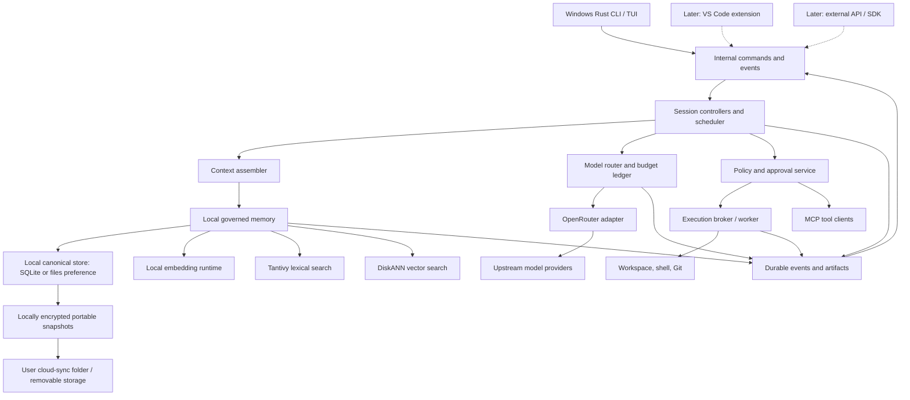
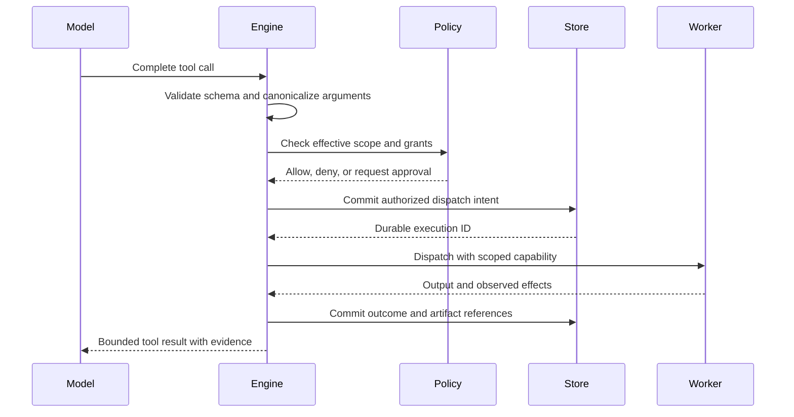
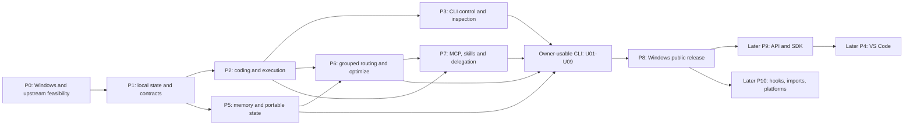

# VCP architecture and implementation plan

**Vibe Code Pro — design draft 0.4 — September 17, 2026 — local plaintext and encrypted cloud portability confirmed**

VCP is an Apache-2.0 coding agent for local use, first by its owner and then by anyone who downloads it. Its first usable release is a **native Windows CLI** combining reliable coding loops, intelligent selection across model groups through OpenRouter, persistent Munarium-style memory, MCP, skills, and visible delegation. All of those capabilities are required before it is considered usable. The API, VS Code extension, and other operating environments follow after the CLI is solid. VCP has no hosted service; its engine, memory, indexes, and embeddings run on the user's machine.

Its memory design borrows selected code and concepts from [Munarium Server](https://github.com/iokaio/munarium): versioned claims, provenance, disputes, supersession, historical views, and local embedding/indexing. VCP adapts these to RAM and local disk with **Tantivy for lexical retrieval and DiskANN for vector retrieval**. Portability governs storage: the proposed default is **local SQLite plus complete portable snapshots**, with a **files/journal preference** evaluated and supported through the same contract. Backend qualification remains a prototype decision. Cloud-synced snapshots must carry history, context, memory, and search state between machines without relying on a hosted VCP backend.

**Encryption boundary confirmed September 17:** VCP does not require or add encryption to active local code, history, memory, databases or indexes. Every VCP file published for cloud backup/synchronization must be encrypted on the developer's machine before entering the sync folder, using a developer-controlled recovery key. The destination decrypts locally. Cloud-provider encryption or HTTPS alone does not satisfy this requirement; the provider must never receive plaintext backup contents or the secret recovery key.

VCP will borrow architecture, implementation components, and tests from the projects in [open-source.md](open-source.md), especially **OpenAI Codex and Gemini CLI**. Start from as much of Codex's Rust engine and CLI as is reasonable, retaining cohesive upstream components where practical and inserting VCP's OpenRouter routing, budget accounting, local Munarium-derived memory, and portability services. Gemini CLI supplies useful tools, scheduling, and extension adaptations. Each borrowed component keeps its provenance and applicable license notices.

## 0. Status, authority, and navigation

This document converts the research in [othertools.md](othertools.md) and the candidate inventory in [open-source.md](open-source.md) into a proposed design and an ordered implementation backlog. It specifies intended behavior; it does not describe an existing implementation or completed benchmark. The owner's instruction to borrow from open-source projects supersedes the earlier restriction on code reuse.

| Status | Meaning in this document |
|---|---|
| Confirmed requirement | Comes from the product brief or the owner's clarification |
| Proposed baseline | A concrete engineering choice to build and validate, subject to its ADR |
| Open decision | Must be resolved by a named experiment or product decision; no default is silently assumed |
| Deferred | Outside the first release, with boundaries preserved where practical |

The confirmed requirements take precedence over proposals. For VCP behavior, this document refines the illustrative interfaces in the research workbook. For competitor behavior, consult that workbook's evidence qualifications and primary sources. Exact dependency versions and provider/model availability must be pinned during implementation.

Read the design in these groups:

- [Product and invariants](#1-product-scope-and-requirements), [system topology](#3-system-topology-and-runtime), and [domain model](#4-domain-model-and-lifecycle).
- [Reuse policy](#02-open-source-reuse-policy), [Codex components](#35-codex-as-the-primary-rust-foundation), [Gemini CLI components](#36-gemini-cli-as-the-tool-and-extension-reference), and [other project candidates](#37-contributions-from-the-rest-of-the-open-source-inventory).
- [Owner decisions](#04-owner-decisions-and-their-design-consequences), [portable environments](#128-portable-environment-and-cloud-folder-transport), [project optimization](#78-interactive-project-optimization), and [owner acceptance suites](#207-owner-acceptance-suites).
- [Local plaintext and encrypted cloud backups](#1211-local-plaintext-encrypted-vaults-and-developer-keys).
- [Engine API](#5-engine-api-and-protocol), [context](#6-context-instructions-and-compaction), [routing](#7-openrouter-and-model-strategy), and [budgets](#8-cost-accounting-and-budget-enforcement).
- [Tools](#9-tools-and-execution), [permissions](#10-permissions-and-isolation), [memory governance](#11-governed-memory), [persistence](#12-canonical-storage-files-or-sqlite), and [retrieval](#13-tantivy-diskann-and-hybrid-retrieval).
- [Audit and recovery](#14-observability-durability-and-recovery), [extensions](#15-instructions-skills-hooks-and-mcp), [delegation](#16-multi-agent-work-and-integration), and [user interfaces](#17-cli-and-programmatic-clients).
- [VS Code](#18-vs-code-extension), [configuration and operations](#19-configuration-packaging-and-operations), [verification](#20-testing-evaluation-and-performance), [implementation plan](#21-implementation-plan), and [decisions and risks](#22-adrs-open-decisions-and-risks).
- [Repository code layout](../plan/code-layout.md) and [contribution conventions](../../CONTRIBUTING.md).

### 0.1 Baseline decisions

| Area | Direction | Status |
|---|---|---|
| Audience and license | Owner testing first; downloadable Apache-2.0 open-source release next | Confirmed |
| Product surfaces | CLI first; API and VS Code deferred until CLI is solid; preserve shared engine boundaries | Confirmed |
| Models | OpenRouter is the initial model gateway; route using task evidence and cost goals | Confirmed |
| Memory | Munarium-inspired governance; local RAM/disk; Tantivy plus DiskANN | Confirmed |
| Canonical persistence | SQLite default candidate, files/journal preference; portable snapshots for either | Portability and user choice confirmed; qualify both through ADR-003/008/015 |
| Encryption boundary | Active local data remains plaintext; cloud-bound snapshots encrypted locally with developer-held recovery material | Confirmed; format/key lifecycle qualification in ADR-019 |
| Engine language | Codex-derived Rust engine and CLI; TypeScript clients later | Proposed baseline; validate native dependencies and packaging |
| Harness foundation | Reuse as much Codex as reasonable; insert local memory and routing; selected Gemini adaptations | Confirmed direction; exact fork/component boundaries remain engineering decisions |
| Client protocol | Typed internal commands/events now; JSON-RPC and external SDK contracts reserved for later | Internal separation required; public API deferred |
| State ownership | One engine writer per data root; one serialized controller per active session | Proposed baseline |
| First execution location | Developer's local workspace, with explicit sandbox capability reporting | Proposed baseline |
| Platform work | Native Windows first; isolate OS adapters for later Linux/macOS/WSL/SSH/devcontainers | Confirmed; minimum Windows/CPU/RAM matrix still to measure |
| First usable release | Coding, grouped routing, memory, MCP, skills, visible delegation, history controls and portability | Confirmed |
| Local inference | Local embedding engine; coding/model-assisted work through OpenRouter | Confirmed; CPU-first embedding runtime proposed |
| History and memory | Full local work history; automatic memory across claim classes; workspace scope; user pruning | Confirmed |
| Terminal close | Pause and recover the task when VCP next opens that workspace | Confirmed |
| Hooks and imports | Defer executable hooks and other agents' configuration importers | Confirmed |
| Hosted VCP | No hosted engine, memory service, or hosted VCP product | Out of scope |

### 0.2 Open-source reuse policy

Evaluate existing code before writing equivalent infrastructure. Reuse is an implementation strategy, with these explicit forms:

| Form | When to choose it | VCP responsibility |
|---|---|---|
| Dependency | A maintained package exposes a suitable boundary | Pin the version, wrap it, and test required behavior |
| Vendored extraction | Suitable code is coupled to an upstream workspace or not independently released | Preserve origin and notices, import the necessary dependency closure, maintain a small patch series |
| Attributed port | The algorithm or lifecycle fits, but its language/types do not | Record the source revision, preserve applicable attribution, and compare behavior through shared fixtures |
| Pattern adoption | The useful contribution is the architecture or contract | Specify VCP semantics and tests; state deliberate differences |
| Deferred candidate | Identity, fit, maintenance cost, or source rights are unresolved | Record the investigation without making production work depend on it |

The owner-directed default is **maximum reasonable Codex reuse**. Begin with a pinned Codex-derived engine/CLI baseline and evaluate where coherent upstream modules can remain intact. Extract or replace code where its coupling prevents VCP's routing, memory, portability, or control contracts; do not require a full rewrite or a small-extraction strategy in advance. Gemini CLI remains the second primary reference. Avoid cosmetic rewrites that make future fixes harder to import. A Rust translation of TypeScript is an attributed port when it derives from that implementation, not a claim of independent authorship.

**Repository convention:** selected Codex source will be copied into `src/third_party/codex/` and committed as ordinary files with reviewed VCP patches already applied. It supplies the engine/CLI foundation in one authoritative build graph. No submodule, gitlink, nested Git repository, or subtree workflow is planned. Builds consume the committed source; an explicit maintenance check reconstructs it from the pinned upstream selection and ordered patches. [ADR-013](../adr/013-upstream-reuse-and-vendoring.md) records this convention separately from the still-open revision and module selection. No Codex code has been imported by this documentation change.

VCP's interfaces and invariants remain the integration contract. Borrowing does not automatically promise compatibility with another agent's CLI, session files, prompts, SDK, configuration, or network protocol. Dependency choices must preserve OpenRouter, low/med/high profiles, local Munarium-derived memory with Tantivy/DiskANN, and portable storage with a user-selectable preference.

### 0.3 Source evidence and scope

[open-source.md](open-source.md) supplies the project list and priorities. Its popularity, provider-count, model-access, and ownership shorthand is not an implementation requirement. Use the exact repository, selected component, license, and revision as the unit of investigation. Commercial IDE/cloud surfaces are not included merely because a project's CLI repository is public.

The Codex and Gemini paths linked below were inspected as research entry points on September 16, 2026. They are mutable branch links, **not selected dependency revisions or completed integration audits**. P0 records immutable commits, dependency closure, and repeatable builds before importing code. Secondary projects have candidate mappings; their component-level extraction work remains in the backlog. No upstream binaries were built or runtime comparisons performed for this revision.

### 0.4 Owner decisions and their design consequences

The September 16 answers and September 17 encryption clarification supersede earlier proposals where they differ. The implementation details below are proposals derived from these requirements, not claims that prototypes have passed.

| Answer | Confirmed decision | Where it changes the design |
|---|---|---|
| A01 | Personal local testing, then downloadable Apache-2.0 open source | Packaging, notices, release gates; no hosted product |
| A02 | Coding loops, selection across groups, automatic routing, and persistent memory must all work | Fixed-model and memory-free slices are development scaffolding only |
| A03 | CLI first; API and VS Code later | Remove public protocol/SDK/editor work from the first-release critical path |
| A04 | Native Windows first; preserve later portability | Windows execution and installer gates; OS abstractions for later ports |
| A05 | Take as much Codex as reasonable; insert local Munarium memory/indexing | Codex-derived baseline, targeted replacement seams, selected Munarium code reuse |
| A06 | Move between machines using cloud backup such as OneDrive; prioritize portability and offer storage preference | Backend-neutral encrypted snapshots, verified local decryption/restore, workspace rebinding, conflict detection and user choice |
| A07 | Remember code-related work within the workspace/folder; browse/purge/trim by date | Comprehensive scoped activity history and CLI lifecycle controls |
| A08 | Automatic memory for all claim classes, with selective/filter-based pruning | Automatic extraction/acceptance policy retaining evidence, inference labels and disputes |
| A09 | Engine and embeddings local; OpenRouter is the model gateway | Local embedding implementation, no hosted memory or embedding fallback |
| A10 | Low emphasizes spend/speed; high emphasizes capability with its cost; interactive `/optimize` | Group-aware project routing policies, measured optimization and user questions |
| A11 | User-selectable familiar autonomy levels | Separate permissions, sandboxing, interactivity and cost controls |
| A12 | Retain full history; notify beyond 30 days; configurable pruning | Full local capture by default, aging notices, explicit retention policy |
| A13 | Pause on terminal close; resume in that workspace | Shutdown checkpoint, process cancellation/reconciliation and workspace-local resume |
| A14 | AGENTS.md, MCP and skills required; broad default development skills; hooks/imports later | Launch extension scope and bundled skill catalog |
| A15 | Delegation essential and visible | Required child orchestration and running console/commentary events |
| A16 | Prove analysis, review and generation against appropriate architecture practices | Three concrete acceptance suites and project-aware graders |
| A17 | Local files need no VCP encryption; every cloud-transferred backup file must use a key controlled by the developer | Plaintext active stores, encryption before sync-folder publication, encrypted metadata/indexes, independent key recovery and local decryption |

### 0.5 Delivery boundary

The first usable milestone is a native Windows CLI passing A02 and A06–A17 together. API, VS Code, other platforms, hooks, configuration imports, and a marketplace do not block that milestone. Internal modularity and reusable contracts remain required to add those later without restructuring task, memory, routing, or execution ownership.

## 1. Product scope and requirements

The owner answers recorded in section 0.4 govern release scope. Earlier research remains evidence, not authority to reinstate deferred work.

### 1.1 What a user should be able to do

1. Open a workspace/folder in a native Windows terminal and ask VCP to analyze, review, generate, modify, or verify code.
2. Select a cost profile and task budget, or use a previously configured bounded policy.
3. See which model is doing each part of the work, why it was selected, and what it is costing.
4. Inspect the instructions, files, memory, and tool definitions included in a model request.
5. Review proposed or applied changes, relevant checks, and unresolved problems.
6. Steer or cancel a task without losing its recorded state.
7. Resume a session after a client restart and understand any effects whose outcome is uncertain.
8. Inspect, correct, dispute, or forget retained project knowledge.
9. Inspect live sub-agent work, optimize project model choices, and browse/prune history from the CLI.
10. Back up the local environment, move it to another machine, and resume with history and memory intact.
11. Use structured CLI output initially; use the same engine through an API and VS Code after the CLI release is solid.

### 1.2 Functional requirements and acceptance mapping

| ID | Requirement | Observable acceptance evidence |
|---|---|---|
| FR-01 | One engine with CLI-first delivery | Interactive and structured CLI use the same commands/events; later API/editor adapters preserve those semantics |
| FR-02 | OpenRouter model execution | Streamed text/tool calls, errors, actual model attribution, and usage normalize into VCP records |
| FR-03 | Low/med/high strategies | Profiles have explicit limits and explanations; none changes permission policy |
| FR-04 | Governed local memory | Accepted facts have scope, evidence, history, correction, and retrieval provenance |
| FR-05 | Tantivy and DiskANN retrieval | Lexical, vector, and fused results can be inspected and evaluated independently |
| FR-06 | Transparent work | Every external action has correlated intent, authority, dispatch, and outcome records |
| FR-07 | Reliable edits | Stale versions and concurrent user changes are detected; partial multi-file results are explicit |
| FR-08 | Session control and pause/resume | Explicit pause keeps the CLI open for inspection and deliberate resume; closing also pauses root/children durably, and reopening discovers recoverable work |
| FR-09 | Bounded spend | Concurrent work cannot reserve more than its root task permits; uncertain charges remain accounted for |
| FR-10 | Recoverable state | Acknowledged durable records survive supported crash tests; incomplete effects are reconciled |
| FR-11 | Required instructions, skills and MCP | AGENTS.md discovery, bundled development skills, and MCP work in the first CLI release; hooks/imports deferred |
| FR-12 | Visible delegation | Children have bounded scope/budget/ownership and streamed commentary, status, tools, results, and integration evidence |
| FR-13 | Maintainable open-source reuse | Borrowed code and ports have pinned origins, notices, VCP adapters, behavioral tests, and an update owner |
| FR-14 | Portable environment, storage choice and encrypted cloud transport | SQLite/files preferences share encrypted snapshot publication and verified local decryption/restore; developer-held keys protect all cloud-bound contents while active local files remain plaintext |
| FR-15 | Full history and pruning | Browse/search/filter code activity; preview selective/date pruning; notify after 30 days; apply configured policy |
| FR-16 | Local memory computation | Indexing and embeddings run locally without a hosted service or remote embedding endpoint |
| FR-17 | Project optimization | `/optimize` uses project evidence and user answers to propose, apply and roll back bounded routing changes |

An internal development slice may use one fixed model and no semantic memory to prove a boundary. It is not the first usable release. That milestone requires grouped model selection, automatic routing, persistent local memory, MCP, skills, visible delegation, portability, and CLI control together.

### 1.3 Initial boundaries

The first release targets a single user's local coding workflow on native Windows. A workspace is one explicitly identified folder tree, optionally with registered additional roots. It may contain multiple repositories/packages; each root has an explicit identity and authority boundary. Multiple machines use sequential portable handoff, not an assumed shared multi-writer database.

Initial scope includes file/search tools, command execution, Git-aware changes, tests, full session history, local memory, model routing, `/optimize`, MCP, bundled skills, visible delegation, pruning, and portable backup/restore. API/SDKs, VS Code, Linux/macOS/WSL/SSH/devcontainers, hooks and configuration imports are deferred until the Windows CLI is solid. Browser/computer use, organization-wide memory, voice and public plugin distribution are also deferred. A hosted VCP service is outside the product direction. Pushing branches, opening PRs, deployment and messaging remain explicit tool effects controlled by the chosen autonomy policy.

“Transparent” means exposing VCP's observable inputs, transformations, outputs, and decisions. It does not mean exposing inaccessible model reasoning or unobserved transformations inside OpenRouter or upstream providers.

## 2. Invariants and quality requirements

### 2.1 Invariants enforced outside the model

| ID | Invariant |
|---|---|
| I-01 | A model, retrieved document, memory claim, or project instruction cannot grant execution authority |
| I-02 | An action is dispatched only after validated arguments, applicable policy, and durable dispatch intent |
| I-03 | Reusing an idempotency key with a different payload is rejected |
| I-04 | A cost reservation is created atomically before a billable request starts |
| I-05 | Root budget accounting includes children, retries, reviewers, observers, compaction, and billable memory work |
| I-06 | A write verifies expected file/document state and never silently discards unrelated user changes |
| I-07 | An accepted memory record has a durable canonical commit; search-index visibility may lag and is labelled |
| I-08 | Every retrieved passage is authorized for the current caller and traceable to a record/source version |
| I-09 | Compaction changes a prompt projection; it does not silently rewrite the audit history |
| I-10 | Cancellation stops new scheduling; unresolved already-started effects remain visible |
| I-11 | An incomplete non-idempotent operation is never replayed solely because its success record is absent |
| I-12 | A task is complete only when its acceptance evidence is tied to the current result |
| I-13 | Files and SQLite backends, if supported, obey the same public state and recovery contracts |
| I-14 | Unknown capabilities, missing usage, redacted content, and stale indexes are explicit states |
| I-15 | A portable restore accepts only a complete verified snapshot; divergent machine histories are never silently overwritten or merged |
| I-16 | Memory embedding/index construction does not send content to a remote embedding service |
| I-17 | Pruning cannot silently delete active-task recovery or unsettled accounting dependencies; requested scope and any exclusions are reported |
| I-18 | Child activity is attributed and visible; parent pause stops new descendant scheduling |
| I-19 | No plaintext VCP backup payload, manifest, index, temporary file or secret recovery key enters the portable vault; missing encryption capability blocks publication, never falls back to plaintext |

### 2.2 Reliability and responsiveness

Separate immediate acknowledgements from long-running completion. The engine must keep cancellation and steering responsive while model streams, indexing, and commands are active. Use bounded queues, explicit timeouts, output spooling, and cancellable background work.

Durable events and accepted claims must survive the tested durability envelope. A disk-full condition stops new effects that require recording; a best-effort UI notification does not replace a failed durable write. Backpressure may reduce display refresh rate but cannot discard a completed action's recorded result.

Performance targets are provisional and appear in section 20. No vendor benchmark is a VCP performance promise.

## 3. System topology and runtime

### 3.1 Processes and ownership



The Rust engine owns state and authority. The first-release CLI consumes internal engine events. A later editor consumes the same contract; its webview never receives provider keys or permission to dispatch workers directly. A worker receives an explicit execution capability and does not inherit the engine's full credential environment. There is no hosted VCP coordinator; a user-managed sync client transports completed encrypted snapshot files only.

**Proposed binary entry points:**

- `vcp`: interactive CLI and commands.
- `vcp serve --stdio`: deferred public API entry point after the CLI is solid.
- `vcp daemon`: deferred client attachment mechanism, not a requirement to keep tasks running after CLI exit.
- `vcp worker`: internal worker entry point with a restricted bootstrap channel.

Prefer one packaged Windows executable for CLI/engine/worker roles initially; reuse a private Codex process boundary if it simplifies integration. A separate worker artifact remains possible if sandbox packaging requires it. Each active local data root has a single writer lock. A second writer returns a conflict or opens a separate root; a later client may attach through the deferred API. A local lock does not coordinate separate cloud-synced machines.

### 3.2 Why a Rust core is the proposed baseline

Tantivy is a Rust library, and the current DiskANN project exposes a composable provider boundary. Keeping memory/search integration in Rust reduces one native interface boundary and aligns process/filesystem work with the same core. Codex's Rust workspace also makes direct component reuse a practical candidate. Qualify the selected components through native Windows build, packaging and reuse spikes; qualify the proposed SQLite default and files preference separately through portability tests. [Tantivy](https://github.com/quickwit-oss/tantivy), [DiskANN](https://github.com/microsoft/DiskANN), [Codex workspace](https://github.com/openai/codex/tree/main/codex-rs).

Use TypeScript for the later VS Code extension and client bindings. Keep internal domain types independent of UI packages now; public schema generation is deferred. Retain suitable runtime, HTTP, serialization, PTY, credential and terminal libraries from the selected Codex baseline, replacing only what the integration requires. Pin their versions and licenses in P0.

### 3.3 Logical packages

The [code layout plan](../plan/code-layout.md) defines repository paths and the complete logical-package responsibility map. Its initial roots are `docs/` for documentation, `src/` for source and test assets, and `scripts/` for build/test automation. The following is the target structure, not a claim that implementation files already exist:

```text
docs/
  architecture/ plan/ adr/ development/ protocol/ operations/ evaluations/
src/
  crates/             VCP logical packages; actual cohesive modules mapped in P0
  tests/              support, fixtures, contracts, recovery, platform, end-to-end
  evals/              tasks, fixtures, and graders
  skills/builtin/     versioned development skill content and manifests
  packages/           deferred protocol-ts, sdk-ts, and vscode packages
  third_party/
    upstreams.toml    selected origins, commits, licenses, patches and owners
    codex/            selected cohesive workspace/components
    gemini-cli/       reference/fixture origins or selected licensed extracts
    munarium/         selected kernel/local retrieval code and test origins
    patches/          reproducible local changes to vendored components
    licenses/         original license and notice texts for imported material
scripts/
  build.ps1 test.ps1 package.ps1
  evals/              evaluation orchestration
THIRD_PARTY_NOTICES.md  notices included in distributed artifacts
```

Logical boundaries can begin as modules in fewer crates to avoid excessive build overhead. The rule is dependency direction: domain/protocol cannot depend on a UI or concrete storage backend; policy/budget checks cannot be bypassed by calling an adapter.

### 3.4 Concurrency model

One session controller serializes changes to session state. It delegates model calls, bounded reads, indexing, and execution to workers and receives typed completion events. No store transaction or session lock remains held while waiting for a model, approval, subprocess, or network call.

Root-task budget reservations and store writes use atomic operations. Parallelism is allowed between independent sessions and non-conflicting work, with separate global limits for model requests, subprocesses, index builders, and embedding batches. Scheduling records explain queue delays and resource exhaustion.

### 3.5 Codex as the primary Rust foundation

Start the engine investigation in [Codex's Rust workspace](https://github.com/openai/codex/tree/main/codex-rs). Retain as much working engine/CLI infrastructure as reasonable, inspecting dependency closure and service assumptions before adapting components. These are **VCP adoption proposals**, not claims that upstream components already implement VCP's invariants.

| ID / candidate and source | Proposed borrowing method and destination | Required VCP adaptation and proof |
|---|---|---|
| C01 App-server lifecycle and protocol tooling: [app-server documentation](https://learn.chatgpt.com/docs/app-server), [schema exports](https://github.com/openai/codex/blob/main/codex-rs/app-server-protocol/src/lib.rs) | Adapt lifecycle patterns and suitable schema-generation code into `vcp-protocol` and `vcp-engine` | Map thread/turn/item concepts onto VCP session/task/turn/tool IDs; retain VCP idempotency, controller leases, durable cursors, and standard JSON-RPC envelope; R01 |
| C02 Patch parser and change representation: [apply-patch library](https://github.com/openai/codex/blob/main/codex-rs/apply-patch/src/lib.rs), [package manifest](https://github.com/openai/codex/blob/main/codex-rs/apply-patch/Cargo.toml) | First direct-code extraction candidate, behind `vcp-tools` | Parse into a VCP prepared change; route all actual writes through expected-version checks, editor ownership, policy, and receipts; R02 |
| C03 Command policy matching: [execpolicy](https://github.com/openai/codex/blob/main/codex-rs/execpolicy/README.md) | Reuse or extract rule parsing/matching behind `vcp-policy` | Map upstream decisions to VCP allow/deny/approval; preserve rule provenance; match results cannot bypass trusted ceilings or authorize shell syntax they did not understand; R03 |
| C04 Process and sandbox infrastructure: [core](https://github.com/openai/codex/tree/main/codex-rs/core), [Linux sandbox manifest](https://github.com/openai/codex/blob/main/codex-rs/linux-sandbox/Cargo.toml) | Extract viable execution/OS components behind `vcp-exec`; resolve Windows/macOS implementations at the pinned revision | Translate a VCP execution capability into OS controls; test cancellation, inherited handles/environment, paths, and packaging on each claimed target; R04 |
| C05 Agent control and context: [core sources](https://github.com/openai/codex/tree/main/codex-rs/core) | Adapt cancellation, tool dispatch, instruction discovery, and history-projection code where extraction is bounded | Inject model, budget, store, memory, and policy interfaces; every model attempt and side effect remains visible to VCP; R05/R07 |
| C06 Terminal and headless clients: [workspace entry points](https://github.com/openai/codex/tree/main/codex-rs) | Evaluate terminal widgets, output handling, and CLI lifecycle helpers for `vcp-cli` | Bind the UI to VCP events and cost/memory inspectors; keep stdout machine-readable in headless mode; R01/R04 |
| C07 Regression fixtures and test infrastructure: component test modules alongside C01–C06 | Retain licensed tests for imported behavior; translate useful cases into VCP contract tests | Preserve provenance and upstream expected results; separately assert stronger VCP contracts and deliberate differences; R01–R08 |

**Reuse sequence.** P0-07 first builds the selected unmodified Codex engine/CLI on native Windows. P0-08 retains its working task, terminal and execution structure, locates model, persistence, context and tool-dispatch boundaries, and inserts adapters for VCP budgets/routing and local memory. Exercise C02/C03/C04 behind those boundaries before deciding which components need extraction. C01's internal lifecycle remains useful now; public protocol exports wait. C01–C06 identify responsibilities, not a limit to six small borrowed components; C07 preserves their tests. This sequence is future P0 work, not a completed fork or import.

**Bound the fork through evidence.** Use a Codex-derived baseline as the first candidate. Record its dependency closure, changed upstream modules, startup/build cost, and effort to import a representative fix. Compare selective extraction only where the baseline's coupling obstructs VCP's model, store, policy, or budget seams. ADR-013 records retained modules and replacements. The objective is maximum useful reuse with maintainable integration, not two complete competing harness implementations.

**Model boundary.** Codex provider configuration is useful research, but endpoint compatibility must be tested. VCP's OpenRouter adapter continues to own request shape, tool-call normalization, usage settlement, fallback admission, and served-model attribution. Retargeting a base URL alone does not establish conformance. Any borrowed retry, compaction, review, or helper-model path must request a VCP budget reservation before making a call. See [Codex provider configuration](https://learn.chatgpt.com/docs/config-file/config-advanced).

**Retained infrastructure versus VCP services.** Retain suitable runtime, HTTP, serialization, PTY, credential, and terminal libraries after qualification. VCP supplies or replaces the model gateway, budgets/cost ledger, routing, canonical store, Munarium-derived local memory/search, and encrypted portability. Remove or disable upstream telemetry and implicit credential discovery from VCP execution paths; needed credential/network operations go through explicit VCP configuration and authority. Keeping useful credential primitives does not permit ambient account discovery or hidden provider calls. Record the exact retained/replaced modules in ADR-013 and the P0 source map rather than promising an unmeasured reuse percentage.

### 3.6 Gemini CLI as the tool and extension reference

Use [Gemini CLI's core](https://github.com/google-gemini/gemini-cli/tree/main/packages/core/src) as the second primary implementation reference. Port well-bounded TypeScript logic into Rust when it reduces work; preserve suitable TypeScript utilities in the editor/client only. Running a second general-purpose agent engine in Node is not the baseline.

| ID / candidate and source | Proposed borrowing method and destination | Required VCP adaptation and proof |
|---|---|---|
| G01 Declarative tools and invocations: [tools.ts](https://github.com/google-gemini/gemini-cli/blob/main/packages/core/src/tools/tools.ts) | Port the separation of declaration, validation, prepared invocation, execution, and model/display output into `vcp-tools` | Remove `@google/genai` types; use VCP content blocks, immutable operation hashes, canonical errors, and artifact references; R02/R05 |
| G02 Tool scheduling: [scheduler.ts](https://github.com/google-gemini/gemini-cli/blob/main/packages/core/src/scheduler/scheduler.ts) | Adapt queue/lifecycle/cancellation structure into `vcp-engine` | Derive concurrency from trusted effect declarations and resource conflicts; persist dispatch boundaries; coordinate root budget and steering versions; R05 |
| G03 Policy and confirmation: [policy-engine.ts](https://github.com/google-gemini/gemini-cli/blob/main/packages/core/src/policy/policy-engine.ts), [confirmation bus](https://github.com/google-gemini/gemini-cli/tree/main/packages/core/src/confirmation-bus) | Port selected rule-evaluation and request-correlation patterns into `vcp-policy` | Explicit trusted precedence, deterministic tie handling, immutable operation identity, headless behavior, late/duplicate decision rejection; R03 |
| G04 Lifecycle hooks: [hook runner](https://github.com/google-gemini/gemini-cli/blob/main/packages/core/src/hooks/hookRunner.ts), [hook modules and tests](https://github.com/google-gemini/gemini-cli/tree/main/packages/core/src/hooks) | Adapt registry/planning/runner boundaries and licensed fixtures into `vcp-extensions` | VCP event schemas, restricted environment, output limits, recursion guards, rewrite reauthorization, and recovery receipts; R06 |
| G05 File discovery and scoped context: [fileDiscoveryService.ts](https://github.com/google-gemini/gemini-cli/blob/main/packages/core/src/services/fileDiscoveryService.ts), [services/tests](https://github.com/google-gemini/gemini-cli/tree/main/packages/core/src/services) | Port suitable ignore/discovery behavior and fixtures into `vcp-repository` and `vcp-context` | VCP canonical roots, link handling, scope precedence, token limits, and context provenance; R02/R07 |
| G06 Skills and MCP: [core module inventory](https://github.com/google-gemini/gemini-cli/tree/main/packages/core/src) | Inspect selected discovery, lifecycle, and cancellation components for ports into `vcp-extensions` | Resolve exact implementation paths in P0; keep VCP server identity, schema revisions, permissions, and lazy loading; R06 |
| G07 IDE companion: [extension package](https://github.com/google-gemini/gemini-cli/blob/main/packages/vscode-ide-companion/package.json) | Reuse suitable TypeScript editor-context/diff utilities after component inspection | Replace its transport and configuration with the VCP SDK; enforce document versions, multi-root identity, workspace trust, and reconnect semantics; R01/R02 |
| G08 Integration and evaluation harness: [integration tests](https://github.com/google-gemini/gemini-cli/tree/main/integration-tests), [evals](https://github.com/google-gemini/gemini-cli/tree/main/evals) | Adapt useful fixture runners/scenarios into VCP contract and evaluation suites | Separate deterministic fake-provider cases from paid model runs; remove provider-specific assumptions and retain test provenance; R05–R08 |

**Tool conversion contract.** A port must expose a side-effect-free declaration/validation boundary, a prepared operation containing required scope and expected resource versions, and an execution function accessible only through the broker. Output has separately bounded model content, UI display content, and full evidence artifacts. UI Markdown is never interpreted as an execution request. Provider-specific content types are converted at `vcp-models`, not embedded in the tool registry.

**Scheduling difference to preserve.** The inspected Gemini scheduler contains an upstream parallelism decision with edit exceptions and a request flag. VCP will adopt the lifecycle structure while making parallelism an engine decision: unknown effects and overlapping writes serialize; a model-supplied flag can request ordering but cannot declare an operation safe. Cancellation, policy changes, or steering received while an invocation is waiting cause a final pre-dispatch recheck. [Inspected scheduler](https://github.com/google-gemini/gemini-cli/blob/main/packages/core/src/scheduler/scheduler.ts).

**Release scope.** G04 hooks and G07 editor utilities are deferred. C01's public schema/API generation is also deferred; its internal lifecycle patterns can support the first CLI. Retain these candidates as later implementation guidance.

**Porting evidence.** G01–G03 should have language-neutral input/event/result fixtures for launch; G04 follows when hooks are implemented. Execute the relevant pinned upstream component against a fixture where practical, then the VCP adapter/port. Normalize incidental IDs/timestamps, compare defined semantics, and document intentional changes. Preserve the upstream expected outcome as a separate fixture when VCP deliberately differs; do not rewrite it to make a comparison pass. A test harness using Node does not make Node a production engine requirement.

### 3.7 Contributions from the rest of the open-source inventory

These mappings cover the remaining projects in [open-source.md](open-source.md). They identify what to investigate and where it would fit; they do not commit VCP to importing every project or certify every component's license. Pin the exact package/revision and inspect its files before promoting a candidate to direct reuse.

| Project / primary entry point | Candidate contribution and VCP destination | Adoption boundary and implementation gate |
|---|---|---|
| [OpenCode](https://github.com/anomalyco/opencode) | Provider capability normalization, model-switch behavior, service/client separation; `vcp-models`, `vcp-routing`, `vcp-protocol` | Compare normalized request/result fixtures; use OpenRouter as the first gateway; P2-02, P6-01/03 |
| [Cline](https://github.com/cline/cline) | Editor diff/review interactions, task history, planning/execution transitions; VS Code client | Extract editor helpers if dependency closure is reasonable; execution mode and cost profile stay separate; P4-02/03 |
| [Aider](https://github.com/Aider-AI/aider) | Token-bounded symbol/repository maps, edit-format cases, Git-aware context; `vcp-context`, `vcp-repository` | Port selected algorithms/fixtures where useful; evaluate lexical-only versus symbol-map context before adding dependencies; P2-01/04 |
| [OpenHands SDK](https://github.com/OpenHands/software-agent-sdk) | Conversation events, persisted state, workspace/executor boundaries; `vcp-audit`, `vcp-store`, worker contract | Select SDK packages separately from the broader product; local execution first; P1-06, P2-07 |
| [Pi](https://github.com/earendil-works/pi) | Compact core, provider adapters, optional skills/extensions, streaming UI; context and CLI | Compare overhead and reuse suitable fixtures/utilities; VCP still enforces authority in its engine; P2-08, P3-02, P7-01 |
| [Goose](https://github.com/aaif-goose/goose) | Rust implementation alternatives, MCP integrations, reusable workflows; execution/extensions | Compare with selected Codex components; avoid a second policy or session authority; P0-08, P7-02/03 |
| [Continue](https://github.com/continuedev/continue) | Editor context providers, model-role configuration, configuration UX; editor and routing | Inspect exact current modules; normalize into VCP context manifests and role registry; P4-01/03, P6-01 |
| [Roo Code](https://github.com/RooCodeInc/Roo-Code) | Mode boundaries, delegated task UX, checkpoints; editor and task graph | Preserve ancestry and original notices for derived components; validate user edits and child budget scope; P4-02, P7-04/05 |
| [Kilo Code](https://github.com/Kilo-Org/kilocode) | Provider/client integration and task review workflows; routing/editor | Resolve the selected package's lineage and dependencies; deduplicate inherited implementations in comparisons; P4-02, P6-01 |
| [Qwen Code](https://github.com/QwenLM/qwen-code) | A comparison point for adapting Gemini-derived behavior to other model contracts | Study adapter differences and tests before porting Gemini assumptions; do not count inherited tests as independent evidence; P0-09, P2-02 |
| [Kimi CLI](https://github.com/MoonshotAI/kimi-cli) | Agent/client separation, streamed tool interaction, shell UX; protocol and CLI | Compare concrete protocol/event cases; any additional compatibility adapter is explicit; P0-03, P3-01/02 |
| [CodeWhale candidate](https://github.com/Hmbown/CodeWhale) | Rust terminal harness and provider/execution boundaries; optional reference for P0 | Resolve the intended owner/fork and selected revision because the inventory gives no URL; no critical path dependency until identified; P0-07/08 |
| [Claw Code candidate](https://github.com/ultraworkers/claw-code) | Optional harness comparison after source-history review | The inventory's clean-room description is not established here; record exact identity, source origin, license, and include/exclude decision; P0-07 |

Munarium remains the memory-governance reference in section 11. Codex/Gemini session-history or instruction-file features are not substitutes for claims, disputes, historical views, or Tantivy/DiskANN retrieval. Closed-source tools in the broader workbook remain behavioral references; this reuse plan concerns identifiable licensed open-source components.

### 3.8 Boundaries around borrowed components

Keep upstream types behind narrow adapters. The names below describe logical contracts; P0 chooses concrete Rust traits and owned/borrowed data representations.

| VCP boundary | Upstream implementation may supply | VCP retains |
|---|---|---|
| `PatchParser` | Parsing, edit representation, diagnostic formatting | Source-version checks, write authorization, dirty-buffer coordination, receipts |
| `CommandMatcher` | Parsed command/rule match and explanation | Effective authority, approval scope/expiry, deny ceilings, audit records |
| `ExecutionBackend` | OS process/PTY/sandbox primitives | Capability issuance, durable dispatch, quotas, cancellation ownership, effect reconciliation |
| `ToolDefinition` / `PreparedInvocation` | Tool-specific validation and execution logic | Scheduling, final authorization, resource conflicts, bounded outputs, durable outcomes |
| `ProtocolCodec` / schema exporter | Framing and generated type/schema machinery | VCP methods, wire version, task identity, capabilities and replay semantics |
| `ContextSource` | File discovery, scoped instruction loading, repository map | Access control, trust attribution, token budget, source versions, memory governance |
| `EditorBridge` | Selection/document/diff helpers | VCP engine connection, document conflict policy, user control and inspection |

Every borrowed module is classified as pure computation, read-only I/O, or effectful. Effectful components execute with a broker-issued capability and controlled environment. Disable, remove, or route embedded network calls, telemetry, credential discovery, automatic updates, and helper-model calls through VCP services. A component with unavoidable hidden effects fails the extraction gate.

VCP has one authoritative session controller, one effective policy decision, one cost ledger, and one canonical memory store. Upstream helper caches are permitted when bounded and rebuildable; upstream session databases or JSONL files cannot silently become an additional source of truth. Record any upstream data importer as a separate feature with explicit unsupported fields and migration tests.

## 4. Domain model and lifecycle

### 4.1 Core entities

| Entity | Identity and essential fields | Authority |
|---|---|---|
| Workspace | ID, canonical roots, host ID, repository/worktree identity, trust state | Execution and path scope |
| Session | ID, workspace ID, configuration revision, fork origin, last event cursor | Durable conversation |
| Task | ID, objective, constraints, acceptance criteria, root budget, status | Work contract |
| Turn | ID, task ID, triggering user input, steering version, state | One user-directed work cycle |
| Step | ID, turn/agent ID, context manifest, routing decision, model attempt IDs | One normalized model cycle |
| Model attempt | ID, reservation, provider request ID, model served, terminal status | One billable attempt; retries have new IDs |
| Tool run | ID, normalized arguments, policy decision, execution ID, effect state | One proposed/dispatched operation |
| Approval | ID, operation hash, scope, actor, policy revision, expiry, decision | Specific grant or denial |
| Artifact | ID, media/schema type, protected content reference, retention, integrity metadata | Immutable version of evidence/output |
| Claim | ID, version, scope, value, evidence, validation, lifecycle | Governed durable memory |
| Index generation | ID, canonical watermark, Tantivy/DiskANN IDs, embedding/schema versions | Searchable memory view |
| Verification | ID, result artifact, tested workspace fingerprint, check specification | Evidence about the current result |

Use opaque IDs; never infer authorization from an ID prefix. Sequence counters are scoped explicitly: session event sequence and memory sequence are different counters. Serialize 64-bit counters as decimal strings to avoid precision loss in JavaScript clients.

### 4.2 Task and turn semantics

A session may contain multiple tasks. A turn continues an existing task when the user steers it; unrelated work creates a new task with a distinct budget and acceptance contract. A clarification answer does not erase the original objective.

Task states are `pending`, `running`, `waiting_for_input`, `blocked`, `paused`, `completed`, `failed`, and `cancelled`. A task may finish with explicit partial artifacts, but partial work is not represented as completed unless the accepted objective was narrowed.

Turn states:

```text
queued -> assembling_context -> reserving_budget -> requesting_model
requesting_model -> processing_response
processing_response -> awaiting_approval -> executing_tools
processing_response -> executing_tools -> assembling_context
processing_response -> verifying -> completed

Active states may transition to:
  waiting_for_input | paused | blocked | budget_exhausted | failed | cancelling
cancelling -> cancelled
```

State transitions carry reason codes and causative event IDs. Resume is a new command that revalidates policy, workspace state, pending effects, and budget; it is not a blind jump back into a saved stack frame.

Every model step and prepared tool operation records the steering version it used. Before dispatching an operation from an older version, the controller checks whether new guidance changed its scope or preconditions; if so, it discards or re-plans the operation. A response based on old guidance cannot silently override a newer instruction.

### 4.3 Tool effect lifecycle

```text
proposed -> validated -> authorized -> dispatch_recorded -> running
running -> succeeded | failed | cancelled | outcome_unknown
```

A failed tool can still have partial effects. Record process exit status separately from observed filesystem or remote changes. A cancelled turn may contain `outcome_unknown` tools requiring reconciliation.

### 4.4 Completion contract

A completion record includes the current diff/artifact IDs, repository and buffer fingerprints, executed checks, outcomes, skipped checks with reasons, outstanding issues, and total known/uncertain spend. It must not reuse a passing result after relevant files or environment inputs changed.

Explanatory tasks can complete with cited evidence and no code verification. Editing tasks require checks appropriate to the change; do not require a full test suite for every documentation edit or treat an unnecessary model review as mandatory.

### 4.5 Terminal close, pause and workspace resume

Users can explicitly pause VCP **without closing the application**. `/pause` in the interactive CLI and the equivalent `vcp tasks pause <task-id>` control command request the same durable pause. The terminal remains open for status, cost, history, child views and evidence inspection. `/resume` deliberately continues the selected paused task in the same running CLI after revalidation; closing and reopening is not required. Repeated pause requests are idempotent, and pause is distinct from cancelling or completing a task.

The interactive CLI owns the active task lifetime. On `/pause`, normal exit, terminal-close notification, or loss of the controlling CLI connection, stop scheduling new model calls, tools, maintenance work and children. Cancel active model streams and brokered process trees within bounded grace periods; persist partial output, unsettled costs and unresolved effects. Commit the last durable task/child state and prepare the configured portable checkpoint when time allows. A pause never promises to freeze arbitrary external processes at an instruction boundary.

Show `pausing` until the stop boundary and checkpoint are established, then `paused`, with unresolved effects and costs still visible. These are presentation/lifecycle states mapped to the task model by P1/P2, not evidence that every remote effect was stopped. Read-only inspection and receipt reconciliation remain available while paused; they do not authorize new task effects. New steering can be recorded while paused but cannot implicitly resume the task. Parent pause stops new descendant work, and resuming the parent must preserve any child's independent pause or cancellation. U06 must exercise pause, inspection and resume in one live CLI process as well as close/reopen recovery.

Native Windows close events and hard termination have different completion guarantees. Reuse the selected Codex process/job controls, maintain recovery checkpoints during work, and test terminal closure, Ctrl+C behavior and forced termination. A process that survives or cannot be reconciled remains `outcome_unknown`; no task is blindly replayed on startup. No agent continues scheduling unattended after its owner CLI is gone.

Starting `vcp` in a known workspace locates its stable identity and most recent unfinished task. If exactly one task is resumable, display its objective, last state, child progress and outstanding issues and offer a one-step continuation. Multiple tasks produce a chooser; `vcp resume --last` supplies explicit selection for automation. Revalidate current files, instructions, policy, model catalog, memory generation and budget before continuing. Keep same-machine grants only within their valid scope; a transferred environment binds destination authority separately.

## 5. Engine API and protocol

**Delivery status: external API, SDK, stdio server and attach endpoints are deferred.** Keep typed commands/events and clear engine ownership for the CLI now. Reuse a private upstream process protocol when useful, without publishing a stable VCP API. Sections 5.1–5.5 specify the later public contract; first-release work needs only the equivalent internal domain behavior, cancellation and persistence. No HTTP service or hosted endpoint is required.

### 5.1 Wire format and transports

Use standard JSON-RPC 2.0 envelopes, including the `jsonrpc` field, request IDs, results/errors, and notifications. Maintain VCP-specific method and event schemas separately from JSON-RPC's transport-independent envelope. [JSON-RPC specification](https://www.jsonrpc.org/specification).

Borrow Codex's engine/client separation and schema tooling through C01, while defining VCP's own wire contract. The inspected Codex app-server documentation omits the `jsonrpc` member on its wire messages; VCP retains it. An upstream codec must be adapted and tested rather than assumed wire-compatible. VCP sessions also have a separate task/budget layer and durable event cursors. An optional Codex client compatibility facade would require an explicit versioned method/state translation and is deferred. [Codex protocol](https://learn.chatgpt.com/docs/app-server).

Initial framing is one UTF-8 JSON message per line over stdio; embedded newlines are escaped in JSON. Reject oversized envelopes and use artifact references for large output. Stdout contains protocol messages only; diagnostics go to stderr.

For daemon attachment, use the same framing over a user-scoped Unix-domain socket or Windows named pipe after testing authentication, endpoint permissions, and peer ownership. TCP/WebSocket and remote authentication are deferred; no unauthenticated network listener is an initial default.

### 5.2 Initialization and compatibility

```json
{
  "jsonrpc": "2.0",
  "id": "request-init",
  "method": "initialize",
  "params": {
    "protocol_version": "1.0",
    "client": {"name": "vcp-vscode", "version": "0.1.0"},
    "capabilities": ["events.resume", "approvals", "editor.context"]
  }
}
```

The response returns the negotiated version, engine build, supported operations, maximum message size, execution host, sandbox capabilities, and event schema version. Clients must not infer capabilities from the version number alone.

Major incompatibility returns a structured error. Additive fields are ignored by older readers where safe; unknown security/governance states fail closed. Generate TypeScript bindings, JSON Schema, examples, and protocol conformance fixtures from one schema source.

### 5.3 Minimum methods

| Method | Request essentials | Result/semantics |
|---|---|---|
| `workspace/open` | Canonical root request and host | Workspace ID, trust/policy, repository state |
| `session/create` | Workspace, requested profile/config revision | Durable session ID |
| `session/read`, `session/list` | Scope, cursor/page limits | Authorized summaries or state snapshot |
| `session/resume`, `session/fork` | Session, optional recorded turn boundary | Revalidated session or new ancestry-linked session |
| `task/read`, `task/cancel` | Task ID, authorized scope, mutation identity where applicable | Root-task state or coordinated cancellation across active turns and children |
| `turn/start` | Session, task objective/input, budget policy, idempotency key | Durable acceptance and turn ID |
| `turn/steer` | Turn, new user input, expected steering version | Accepted guidance and next application boundary |
| `turn/pause`, `turn/cancel` | Turn, request identity | Acknowledgement followed by state/terminal events |
| `approval/respond` | Approval ID, decision, expected operation/policy revision | Atomic acceptance or stale/already-resolved error |
| `events/subscribe` | Session, after-sequence cursor | Ordered notifications plus gap/snapshot handling |
| `artifact/read`, `diff/read` | Artifact/change ID and bounded range | Access-checked content or reference |
| `context/inspect`, `routing/explain`, `usage/read` | Step/task ID | Stored manifests, decisions, and complete cost view |
| `memory/query`, `memory/inspect` | Scope/query or claim ID/version | Evidence, findings, generation and sequence |
| `memory/propose`, `memory/resolve`, `memory/forget` | Versioned command and authorization | Durable governance/deletion status |
| `editor/context`, `editor/changeResult` | Versioned buffers or change receipt | Accepted context or reconciled editor effect |
| `session/export` | Session and capture/redaction scope | Export artifact and visibility manifest |

All methods validate identity and workspace scope. Mutation idempotency keys are persisted with a request payload digest and result reference. A repeated request returns the existing result; a changed payload with the same key is rejected.

### 5.4 Events, reconnect, and ownership

Each durable session event has an event ID, session sequence, type/schema version, causation/correlation IDs, timestamp, and payload/artifact references. Notifications use `event` with that envelope. Live token deltas may be coalesced; their durable completed artifact remains fetchable.

Subscriptions resume from a cursor. If retention removed the cursor's events, return an explicit gap and a snapshot boundary; do not pretend a full history was delivered. Duplicate delivery is permitted and deduplicated by event ID/sequence.

Multiple clients may observe. A controller lease determines who can submit interactive responses for a session; lease transfer and expiry are events. A pending approval can be resolved once. Client disconnect does not imply permission, cancellation, or approval denial.

Stdio owner exit requests a controlled pause according to section 4.5. Detaching an observer does not change a live controller's task; losing the controlling owner pauses its task tree. Earlier daemon-owned continuation wording is superseded by the confirmed close-to-pause requirement. A future independent background-owner mode requires an explicit product decision and does not follow merely from adding local attachment.

### 5.5 Errors

Use JSON-RPC standard errors for envelope/method/parameter failures. Application errors have stable symbolic codes inside structured error data:

`POLICY_DENIED`, `APPROVAL_REQUIRED`, `APPROVAL_STALE`, `BUDGET_EXHAUSTED`, `CAPABILITY_UNAVAILABLE`, `VERSION_CONFLICT`, `PROVIDER_RETRYABLE`, `PROVIDER_REJECTED`, `STORE_UNAVAILABLE`, `INDEX_NOT_READY`, `OUTCOME_UNKNOWN`, `CANCELLED`.

Include retry classification, affected operation, safe explanation, and reconciliation guidance. A transport timeout does not prove a command failed; the client queries its idempotency key or operation ID before retrying.

## 6. Context, instructions, and compaction

### 6.1 Context is a reproducible projection

The assembler builds a request from versioned inputs; it does not maintain an opaque string buffer as the sole source of task state. Each context part records its source, trust class, scope, revision, content artifact, estimated tokens, inclusion reason, and any truncation.

Proposed assembly order:

1. VCP's versioned operating instructions and tool-use contract.
2. Effective task mode, user objective, accepted constraints, and current steering.
3. Applicable project/user instructions, with their source and scope.
4. Activated skill content and relevant tool schemas.
5. Current task state, decisions, unresolved work, and verified results.
6. Repository evidence, editor context, and authorized memory passages.
7. Required conversation/tool-call history and the latest user input.

This order describes a logical manifest; the provider adapter maps parts to the model's supported message roles. The system must preserve meaning when those roles differ. Record any role conversion instead of silently treating all content as an equally trusted instruction.

### 6.2 Instruction discovery and precedence

Use `AGENTS.md` as the initial repository convention, including nested path scopes. VCP settings live in `.vcp/config.toml`; reusable skills live under explicitly configured skill roots. Compatibility with `CLAUDE.md`, `GEMINI.md`, or other formats is opt-in and documented, avoiding accidental duplicate or conflicting loads.

Separate behavioral precedence from enforcement:

- Trusted VCP policy sets allowed capabilities independently of prompt text.
- Current explicit user constraints guide the task; repository instructions supply project conventions within their scope.
- More specific path instructions refine general project conventions for affected files.
- Skill instructions apply only while the skill is active and cannot change grants.
- Retrieved source, tool output, external content, and recalled memory are attributed data.

Record conflicts that affect an action. Do not silently discard a user constraint because a repository file says otherwise. Import expansion, if enabled, needs cycle/depth/size limits and workspace-policy checks. Changes to applicable instructions produce a new manifest revision before further affected work.

### 6.3 Selection and token budgeting

Routing first supplies a candidate model's capability/context envelope. The assembler creates a prompt that fits that envelope; final routing and budget admission validate the actual assembled size before dispatch. A fallback to a smaller context model requires reassembly.

```text
input_budget =
  usable_context_limit
  - reserved_output_capacity
  - provider_specific_overhead
  - tokenizer_uncertainty_margin

required_state + instructions + schemas + evidence + history <= input_budget
```

Use the selected model's tokenizer where supported. Otherwise retain a conservative estimate and uncertainty marker. Never assume character count is an exact token count.

Candidate evidence comes from exact file/path requests, lexical search, symbols, diagnostics, current diffs, recent relevant tool results, and governed memory. Deduplicate overlapping chunks and prioritize evidence needed to act safely and verify the result. Record excluded candidates with short reasons.

A required constraint, pending tool-call pair, or file precondition cannot be dropped just to fit. If required state alone exceeds the budget, partition the task or return a context-capability error.

Seal the context manifest with the current steering, access-policy, source, and memory-view revisions. Recheck applicable authorization and invalidation before sending source content to a provider. A revocation after dispatch cannot unsend data; cancel affected pending work where possible and record that boundary honestly.

### 6.4 Tool schemas and skills

Load a small stable built-in tool set and concise skill/tool discovery metadata. Load optional schemas and skill bodies only on activation. Cache schema versions, but invalidate them when a plugin or server changes.

Measure the trade-off between smaller prompts and discovery misses. Deferred tool loading must still leave an explicit mechanism for discovering available capabilities. Listing thousands of descriptions is not a free substitute for loading thousands of full schemas.

### 6.5 Compaction contract

Compaction creates a new projection artifact linked to its source event range. Keep authoritative task fields outside the summarizer:

- Objective, acceptance criteria, user constraints, steering version.
- Active grants/denials and their actual scope.
- Current file/diff versions and unresolved write conflicts.
- Pending questions, tool outcomes, reservations, and unknown effects.
- Accepted decisions, evidence links, and next required verification.

Only descriptive history is summarized. The original events remain subject to retention policy. The summary is model-generated evidence with a known source range; it is not automatically accepted memory.

### 6.6 Reused discovery and repository maps

Combine C05 instruction/context candidates with G05 discovery candidates behind `ContextSource`. Use one VCP scope resolver so two borrowed loaders cannot include the same instruction twice or disagree about precedence. An explicit importer may recognize `GEMINI.md` or another agent's configuration, but it records the source and translated semantics rather than silently granting it VCP instruction priority.

Evaluate Aider-style symbol maps as a token-bounded context source in P2-01. A map entry refers to the current file version and symbol/range; it is navigation evidence, not an accepted memory claim. Compare exact lexical search alone, lexical search plus a map, and the later memory-assisted pipeline using the same task set. Generated code, unsupported languages, stale parsers, and failed symbol extraction have explicit fallback behavior. See [Aider repository maps](https://aider.chat/docs/repomap.html).

Trigger compaction before exhausting output capacity. Detect repeated compaction that does not reduce required context and stop the loop with a clear reason. Charge summarization to the task, record its model, and do not compact if doing so consumes the funds required to report or verify the existing result.

## 7. OpenRouter and model strategy

### 7.1 Adapter boundary

Use OpenRouter's documented API as the initial gateway. Keep VCP's normalized conversation and tools independent of a particular provider wire format. Model selection and provider selection are separate decisions; OpenRouter documents provider policies and fallback mechanisms independently. [Provider routing](https://openrouter.ai/docs/guides/routing/provider-selection), [model fallbacks](https://openrouter.ai/docs/guides/routing/model-fallbacks).

Conceptual interface:

```text
ModelGateway.describe(model_id, provider_constraints) -> CapabilityEnvelope
ModelGateway.stream(RequestEnvelope, CancellationToken) -> ModelEventStream
ModelGateway.reconcile(provider_request_id) -> UsageOrUnknown

ModelEvent =
  Started | TextDelta | ToolCallDelta | ToolCallComplete
  | UsageUpdate | Completed | Failed
```

The adapter assembles fragmented tool arguments, maps tool-call IDs, validates complete JSON, classifies errors, records exposed request IDs, and normalizes usage. It never executes a tool itself. A `ToolCallDelta` is display/parsing input only. All remote model-assisted reasoning, extraction and optimization uses this OpenRouter boundary; memory embeddings and index construction stay local. Explicit MCP tools may contact their configured services under user policy, and user-managed cloud sync may transport backups; neither makes VCP a hosted engine.

Use one explicitly selected model in the first vertical slice. Add bounded fallback after conformance tests prove capability, budget, attribution, and data-policy behavior. Coordinate retries across VCP and the gateway so one logical step cannot expand into an uncontrolled attempt tree.

### 7.2 Catalog and compatibility registry

Persist a dated metadata snapshot plus VCP's measured compatibility record. OpenRouter's model catalog is an input to capability filtering, not evidence that a particular model performs reliably in VCP. [Models API](https://openrouter.ai/docs/api/api-reference/models/list-all-models-and-their-properties).

| Group | Fields |
|---|---|
| Identity | Exact model ID, alias/version behavior, provider endpoint where exposed, availability, snapshot time |
| Context | Input/total/output limits, tokenizer identity or estimate method, modalities |
| Tool behavior | Tools, parallel calls, structured output, schema limitations, tool-result constraints |
| Controls | Reasoning settings, supported sampling parameters, caching and usage reporting |
| Price | Currency, explicit units, input/output/cache/request/tool rates, unknown fields |
| Data policy | Allowed providers, retention constraints, region requirements when applicable |
| Measured behavior | Task-class success, edit validity, invalid calls, latency, retries, evaluation revision and sample count |
| Exceptions | Known incompatible parameters, version-specific failures, disabled capabilities |

Unknown required capabilities disqualify a candidate unless a controlled compatibility check establishes support. Catalog refresh cannot mutate the meaning of an in-flight reservation; retain the snapshot and limits used for that attempt.

### 7.3 Roles and strategies

Roles are optional task assignments, not permanently running processes:

| Role | Input | Output |
|---|---|---|
| Investigator | Objective, repository evidence, questions | Findings with source references and uncertainties |
| Planner | Constraints, findings, affected modules | Bounded task graph and acceptance checks |
| Editor | Task packet, relevant current files, tool access | Verified patch or explicit blocker |
| Reviewer | Current diff, requirements, verification | Specific findings tied to files/evidence |
| Summarizer | Event range and required-state rules | Compaction artifact |
| Memory extractor | Completed evidence and permitted claim classes | Memory proposals |

The main agent can perform several roles. Do not spawn a second model call merely to label a phase “planning.” Start with one capable model and add roles when the expected improvement exceeds handoff and verification cost.

### 7.4 Proposed profile defaults

These are initial scheduler limits to evaluate, not measured optimal values. Dollar caps must come from user configuration or the command; release dollar defaults remain open.

| Control | low | med | high |
|---|---|---|---|
| Main strategy | Economical capable model | Economical model with selective escalation | Stronger eligible model or bounded parallel work |
| Maximum simultaneous model calls per task | 1 | 2 | 4 |
| Maximum write workers | 1 | 2, disjoint and isolated | 4, disjoint and isolated |
| Quality escalation attempts per task | 1 | 2 | 3 |
| Routine observer calls | Off | Event-triggered and capped | Event-triggered and capped |
| Model review | Only when a defined risk/verification signal warrants it | Selective | Selective independent review for complex changes |
| Required capabilities and relevant tests | Same correctness floor for every profile | Same | Same |

Global resource limits and root budget may lower these caps. Child tasks cannot select a more expensive profile to evade the root's limits. Profile changes apply to new work after revalidation; they do not erase already incurred or uncertain charges.

### 7.5 Routing algorithm and explanation

1. Derive task role and complexity signals from explicit task metadata and current evidence.
2. Filter by capabilities, allowed providers, data policy, context fit, availability, and current price knowledge.
3. Use offline evaluation to rank likely quality, total cost, and latency for the task class.
4. Assemble model-compatible context, including handoff cost.
5. Reserve the next bounded attempt and record the selected model/provider constraints.
6. Observe tool validity, patch applicability, tests, repeated failure, and intervention.
7. Escalate, change strategy, or stop according to bounded rules.

Initial ranking should be deterministic and explainable: capability filters, measured-quality tier, estimated total cost, then latency tie-breaks. Do not implement an opaque learned router before collecting sufficient VCP evaluation data.

[ADR-020](../adr/020-bounded-semantic-decisions.md) proposes a bounded semantic
decision interface for optional complexity, suitability and strategy signals.
Its [design](decision-evaluation-design.md) incorporates the useful parts of the
[JEV exploration](exploring-jev.md). Actual Jev through OpenRouter is the leading
specialized qualification candidate, compared with deterministic rules and a
conventional OpenRouter LLM. A thin Rust adapter preserves the existing gateway;
LangChain is not a VCP runtime dependency. The listing does not prove request,
native probability, usage or cancellation compatibility; qualify those explicitly.
Closed Boolean/Choice/Score answers are advisory inputs to explicit Rust rules;
scores do not establish calibrated confidence, authority or verified completion.
Apply hard eligibility and quality constraints first. Retain deterministic fallback
and record the answer, evidence, policy revision and its effect on the choice.

P6-02/03/05 owns the proposed integration and P6-04 qualifies any enabled default
against held-out total-cost and quality evidence. Remote judgments and repairs use
the same OpenRouter gateway, task ledger, context permissions and pause barriers.
Local retrieval/indexing remains local. Direct TypeSafe access outside OpenRouter,
an extra local model and always-on observers are not adopted by this proposal.
No task dependencies or first-release requirements change, and no model savings
are yet demonstrated.

A routing decision records the candidate set, exclusion reasons, profile, catalog/evaluation revisions, estimated cost, reservation, selected role/model, provider restrictions, and escalation trigger. User-selected model pins remain effective unless the user enabled fallback.

### 7.6 Handoffs and errors

A handoff packet includes objective, constraints, decisions, current diff/base revision, relevant file versions, evidence, unresolved issues, acceptance checks, scope, and remaining budget. Full prior transcripts are retained artifacts; including them in the next prompt is optional and token-bounded.

Preserve valid tool-call/result pairing and omit incompatible opaque provider fields with a recorded reason. A changed model may require new tool schemas or message-role conversion. Never invent missing reasoning to make a conversation appear continuous.

Bound retryable network/rate-limit failures with backoff and a task deadline. Reject incompatible schemas before spending when possible. Do not automatically retry a tool's external effect because a subsequent model request failed.

### 7.7 Model groups and project routing policy

Use the **Frontier, High, Medium and Low** groups in [model-groups.md](model-groups.md) as research inputs to a versioned registry. These four capability groups are distinct from the three user cost profiles `low`, `med`, and `high`. The workbook's reported rankings, prices and model availability must be revalidated; they are not a shipping dependency lock or VCP measurements. Its local coding-model suggestions do not change this release's OpenRouter model gateway or local-only embedding contract.

Each eligible model/provider entry has group membership with evidence/version, role suitability, actual supported parameters, observed latency, task success and total cost. A profile chooses among groups; it does not mechanically map to one group. `low` favors inexpensive and fast candidates that meet the quality floor, with bounded escalation for hard work. `med` balances those goals. `high` prioritizes capability and successful completion while still exposing cost and obeying the selected cap. Cheap support roles remain cheap when a stronger main model is selected.

Project routing policy includes role/group/model eligibility, latency preference, task-quality floor, effort/output limits, escalation triggers, concurrency, model/provider exclusions and budget settings. Record why the chosen group/model fits the current stage and why an escalation occurred. A strong model may plan a difficult feature while a cheaper eligible model performs bounded investigation; handoff overhead counts toward the decision. Group changes do not change permissions.

### 7.8 Interactive project optimization

`/optimize` is required in the first usable CLI. Its persistent counterpart is `vcp optimize`; both operate on the current workspace and a selected history window. It is an inspectable workflow, not a continuously running hidden optimizer.

1. Read local project history and memory: task classes, languages/toolsets, outcomes, checks, retries, interventions, token/effort use, latency, actual/uncertain cost, child overhead and retrieval usefulness. Include failed/abandoned tasks and indicate small samples.
2. Produce a baseline report and identify likely waste or quality gaps. Separate observed correlations from causal claims; different tasks or providers cannot be treated as a controlled comparison.
3. Ask a small adaptive set of questions about speed versus quality, typical task size, acceptable spend, review needs, repeated failures and desired model restrictions. Use existing answers and project preferences rather than repeating the entire questionnaire.
4. Propose a configuration diff: role/group choices, effort/output caps, escalation rules, context/retrieval limits and concurrency. Explain expected effects, supporting evidence and uncertainty. Show pruning suggestions separately; changing routing never silently deletes memory.
5. Apply the user's selected changes as a new project policy revision, preserving the prior revision and an undo command. Effective configuration remains bounded by user-level budgets and authority. Update proposals cannot grant network/tool capabilities or increase a spending cap without an explicit user choice.
6. Evaluate subsequent tasks and bounded opt-in trials against the prior policy; report regressions and offer rollback. Do not require extra paid trial runs merely to save a preference.

Local analysis and the interview work without a separate service. Optional model-assisted analysis uses OpenRouter with an estimated/reserved optimization budget and an attributed prompt; embeddings remain local. `/optimize` does not retrain model weights. If useful history has been pruned, explain the limited evidence and ask preference questions rather than inventing a performance conclusion.

## 8. Cost accounting and budget enforcement

### 8.1 Root ledger and reservations

Every task has one authoritative root budget in a currency such as USD. Store monetary values as fixed-precision decimals or integer microcurrency; serialize them as decimal strings. Child allocations are subdivisions of the root budget, not additional spend to be counted twice.

```text
available =
  task_cap
  - settled_charges
  - active_reservations
  - unresolved_charge_reserves
  - protected_verification_reserve
```

Before dispatch, atomically admit a reservation only if it fits all applicable task, child, session, and global limits. The reservation includes the bounded maximum output and all known charge categories. A token-count estimate alone cannot guarantee an invoice ceiling.

### 8.2 Reservation state machine

```text
created -> submitted -> settled
created -> released                 # positively known not submitted
submitted -> reconciliation_pending # missing terminal usage or acknowledgement
reconciliation_pending -> settled | explicitly_resolved
```

Preserve reserves for potentially billed requests after cancellation or a crash. Release them only after reliable reconciliation or an explicit accounting policy records the unresolved liability; do not turn “usage unavailable” into zero.

Usage reports may contain overlapping totals. Keep raw provider fields and a documented normalized breakdown; sum only disjoint categories. Reasoning and cached-token details must be mapped according to that provider's billing semantics. OpenRouter distinguishes total charge from upstream inference cost. [Usage accounting](https://openrouter.ai/docs/cookbook/administration/usage-accounting).

### 8.3 What is charged to the task

Include main-agent requests, model-assisted routing if introduced, child agents, review, compaction, model-assisted memory extraction, optimization and retries in remote model charges. Embedding/index work is local and has CPU/RAM/disk accounting, not remote embedding charges. Track tool infrastructure costs separately where known. All such work has a task or explicitly configured maintenance owner.

Before a write-heavy stage, protect a configurable portion for relevant verification, reconciliation, and final reporting. Deterministic local checks do not require model tokens, but may have execution cost. If completion cannot fit the remaining budget, stop new work and report the current verified/partial artifacts.

### 8.4 Budget UX and controls

Show spent, reserved, uncertain, and remaining values together. The visible total covers the whole task tree. A cost profile is a strategy selector; a budget is an enforceable scheduling cap.

A new task must have an explicit cap or a persisted bounded policy before starting billable work. Headless callers receive a configuration error when neither exists. Users can raise a cap while a task is paused; the change is a durable user decision. Optional daily limits are configurable, with their currency/timezone and local or portable-environment scope disclosed; disconnected machines cannot claim a synchronized global budget lock. Restore carries existing liabilities forward.

The guarantee is that VCP does not deliberately schedule work beyond its reservation policy. Already-started requests, unknown provider charges, or changed upstream pricing can create invoice uncertainty; record that uncertainty rather than claiming absolute external billing control.

## 9. Tools and execution

### 9.1 Initial tool set

| Tool family | Contract essentials |
|---|---|
| `file.read`, `file.list` | Canonical workspace path, bounded range/size, content hash and encoding |
| `search.text`, `search.symbols` | Authorized roots, bounded results, source versions, ignore-policy disclosure |
| `file.prepareChange` | Expected versions, proposed operations, complete diff, affected roots |
| `file.applyChange` | Prepared change ID, fresh policy, version checks, per-file receipts |
| `process.start` | Executable/args or explicit shell, cwd, environment policy, limits, capability |
| `process.read`, `process.write`, `process.cancel` | Execution ID, bounded streams/stdin, cancellation state |
| `git.status`, `git.diff` | Repository/worktree ID, bounded evidence; avoid parsing human UI text where structured output exists |
| `verification.run` | Check specification, environment/fingerprint, result artifact |
| `user.ask` | Task-linked question and explicit pending state |
| `memory.query`, `memory.propose` | Scoped evidence retrieval or governed proposal, never raw unrestricted storage access |

Required MCP tools and optional web, image, LSP or later browser tools use the same registry and policy path. Each schema declares effect class, capability requirements, output caps, timeout, cancellation, retry/idempotency class, and artifact types.

### 9.2 Tool dispatch sequence



A hook that changes arguments runs before the final authorization step. A tool error is returned to the model with actionable evidence, but the model cannot request an unbounded recursive retry.

The G01/G02 port uses a VCP prepared invocation containing `tool_run_id`, tool/schema revision, canonical arguments hash, source preconditions, effect class, resource keys, steering version, and required capabilities. Preparation can perform authorized reads but cannot dispatch a write or command. Approval binds to that identity. Execution returns bounded `model_content`, `display_content`, `artifact_refs`, and `effect_receipts`; all presentations derive from the same recorded outcome.

The scheduler may batch independent reads. Writes with intersecting resource keys serialize, and commands with unknown effects take the conservative workspace conflict scope. Plugin/MCP declarations do not by themselves establish that a tool is read-only. Completing tools out of order is allowed when their correlation IDs and model-result ordering remain valid; reconstruct output order explicitly rather than relying on arrival order.

### 9.3 File changes and editor conflicts

Represent a change as stable file IDs/paths, expected content hashes or editor versions, ordered edit operations, and resulting content hashes. Preserve encoding and line endings unless the task explicitly changes them.

Prepare the whole change set before writing. Validate permissions, path traversal, link targets, affected versions, and all edit ranges. An ambiguous search/replace fails; it must not replace a different occurrence silently.

C02 provides a candidate parser, not the final write path. Use its parsed operations to calculate expected new contents, then pass those through `file.prepareChange` and `file.applyChange`. Any extracted helper that writes directly must be adapted or remain unreachable from the model-facing path. Retain upstream parsing fixtures and add VCP cases for CRLF, rename/delete, links, stale contents, duplicate matches, and dirty editor buffers.

For disk files, use platform-tested staging and per-file replacement with immediate freshness checks and receipts. A multi-file patch is not generally atomic to external observers; journal each file transition and report a partial application if interrupted. Recovery must not roll back over a new human edit.

For editor-owned dirty buffers, use the versioned editor path in section 18. Advisory engine locks do not prevent other programs writing a file. Document the supported concurrency envelope and test mutation races; do not claim a portable filesystem compare-and-swap guarantee that the implementation cannot provide.

### 9.4 Process control

The broker resolves execution host, working directory, shell, environment, sandbox profile, output limits, and cancellation behavior before dispatch. Prefer executable plus argument-vector calls for deterministic operations; require an explicit shell for pipelines and shell syntax.

Capture stdout/stderr separately with sequence offsets, timestamps, and bounded in-memory tails. Spool large output to artifacts and return ranges to the model. PTY mode is an explicit capability because terminal semantics differ from pipe execution.

Track a process tree or platform job/group rather than only a parent PID. Cancellation stops scheduling, signals the process group, waits a bounded grace period, then escalates according to policy. Report surviving or unreachable processes instead of claiming they stopped.

Worker restart never reuses a stale PID as an execution identity. Persist a worker/execution nonce and reconcile with a live worker or observed artifacts.

### 9.5 Verification

Checks can be configured by the repository and selected by the task: unit tests, type checking, lint, build, schema validation, documentation checks, or a reproducible smoke test. Treat configured commands as executable inputs subject to policy.

A verification record contains command/specification, environment, workspace fingerprint, affected artifacts, start/end, exit status, parsed findings, and raw output. Distinguish failed checks from tests that could not run. The final report states both.

## 10. Permissions and isolation

Use C03 command matching, C04 execution primitives, and G03 confirmation patterns as components of this service. VCP remains the final policy authority: rule matching, user approval, and OS isolation are different operations. A successful upstream matcher or sandbox launch does not stand in for the dispatch contract below.

### 10.1 Independent controls

Keep cost profile, task mode, authorization policy, and OS isolation separate:

- Task mode controls available workflow actions, such as exploration versus editing.
- Authorization determines whether a specific operation is allowed.
- Isolation bounds what an executing process can access.
- Cost policy bounds billable/resource scheduling.

Provide user-selectable autonomy presets with familiar planning, approval and automatic-edit behavior, while defining VCP's exact semantics. Claude Code's documented separation of modes and permission rules is a reference, not a promise of configuration compatibility. [Claude Code permissions](https://code.claude.com/docs/en/permissions).

| Proposed preset | Edits and commands | Network and broader effects |
|---|---|---|
| `plan` | Read/search and produce plans; no workspace mutation | Only separately authorized information tools |
| `ask` | Ask for new write/command authority; reuse valid scoped grants | Ask unless an existing scoped grant permits the operation |
| `workspace` | Allow task-scoped workspace edits and configured build/test commands | Dependency installation, additional paths and network follow explicit rules |
| `autonomous` | Execute within a user-configured broad capability set without routine prompts | Publish/install/network actions proceed only if included in that configured scope |

Use `workspace` as the proposed initial preset; final preset names/defaults remain a usability decision. A higher preset never disables durable intent, budget accounting, explicit deny rules or path/version checks. Display the effective mode and sandbox capabilities. Headless operation is an independent input mode: an action requiring a new answer pauses with a durable reference instead of inventing approval. Overrides are inspectable and can be scoped to task, workspace or user policy.

### 10.2 Decision order

1. Validate operation/schema, canonical paths, execution host, and current workspace trust.
2. Apply non-overridable capability and scope constraints.
3. Apply explicit denials.
4. Match applicable user/session/task grants.
5. Request a concrete approval if required and an authorized interactive controller exists.
6. Verify sandbox capabilities and recheck operation identity immediately before dispatch.

Grants have actor, scope, operation pattern or exact arguments, host, policy revision, and expiry. Existing user authorization persists within that scope. A new approval is required only when the operation exceeds it or relevant state invalidates the grant.

Repository configuration cannot grant itself network, credentials, executable hooks, or broader filesystem access. Model-based risk classification may be evaluated later, but cannot override deterministic constraints.

### 10.3 Platform capability matrix

Each execution backend reports supported filesystem restrictions, process isolation, network restrictions, credential separation, resource limits, PTY, and cancellation. Implement and test native Windows first. Keep host, path, shell, credential and isolation adapters replaceable; macOS/Linux and WSL/SSH/devcontainer implementations are later work and are not release blockers.

Native Windows is included in the first process/path spike. Evaluate restricted execution and process-job mechanisms against actual filesystem, junction, environment, and child-process tests. A WSL/container path is a separately labelled execution target with explicit path mapping, not a silent fallback.

If a requested isolation capability is unavailable, fail that request or use an explicitly configured reduced-isolation workflow. A Git worktree is never reported as an OS sandbox.

### 10.4 Credentials and untrusted content

Resolve OpenRouter and connector credentials in the trusted host from a user credential facility or explicit environment reference. Keep secrets out of stored configuration, model context, ordinary logs, and worker environment by default.

Treat repository documents, build output, retrieved passages, tool descriptions, and external responses as potentially instruction-bearing data. Their contents cannot authorize an action. Restrict tool schemas and execution capabilities independently of what the model claims a document asked it to do.

## 11. Governed memory

### 11.1 Adapt Munarium's concepts to local coding

Reuse selected Munarium Server code as well as its concepts. The published layout separates `munarium-core` kernel logic from storage/retrieval/provider implementations and includes in-memory storage and conformance scenarios. The source is an extraction starting point; VCP's integration still needs native Windows and portable-storage tests. [Munarium Server README](https://github.com/iokaio/munarium/blob/main/server/README.md), [license](https://github.com/iokaio/munarium/blob/main/LICENSE).

| Candidate | Intended reuse | VCP integration requirement |
|---|---|---|
| `server/src/munarium-core` | Ledger, governance gates, evidence/claim composition and trait boundaries | Map workspace identity, automatic acceptance, pruning and VCP events; retain attribution and conformance cases |
| In-memory backend and `server/conformance` | Prototype adapter and semantic test scenarios | Exercise the same contracts against VCP SQLite and files backends |
| Selected local embedding/index lifecycle code | Local embedding interface/cache, generation/provenance handling where reusable | Pin exact implementation and model artifacts in P0; replace database-coupled retrieval with Tantivy/DiskANN adapters |

The published overview describes local embedding for index construction; P0 must locate that implementation in the selected commit and verify its dependencies and model assets. Do not assume an upstream database backend, embedding cache, or server deployment is already the required portable local implementation. Exclude hosted server planes, PostgreSQL requirements, paid document services and ambient cloud credentials from the VCP dependency closure. [Munarium overview](https://github.com/iokaio/munarium).

Separate four stores/views:

| Kind | Meaning | Lifetime |
|---|---|---|
| Operational history | What sessions, models, tools, and policy actually did | Durable events, with retention-controlled content |
| Working context | What one model request sees | Rebuildable projection |
| Repository/search index | Derived representations of current or retained source | Rebuildable, versioned caches |
| Governed memory | Accepted project knowledge and its evidence/history | Durable canonical claims |

Capture all available code-work activity within the configured workspace: user requests, prompts/responses, tool results, edits, checks, routing choices, child work and corrections. This means activity VCP observes or performs; it does not claim to observe every editor action while VCP is closed. On reopening, record changed files/repository state relative to the last known snapshot, with the actor marked unknown when appropriate. External file observation while VCP runs is bounded by workspace scope and ignore/size policy.

Automatically derive memory across all supported claim classes. Operational history preserves what happened; inferred architectural lessons retain inference/evidence labels and are not converted into unquestionable facts. Workspace/folder identity defines default recall scope, including nested code and paths. Another workspace's activity is not silently mixed into the current project's context. User-global configuration/preferences can be separately scoped; sharing code knowledge across workspaces is an explicit operation.

### 11.2 Claim schema

Logical record fields:

| Group | Fields |
|---|---|
| Identity | `claim_id`, `version_id`, `proposal_id`, `memory_seq`, `origin_event_id` |
| Scope | `principal_scope`, `repository_id`, `workspace_scope`, optional paths/symbols |
| Meaning | `claim_type`, structured subject/predicate/value, readable statement, conditions |
| Applicability | Source revision/hash, branch applicability if needed, valid time, recorded time |
| Evidence | Evidence IDs, source locations, source/content versions, relevant verification IDs |
| Governance | Resolution state, findings, accepting actor/policy, validation revision |
| History | Predecessor/supersession links, contradiction group, correction reason |
| Retrieval | Chunk/vector IDs, tags, index/embedding versions |
| Retention | Sensitivity, retention class, deletion/tombstone status |

Example proposal:

```json
{
  "proposal_id": "proposal-example",
  "claim_type": "project.test_command",
  "scope": {"repository_id": "repo-example", "path": "packages/parser"},
  "value": {"command": ["npm", "test"], "cwd": "packages/parser"},
  "evidence_ids": ["artifact-package-config", "verification-example"],
  "source_revision": "workspace-fingerprint-example",
  "origin_event_id": "event-verification-completed",
  "idempotency_key": "memory-proposal-example"
}
```

The example's command is evidence-bearing data. Recalling it does not authorize execution.

### 11.3 Governance rules

Start with a small versioned set of claim types: test/build commands, module relationships, architectural decisions, environmental constraints, verified fixes, and explicitly stated user preferences.

The write path checks:

1. Schema and type validity.
2. Identity, repository, path, and retention scope.
3. Evidence existence, integrity, and applicability.
4. Chronology and valid predecessor/version.
5. Conflicts with accepted claims of the same subject and conditions.
6. Claim-class acceptance policy.

Possible resolutions are accepted, disputed, rejected, or awaiting review. Keep the proposal and findings according to retention policy. A disagreement is not fixed by silently choosing the newest text.

The default acceptance policy is automatic for all supported claim classes, including architecture observations and lessons from work. Authoritative configuration and verified results can become accepted facts; inferred claims are retained automatically with `inferred`/`unverified` evidence status, applicable scope and source links. Conflicts become visible disputes, not blocking requests for routine user approval. A successful test supports a version-specific observation, not a universal guarantee. User correction supersedes the affected claim, and a model confidence score never substitutes for evidence. Optional review policies remain configurable rather than the default.

### 11.4 Updates, historical views, and current authority

An accepted correction creates a new version with a supersedes link. Current-state projections mark the prior version superseded without changing its original content. History uses the memory sequence and recorded applicability.

Historical inspection is subject to current access and deletion policy. A previous sequence does not restore revoked authorization. “As of sequence N” guarantees a coherent canonical claim view within retained data; full historical lexical/vector search requires a matching index generation or a controlled rebuild.

### 11.5 Memory service interface

This is an internal local service contract, independent of transport:

```text
query(scope, query, view, required_seq, limits)
  -> evidence[], claims[], generation, watermarks, degraded_flags
inspect(claim_id, version_or_seq)
  -> claim, evidence, history, findings
propose(proposal, idempotency_key)
  -> proposal_id, validation_findings
resolve(proposal_id, resolution, actor, expected_revision)
  -> canonical_seq, durable_status, indexing_status
supersede(claim_id, replacement_proposal, expected_version)
  -> new_version, canonical_seq
forget(selector, retention_policy, expected_revision)
  -> tombstones, active_payload_status, index_status, backup_policy
status()
  -> store_health, durable_seq, searchable_seq, generations, resource_use
```

The engine uses this interface for memory and for its inspector. Models receive only scoped query/proposal capabilities; accepting policy changes and deleting durable history are separately authorized operations.

### 11.6 Forgetting and retention

Represent deletion intent durably, immediately suppress affected records from new retrieval, invalidate caches, and rebuild or update indexes to remove retained payloads. Report when physical cleanup is complete.

Append-only governance does not override a retention/deletion requirement. Sensitive content belongs in separately removable payloads where practical; keep only permitted audit metadata after erasure. Backups, SQLite journals, file checkpoints, exports, and old index generations require explicit retention handling. Do not claim secure physical erasure of SSD blocks from an ordinary file deletion.

### 11.7 Memory extraction and quality

Trigger automatic proposals after relevant evidence, explicit preferences, corrections, architectural observations and completed work. Keep every retained assistant message in operational history; use deduplication and extraction to derive useful claims rather than making each message a fact. Failed and interrupted work is retained too, with its outcome labelled.

Batch extraction and use deterministic parsing for structured facts where possible. Charge model-assisted extraction and embedding to the originating task or an explicitly configured maintenance budget. Maintenance work may not run as unbounded background spend.

Compare useful recall and task outcomes against no memory and simple Markdown memory. Disable or adjust claim classes that produce stale, redundant, or unsupported recall.

### 11.8 History exploration, aging and pruning

The CLI exposes chronological and searched views by workspace, session, task, agent, date/time range, path, language/toolset, event kind, model/group, cost, outcome, claim type, evidence status and relevance/staleness indicators. Inspection navigates from a recalled claim to its source events and from an event to derived claims. Show scope and timezone; date filters use explicit UTC boundaries after interpreting the user's local date.

Provide distinct actions: **exclude from recall**, **compact retained presentation**, and **purge retained content/history**. Exclusion is a reversible relevance change; compaction does not claim deletion; purge propagates to derived claims, chunks, embeddings, caches and eligible snapshots. A preview reports record counts, byte estimates, dependent evidence, protected active-task/accounting references and expected search impact. Apply exactly that revision-bound selection, or re-preview if state changed. Pruning suggestions may identify repeated failures, superseded knowledge, duplicate passages and obsolete source versions, but the user or a saved policy determines deletion.

By default retain history without automatic age deletion. When any retained history exceeds **30 days**, show a non-blocking workspace notice with oldest date, size and pruning controls. Record notification state to avoid repeating it on every event; proposed repeat cadence is weekly until acknowledged or addressed. Users can set age/size/claim/filter policies and choose notification-only or automatic application. A 30-day notice is not a 30-day retention limit.

Pause affected tasks before purging recovery dependencies, or report protected records and exclusions. Preserve unresolved charge facts until accounting is settled or explicitly resolved; content can be redacted independently where the contract permits. Invalidate in-flight context manifests and publish deletion watermarks so a concurrent model dispatch cannot use purged material. Old cloud backups may retain older content; snapshot retention and restore tombstones must be reported separately from active-store cleanup.

## 12. Canonical storage: files or SQLite

### 12.1 Decision boundary

**Portability-first recommendation:** use local SQLite as the default candidate for transactional records, with full-content artifacts and immutable search generations packaged in portable snapshots. Offer a files/journal backend preference under the same contract. The owner has authorized choosing based on portability; this is an engineering recommendation, not a completed comparison. Both options retain Tantivy/DiskANN, and neither requires a database server.

Prototype both using the same backup, transfer, restore, pruning and crash cases. The release exposes `storage.preference = auto | sqlite | files`; `auto` resolves to a tested recommendation and records the chosen backend, while an explicit preference is honored or rejected with a concrete unsupported reason. Do not silently substitute a different backend. Complete conformance for each advertised choice; keep the second implementation small through shared artifacts, snapshot format and index adapters. Switching backends is an explicit export/import migration with validation, not an in-place setting flip.

### 12.2 Backend-neutral contract

```text
CanonicalStore.open(data_root, expected_format) -> StoreHandle
CanonicalStore.transact(
  transaction_id,
  expected_revisions,
  record_appends,
  projection_updates,
  indexing_intents,
  idempotency_result
) -> durable_commit_receipt
CanonicalStore.read_snapshot(scope, sequence) -> SnapshotHandle
CanonicalStore.scan_events(after_cursor, limit) -> Events
CanonicalStore.checkpoint() -> CheckpointReceipt
CanonicalStore.backup(target, retention_scope) -> BackupManifest
CanonicalStore.verify() -> IntegrityReport
```

A transaction receipt records the canonical sequence and durability status. Network/model calls never happen inside a storage transaction. Referenced evidence artifacts must be durably staged before committing a canonical reference, or the record must explicitly describe a pending artifact.

### 12.3 Logical collections and constraints

| Collection | Key/constraint | Main lookups |
|---|---|---|
| Sessions and tasks | Unique IDs; versioned state | Workspace, state, update time |
| Events | Unique event ID and session sequence | Session cursor, causation, task |
| Model attempts | Unique attempt ID | Task, provider request ID, reservation |
| Reservations/charges | Unique reservation; atomic task admission | Root task, unsettled status |
| Tool runs/approvals | Unique operation ID; one terminal approval decision | Pending effects and grants |
| Artifacts | Immutable ID/version; integrity and access metadata | Owner/task, retention, media type |
| Memory proposals/claims | Proposal idempotency; immutable accepted versions | Subject/scope, current heads, sequence |
| Evidence links | Valid referenced version and scope | Claim, source revision, verification |
| Indexing intents | Unique source transaction and operation | Pending, sequence range |
| Generations | Valid compatible component references | Active view, retained historical view |
| Tombstones | Durable selector/identity and effective sequence | Retrieval exclusion and cleanup |

These are logical entities, not a commitment to SQL tables or one file per entity. Budget reservation, task revision, and corresponding event must be committed together when they share a store.

### 12.4 Files backend prototype

Use framed append-only records with format/version, transaction ID, sequence, payload length, and integrity checksum. A transaction has a durable commit boundary; an acknowledged operation cannot depend on an unflushed process buffer.

Proposed layout:

```text
state/
  format-manifest
  writer-lock
  journals/<generation>...
  checkpoints/<sequence>...
  active-checkpoint
artifacts/<opaque-or-content-addressed-id>...
search/
  tantivy/<generation>/...
  diskann/<generation>/...
  generation-manifests/...
```

A checkpoint records its source sequence and integrity metadata. Publish a new checkpoint only after its files and manifest meet the tested durability protocol. Old checkpoints/journals remain until readers and backup policy permit cleanup.

Recovery verifies checkpoints and replays committed journal transactions. A torn tail has a defined recovery procedure; corruption in the middle of acknowledged history triggers integrity failure or read-only recovery, not silent skipping. Writer locks and generation publication must be tested on each supported filesystem/OS.

This option requires implementation and validation work for transactions, indexing, compaction, migration, backups, and corruption recovery, using suitable existing components where possible. “No database” does not mean those responsibilities disappear.

### 12.5 SQLite backend prototype

Map the logical collections into a versioned schema with constraints and indexes. Use transactions for canonical records, task state, reservations, idempotency, and indexing intents. Measure query/write contention and select/test journal, synchronization, and connection settings explicitly.

Compare BLOB storage with external artifact references for large evidence and vectors. An external file is not atomically committed merely because its path was inserted into a database transaction.

Use SQLite's supported backup and integrity facilities as appropriate, with a consistent artifact/generation manifest. A live filesystem copy of unrelated database and index files is not assumed to be a recoverable backup. [SQLite atomic commit](https://www.sqlite.org/atomiccommit.html).

### 12.6 Publication across stores and indexes

Initial preference is a shared canonical store boundary for session references, task accounting, and memory mutations, with separate logical sequences. If prototypes show a reason to split stores, use durable outbox records and idempotent reconciliation; do not emulate an atomic cross-store transaction with sequential writes.

Search components are always derived. A canonical mutation commits indexing intent; an index worker publishes searchable state later. Expose:

- `durable_seq`: latest acknowledged canonical memory commit.
- `searchable_seq`: canonical sequence represented by the active compatible search generation.
- `pending_index_count` and last failure.
- Generation IDs and tokenizer/embedding/schema versions.

### 12.7 Migration, backup, and restore

Every data root has a format version and engine compatibility range. Refuse to open a newer unsupported format for writes. Migrations require a recoverable pre-migration snapshot, a validation result, and a recorded completion/failure state.

A backup manifest includes canonical checkpoint/transaction boundary, required artifacts, search-generation references, configuration versions, and integrity metadata. It may omit rebuildable indexes if restoration is explicitly marked as requiring rebuild.

Restore into a separate target, validate identities and integrity, rebuild missing indexes, then switch the configured data root through a controlled operation. Rollback after new writes requires a defined reconciliation/export procedure; it is not always equivalent to installing an older binary.

### 12.8 Portable environment and cloud-folder transport

Portability is a first-release feature, not an export added after storage is chosen. Use an unencrypted local active data root for mutations and a separately configured **portable vault** containing immutable encrypted snapshots. The vault may be under OneDrive, another user-managed sync folder, or removable storage. Use the same encrypted portable format for all vaults so placing or moving a vault into cloud sync cannot expose plaintext. VCP writes ciphertext to that location; it does not need the user's cloud-service account or its own cloud backend.

| Candidate | Portability strengths | Work required before advertising support |
|---|---|---|
| Local SQLite plus immutable snapshot bundles | Transactional canonical state and a consistent database snapshot; one logical state image to validate | Snapshot referenced artifacts/indexes at matching watermarks; measure bundle size, transfer churn and restore time |
| Local files/journal plus immutable snapshot bundles | Inspectable records, sealed segments and potential incremental object transfer | Commit framing, checkpoints, recovery and compaction; the same integrity/restore guarantees as SQLite |
| Direct synchronization of an active data root | Appears simple to configure | Unsupported: exposes plaintext local records and permits inconsistent file arrival or concurrent writers; use the encrypted snapshot vault |

SQLite's backup API provides a consistent database snapshot, but a VCP backup also needs the referenced artifacts and search state. VCP must coordinate that larger boundary itself. Neither copying an open database file alone nor syncing live files provides the complete contract. [SQLite backup API](https://www.sqlite.org/backup.html), [SQLite file/journal consistency](https://www.sqlite.org/howtocorrupt.html).

**Recommendation and choice.** Default `auto` to the qualified SQLite implementation unless measured portability results overturn it. Offer the qualified files implementation to users who prefer it. Prefer one complete bundle per checkpoint initially; compare content-addressed incremental bundles in P0 to reduce large history/index transfers. A manifest-backed object set is acceptable only if restore checks that every required object arrived. Publishing a manifest last on the source machine does not guarantee that a sync service delivers it last.

Encrypt the entire archive, including its manifest and internal filenames. If incremental objects are introduced, every object and catalog must be encrypted and use opaque external identifiers; keep plaintext content hashes inside encryption. Compare transfer efficiency with randomized encryption enabled, without adding deterministic/convergent encryption for deduplication.

### 12.9 Snapshot contents and publication

A snapshot manifest contains format version, snapshot ID, parent snapshot ID, device/writer identity, creation time, workspace identities and root bindings, canonical/event/memory watermarks, deletion-policy epoch, storage backend/version, engine/upstream versions, object hashes/sizes, index specifications/generations and completeness status. This manifest belongs inside the encrypted payload; no plaintext inventory or project metadata sidecar is published.

The portable environment includes:

- Sessions, task state, prompts/results, child transcripts, evidence, claims/disputes/history, learned routing configuration, optimizer feedback and pruning policy.
- Budget settlements and unresolved liabilities so moving machines cannot reset spend or repeat uncertain calls.
- Retained source chunks, embeddings, index-generation manifests and compatible Tantivy/DiskANN index files; local rebuild inputs accompany binary caches.
- User settings and installed skill/MCP configuration as definitions, with executable dependencies and local-path requirements recorded.
- A workspace checkpoint for pending work: repository/base identity, relevant committed-source references and retained content, staged/unstaged diffs and required untracked files. Report excluded paths. A VCP data backup is not silently advertised as a complete backup of every repository or installed tool on the machine.

Credentials, machine-specific authorization grants, live PIDs/handles and OS credential-store keys are not portable authority. Record required secret names and setup dependencies, then rebind them on the destination. Absolute paths are host bindings; durable workspace identity and relative source paths survive a move. A small workspace marker can hold the identity, with an explicit rebind operation for repositories where such a marker is undesirable.

Publication protocol:

1. At a configured checkpoint, capture a consistent canonical view and pin every required artifact/index generation; changes after that view belong to the next snapshot.
2. Produce a consistent SQLite backup or a sealed files checkpoint. Include pending indexing intent if search visibility lags; do not label stale indexes current.
3. Stage all portable objects in a private local directory outside every configured sync root, hash them, validate references and write the internal manifest. Plaintext staging is permitted locally, including SQLite backup files and journal checkpoints.
4. Stream the complete archive through the qualified encryption library to a local ciphertext staging file. Finalize the authenticated stream and close it successfully before publication. Copy only that ciphertext into the vault under an opaque immutable name; any partial copy in the vault must also contain ciphertext only. Never create a plaintext archive there and encrypt it afterward, or overwrite the last good snapshot in place.
5. Record `locally_published` separately from observable sync-provider status and `restore_verified`. Publication records successful encryption finalization; a destination accepts the snapshot only after full local decryption/authentication, hash validation and manifest checks. A hash alone does not authenticate an encrypted backup.
6. Retain prior valid snapshots under the configured backup policy; delete them only after their references and retention obligations are evaluated.

Proposed default checkpoint triggers are successful task completion, controlled pause/exit, and an explicit `backup` command; a bounded interval is configurable for long work. These triggers become active after the user selects a vault and completes key setup/recovery verification. A full disk, unavailable vault or encryption failure reports a pending/failed backup and preserves local work. Publish no plaintext fallback. A task's local durability is not falsely reported as remote backup completion.

### 12.10 Restore, handoff and divergent machines

Download ciphertext and decrypt with the developer's recovery identity into a temporary local root outside sync folders. Authenticate the full stream, including its final chunk, verify every required hash and version, enforce current pruning/tombstone state, and only then activate the restored plaintext environment. Wrong or missing keys, tampering or truncation leave the active environment unchanged. Online-only cloud placeholders must be downloaded before verification; OneDrive's availability controls can keep a vault locally available, but VCP still validates contents. [OneDrive Files On-Demand](https://support.microsoft.com/en-us/onedrive/save-disk-space-with-onedrive-files-on-demand-for-windows).

Run `doctor`, rebind workspace roots/secrets/tools and check the repository plus pending dirty work. Reopen compatible indexes or rebuild locally from retained sources/vectors. Preserve task/model/memory provenance during backend conversion and rebuild; report incomplete environment dependencies before resuming execution. Importing a backup restores context, not authority to run on an unfamiliar machine without its configured policy.

Normal handoff is sequential: pause on machine A, publish an encrypted snapshot, ensure it is available on machine B, provide the separately held recovery identity, decrypt/restore/rebind, then resume. Return to A through the same process. A stale local snapshot must not overwrite a newer vault head. If two machines work offline from one parent, keep both descendants, display the conflict and require an explicit branch selection or supported reconciliation. Do not merge databases/journals by filename or latest modification time. Without an online coordinator VCP cannot guarantee a global writer lock, so divergent work is preserved and detected when snapshots meet.

The default supported handoff preserves the latest completely verified snapshot. Interrupted/offline uploads can leave later acknowledged local work only on the source machine until the next successful transfer; display the unsynced sequence range. Treat pruning as a versioned mutation and prevent an older snapshot from resurrecting forgotten content into a newer active lineage. Restoring an intentionally older isolated environment must clearly disclose its deletion/retention epoch.

### 12.11 Local plaintext, encrypted vaults and developer keys

**Confirmed requirement:** local working data stays usable without VCP file/database encryption. VCP encrypts all backup/sync content on the source machine, the cloud service stores and transfers only ciphertext, and the developer decrypts on the destination. HTTPS and provider-managed storage encryption may supplement this boundary but cannot replace it.

| Location or artifact | Required treatment |
|---|---|
| Active code, SQLite/files history, memory, embeddings and Tantivy/DiskANN indexes | Plaintext local operation; normal OS access controls; no VCP database-encryption dependency |
| Snapshot preparation and decrypted restore staging | Plaintext allowed only in private local locations outside configured sync roots; cleanup on completion/failure |
| Portable vault and cloud-bound exports | Encrypt every payload and internal filename, manifest, history record, claim, vector, index, configuration and workspace checkpoint before publication |
| Cloud-visible envelope | Opaque random filename plus the selected format's necessary cryptographic header; no plaintext project names, paths, source hashes, summaries or inventories |
| Recovery identity | Developer-held secret, exported/backed up separately from the vault; never included in portable snapshots, logs, model prompts or MCP calls |

The cloud service can still observe ciphertext size, object count and transfer timing. The confidentiality claim concerns protected contents and internal metadata, assuming the developer's key and endpoints remain secure. This backup rule does not make coding prompts opaque to the OpenRouter models the developer chooses; those requests retain their existing disclosure and execution policies.

**Proposed implementation candidate.** Evaluate the existing `age` v1 format through the Rust `age` crate from `rage`, with a dedicated X25519 recovery identity. The format supplies per-file randomness, recipient wrapping and authenticated streaming; `rage` exposes the library and documents Windows distribution. Pin the exact library/version/features, retain notices and test interoperability before acceptance. VCP defines its inner snapshot schema, not a new cipher or custom nonce scheme. [age format](https://age-encryption.org/v1), [Rust implementation/library](https://github.com/str4d/rage).

In this proposal the developer holds an exportable **secret recovery identity** and registers its public encryption recipient locally. Automated checkpoints need only that public recipient, so closing the terminal need not wait for a password prompt or leave the secret loaded. Restoring on another machine requires the secret identity, transferred independently by the developer. A generated key is not a cloud login, OpenRouter key or machine-only credential. An optional password-protected recovery-key file can use the selected tool's existing support; password-based protection of that key must not become mandatory encryption of working files. [age key and recovery-file usage](https://github.com/FiloSottile/age).

Key lifecycle and CLI responsibilities:

1. **Create or import.** Generate a dedicated recovery identity with the library's secure randomness, or import an existing supported identity. Give the developer a portable recovery copy through an explicit local destination excluded from capture. Store only a key reference/public recipient in ordinary configuration. Secret input uses a local protected prompt/file/credential handle, never a literal command-line argument.
2. **Verify recoverability.** Before automatic cloud backup becomes active, perform a small encrypt/decrypt round trip using the independently saved recovery material and record the verified key reference. This tests recovery access without storing the secret in history. A new machine must pass the same check; local coding remains available without cloud-backup setup.
3. **Keep control local.** The developer decides where the independent recovery copy lives, such as a password manager or offline storage. An optional OS credential-store cache may ease local restore, but must not be the only copy. The sync provider, VCP maintainers and model/tool providers receive no secret or escrow copy. Repository instructions, restored configuration and model output cannot silently change the configured recipient or add a recipient.
4. **Restore.** Select the local key reference, decrypt/authenticate the entire bundle into local staging and validate its contents before activation. Reject wrong keys, malformed streams, missing final chunks and unsupported formats without publishing decrypted files into the vault or modifying the active store. Enforce archive path, junction/link and expansion limits during staging.
5. **Rotate.** Create and verify a replacement identity, then explicitly select it for future snapshots. Retain old recovery identities for retained snapshots, or decrypt/re-encrypt those snapshots into newly named bundles and verify them before applying retention. Track which key reference unlocks each snapshot in local/encrypted metadata. Rotation cannot revoke someone else's already obtained old key and ciphertext.
6. **Handle loss/failure.** If the secret is lost, existing cloud snapshots cannot be recovered through VCP or the provider. Remaining plaintext local data can be backed up under a new verified identity. An encryption or key-configuration failure blocks backup publication and reports unsynced work; it does not stop unrelated local coding or silently upload plaintext.

Public-recipient encryption alone does not prove who created a snapshot. Treat recovered data as untrusted input, retain existing lineage/authority checks, and decide how to authenticate an authorized writer separately in ADR-019; do not label successful decryption as verified sender identity. A replayed valid old snapshot still needs the existing deletion-epoch and lineage checks.

U04 must exercise both canonical backends with a vault observer that inspects files as they appear, including interrupted writes. Verify that no plaintext manifest, sample source/history marker or private identity reaches the vault; use format/interoperability and authentication tests as well as marker scans, since scans alone do not prove encryption. Cover correct-key fresh-machine recovery, missing/wrong key, modified header/payload, truncated stream, key rotation with old backups, key loss with surviving local data, and rejected plaintext publication. Run these tests without relying on cloud-provider encryption to meet the contract.

## 13. Tantivy, DiskANN, and hybrid retrieval

**Local-only contract:** embedding inference, chunking, indexing, fusion and any embedding-based reranker run on the machine. Coding or model-assisted memory interpretation may call OpenRouter through the normal gateway. A missing local embedding model produces a visible setup/not-ready state, never a remote embedding fallback.

### 13.1 Index documents and stable identity

Search over accepted claims and retained source chunks, with distinct record kinds. Each indexed record includes stable VCP ID, version, scope, source hash, canonical sequence/applicability, retention state, and searchable text or vector reference.

Tantivy document addresses and DiskANN internal node IDs are implementation details. Maintain durable mappings to VCP IDs so segment merges, rebuilds, and provider changes do not change claim identity.

### 13.2 Tantivy design

Use separate fields for exact identifiers/paths and analyzed natural-language/code text. Prototype code-aware tokenization for snake_case, camelCase, namespace separators, filenames, and command names. Preserve exact forms alongside split tokens.

Index scope/version fields suitable for candidate filtering. Evaluate BM25, phrase matches, field boosts, and exact-match priority on coding questions. Record schema and tokenizer revision in every generation.

Define commit/reload visibility and memory limits explicitly. Segment merges and deletion cleanup are asynchronous operational work that must not invalidate stable IDs or open readers. Verify library upgrade compatibility rather than opening old index files optimistically.

### 13.3 DiskANN design

Pin the DiskANN implementation, provider, distance metric, dimensions, quantization, graph parameters, and bindings. The current project exposes a provider boundary; VCP must verify who persists vectors, graph adjacency, and metadata for the selected integration. [DiskANN documentation](https://github.com/microsoft/DiskANN).

Persist an embedding specification including model identifier/version, input preprocessing, chunking, dimension, normalization, and distance convention. Vectors from incompatible specifications do not share a generation.

Inspect and reuse Munarium's selected local embedding implementation before selecting a replacement runtime. CPU-only operation is the proposed baseline; GPU acceleration is optional and uses the same versioned embedding contract. P0 measures Windows installation size, download/model licenses, CPU/RAM use, query time, batch throughput and numerical portability. Pin model files by digest and allow an explicit local path/offline provisioning method. Any model download is disclosed setup work; indexed content is not sent to a download service.

Persist vector artifacts when exact rebuilds are required. Re-embedding with a changed or unavailable model creates a new generation and may change rankings; label it accordingly.

The default portable snapshot includes retained source chunks, vectors, the embedding specification and index-generation metadata. Include validated binary indexes for fast restore; if a library/CPU/OS change prevents reopening them, rebuild locally from the retained data and report progress. Do not claim identical rankings after a rebuild unless tested. Exact local model artifacts are included when redistribution/storage policy permits, otherwise record their digest and required provisioning clearly.

Evaluate insert/update/delete behavior, filtered recall, memory versus SSD use, crash/reopen behavior, and native packaging. For small test sets, use exact vector search as an evaluation oracle, not as an unannounced replacement for the selected production component.

### 13.4 Consistent generation protocol

Initial baseline: publish coherent immutable search generations, with a bounded recent-change overlay for freshness. More efficient incremental publication can follow only after its snapshot semantics are proven.

1. Commit canonical mutation and indexing intent at sequence N.
2. Select a stable canonical snapshot and build/update private lexical and vector components.
3. Validate record mappings, scope fields, tombstones, vector configuration, and common watermark.
4. Persist component completion/integrity records.
5. Publish one canonical generation manifest referencing both completed components.
6. New readers pin that manifest; existing readers finish against their retained handles.
7. Retire old generations when no reader, historical query policy, or backup requires them.

Never label two independently mutable indexes as a snapshot merely because each reports a recent sequence. If a provider cannot freeze a compatible view, use a generation rebuild or explicitly supported snapshot mechanism.

### 13.5 Query algorithm

1. Resolve current identity, repository/path scope, access policy, requested historical/current view, and minimum sequence.
2. Pin a compatible generation and bounded overlay where needed.
3. Retrieve lexical and vector candidates within supported partitions/filters.
4. Recheck candidate eligibility against canonical state and current access/tombstones.
5. Fuse ranks, deduplicate overlapping chunks, and optionally rerank within budget.
6. Fetch authorized evidence, validate source applicability, and fit passages into a token budget.
7. Return records with selection reasons, ranks, generation/watermark, and degradation flags.

An initial fusion experiment can use reciprocal rank fusion:

```text
score(record) = sum_over_retrievers(weight / (rank_constant + rank))
```

Choose weights and the rank constant using held-out evaluation. Raw lexical scores and vector distances have different scales and should not simply be added.

Postfiltering may reduce recall; fetch additional bounded candidates, use suitable partitions, or use an authorized-subset fallback when the selected ANN path cannot filter effectively. Never relax access restrictions to improve recall. Evidence text is returned only after authorization.

### 13.6 Freshness, deletion, and resource limits

A recent-change overlay can make a durable claim visible before a full generation rebuild. It must be bounded, versioned, and governed by the same scope/eligibility checks. When it exceeds its limits, require an index update or return explicit stale/not-ready status.

Apply current tombstones and revocations before exposing old-generation content. Historical search remains bounded by current access and retained data.

Limit ingestion batch size, RAM caches, mapped pages, embedding concurrency, graph-build memory, index disk growth, and retained generations. Maintenance scheduling yields to interactive work and uses a separate bounded budget when it calls models.

## 14. Observability, durability, and recovery

### 14.1 Event envelope

```json
{
  "schema_version": "1.0",
  "event_id": "event-example",
  "session_id": "session-example",
  "session_seq": "42",
  "task_id": "task-example",
  "turn_id": "turn-example",
  "agent_id": "agent-main",
  "type": "tool.completed",
  "occurred_at": "2026-09-16T12:00:00Z",
  "caused_by": "event-dispatch-example",
  "policy_revision": "policy-example",
  "payload": {
    "tool_run_id": "tool-example",
    "effect_state": "succeeded",
    "result_artifact_id": "artifact-example"
  },
  "visibility": {"capture_mode": "redacted", "omitted_fields": []}
}
```

Store the engine-assigned sequence for ordering; timestamps assist diagnosis. Causal IDs connect events across sessions/children without pretending all hosts share one perfectly ordered clock.

### 14.2 Required event families

| Family | Examples and evidence |
|---|---|
| Session/task | Created, resumed, forked, objective changed, state changed, completed |
| Lifecycle/portability | Pause requested/completed, owner connection lost, snapshot staged/encrypted/verified, key setup/rotation status without secrets, encryption failure, restore/rebind, divergent snapshot detected |
| Optimization/retention | Project baseline computed, question answered, policy proposed/applied/rolled back, aging notice, pruning preview/applied |
| Context | Instructions resolved, evidence selected, schemas activated, compaction created, request manifest sealed |
| Routing | Candidates evaluated, model selected, escalation chosen, fallback observed |
| Budget | Reservation admitted/denied, request submitted, usage settled, liability unresolved |
| Policy | Operation evaluated, approval requested/resolved/expired, grant changed |
| Tools | Proposed, dispatch committed, started, output artifact extended, completed, unknown outcome |
| Repository/editor | Version observed, change prepared/applied/conflicted, verification invalidated |
| Memory/search | Proposed/resolved/superseded/forgotten, indexing pending, generation published, retrieval completed |
| Extension | Skill activated, hook started/failed, MCP schema changed, plugin enabled/disabled |
| Recovery | Store verified, effect reconciled, index rebuilt, unresolved operation reported |

For an authorized action, the user should be able to navigate from the task to context, model selection, proposal, policy decision, outcome, verification, memory, and costs.

### 14.3 Capture policy and truthfulness

Provide explicit capture modes:

- **Metadata:** event relationships, manifests, sizes, costs, and omission markers; prompt content may be unavailable.
- **Redacted:** retained prompt/tool content after configured redaction, with a visibility manifest.
- **Protected full:** explicit sensitive-content capture into protected artifacts, with access and retention controls.

**Owner-selected default: full local content capture**, covering serialized requests, model responses exposed by the gateway, full tool-output artifacts, relevant file/change versions, and complete child transcripts. Credentials/authentication secrets remain excluded. `metadata` and `redacted` are optional user choices, especially for exports. Full capture does not invent hidden model reasoning or upstream gateway internals. Bounded prompt/UI tails refer to the retained full artifacts; any unavoidable capture truncation or failed write is explicit. If recording required work fails, pause new effects instead of continuing with an apparently complete history.

Local OS access controls and credential exclusion remain required; active local artifacts, SQLite/files stores and indexes need no VCP encryption. The owner requires encryption of every cloud-bound backup file before publication, with developer-controlled recovery material and local destination decryption as specified in section 12.11. Machine-bound credential storage cannot be the only recovery mechanism. Retention follows section 11.8: notify beyond 30 days and prune according to user policy.

Authentication headers and credential secrets are excluded from ordinary capture. Secret detection is imperfect; report the policy and known omissions without promising that all sensitive content was identified.

An “exact request” view shows the retained bytes VCP serialized under the active capture policy, or clearly reports that exact bytes are unavailable. Redaction creates a derived view; it must not masquerade as byte-exact capture.

Use local structured metrics for latency, queues, memory, cost and failures. There is no VCP telemetry backend or automatic trace upload in the first release. User-managed backup destinations and explicitly configured MCP services remain visible external data paths.

### 14.4 Crash reconciliation

| Crash point | Recovery action |
|---|---|
| Before canonical dispatch intent | No effect is assumed dispatched; revalidate before new work |
| After intent, before worker acknowledgement | Query execution identity; do not blindly dispatch a duplicate |
| During a file change | Compare recorded before/after hashes and current state; preserve newer human edits |
| During a shell/external operation | Reattach/query where possible; otherwise record unknown outcome |
| After model submission, before usage | Retain uncertain charge reserve and query exposed provider metadata where supported |
| After canonical memory commit, before index publication | Replay indexing intent; keep last valid generation and freshness state |
| During checkpoint/migration | Use verified commit/checkpoint boundaries and explicit recovery mode |
| During client disconnect | Continue or pause according to recorded lifecycle ownership; retain pending questions/approvals |

The engine must stop new relevant mutations when unresolved effects could invalidate their assumptions. Independent read-only work may continue within policy.

### 14.5 Replay has three meanings

**Trace replay** renders recorded events and artifacts without executing tools. **State reconstruction** rebuilds projections from durable records. **Task re-execution** makes new model/tool calls with new costs and possibly different effects.

Expose those as distinct commands or explicit modes. An append-only log cannot guarantee identical model output or exactly-once external writes.

## 15. Instructions, skills, hooks, and MCP

**First-release scope:** discover AGENTS.md by default, ship development skills, and support MCP. **Deferred:** executable hooks, public marketplace features and importing other agents' configurations. Preserve the hook/import contracts for later, but do not make their implementation a dependency of CLI usefulness.

### 15.1 Distinct extension contracts

| Mechanism | Purpose | Activation and authority |
|---|---|---|
| Instructions | Project conventions and standing context | Scoped text; cannot execute or grant capabilities |
| Skills | Reusable task procedures and resources | Description-first discovery; body loaded on activation |
| Hooks | Deterministic lifecycle integration | Executable capability, timeout, typed output, explicit trust |
| MCP | External tool/resource integration | Identified server, validated schema, per-tool policy |
| Agent role definitions | Reusable delegation settings | Bounded inheritance of task, tools, budget, and context |
| Plugin bundle | Versioned distribution of the above | Manifest, dependencies, provenance, capability declaration |

Begin with local explicit configuration. Public marketplace installation, dependency resolution across arbitrary registries, and automatic executable upgrades are deferred.

### 15.2 Manifest and activation

A VCP extension manifest records stable ID/version, component types, entry paths, declared capabilities, supported VCP versions, dependencies, and provenance. Load resource paths relative to the package root with traversal checks.

The activation event captures exact versions, source hashes, trigger, loaded context, and permitted capabilities. Disable/uninstall prevents future activation and identifies running work that must stop or finish under its existing contract.

Do not imply semantic compatibility merely because a third-party bundle also contains `SKILL.md`. Importers must map supported fields and reject or report unsupported executable behavior.

### 15.3 Hook lifecycle

**Deferred implementation.** These are reserved lifecycle extension points, not an executable first-release feature.

Initial hook points: session start, task start, before context assembly, before tool authorization, after tool completion, before compaction, after verification, and task completion.

Each hook has a bounded input schema, execution scope, timeout, output-size cap, and failure policy. A hook can return structured findings, context proposals, or a proposed argument rewrite. Rewrites receive schema validation and fresh authorization.

Security/validation hooks fail closed for affected actions; optional notifications can fail with a visible warning. Prevent recursive hook-trigger storms through causation depth and trigger deduplication. Hooks cannot directly alter budget balances or accepted memory outside the canonical interfaces.

### 15.4 MCP lifecycle

Treat MCP as the external tool/resource protocol, separate from VCP's client session API. Negotiate a supported version and transport, authenticate the server, load bounded discovery metadata, and pin tool schemas for execution. [MCP specification](https://modelcontextprotocol.io/specification/2025-11-25).

Cache discovery with server identity/schema revision. Changes invalidate affected approvals and context manifests. Tool annotations are hints; VCP's policy determines authority. Apply timeouts, cancellation, output limits, error normalization, and redaction to MCP calls as to built-in tools.

MCP results enter context as attributed external data. A remote tool's uncertain write outcome needs reconciliation; rerunning the tool is not the default recovery strategy.

### 15.5 Gemini-derived hooks and explicit compatibility

**Deferred implementation.** The G04 hook port and configuration importers begin after the Windows CLI release is solid; G06 skill/MCP work proceeds for launch.

Implement G04 as three replaceable stages: registry/discovery, deterministic hook planning, and brokered execution. Persist the chosen hook version and input identity before execution; validate and record output before it affects context or a prepared tool operation. On recovery, an unfinished hook with external effects becomes an unknown outcome, following the same rules as other tools.

Start with the VCP hook contract. Add a Gemini extension/hook importer only for a documented subset: map event names, environment/input fields, result structure, and failure behavior; show unsupported fields. Imported commands still need VCP trust and policy. Similar file names or JSON shapes do not justify claiming full extension compatibility. G06 discovery and G07 editor utilities follow the same rule. ADR-014 owns the supported compatibility matrix and fixture versions.

### 15.6 Bundled development skills

Ship a versioned built-in skill catalog with short discovery metadata and on-demand bodies, using the same visible activation contract as user skills. AGENTS.md remains the default scoped instruction source; repository conventions and explicit user requests specialize generic best practices. Detect languages/toolsets from actual files/manifests and installed tools, not filename guesses alone. A skill cannot install a toolchain, run a command or send data outside the current autonomy scope by itself.

| Skill family | Initial coverage | Expected behavior and evidence |
|---|---|---|
| Architecture and organization | Module boundaries, dependency direction, APIs, configuration, error handling | Analyze the existing style; propose focused changes with source references and trade-offs |
| Analysis, review and debugging | Repository exploration, defect reproduction, code review, concurrency/security checks | Findings tied to source/evidence; distinguish suggestions from demonstrated defects |
| Testing and verification | Unit/integration tests, regression selection, build/lint/type checks | Discover project commands, run relevant checks and tie results to current changes |
| Git and change hygiene | Status/diff, worktrees, integration, conflict handling | Preserve staged/unstaged/untracked user work; no publishing without policy authority |
| JavaScript/TypeScript and web | Node package managers, TS, common frontend/backend layouts | Honor lockfiles/framework conventions; select project-defined scripts |
| Python | pyproject/requirements, venv, uv/pip, common test/lint/type tools | Reuse the project's environment and version constraints |
| Rust | Cargo workspaces, tests, formatting, linting | Fit the pinned toolchain and feature configuration |
| C#/.NET and PowerShell | Solutions/projects, dotnet/MSBuild, tests, Windows automation | Respect target frameworks, quoting and Windows path/process behavior |
| Java/Kotlin | Maven/Gradle/JVM project structure and tests | Use wrapper/version configuration and module-specific checks |
| Go | Modules/workspaces, go test, formatting and analysis | Respect module boundaries and build tags |
| C/C++ | CMake, MSBuild, Ninja/Make, toolchains and native tests | Detect the configured Windows compiler/generator; report missing prerequisites |
| Ruby, PHP, Swift and Dart | Bundler/Composer, SwiftPM, Flutter/Dart project conventions | Provide useful analysis/review/generation; execute checks only where the host supports the toolchain |
| Shell, SQL, data and infrastructure | Bash/PowerShell, database migrations, Docker, Terraform, CI/YAML | Use environment-aware checks; remote execution and platform-only tools remain explicit requirements |
| Project optimization and memory hygiene | Routing evidence, context selection, stale/duplicate memory | Support `/optimize` and pruning previews with reversible proposed policy changes |

This is the initial catalog breadth, not a claim that every language ecosystem is exhaustively covered or executable on Windows. Publish a coverage matrix of analyze/review/generate/test capabilities and validated toolchains. Each packaged skill has version, source/license, activation cues, supported environments, tool requirements, output contract and a representative fixture. Missing tools produce an actionable diagnostic; general guidance never masquerades as a successful compile or test. Add stack-specific skills through the same format as demand appears.

## 16. Multi-agent work and integration

### 16.1 Delegation criteria

Delegation is required in the first usable release. The scheduler may still use one agent for a small task, and delegates bounded investigation, disjoint edits or review when useful. Support both read-only helpers and isolated write children, with visible reasoning for their role/model/group selection and expected budget. Under a one-call concurrency cap, children can run sequentially; `low` does not remove the delegation feature.

A task graph contains node ID, objective, dependencies, owner, read/write set, accepted base revision, acceptance checks, maximum depth, child allocation, and status. Cycles are rejected before scheduling.

Children inherit constraints and may receive narrower authority. They cannot elevate permissions or create unbounded descendants. Reviews default to read-only tools.

### 16.2 Workspace ownership

One writer owns a mutable worktree at a time. Independent write children get separate worktrees and execution scope. A non-Git workspace requires a tested isolated-copy strategy or serialized writing; never silently fall back to shared parallel writes.

Record the parent's commit and dirty-workspace fingerprint. If uncommitted changes must be included, materialize an explicit task snapshot or patch on the child base; do not assume a worktree from HEAD contains them. Preserve staged, unstaged, and untracked user state separately.

### 16.3 Child result contract

Return objective/result status, patch/base identity, changed files, findings, evidence, verification, unresolved issues, and known/uncertain cost. Keep the full child transcript as an inspectable artifact, while the parent prompt receives a bounded structured result.

Task cancellation propagates to descendants and workers. Child allocations and active reservations return to the root only after their accounting state is reconciled.

### 16.4 Integration

Integration is its own task stage:

1. Verify child base and current parent state.
2. Check overlapping changes, instructions, and affected ownership.
3. Prepare an integration diff, surface conflicts, and obtain any required authority.
4. Apply through the same change contract as ordinary edits.
5. Run relevant verification on the integrated result.
6. Record child artifact ancestry and final acceptance.

A passing child branch is not proof that the merged result passes. An integration failure does not erase the child's useful evidence or charge history.

### 16.5 Observers

Optional recall, goal-tracking, and verification observers consume selected durable events with debounce and deduplication. Key work by task/manifest/diff revision so unchanged input is not repeatedly reviewed.

Observers have explicit call/concurrency/budget limits and can recommend action. The session controller decides whether the recommendation changes task state. They do not run unrestricted session-long model loops by default.

### 16.6 Visible sub-agent work

Publish child lifecycle and progress through the same durable event stream as the parent. The normal console shows child ID/name, parent, objective, role, model/group, workspace/worktree, state, current tool/stage, concise commentary and known/reserved cost. Emit start, meaningful progress, waiting/blocked, verification, completion, failure and cancellation updates; surface lack of progress as a heartbeat/status rather than invented activity.

Use `/agents` to list children and `/agents <id>` to focus a child's commentary, tool output and transcript. Support pause/cancel of one child or the whole task tree. A concise mode may collapse output but must still announce delegation and terminal results; a verbose mode follows live interleaved events with attribution. JSONL output carries equivalent child events. Full child transcripts are retained under the history policy, but inaccessible private model reasoning is not fabricated for commentary.

Parent exit/pause stops descendant scheduling and preserves result packets, checkpoints, costs and unresolved operations. Resuming the workspace reconstructs the graph and validates child worktrees before continuing. A child crash cannot silently remove its activity or cost from the parent's view.

## 17. CLI and programmatic clients

### 17.1 Commands

Proposed command grammar:

```text
vcp
vcp run "fix the parser failure" --cost med --budget-usd 2.00
vcp run --file task.md --format jsonl --non-interactive --autonomy workspace
vcp resume --last
vcp sessions list
vcp sessions resume <session-id>
vcp sessions fork <session-id> --through-turn <turn-id>
vcp tasks status <task-id>
vcp tasks cancel <task-id>
vcp tasks pause <task-id>
vcp agents list
vcp agents follow <agent-id>
vcp inspect <session-id> --view prompts
vcp inspect <task-id> --view costs
vcp memory search "parser test command"
vcp memory inspect <claim-id>
vcp memory forget <selector> --preview
vcp history list --workspace current --before 2026-08-17
vcp history search "parser" --path src --agent <agent-id>
vcp history prune --before 2026-08-17 --preview
vcp memory prune --filter "state=superseded" --preview
vcp prune apply <preview-id>
vcp retention show
vcp retention set --notify-after-days 30 --mode notify
vcp optimize --workspace current
vcp optimize rollback <policy-revision>
vcp storage configure --preference sqlite
vcp storage migrate --to files --preview
vcp backup keys create --name developer
vcp backup keys import --name developer --from "D:\recovery\vcp-key.txt"
vcp backup keys verify --name developer
vcp backup keys rotate --name developer --preview
vcp backup configure --vault "C:\Users\example\OneDrive\VCP" --key developer
vcp backup create --workspace current
vcp backup status
vcp restore <snapshot-id> --workspace "D:\code\project" --key developer
vcp workspace rebind <workspace-id> --root "D:\code\project"
vcp export <session-id> --capture full
vcp doctor
```

The $2.00 cap, dates, paths and selectors are examples, not release defaults or commands executed by this design. Commands share typed internal engine contracts. JSONL schemas are versioned for CLI automation; the public API/SDK and editor remain deferred. Prune previews are bound to the selected record set and store revision. Destructive application follows the user's explicit command or configured retention policy; `/optimize` may suggest it but cannot apply deletion by itself.

Key creation and import are alternative setup paths; neither exposes the private identity in normal command output or session capture. Local exports can remain plaintext outside configured sync roots. Any VCP-managed cloud-directed export uses the same encrypted vault publisher as backups. Without an unlocked recovery identity or an existing local catalog, vault browsing shows opaque objects and transfer status until encrypted snapshot metadata is decrypted locally.

### 17.2 Interactive workflow

The terminal displays task objective, state, model/role, execution location, cost profile, spent/reserved budget, active tools, and pending input. Keep normal progress concise; the inspector exposes details on demand.

Proposed slash controls: `/plan`, `/model`, `/groups`, `/cost`, `/budget`, `/context`, `/memory`, `/history`, `/prune`, `/retention`, `/optimize`, `/agents`, `/pause`, `/resume`, `/backup`, `/compact`, `/permissions`, and `/inspect`. Each becomes an engine command/event rather than a private UI action. `/optimize` runs the interactive workflow in section 7.8, and `/agents` exposes activity even while parent output is quiet.

New user messages can steer active work. Show whether guidance is queued, applied to the next model step, or requires cancelling an already-running effect. A task does not vanish when the user asks a progress question.

### 17.3 Headless contract

In JSONL mode, stdout contains event/result envelopes only. Diagnostics go to stderr. Respect non-interactive input, closed pipes, cancellation signals, and output backpressure.

Proposed exit codes:

| Code | Meaning |
|---|---|
| 0 | Requested work completed with its declared acceptance evidence |
| 1 | Engine/internal failure |
| 2 | Invalid input/configuration or incompatible protocol |
| 3 | Verification failed or task could not complete |
| 4 | User input/approval required; durable task reference returned |
| 5 | Budget exhausted |
| 6 | Cancelled |
| 7 | Unresolved effect requires reconciliation |
| 8 | Paused with a durable task reference for later resumption |

If multiple conditions apply, unresolved effect takes precedence, then cancellation, budget, input, verification, configuration, and internal outcome as applicable to the actual failure. Use paused only when a checkpoint was saved and none of those conditions applies; a normal explicit pause is distinct from cancellation. Persist the full structured state; an exit code is only a summary. A forced process termination may prevent VCP from returning an exit code, so recovery uses durable state.

### 17.4 SDK

**Deferred until the native Windows CLI is solid.** The first release can expose structured CLI output without a separately supported API or SDK.

The generated TypeScript client supplies typed methods, cancellation, subscriptions, cursor resume, artifact reads, and structured errors. It does not contain an independent agent loop or policy engine.

Provide small examples for running a task, handling approval, observing cost, reconnecting, and exporting evidence. Test examples against a mock engine and one real protocol fixture. Additional SDK languages can follow the same schema contract.

## 18. VS Code extension

**Deferred until the CLI is solid.** The following design preserves later integration boundaries and is not first-release implementation or acceptance scope. Terminal operation does not depend on an editor extension being installed.

Use G07 as the first TypeScript source candidate for editor-context/diff helpers, with Cline, Continue, Roo Code, and Kilo Code as secondary references for review interactions. Select individual components after dependency inspection. All selected components bind to the generated VCP SDK; model calls, task scheduling, policy decisions, and canonical state stay in the engine. Editor components must be available in the selected public source; the Codex app-server's use by an IDE client does not establish that client's source availability.

### 18.1 Components

| Component | Responsibility |
|---|---|
| Extension host | Engine lifecycle/connection, commands, workspace mapping, document versions, credential integration |
| Engine client | Typed API, subscriptions, reconnect, capability negotiation |
| Session view | Task tree, progress, questions, model/budget state |
| Diff integration | Prepare/review/apply changes, conflict display, verification links |
| Inspector | Context manifest, prompts, routing, policy, memory provenance, costs |
| Webview, where needed | Presentation only through a bounded message bridge |

Use native editor APIs for documents, diagnostics, diffs, and commands. Use webviews only for presentation that benefits from them. Validate webview messages, constrain resource access and script policy, and keep credentials outside the page. [VS Code webview guide](https://code.visualstudio.com/api/extension-guides/webview).

### 18.2 Workspace trust and host placement

Map each workspace folder to an engine workspace/execution host. Multi-root folders do not automatically share grants or memory scope.

Respect VS Code Workspace Trust for executable project configuration, hooks, and commands. A restricted workspace can inspect documented state within policy but cannot activate trusted execution implicitly. [Workspace Trust guide](https://code.visualstudio.com/api/extension-guides/workspace-trust).

The local release starts the engine on the workspace host it supports. SSH/devcontainer support requires an explicit tested host mapping and credential policy; unavailable host capabilities produce a clear unsupported state. Do not send local paths to a remote engine as though they identify the same files.

### 18.3 Buffer context

`editor/context` includes document URI, workspace identity, language, version, content hash, dirty state, selected ranges, and optional bounded content. Diagnostics have their own revision/time and are not assumed current indefinitely.

Unsaved content is ephemeral evidence unless the user requested capture. The engine records whether a prompt used disk or editor content. Memory extraction must not persist a temporary unsaved draft as a settled project fact without appropriate evidence.

### 18.4 Applying edits

For a dirty document, the engine prepares a change against an explicit version and asks the extension to apply/review it. The extension validates current version and workspace, presents a diff where required, and returns an application receipt with before/after versions and hashes.

If the document changes while review or application is pending, invalidate the prepared change. The implementation spike must verify the actual editor API's concurrency guarantees; if it cannot enforce the expected version safely, require a refreshed review or an explicit save/retry rather than assume an atomic compare-and-swap.

Disk changes and editor changes must reconcile into one change set. Never silently overwrite a dirty buffer from a disk edit, and never report an unsaved buffer change as a durable disk write.

### 18.5 Client lifecycle

On extension reload, reconnect to the existing local engine or recover its last durable state. If the extension was the controlling owner, owner loss pauses its task tree; reconnect alone does not resume it. Restore pending questions and approvals with their current validity. Do not automatically resubmit the last user command without its idempotency key.

The extension status indicates engine version, execution host, active policy, memory index status, and any protocol mismatch. UI state can be recreated from engine snapshots/events.

## 19. Configuration, packaging, and operations

### 19.1 Configuration layers

Separate ordinary preferences from authority-bearing policy:

| Layer | Contents | Merge rule |
|---|---|---|
| Built-in defaults | Safe limits and supported feature defaults | Lowest preference precedence |
| User settings | Provider credential references, profiles, capture choices | Override preferences within effective policy |
| Workspace settings | Tool/check definitions, paths, local conventions | Apply after trust validation; cannot self-grant authority |
| Session/task overrides | Cost profile, model pin, task cap, mode | Override preferences within allowed limits |
| Trusted policy | Denials, maximum scope, allowed providers, retention ceilings | Constrains all layers |

Expose effective settings and their origins through inspection. Unknown settings fail validation or are explicitly reported; silently ignoring a misspelled budget field is unacceptable.

Illustrative first-release configuration; amounts and resource bounds are examples, while full capture, local embeddings, pause-on-close, plaintext active storage and encrypted cloud backups reflect owner requirements:

```toml
config_version = 1
cost_profile = "med"
autonomy = "workspace"
capture_mode = "full"

[models]
gateway = "openrouter"
api_key_env = "OPENROUTER_API_KEY"
catalog_refresh_hours = 24

[budget]
task_cap_usd = "2.00"

[storage]
preference = "auto"
local_data_encryption = "none"
portable_vault = 'C:\Users\example\OneDrive\VCP'

[storage.vault_encryption]
required = true
format = "age-v1"
key_ref = "developer"

[memory]
lexical_index = "tantivy"
vector_index = "diskann"
hot_cache_mib = 128
embedding_mode = "local"

[history]
notify_after_days = 30
pruning_mode = "notify"

[lifecycle]
on_cli_close = "pause"

[delegation]
progress = "commentary"

[execution]
max_active_processes = 2
```

Dollar caps and resource values require measurement or user configuration; the 30-day notification threshold is confirmed. `auto` resolves to a supported backend at initialization and records that selection. SQLite is the recommended candidate; an explicit `sqlite` or `files` preference is available only with its conformance evidence, and is never silently ignored. The vault path is an example and must be selected by the user. No real credential appears in this configuration.

`age-v1` is the proposed format pending ADR-019 qualification; `key_ref` names locally registered recovery material and contains no secret. Vault encryption is mandatory: `required = false` or an unsupported format disables publication with a configuration error. Creating or changing a key/recipient binding is a developer configuration action, not an authority granted by project files or restored settings. OS full-disk encryption remains the developer's independent choice; VCP requires none for active local data.

### 19.2 Data placement

Place project configuration, AGENTS.md and optional user-authored plans in the repository. Store active sessions, memory, full outputs and indexes as plaintext in a local data root outside version control and configured sync folders. Keep plaintext backup/restore staging there too. Publish only completed encrypted snapshots to the separately configured portable vault. Resolve configured paths and Windows junctions before accepting data/staging/key locations; reject locations inside known or declared sync roots and offer a local active location. VCP cannot detect every unrelated backup/sync program, so report its checked roots and require user-managed destinations to use the encrypted vault.

Use platform-appropriate per-user data/cache locations and allow an explicit `--data-dir`. Separate authoritative state from disposable caches. Repository identity must survive a normal path move without automatically merging unrelated repositories that share a name.

Record data-root format, owner engine, storage backend, encryption/credential references, and active index generations. Do not put API keys in command-line arguments or generated bug-report bundles.

### 19.3 Installation and upgrades

Package native Windows CLI/engine/worker artifacts first, with checksums, applicable signatures and bundled Apache-2.0 notices. Test by the owner locally before publishing downloadable releases. Other OS packages and the compatible VS Code extension are later work. Installer and upgrade paths preserve chosen local data roots, workspace IDs and vault settings.

Upgrade the engine and extension through compatibility checks. A binary rollback does not imply a data-format rollback. Index libraries may require rebuilds; publish progress and keep the last supported generation until replacement passes validation.

Document optional system dependencies, shell support, sandbox capabilities, and embedding-model downloads. First startup must not download a large model or build an entire repository index without reporting that work and its resource implications.

### 19.4 Maintenance

`vcp doctor` reports configuration validity, credential presence without values, provider reachability when requested, protocol compatibility, store integrity, index health, disk headroom, and available isolation capabilities. For portability it reports encryption format/key reference, recovery verification status, pending backups and separation of plaintext data/staging from sync roots; never print secret key material.

Maintenance jobs have explicit scheduling, CPU/RAM/disk caps, cancellation, and charge ownership. They include checkpointing, artifact retention, index rebuilds, embedding cache cleanup, and backups.

Allow export of a redacted diagnostic bundle containing versions, event metadata, configuration origins, and integrity reports. Preview omitted/included categories before sharing; no automatic upload is required for local operation.

### 19.5 Provenance, attribution, and upstream maintenance

**VCP's distribution license is Apache-2.0, confirmed by the owner.** Codex, Gemini CLI and the inspected Munarium root use Apache-2.0. Verify selected files/dependencies/model assets and retain required copyright/license/NOTICE and modification notices in source and Windows packages. VCP's project license does not replace third-party notices or model-asset terms. [Codex license](https://github.com/openai/codex/blob/main/LICENSE), [Gemini CLI license](https://github.com/google-gemini/gemini-cli/blob/main/LICENSE), [Munarium license](https://github.com/iokaio/munarium/blob/main/LICENSE).

Before an import, record the following in the proposed `src/third_party/upstreams.toml` and its linked component note:

| Field group | Required information |
|---|---|
| Identity | Canonical repository URL, project/fork lineage, immutable commit, release tag if any, fetch date |
| Selection | Upstream paths/symbols, source/content hashes, VCP destination, reuse form, dependency closure |
| Rights and packaging | Component/license identifiers, license and notice paths, modification markers, required distributed notices |
| Local changes | Ordered patch/port history, rationale, upstream issue/commit references, known divergences |
| Boundaries | Adapter contract, allowed effects, disabled services, credential/network requirements |
| Evidence | Upstream tests retained, R/E/M fixture versions, supported target builds, comparison report |
| Maintenance | VCP owner, update source/cadence, last reviewed revision, replacement/rollback strategy |

For Codex, the manifest identifies both the selected pristine inputs and the resulting committed source, with explicit path mapping, exclusions, content normalization, and ordered patch references. The required field groups above are a recording contract; P0 still defines the concrete manifest schema and verification tooling. Store reviewed patches under `src/third_party/patches/codex/`. Applying them to the recorded upstream selection in a disposable directory must reproduce the already-patched files committed under `src/third_party/codex/`. Normal builds do not fetch that source or reapply patches. See [ADR-013](../adr/013-upstream-reuse-and-vendoring.md) for the import and clean-clone checks.

Add applicable original license/NOTICE texts, modification markers, and root attribution when source is first imported. Recheck them against the actual distributed dependency graph before release; attribution is not postponed until packaging.

Use immutable dependency pins; a branch URL in this design is a research link. Keep extracted source recognizable and local changes reviewable. Translated code and copied tests carry provenance too. Reusing a dependency does not require copying its entire application or shipping its optional assets.

For an upstream update, review the selected component and transitive dependency diff, reapply local changes, regenerate derived schemas, and run the affected upstream plus VCP contract suites. Any changed authority, wire, storage, prompt, or provider behavior receives an explicit decision. Record the resulting source manifest with the VCP build so a failing release can be traced to exact inputs.

Review upstream fixes before each release and on relevant security/compatibility reports; neither builds nor runtime automatically update vendored source. Review and commit the changed source, pins, patch series, and notices together through the normal authorized PR workflow. Support rollback through the existing data-format rules. Track patch size, upstream lag, build cost, and time to import a representative fix so selective reuse can be compared with a fork using evidence. P8-06 includes an update rehearsal and checks the packaged notices/source manifest.

## 20. Testing, evaluation, and performance

### 20.1 Test layers

| Layer | Focus |
|---|---|
| Domain/property tests | State transitions, idempotency, budget arithmetic, supersession, scope filtering |
| Contract tests | Store parity, model adapters, tool schemas and worker protocol; public client API in its later release |
| Recovery tests | Fault injection at durable write/dispatch/index-publication boundaries |
| Platform tests | Paths, Unicode, CRLF, symlinks/junctions, PTY, subprocess trees, sandbox claims |
| Editor tests (later release) | Dirty buffers, concurrent typing, stale diffs, multi-root mapping, reload |
| Integration tests | Single-model task through execution, verification, memory, and accounting |
| Evaluation tasks | Coding quality, routed versus fixed models, memory value, retrieval recall |
| Distribution tests | Clean install, upgrade, backup/restore, incompatible versions |
| Reuse conformance | Upstream component behavior, intentional VCP divergences, provenance and update reproducibility |

Use deterministic fake providers and workers for state/recovery tests. Live-model tests are a separate controlled suite with explicit budgets and recorded model/provider metadata.

### 20.2 Traceability to the research workbook

Reuse the experiment IDs in [othertools.md](othertools.md#202-required-experiment-matrix):

- E01–E04: client parity, instructions, deferred capabilities, and compaction.
- E05–E10: edits, permissions, platform isolation, cancellation, reconnect, and crashes.
- E11–E12: provider behavior and concurrent budget admission.
- E13–E14: memory governance and storage/index failure.
- E15–E18: integration, extensions, trace export, and distribution.
- E19–E20: routing value and memory value.

Memory backend/search work additionally uses [M01–M08](othertools.md#1711-storage-specific-experiments-and-decision-outputs) for store parity, index publication recovery, resource use, hybrid recall, stale/deleted records, upgrades, corruption, and backups.

### 20.3 Benchmark manifest and graders

Each run records task/dataset version, source revision and dirty state, environment, engine/policy/prompt versions, model/provider identity, profile, budget, catalog/evaluation revision, memory/index generation, capture policy, and deterministic random seed where applicable.

Use tests and artifact checks as primary graders. Human review evaluates maintainability and requirements that tests miss. Model grading is supplementary, calibrated, and kept separate from the implementation model where feasible.

Report all attempted tasks, not only successful traces. Compare total cost per successful task including failures, p50/p95 latency, intervention rate, edit/tool validity, stale-memory rate, retrieval precision/recall, and trace completeness.

### 20.4 Provisional performance targets

These are engineering targets for a declared development-machine profile, not measured results. Start with a reference machine around 8 logical CPU cores, 16 GiB RAM, and SSD storage; record actual hardware for every result.

| Operation | Initial target or bound | Exclusions/measurement |
|---|---|---|
| Warm local command acknowledgement | p95 below 250 ms | Excludes model response and human approval |
| Steering/cancel scheduling response | p95 below 250 ms | Measure external worker termination separately |
| Normal cold CLI startup | Below 2 seconds | Excludes first install, migrations, model downloads, index rebuild |
| Warm hybrid memory query | p95 below 300 ms for a 100k-chunk fixture | Report local query-embedding, retrieval and any local reranking time separately; no remote embedding |
| Configured hot cache | Example 128 MiB default candidate | Count mapped pages and index/provider memory separately |
| Queues/output | Explicit finite limits with backpressure | No unbounded token/output accumulation |
| Crash recovery | Zero lost acknowledged canonical commits in the declared fault suite | Does not claim survival of arbitrary hardware/media loss |
| Authorization | Zero unauthorized dispatches in the boundary suite | Report attempted policy violations separately |

Revisit targets after the first measurements. A memory or ANN implementation that misses the initial target requires optimization or a documented limit, not a fabricated benchmark result.

### 20.5 Release gates

The first usable CLI requires all confirmed owner capabilities together and passes U01–U09 below. Public release additionally requires native Windows installation/recovery/portability evidence, complete cost visibility, evaluated grouped routing, local memory governance, bundled skill/MCP/delegation coverage and Apache-2.0 notice packaging. API/editor parity and non-Windows platforms are later gates, not blockers for this release.

Do not average away an unauthorized execution, lost acknowledged record, silent overwrite, restricted-memory disclosure, or false completion. Those are blockers even when aggregate task success is high.

Selected upstream components must also pass their applicable reuse cases, produce traceable source/notice manifests, and have a tested update path. Passing upstream tests alone does not establish VCP conformance.

### 20.6 Reuse acceptance matrix

These additional IDs complement E01–E20 and M01–M08. A case applies to imported code, ports, and adapters within its boundary; it does not require importing every candidate.

For the first CLI release, run the internal lifecycle/CLI subset of R01, filesystem-edit subset of R02 and skill/MCP subset of R06. Public API/schema, editor-buffer, hook and importer cases become gates when their corresponding deferred features ship. R04 initially covers native Windows; other platforms join that matrix when implemented.

| ID | Boundary / candidates | Required evidence |
|---|---|---|
| R01 | Protocol and client adaptation / C01, C06, G07 | Generated VCP schema round trip; explicit envelope/method differences; cancelled/stale approvals and reconnect do not duplicate tasks; E01/E09 |
| R02 | Prepared edits and context / C02, G01, G05, G07 | Upstream parsing/validation fixtures plus VCP stale-hash, dirty-buffer, CRLF, link, rename, ambiguous-edit, and partial-effect cases; E02/E05/E07 |
| R03 | Policy composition / C03, G03 | Matching versus authority separated; rule precedence/ties, shell redirection, argument rewrite, duplicate/late response, and headless decision cases; E06 |
| R04 | Execution and packaging / C04, C06 | Supported OS matrix, process-tree cancel, output backpressure, environment/handle isolation, no inherited automatic network/auth behavior; E07/E08/E18 |
| R05 | Tool lifecycle and provider separation / C05, G01/G02/G08 | Invalid arguments, out-of-order results, conflicting resources, steering and cancel during confirmation, duplicate completion, unknown effects; normalized fake-provider calls require reservations; E08/E11/E12 |
| R06 | Extension ports / G04/G06 | Hook timeout/crash/malformed output, recursion, rewrite reauthorization, MCP schema change, and explicit unsupported import semantics; E03/E16 |
| R07 | Context, accounting, and local memory / C05, G05/G08 | Forced compaction/model handoff retains constraints and tool pairs; every helper call is charged; imported transcript state cannot bypass claims/governance/indexes; E04/E12/E13/E20 |
| R08 | Provenance and update rehearsal / every selected component | Reproduce source selection and local patches, retain notices/test origins, rerun affected upstream/VCP suites after a pinned update, and record maintenance effort |

Use the same neutral fixture input where semantics match. Keep separate expected results for intentional differences, and classify an upstream behavior as observed only after the pinned experiment runs. For cross-harness task comparisons, control model/provider, repository state, context budget, allowed tools, and task budget where feasible; label cases where equal conditions are impossible. Prompt and harness changes are experimental variables, so VCP does not inherit another project's benchmark score.

### 20.7 Owner acceptance suites

Use disposable representative repositories initially, then the owner's real projects. Select actual repository revisions and sizes before recording results. These suites translate the stated analysis, review and generation goals into repeatable acceptance evidence without inventing a particular project or a benchmark score.

| ID | Scenario | Evidence required before owner usability |
|---|---|---|
| U01 | Analyze a multi-module codebase with documented conventions, generated files and an intentional dependency-boundary violation | Explain organization/architecture with file references; identify the known violation, respect AGENTS.md, distinguish observation from proposal, and retain findings in scoped memory |
| U02 | Review a prepared diff containing seeded correctness and maintainability defects plus benign changes | Visible read-only reviewer delegation, findings tied to code/evidence, measured missed/false findings, appropriate checks and no unsolicited edits in review-only mode |
| U03 | Generate a bounded feature spanning existing modules with tests and a pre-existing unrelated user edit | Fit the project's architecture/toolset, use appropriate model groups and visible children, integrate safely, run current-result checks and retain design/evidence history |
| U04 | Pause on Windows machine A, encrypt a backup into a sync-folder test vault, then decrypt/restore on Windows machine B and return | Preserve history, claims, vectors/indexes, routing, task/child state and budgets across changed paths; both backends, incomplete/offline uploads, conflicts and index rebuilds; section 12.11 key recovery/rotation, tamper rejection and no-plaintext-publication tests |
| U05 | Seed full history older than 30 days, disputed/inferred memories and active recovery/accounting references | Non-blocking aging notice with no default deletion; filter/date preview and precise prune application; retrieval excludes purged content; protected references and old-backup limits explicit |
| U06 | Pause, inspect and resume within a live CLI; separately close/kill it while a model request and child command are active, then reopen | No new root/child scheduling while paused; deliberate revalidated resume; process/model outcomes reconciled; concise task/child state restored; no duplicate effect or lost known/uncertain cost |
| U07 | Mix simple and difficult project tasks, then run /optimize with enough and insufficient history | Explain group/model choices, record all costs/latencies/failures, ask adaptive questions, show a policy diff, apply chosen changes and roll back; no silent pruning or authority/budget expansion |
| U08 | Activate bundled skills in representative language projects and invoke configured MCP tools | Default AGENTS.md scope, lazy skill loading, truthful Windows tool availability, MCP auth/schema/cancel/error behavior and policy enforcement; no hooks/importers required |
| U09 | Install and run local embedding/index/query on a CPU-only Windows test machine with remote embedding traffic blocked | Model artifact identity/license recorded, local recall works without a hosted VCP service, source content never sent to an embedding endpoint, measured RAM/CPU/disk and clear setup failures |

For U01–U03, evaluate architectural fit against the repository's conventions and the requested change, not a universal mandated pattern. Use executable checks and reviewed reference findings; record false positives and unsupported claims. Publish measured quality/cost/latency without transferring scores from the model research workbook. Minimum pass thresholds, test corpus size and the owner's actual repository fixtures are P0/P8 decisions still to record.

## 21. Implementation plan

The detailed coding and testing segments are in [docs/plan/](../plan/README.md). Each of the 68 work items below has one owner there, with proposed code organization, implementation increments, fixtures, failure cases and completion evidence. [The traceability ledger](../plan/20-traceability.md) preserves these dependencies and maps requirements/invariants to tests. This architecture remains the product contract; the segmented plan supplies execution detail.

### 21.1 Delivery strategy and release gates

Build a Codex-derived native Windows CLI in vertical slices. Fixed-model calls and a memory-free loop are internal development scaffolds; they are not a usable alpha. The **first owner-usable build requires coding, routing across groups, governed local memory, MCP, skills, visible delegation, history/pruning, optimization, pause/resume and portable handoff together**. Owner testing precedes a public downloadable Apache-2.0 release.

The owner answers change the draft 0.2 backlog. P4 is now deferred editor work, P9 holds public API/SDK work, and P10 holds hooks/imports/platform expansion. Existing phase numbers are retained where useful, but exact work-item descriptions and dependencies below supersede the previous draft. A phase number is not an execution order.

| Milestone | Included work | Acceptance meaning |
|---|---|---|
| Feasibility | P0 | Windows Codex/Munarium integration, local embeddings, storage choice and snapshot transport have prototype evidence |
| Internal CLI integration | P1–P3, progressing alongside P5–P7 | Developers can exercise boundaries; incomplete capabilities are explicitly marked internal |
| First owner-usable Windows CLI | P1/P2/P3/P5/P6/P7 plus integrated U01–U09 | All required owner workflows work together; no API/editor/platform prerequisite |
| Public downloadable release | P8 after owner acceptance | Windows installation, recovery, portability, licensing, documentation and regression gates pass |
| Later clients | P9 then P4 | Public API/SDK and VS Code reuse the established engine |
| Later extensions and platforms | P10 | Hooks, importers and additional environments without changing core ownership/contracts |

Use the reuse policy in section 0.2. Preserve working Codex modules and import upstream tests; port Gemini components where useful; insert selected Munarium code behind VCP's local storage/retrieval boundary. Record replacements and measured coupling in ADRs. No dates or successful runtime results are implied by this plan.

### 21.2 Dependency graph



The diagram shows major gates. Detailed dependencies govern individual work: CLI inspectors can be built before all memory features; their memory/pruning/backup integration completes with P5. MCP/skill groundwork can start once the execution policy exists. Routing must account for local-memory and child-work overhead before profile defaults qualify.

### 21.3 P0 — native Windows and reuse feasibility

| Work item | Dependencies | Implementation/output | Acceptance evidence |
|---|---|---|---|
| P0-01 Requirements and ADRs | None | Record A01–A17, FR/I traceability and ADR-001…019; distinguish confirmed choices from experiments | CLI/Windows priority, Apache-2.0, local embeddings, plaintext active files, encrypted cloud backups and complete usable milestone preserved |
| P0-07 Upstream pins | P0-01 | Pin Codex, Gemini and Munarium commits, component paths, licenses/NOTICE, dependency closure and model-asset origins | Immutable manifest, reproducible source selection, R08; ambiguous secondary projects off critical path |
| P0-02 Local memory/runtime spike | P0-07 | Build selected Munarium kernel/local embedder and tiny Tantivy/DiskANN integration on native Windows | CPU inference, index reopen, local network boundary, resource/install measurements; U09 |
| P0-03 Internal lifecycle seam | P0-07 | Exercise Codex CLI/controller commands, event subscription, cancellation and worker ownership | Typed boundary and Windows close/recovery fixture; no new public API/TS SDK required |
| P0-04 Portable storage comparison | P0-01/02 | SQLite/files snapshots, native Windows age-library/format spike, recovery-key lifecycle and authorized-writer authentication decision | M01/M02/M08/U04; encrypted interoperability, wrong-key/tamper/truncation tests; size, transfer churn and restore time with encryption enabled |
| P0-05 Windows execution spike | P0-03/07 | Exercise C04 paths, junctions, quoting, process jobs, PTY/pipes, cancellation and sandbox reporting | E07/E08/R04; no WSL fallback or untested OS guarantee |
| P0-08 Codex integration baseline | P0-02/03/05/07 | Keep the working Codex CLI/loop; locate seams for OpenRouter, budgets and Munarium memory; compare extraction where coupling requires it | Scripted read/patch/verify path, retained module map, representative fix-import effort; R02–R05/R08 |
| P0-09 Gemini port fixtures | P0-03/07 | Neutral G01/G02/G03 tool/scheduler/policy fixtures; inspect G06 skills/MCP; leave G04 hooks and G07 editor for later | Provider-neutral types and intentional divergences; R02/R03/R05 |
| P0-06 Baseline qualification | P0-02…05, P0-08/09 | Record runtime/reuse choices, Windows target, local model/runtime, backend recommendation, encrypted portable format and recovery-key contract | Evidence supports each advertised choice, including ADR-019; failure yields a bounded replacement plan |

P0 uses prototype-level cases with fake services. It does not require a finished durable memory system or every later R/U scenario. The proposed storage recommendation is SQLite; the user can choose the qualified files preference. Both advertised choices must eventually pass the same production contracts.

### 21.4 P1 — internal contracts, durable state and capture

| Work item | Dependencies | Implementation/output | Acceptance evidence |
|---|---|---|---|
| P1-01 Domain state | P0-06 | Workspace/session/task/child identities, pause states, snapshots and revisioned state machines | Property tests for transitions, idempotency, stale state and stable workspace rebinding |
| P1-02 Internal commands/events | P1-01, P0-03 | Reuse C01 lifecycle/types behind a CLI-neutral engine boundary; version persisted events and JSONL | Interactive/structured CLI semantics agree; future transport remains replaceable |
| P1-03 Full capture/artifacts | P1-01 | Full request/response/tool/child content, immutable artifacts, credential exclusions, retention metadata | U05; prompt/UI limits do not silently truncate stored evidence; recording failure pauses new effects |
| P1-04 Canonical backends | P1-01/03, P0-04/06 | SQLite and files preference adapters, shared snapshots/artifacts, writer ownership, migrations and receipts | Same conformance suite for every offered backend; durable admission and reopen/restore |
| P1-05 Budget ledger | P1-04 | Atomic reservations, root/child/optimization costs, unknown charges and optional daily policy | Concurrent admission/restart tests; restore never resets liabilities |
| P1-06 Projections and history | P1-02/04 | Resumable task/child projections, cursor history, filter/search metadata and portable identity mapping | Trace/state replay differs from re-execution; gaps and unknown effects remain visible |

Qualify the default backend first, then the alternative against the shared suite before listing it as supported. Avoid duplicating orchestration, artifacts or indexes inside the adapters.

### 21.5 P2 — reliable local coding and pause/resume

| Work item | Dependencies | Implementation/output | Acceptance evidence |
|---|---|---|---|
| P2-01 Repository/context | P1-03/04 | C05/G05 discovery, default AGENTS.md, root identity, file hashes, context manifests and bounded repository map experiment | E02/R02/R07; preserve existing edits and workspace scope |
| P2-02 OpenRouter gateway | P1-05, P0-09 | Normalize requests, streamed tools, errors, served model/provider and usage with reusable provider fixtures | E11/R05; fixed-model conformance scaffold and bounded live smoke run |
| P2-03 Autonomy and grants | P1-01/04, P0-05/06 | C03/G03 integration; plan/ask/workspace/autonomous proposals; interactivity separate | E06/R03; existing grants respected, denials preserved and costs independent |
| P2-04 Execution/tools | P2-03, P1-03/04 | C02 patch parsing, C04 Windows execution, G01 invocation boundary, output capture and effect receipts | E05/E07/E08/R02/R04; no direct-write bypass or stale overwrite |
| P2-05 Session loop | P2-01…04, P0-08/09 | Retained Codex loop with VCP context/reservation/policy/memory seams and G02 scheduling adaptations | Fixture change completes without duplicate calls, hidden helper calls or state drift |
| P2-06 Verification/completion | P2-05 | Current-result checks, architecture-aware evidence and explicit failed/unrun checks | U01–U03 scaffolds; edits invalidate earlier verification |
| P2-07 Recovery and close handling | P2-04/05, P1-06 | Stop scheduling on owner loss; Windows close/kill reconciliation, pause checkpoint and uncertain charges | U06/E08/E10/E12; interrupted effects are not blindly replayed |
| P2-08 Context continuity | P2-01/05, P1-05/06 | Scoped refresh, task-state pinning, charged compaction and group/model handoffs | E04/R07; preserve steering, constraints and tool/result pairing |

This phase provides an internal baseline only. Required multi-model routing, memory and delegation follow before owner usability is declared.

### 21.6 P3 — first-release CLI and user control

| Work item | Dependencies | Implementation/output | Acceptance evidence |
|---|---|---|---|
| P3-01 Structured CLI | P2-06/07/08 | Run, resume, pause, cancel, JSONL, task files, noninteractive operation and exit codes | E01 for CLI modes; pending input/broken-pipe cases |
| P3-02 Interactive terminal | P3-01 | Selected C06 components, progress, steering, model/group/cost display and questions | Native Windows Unicode/resize/long-output/cancellation checks |
| P3-03 Inspectors | P1-06, P2-06, P3-01 | Context, routing, policy, prompt/output, costs, verification and memory navigation | E17/U05; every action and supporting artifact is inspectable |
| P3-04 Workspace continuation | P3-01, P2-07 | Workspace lookup, last-task summary/chooser and explicit resume with rebinding checks | U06; multiple paused tasks, changed files and partial child results |
| P3-05 History and pruning CLI | P3-03, P5-07 | Browse/search/date and filter selection, preview/apply, aging notices and retention policy UI | U05; 31-day fixture notifies without deleting; exact selected scope and protected records visible |
| P3-06 Portable environment CLI | P3-04, P5-09/10 | Storage preference/migration, vault/key create/import/recovery verification/rotation, encrypted backup status, local restore and workspace rebind | U04; no secret in model prompts/logs/argv, missing-key/setup failures actionable, published ciphertext distinguished from verified restore |

The public API, SDK, standalone daemon and editor are not dependencies of this CLI. Source-level interfaces and JSONL remain adequate for the initial automated test harness.

### 21.7 P4 — deferred VS Code client

**Starts after P8 and P9.** Preserve the design in section 18; do not staff or gate the Windows CLI on editor work.

| Work item | Dependencies | Implementation/output | Acceptance evidence |
|---|---|---|---|
| P4-01 Engine connection | P9-02/03 | Launch/attach, workspace mapping, trust and selected G07 helpers | Reload/multi-root and host ownership tests |
| P4-02 Session/child views | P4-01 | Task, child commentary, questions, model/group/cost and steering UI | E01 parity with established CLI behavior |
| P4-03 Versioned edits | P4-01, P2-04 | Selected G07/Cline/Continue helpers with prepared buffer edits and receipts | E05/R02 dirty-buffer and concurrent typing tests |
| P4-04 Inspectors | P4-02, P3-03/05 | History, memory, costs, policy and optimization navigation | Capture/access parity and safe webview messaging |
| P4-05 Packaging | P4-01…04 | Compatible extension/engine distribution and version handling | Clean install/reload and incompatible-version diagnostics |

### 21.8 P5 — automatic memory, local retrieval and portability

| Work item | Dependencies | Implementation/output | Acceptance evidence |
|---|---|---|---|
| P5-01 Munarium governance | P1-04, P0-02/07 | Integrate selected kernel/gates and claims; automatic policy across all supported classes | E13/M01; inferred evidence labelled, contradictions retained and user corrections supersede |
| P5-02 Activity/evidence ingestion | P5-01, P1-03 | Full scoped activity links, code/source versions, proposals, chunks and restart change observations | External actor unknown where unobserved; no cross-workspace leakage |
| P5-03 Tantivy adapter | P0-02, P5-02 | Stable IDs, code-aware lexical schema, filters, generations and rebuild | Lexical recall, delete/merge, version and watermark cases |
| P5-04 Local embeddings/DiskANN | P0-02, P5-02, P1-05 | Selected local runtime/model, cache/vector artifacts, DiskANN provider and bounded CPU/RAM scheduling | U09/M03/M04; network boundary, exact-search oracle, reopen/filter/delete and offline recall |
| P5-05 Publication/recovery | P5-03/04, P1-04 | Indexing intents, compatible generations, watermarks, overlay and deletion checks | M02/M05/M06; canonical commit cannot expose invalid/revoked search data |
| P5-06 Retrieval/inspection | P5-05, P3-03 | Hybrid fusion, freshness, evidence/history navigation and workspace scope | E20/M04; claim versus raw history distinguished and degradations visible |
| P5-07 Pruning/retention | P5-05/06, P1-03/04 | Selective/date/filter previews, 30-day notices, saved policies and derived-data cleanup | U05/M05/M07; protect live recovery/accounting, invalidate prompts and report snapshot retention |
| P5-09 Portable snapshots | P5-05/07, P1-04 | Consistent canonical/evidence/index snapshot; encrypted inner manifest/archive; local recipient/key registry, rotation and ciphertext-only vault publication | U04/M08/I-19; interrupted/error paths never expose plaintext or keys, no recipient substitution, encryption finalized before publication |
| P5-10 Restore and handoff | P5-09, P3-04 | Developer-key local decryption/authentication, staged validation, root/secret/tool rebinding, backend migration, index rebuild and conflict lineage | U04 on two Windows environments; wrong/missing key and tampering rejected, recovery/rotation verified, no lost records or overwritten divergent work |
| P5-08 Integrated memory acceptance | P5-01…07, P5-09/10 | Memory/no-memory/Markdown comparisons plus portable history and recall report | E13/E14/E20/M01–M08/U04/U05/U09; useful local recall and transparent limits |

Full history retention and selective prompt context are separate concerns. Local embedding work remains bounded even when a user retains a large history; report maintenance backlog and disk growth rather than silently dropping records.

### 21.9 P6 — grouped routing and interactive optimization

| Work item | Dependencies | Implementation/output | Acceptance evidence |
|---|---|---|---|
| P6-01 Group registry | P2-02, P5-06 | Versioned Frontier/High/Medium/Low candidates seeded from model-groups.md and validated catalog/provider data | Group/profile distinction, unknown capability/price and stale research handled explicitly |
| P6-02 Routing/profiles | P6-01, P1-05 | Task/role selection across groups, low spend/speed versus high capability policy and explanations | Deterministic decisions from recorded inputs, quality floor and root budget intact |
| P6-03 Escalation/handoff | P6-02, P2-05/08 | Bounded cross-group escalation and model-compatible handoff | E04/E11/E12/U07; no dropped constraints or orphan tool results |
| P6-05 Project optimizer | P6-03, P5-06, P3-02/03 | /optimize local analysis, adaptive questions, policy diff, versioned apply/undo and follow-up metrics | U07; sparse/biased/pruned history labelled; no silent budget increase, authority change or deletion |
| P6-04 Profile qualification | P6-03/05, P5-08 | Fixed-versus-routed and before/after optimization report on analysis/review/generation tasks | E19/U07 with total failed-attempt and child/support costs; thresholds/defaults justified |

The optimizer's model-assisted work uses OpenRouter and the same budget ledger. No specific dollar default or model ID becomes a release default simply because it appears in an example or research table.

### 21.10 P7 — required MCP, skills and visible delegation

| Work item | Dependencies | Implementation/output | Acceptance evidence |
|---|---|---|---|
| P7-01 Skill discovery | P2-01/03 | G06/Pi-inspired description-first discovery, activation, source versions and AGENTS.md precedence | E02/E03/U08; no executable config-import dependency |
| P7-02 Bundled development skills | P7-01, P2-06 | Versioned catalog from section 15.6, coverage matrix, tool/environment declarations and representative fixtures | U01–U03/U08 across representative language families; unavailable Windows toolchains reported |
| P7-03 MCP | P7-01, P2-03/04 | Local/remote configured servers, discovery/auth/schema lifecycle, scoped tools and cancellation | E16/R06/U08; schema drift and uncertain remote effects preserve policy |
| P7-04 Task graph/worktrees | P6-03, P2-07 | Bounded read/write children, dirty-base snapshots, non-Git serialized/isolated behavior, parent budget | E12/E15/U06; no silent shared writes or orphan charge history |
| P7-05 Integration/review | P7-04, P2-06 | Child packets, conflict-aware integration and current-result checks | U02/U03/E15; successful child cannot bypass failed integrated verification |
| P7-06 Visible progress and recovery | P7-04/05, P3-02/04 | Interleaved attributed commentary, /agents/follow, tools/cost/status, individual pause/cancel and resume graph | U06; child failures/blocks/costs always visible; quiet mode still announces delegation |

Hooks, foreign configuration import and continuous observer agents are deferred. Delegation infrastructure is required even though the scheduler can choose a single agent for a small task.

### 21.11 P8 — owner acceptance and Windows public release

| Work item | Dependencies | Implementation/output | Acceptance evidence |
|---|---|---|---|
| P8-01 Native Windows matrix | P3-06, P6-04, P7-02/03/06 | Supported Windows/CPU/toolchain matrix, paths, PTY/process/isolation and local model setup | E07/E08/E18/U09; unsupported environments clearly labelled |
| P8-02 Recovery/portability campaign | P7-06, P5-07/10, P3-05/06 | Repeated kill/disk-full/partial-sync/corruption/restore/prune and machine-handoff tests | E10/E14/M02/M07/M08/U04–U06; acknowledge precise tested durability envelope |
| P8-03 Full-history/export review | P3-05/06, P5-07/10 | Capture completeness, credential/key exclusion, retention, backup deletion semantics and encrypted-cloud/local-plaintext contract review | U04/U05/I-19; vault observation under injected failures, fresh-machine key recovery, no false erasure or fully-synced claims |
| P8-04 Windows distribution | P8-01, P5-10 | Installer/archive, checksums/signatures, bundled skills, local model provisioning, migrations and data preservation | Fresh-machine install and transfer with no hosted VCP dependency |
| P8-06 Upstream maintenance | P7-06, P0-07, P2-05 | Codex/Gemini/Munarium update rehearsal, patch/port provenance, Apache-2.0 license/NOTICE packaging | R08; affected upstream/VCP suites pass and maintenance cost is recorded |
| P8-05 Owner sign-off and release evaluation | P6-04, P8-01…04, P8-06 | Owner exercises analysis/review/generation; publish scorecard, support matrix, operations and known limits | FR/I and U01–U09 complete; downloadable Apache-2.0 release is reviewable |

### 21.12 P9/P10 — deferred capabilities

These do not gate owner usability or the initial Windows release. They reuse the established internal boundaries.

| Work item | Dependencies | Implementation/output | Acceptance evidence |
|---|---|---|---|
| P9-01 Public protocol | P8-05, P1-02 | JSON-RPC schemas, negotiation, public errors and generated types from section 5 | R01/version compatibility and CLI/API parity |
| P9-02 Server/attach | P9-01 | Stdio and local Windows-pipe attachment; explicit owner/disconnect semantics | Authenticated local ownership and cursor recovery; no hosted service |
| P9-03 TypeScript SDK | P9-02 | Typed calls/subscriptions and examples | Real protocol fixture tests, generated schema drift checks |
| P10-01 Hooks | P8-05, P7-03 | G04 adaptation and VCP hook lifecycle | E16/R06 timeout, recursion, rewrite and recovery cases |
| P10-02 Configuration imports | P8-05, P7-01/03 | Explicit versioned Codex/Gemini import subsets | Unsupported fields reported; imported data grants no authority |
| P10-03 Optional observers | P8-05, P7-06 | Bounded event-driven recall/goal/verification observers | Measured benefit, root cost and intervention-rate accounting |
| P10-04 Other environments | P8-05 | Linux/macOS, then WSL/SSH/devcontainer host mappings and packages as prioritized | Separate per-host path/process/credential and installation matrices |

### 21.13 First changes and requirement traceability

The first reviewable changes should pin/build Codex on Windows, locate the Munarium kernel/local embedding seam, demonstrate a tiny local Tantivy/DiskANN index, and compare portable SQLite/files snapshots. Follow with internal commands/state/capture, budgeted OpenRouter tool execution and the CLI. Add required memory/routing/extensions/delegation through the gates above; avoid beginning the deferred editor/API implementation.

| Requirement | Primary work items | Acceptance cases |
|---|---|---|
| FR-01 Shared engine / CLI first | P1-02, P3-01/02; later P9/P4 | E01 now for CLI modes, later client parity |
| FR-02 OpenRouter | P2-02, P6-01 | E11/R05/U07 |
| FR-03 Cost profiles and groups | P6-01…05 | E12/E19/U07 |
| FR-04 Governed automatic memory | P5-01/02/07 | E13/M01/M05/U05 |
| FR-05 Hybrid retrieval | P5-03…06 | E20/M02–M06/U09 |
| FR-06 Transparency | P1-03/06, P3-03, P7-06 | E17/U05/U06 |
| FR-07 Reliable edits | P2-04, P7-05; later P4-03 | E05/E07/U03 |
| FR-08 Close-to-pause and resume | P2-07/08, P3-04, P7-06 | E04/E08/E10/U06 |
| FR-09 Bounded spend | P1-05, P6-03/05, P7-04 | E12/U07 |
| FR-10 Recovery | P1-04/06, P2-07, P5-09/10 | E10/E14/M02/M07/M08/U04 |
| FR-11 AGENTS.md, skills and MCP | P2-01, P7-01…03 | E02/E03/E16/U08 |
| FR-12 Visible delegation | P7-04…06 | E12/E15/U02/U03/U06 |
| FR-13 Maintainable reuse | P0-07…09, P8-06 | Applicable R01–R08 |
| FR-14 Portability/storage choice/encryption | P0-04, P1-04, P5-09/10, P3-06, P8-03 | M01/M08/U04/I-19; ADR-019 |
| FR-15 History/pruning | P1-03/06, P5-07, P3-05 | U05 |
| FR-16 Local memory compute | P0-02, P5-04, P8-01 | U09 |
| FR-17 Project optimization | P6-05/04 | E19/U07 |

I-01…14 remain cross-cutting correctness tests. I-15 covers complete restores and conflicting lineages; I-16 covers local embeddings; I-17 covers pruning dependencies; I-18 covers visible child ownership and pause. Attach actual test artifacts as implementation proceeds.

## 22. ADRs, open decisions, and risks

### 22.1 ADR register

Retain the original ADR IDs and extend them for owner decisions. A confirmed product direction is distinct from an accepted implementation supported by tests.

| ADR | Subject | Current position | Decision gate |
|---|---|---|---|
| [ADR-001](../adr/001-runtime-topology.md) | Runtime/process topology | Codex-derived Rust Windows CLI first; engine and embeddings local | P0-02/03/05/08/06 |
| [ADR-002](../adr/002-internal-and-public-protocol.md) | Internal/public protocol | Internal commands/events now; public JSON-RPC/API/SDK deferred | P1-02; later P9 |
| [ADR-003](../adr/003-canonical-storage.md) | Canonical records and artifacts | SQLite recommended default candidate, qualified files preference, shared portable format | P0-04, P1-04, P5-09/10 |
| [ADR-004](../adr/004-edits-and-execution.md) | Edits and execution | Prepared changes, expected versions, partial-effect receipts and Windows process ownership | P2-04/07; later P4-03 |
| [ADR-005](../adr/005-autonomy-and-isolation.md) | Autonomy and sandbox | Configurable familiar autonomy levels; separate budget/interactivity/isolation; exact preset defaults proposed | P2-03, P8-01 |
| [ADR-006](../adr/006-model-gateway-and-groups.md) | Gateway/catalog/groups | OpenRouter model gateway; versioned four-group registry with measured provider compatibility | P2-02, P6-01 |
| [ADR-007](../adr/007-profiles-and-routing.md) | Profiles/routing | Low favors spend/speed, high capability with visible cost; bounded escalation and quality floor | P6-02/03/04 |
| [ADR-008](../adr/008-local-governed-memory.md) | Local governed memory | Selected Munarium code/concepts; local embeddings; Tantivy/DiskANN; automatic claim classes with evidence labels | P0-02/07, P5-01…08 |
| [ADR-009](../adr/009-context-and-capture.md) | Context and full capture | Full local activity retention, bounded prompt projection and pinned task state | P1-03, P2-08, P3-03 |
| [ADR-010](../adr/010-visible-delegation.md) | Delegation | Required capability, visible child progress, isolated writes, root budgets and parent pause | P7-04…06 |
| [ADR-011](../adr/011-extension-scope.md) | Extension scope | AGENTS.md, bundled skills and MCP required; hooks/importers deferred | P7-01…03; later P10-01/02 |
| [ADR-012](../adr/012-clients-and-distribution.md) | Clients/distribution | Native Windows CLI/owner testing first, downloadable release next; API/editor/other platforms later | P8; later P9/P4/P10 |
| [ADR-013](../adr/013-upstream-reuse-and-vendoring.md) | Upstream reuse/license | Maximum reasonable Codex reuse as committed copied source with reproducible patches; module selection and qualification pending; Apache-2.0 distribution confirmed | P0-07/08/09, P8-06 |
| [ADR-014](../adr/014-foreign-compatibility.md) | Foreign compatibility | Explicit future import subsets; no drop-in protocol/config compatibility required for first release | Later P9/P10-02 |
| [ADR-015](../adr/015-portability-and-storage-choice.md) | Portability and storage choice | Plaintext local active root plus encrypted immutable vault snapshots, complete validation, sequential handoff and preserved conflicts | P0-04, P5-09/10, U04 |
| [ADR-016](../adr/016-history-and-pause.md) | History and pause lifecycle | Full history, notice beyond 30 days, user pruning, explicit pause while open, close-to-pause and deliberate resume | P3-04/05, P5-07, U05/U06 |
| [ADR-017](../adr/017-project-optimization.md) | Project optimization | /optimize analyzes project evidence, asks questions and versions user-selected policy changes | P6-05/04, U07 |
| [ADR-018](../adr/018-release-acceptance.md) | Usable-release acceptance | All required CLI capabilities together; analysis/review/generation and U01–U09 | P8-05 |
| [ADR-019](../adr/019-cloud-encryption-and-keys.md) | Cloud encryption and developer keys | Local encryption unnecessary; mandatory client-side cloud encryption confirmed; age/Rust candidate, independent recovery identity, rotation, no plaintext fallback; qualify format and writer authentication | P0-04/06, P3-06, P5-09/10, P8-03, U04/I-19 |
| [ADR-020](../adr/020-bounded-semantic-decisions.md) | Bounded semantic decisions | Proposed typed judgments; qualify actual Jev through OpenRouter against rules and a conventional LLM, thin Rust integration and measured rollout; direct TypeSafe outside OpenRouter unselected | P6-02/03/04/05; existing P7/P8 integration gates |
| [ADR-021](../adr/021-retention-replay-bases.md) | Retention replay bases | Sealed bases preserve replay through physical cleanup | P5-07 |
| [ADR-022](../adr/022-retention-selection-and-cleanup.md) | Retention selection | Exact selection, protection and cleanup policy | P5-07 |
| [ADR-023](../adr/023-canonical-selection-activation.md) | Canonical selection activation | Leased descriptors and revision-checked activation | P3-06/P5-10 |
| [ADR-024](../adr/024-native-skill-packages.md) | Native skill packages | Descriptor discovery and explicit body activation under current authority | P7-01 |
| [ADR-025](../adr/025-builtin-skill-assets.md) | Built-in skill asset identity | Lazy packaged bodies bound to an embedded metadata inventory | P7-02 |
| [ADR-026](../adr/026-governed-mcp-stdio.md) | Governed sequential MCP stdio | Original bounded codec; host owns authority, source fences and durable dispatch; ADR-028 supersedes the initial numeric restriction | P7-03 |
| [ADR-027](../adr/027-owned-http-send-boundary.md) | Owned HTTP send boundary | Physical socket admission below TLS, scoped credential leases and bounded framing; canonical remote integration qualified | P7-03 |
| [ADR-028](../adr/028-exact-mcp-schema-profile.md) | Exact MCP schema profile | Bounded decimal arithmetic and schema graph; profile identity pins interpretation across dispatch and capture | P7-03 |

Each accepted engineering ADR includes alternatives, evidence, consequences, operational burden, compatibility, tests and conditions for reconsideration. Product answers do not certify unbuilt integrations.

### 22.2 Decisions that remain open

The answers settle audience, project license, first interface/platform, hosted-service exclusion, local embedding policy, automatic memory, full history, 30-day notices, pause behavior and launch extension/delegation scope. The September 17 clarification also settles unencrypted active local data and mandatory encryption of all cloud-bound backups with developer-controlled recovery material. Do not reopen those as unspecified choices.

The following details still need evidence or a later preference:

- Exact Codex/Gemini/Munarium revisions, retained modules, dependency closure and update owners.
- SQLite versus files portability measurements, final automatic recommendation, artifact/BLOB placement, full versus incremental snapshot packaging, and measured transfer/restore cost. User choice and the portable contract are required either way.
- Local embedding model/runtime, artifact redistribution/download policy, GPU acceleration options, and exact Tantivy/DiskANN versions/providers.
- Minimum supported native Windows version/CPU, baseline RAM/disk and maximum practical history/corpus size. CPU-only embeddings are the proposed baseline to validate.
- Dollar caps, optional daily limits, latency/quality thresholds, exact model/provider pools and user-selectable effort/concurrency bounds.
- Final autonomy preset names/defaults and the rule sets for installation, network, publishing and additional paths.
- Exact encrypted archive/library version, supported key/recovery-file formats, optional local secret caching and authorized-writer authentication. The proposed age/Rust implementation needs native Windows interoperability/failure tests; the encryption boundary and developer ownership are confirmed.
- Pruning filter defaults beyond notification-only at 30 days, age-notice repeat cadence, snapshot retention and treatment of backup copies outside VCP control.
- Whether older index generations must support immediate historical vector search or may rebuild from retained canonical/source/vector data.
- Representative owner repositories, task sizes, quality thresholds and language/toolchain fixtures for acceptance.

API/editor transport details, configuration import compatibility and non-Windows packaging are intentionally deferred engineering decisions. They do not delay a native Windows CLI that meets the confirmed requirements.

### 22.3 Risk register

| Risk/trigger | Consequence | Mitigation and decision owner |
|---|---|---|
| DiskANN provider cannot meet required persistence/platform contract | Search integration dominates schedule | P0 native spike; pin provider and supported targets before deep implementation |
| Custom files backend recovery is substantially more complex | Data loss risk and implementation burden | M01/M02 comparison; ADR-003 may select SQLite while retaining Tantivy/DiskANN |
| SQLite selected but indexes treated as part of its transaction | Incoherent published memory | Separate durable indexing intent and compatible generation publication |
| Index rebuild peaks exceed desktop RAM/disk | Interactive work stalls or installation fails | Explicit resource caps, bounded overlay, measured corpus limits, staged builds |
| Model routing saves token price but increases failures/retries | Higher actual cost and worse quality | Total-cost evaluation and per-task-class fixed-model fallback |
| Provider usage arrives late or not at all | Budget view understates liabilities | Unresolved-charge reserves and reconciliation; no false invoice guarantee |
| Compaction loses constraints or tool history | Incorrect continuation | Pin authoritative task state and test forced compaction/model changes |
| Dirty buffers and disk edits race | User work is overwritten or verification is stale | Prepared changes, actual API guarantee checks, conflict receipts |
| Shell/sandbox behavior varies by OS | Misleading security promise | Per-platform capability tests and explicit unsupported modes |
| Memory becomes stale or conflicts silently | Confidently wrong code changes | Applicability checks, retained disputes, source versions, user correction |
| Logs retain sensitive code or credentials | Unintended exposure | Capture modes, protected artifacts, redaction manifests, retention/export tests |
| Too many observers/children | Unpredictable cost and coordination failures | Root reservations, depth/concurrency caps, event-triggered deduplication |
| Native or protocol upgrade invalidates stored state | Sessions or indexes become unreadable | Compatibility manifests, backup/restore, migrations, rebuild and rollback rules |
| Deferred API/editor/platform work enters the first-release path | Required CLI usefulness is delayed | ADR-018 and section 21 gates; hosted VCP remains out of scope |
| Codex integration creates broad invasive changes | Upstream fixes become difficult to import | P0-08 retains cohesive modules and extracts only obstructing seams; record maintenance effort |
| Gemini port retains SDK types or hidden helper calls | Provider coupling and unaccounted spend | G01 provider-neutral types, R05/R07 fixtures, and mandatory VCP model/budget interfaces |
| Upstream policy or scheduler defaults weaken VCP guarantees | Unauthorized effects or conflicting writes | R03/R05 composition tests; VCP owns final dispatch and resource conflict decisions |
| Upstream drift or untracked port changes accumulate | Fixes become difficult to import | Pinned source manifest, maintained patch/port history, update owner, and P8-06 rehearsal |
| Shared ancestry mistaken for independent validation | Confidence exceeds evidence | Record fork lineage and deduplicate inherited fixtures/results in comparisons |
| Snapshot contents arrive partially or out of order | Incomplete restore appears successful | U04 verifies all referenced bytes/hashes before activation; retain last known good local state |
| Plaintext staging or metadata is written into a sync folder | Cloud history exposes code/memory despite later encryption | Separate resolved local staging paths; ciphertext-only vault publisher; encrypted inner manifest; U04/I-19 fault-injection observation |
| Recovery key is lost or stored with its cloud backup | Unrecoverable snapshots or disclosure to anyone with both | Independently saved developer identity, verified recovery, no key export into vault; explicit rotation/old-backup handling |
| Encryption success is mistaken for trusted sender or newest state | A forged or replayed snapshot gains authority | ADR-019 writer-authentication decision, untrusted archive validation, pinned recipient and existing lineage/deletion/authority checks |
| Two machines modify the same portable lineage offline | History or context is silently lost | Immutable snapshot ancestry, preserve both descendants, explicit conflict resolution and sequential handoff |
| Full history grows faster than disk or sync capacity | Tasks stall or backups fall behind | Visible usage/unsynced sequence ranges, 30-day notices, user pruning policies and measured incremental packaging |
| Automatic inferred memory is treated as verified fact | Repeated architecture or code mistakes | Separate evidence status from retention/acceptance, source applicability, disputes, user correction and prune controls |
| Local embeddings exceed practical Windows CPU/RAM | Retrieval delays undermine CLI use | P0 CPU-only measurements, bounded maintenance, local model sizing and explicit not-ready states |
| Restore resurrects forgotten data from an older backup | Pruning intent is lost across machines | Deletion epochs/tombstones, lineage checks and explicit isolated historical-restore behavior |

## 23. End-to-end acceptance walkthrough

Use a disposable repository containing a parser bug, a failing test, a pre-existing unrelated user edit, and an old memory claim naming an obsolete test command.

### 23.1 Successful task

1. The user starts the task with a configured bounded med profile. VCP records objective, workspace state, policy, and root budget.
2. The context assembler loads scoped instructions and relevant source. Memory retrieval surfaces the old command with its source revision; freshness validation excludes or disputes it.
3. The router selects an eligible model/group based on the pinned catalog/evaluation and project policy. The inspector shows selected evidence, group/model reason, request estimate and reservation.
4. The model requests a file read and test run. The engine validates tools, checks existing authority, commits dispatch records, and collects evidence.
5. A bounded child investigates the parser while the console shows its role, model/group, tools, commentary and cost. The parent integrates its evidence and proposes a patch through the version-bound Windows workspace contract, preserving the unrelated user edit.
6. Relevant tests run against the new workspace fingerprint. Results and any remaining limitations become verification artifacts.
7. Memory extraction proposes the current test command using configuration/test evidence. Governance accepts or disputes it through a canonical commit.
8. Tantivy/DiskANN publication proceeds from indexing intent. The UI can distinguish saved memory from memory still awaiting search visibility.
9. Cost accounting settles all known model/supporting work and retains any unresolved charge reserve.
10. The task completes with a current diff, checks, automatic memory changes, child results, known/uncertain cost and full inspectable history.
11. The configured portable checkpoint captures canonical state, history, vectors/index generation and workspace continuation data, encrypts the full bundle locally and publishes ciphertext to the vault. Its status distinguishes successful encryption/publication from developer-key decryption and a complete destination restore.
12. `/optimize` reviews the project's accumulated evidence, asks targeted questions and proposes a reversible routing policy change. If history exceeds 30 days, a separate notice offers pruning controls without automatically deleting it.

No model names, costs, or pass results are predetermined by this walkthrough; those are recorded from the actual run.

### 23.2 Required variations

Repeat with:

- A user edit after diff preparation: VCP reports a version conflict and prepares fresh evidence.
- A denied command: no dispatch occurs; the model receives the policy result.
- A lost provider stream: usage remains uncertain until reconciled; no duplicate tool effect is inferred.
- A crash after memory commit: claims remain durable and indexing resumes without duplicate acceptance.
- A crash during a command: VCP inspects execution identity/effects and reports uncertainty where necessary.
- An exhausted budget: new model calls stop, while available evidence and partial results remain inspectable.
- A terminal close with active children: scheduling stops, work pauses and reopening that workspace restores the graph without duplicate effects.
- A machine handoff with an incomplete cloud download: restore rejects it and preserves the last complete snapshot.
- A missing/wrong recovery key or tampered encrypted bundle: restore fails locally without modifying active state or placing plaintext in the vault; surviving local work remains usable.
- A crash during backup publication: the sync-folder observer sees only ciphertext or no new file, and the last verified snapshot remains available.
- Divergent offline machine snapshots: both histories remain available and the conflict is explicit.
- A date/filter prune: affected history and derived retrieval are removed according to the preview, with protected records and backup limits reported.
- A forget/revocation during retrieval: restricted evidence is suppressed before model dispatch.

These scenarios supplement U01–U09 with a connected CLI workflow. Editor reload and multi-platform variants are added when those deferred clients/hosts are implemented.

## 24. Design sources and document maintenance

The research companions are [othertools.md](othertools.md), [open-source.md](open-source.md), and [model-groups.md](model-groups.md). They supply investigation leads and evidence; this document supplies the current VCP contracts and delivery order. Section 0.4 records the owner's original 16 answers plus the encryption clarification as A17 and takes precedence over older workbook proposals, including release surfaces, automatic memory, capture defaults, storage/encryption priorities and delegation scope. Reported model rankings/prices still require current validation before use.

Primary technical references used for this design:

- [Codex Rust workspace](https://github.com/openai/codex/tree/main/codex-rs), [app-server protocol](https://learn.chatgpt.com/docs/app-server), [protocol generation](https://github.com/openai/codex/blob/main/codex-rs/app-server-protocol/src/lib.rs), [patch library](https://github.com/openai/codex/blob/main/codex-rs/apply-patch/src/lib.rs), and [execution policy](https://github.com/openai/codex/blob/main/codex-rs/execpolicy/README.md): primary Rust borrowing candidates, detailed in section 3.5.
- [Gemini CLI core](https://github.com/google-gemini/gemini-cli/tree/main/packages/core/src), [tools](https://github.com/google-gemini/gemini-cli/blob/main/packages/core/src/tools/tools.ts), [scheduler](https://github.com/google-gemini/gemini-cli/blob/main/packages/core/src/scheduler/scheduler.ts), [policy](https://github.com/google-gemini/gemini-cli/blob/main/packages/core/src/policy/policy-engine.ts), and [hooks](https://github.com/google-gemini/gemini-cli/tree/main/packages/core/src/hooks): primary tool/extension borrowing candidates, detailed in section 3.6.
- [Codex license](https://github.com/openai/codex/blob/main/LICENSE) and [Gemini CLI license](https://github.com/google-gemini/gemini-cli/blob/main/LICENSE): source/notice requirements to carry into pinned component manifests.
- [Munarium repository](https://github.com/iokaio/munarium), [Server README](https://github.com/iokaio/munarium/blob/main/server/README.md), [workspace manifest](https://github.com/iokaio/munarium/blob/main/server/Cargo.toml), and [license](https://github.com/iokaio/munarium/blob/main/LICENSE): selected local memory/kernel code and dependency boundaries to inspect at the pinned revision.
- [Tantivy](https://github.com/quickwit-oss/tantivy) and [architecture guide](https://github.com/quickwit-oss/tantivy/blob/main/ARCHITECTURE.md): lexical-index integration.
- [DiskANN](https://github.com/microsoft/DiskANN): vector-index/provider integration.
- [SQLite atomic commit](https://www.sqlite.org/atomiccommit.html), [backup API](https://www.sqlite.org/backup.html), and [file/journal consistency](https://www.sqlite.org/howtocorrupt.html): local transaction and snapshot boundaries.
- [OneDrive Files On-Demand](https://support.microsoft.com/en-us/onedrive/save-disk-space-with-onedrive-files-on-demand-for-windows): destination file availability and hydration, not a transactional VCP replication protocol.
- [age file format](https://age-encryption.org/v1), [Rust age/rage implementation](https://github.com/str4d/rage), and [age key usage](https://github.com/FiloSottile/age): encrypted portable archive and developer recovery-key candidates, consulted September 17; implementation pins and qualification remain P0 work.
- [Claude Code permissions](https://code.claude.com/docs/en/permissions): reference for familiar configurable autonomy behavior.
- [OpenRouter provider routing](https://openrouter.ai/docs/guides/routing/provider-selection), [model fallback](https://openrouter.ai/docs/guides/routing/model-fallbacks), [catalog](https://openrouter.ai/docs/api/api-reference/models/list-all-models-and-their-properties), and [usage accounting](https://openrouter.ai/docs/cookbook/administration/usage-accounting): gateway contracts.
- [JSON-RPC 2.0](https://www.jsonrpc.org/specification): protocol envelope.
- [MCP specification](https://modelcontextprotocol.io/specification/2025-11-25): external tool/resource protocol.
- [VS Code webviews](https://code.visualstudio.com/api/extension-guides/webview) and [Workspace Trust](https://code.visualstudio.com/api/extension-guides/workspace-trust): editor integration boundaries.

Sources were consulted during the September 16–17, 2026 design work. Pin release/revision-specific contracts during implementation; a consulted main-branch README is not a dependency lock.

Update this document when an ADR is accepted, a supported capability changes, or an experiment invalidates an assumption. Keep implementation status and measured results separate from intended design. Move stable schemas and operating procedures into their dedicated locations when implementation begins, while preserving links and requirement/test traceability here.
