# VCP history outline

A PR-by-PR outline of how VCP was built. It covers every merged pull request, #1 through #163, from 2026-09-17 to 2026-09-24 UTC. The full history will be written from it.

**Audience:** future technical architects and VCP contributors who need to know what was built, in what order, and why each boundary exists.

**Sources:** each linked entry comes from the PR description and its changed-file list. Entries describe the state at that merge, rather than claiming every earlier limit still applies today. ADRs, plan documents and `git show` were consulted briefly where a description was unclear. Work-item IDs follow [docs/plan/20-traceability.md](../plan/20-traceability.md). Where a PR did not name its item, the entry gives the inferred item.

**Entry format:** *What happened*, *Why*, *Decisions & records*, *Evidence* and *Diagram*. Diagrams sit in [images/](images/), and their Mermaid sources are in [images/src/](images/src/) for editing and regenerating.

## Overview

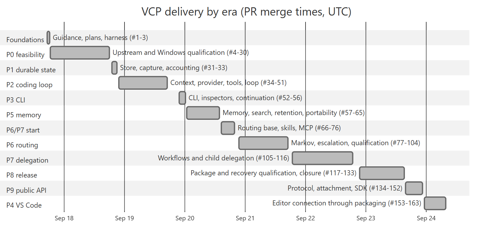

*Merge-time span of each era. Work happened in plan dependency order, with the deferred P9 API delivered before the P4 VS Code extension (see ADR-042).*

### Eras

1. [Foundations: agent guidance, plans and delivery harness (#1–#3)](#era-1)
2. [P0 upstream feasibility and Windows qualification (#4–#30)](#era-2)
3. [P1 durable state, capture and accounting (#31–#33)](#era-3)
4. [P2 context, provider, authority, tools and the coding loop (#34–#51)](#era-4)
5. [P3 native CLI, inspectors and continuation (#52–#56)](#era-5)
6. [P5 governed memory, search, retention and encrypted portability (#57–#65)](#era-6)
7. [P6 routing foundations, P7 skills and governed MCP (#66–#76)](#era-7)
8. [P6 Markov analytics, escalation advice and routing qualification (#77–#104)](#era-8)
9. [P7 developer workflows and visible child delegation (#105–#116)](#era-9)
10. [P8 package, recovery and release qualification, and owner-directed closure (#117–#133)](#era-10)
11. [P9 public protocol, local attachment and TypeScript SDK (#134–#152)](#era-11)
12. [P4 VS Code extension (#153–#163)](#era-12)

### Recurring themes to follow through the history

- **Committed-source reuse of Codex and Munarium** (ADR-013). Upstream code is vendored and rebuilt from pinned inputs plus ordered patches. VCP seams replace upstream credentials, telemetry and effects (#1, #6, #10, #13, #17, #117).
- **Canonical host owns every effect.** Model requests, file edits, processes, MCP calls and helpers go through capture → authority → intent → dispatch → receipt. Unknown outcomes stay unknown and are never replayed automatically (#27, #33, #37–#43, #70–#72).
- **Truthful evidence over green checks.** `not_run` is distinct from pass, failed live runs and unresolved liabilities are kept, and rejected candidates are recorded as outcomes (#3, #101, #104, #110, #122, #133).
- **Pause, drain and recovery semantics** (ADR-016). Scoped holds, close-to-pause, startup paused after a crash, and explicit reconciliation (#24, #27, #41, #116, #136, #139).
- **Governed local memory** (ADR-008). Indexes are untrusted derived pointers, governance decides truth, retention reaches every derived copy, and recall runs offline (#19–#21, #57–#63, #94, #148–#151).
- **Capability-gated public surface.** Protocol v1 grows only through capability-gated fields and methods. Editors observe by default and take control only through explicit leases (#134, #145, #153–#163).
- **Owner direction and budget boundaries.** Paid live qualification runs only under explicit caps, and phase gates change only by recorded owner decision (#23, #55, #102, #122, #133).

## Era 1 — Foundations: agent guidance, plans and delivery harness (#1–#3)

The repository started as architecture and plan documents. These PRs set agent operating rules and the Codex vendoring policy, expanded the plans into implementable contracts with ADR-001–019, and built a delivery harness that records evidence truthfully.

### [PR #1](https://github.com/iokaio/vcp/pull/1) — Add VCP agent guidance and define Codex vendoring

- **Merged:** 2026-09-17 · **Work items:** repository maintenance / docs (frames P0-07, P0-08, P8-06) · **Size:** +721/−15, 16 files
- **What happened**
  - Added byte-identical `AGENTS.md` and `CLAUDE.md`: project authority, layout, implementation boundaries, validation, public-data handling, contributor identity, protected-main workflow.
  - Added ADR-013: maximum reasonable reuse of a Codex-derived engine/CLI, with selected source committed under `src/third_party/codex/` and reviewed patches already applied.
  - Aligned architecture (`vcp-what.md`), plan, code layout, README, CONTRIBUTING and third-party notices with that policy.
- **Why**
  - The repository had no VCP-specific agent instructions, and it was unclear whether Codex would be committed source or fetched at build time.
  - Settling the source-management convention early gives P0-07 (unmodified Windows baseline), P0-08 (adapter integration/module map) and P8-06 (update rehearsal) a fixed target.
- **Decisions & records:** ADR-013 upstream reuse and vendoring — normal builds consume committed source; explicit maintenance reconstructs it from immutable inputs plus ordered patches. Submodules, subtrees or fetch-and-patch delivery would require revising the ADR. No Codex source imported yet.
- **Evidence:** Documentation checks only: 400 links across 45 docs resolve, guidance files hash-identical, 68-task plan graph acyclic with a 56-task release closure.
- **Diagram:** Not needed

### [PR #2](https://github.com/iokaio/vcp/pull/2) — docs: expand implementation plans and supporting designs

- **Merged:** 2026-09-17 · **Work items:** docs (all plan documents; no task completed) · **Size:** +5024/−37, 55 files
- **What happened**
  - Expanded all 23 plan documents with implementation steps, proposed interfaces and records, transaction/dispatch ordering, failure handling and acceptance evidence.
  - Added seven architecture designs (context provider, deferred clients, engine execution, memory retrieval, qualification/release, routing/extensions, storage/portability).
  - Added 18 missing ADR records (ADR-001–012, 014–019), bringing the register to 19; added development workflow and upstream-qualification guides.
  - Defined explicit in-application `/pause` and deliberate `/resume` while the CLI stays open, including child pause inheritance and recovery; replaced older daemon-detach wording with close-to-pause.
- **Why**
  - The plan named work but left cross-service contracts implicit and cited ADRs that had no documents; implementation needed concrete contracts first.
- **Decisions & records:** ADR-001 through ADR-012 and ADR-014 through ADR-019 recorded (runtime topology, protocol, canonical storage, edits/execution, autonomy/isolation, gateway, routing, governed memory, context, delegation, extension scope, clients, foreign compatibility, portability, history/pause, optimization, release acceptance, cloud encryption). Engineering selections stay "proposed" pending qualification. All 68 task owners, dependencies and states preserved (56 first-release, 12 deferred).
- **Evidence:** Local doc validator: 783 links across 68 files, task ownership/dependency/acyclicity and 56-task closure checks; parallel agent reviews corrected recovery and pause wording. No runtime exists.
- **Diagram:** Not needed

### [PR #3](https://github.com/iokaio/vcp/pull/3) — Implement plan 00 delivery harness and repository CI

- **Merged:** 2026-09-17 · **Work items:** Plan 00 delivery contract (P0-01 started) · **Size:** +737/−43, 23 files
- **What happened**
  - Added the PowerShell/Node delivery runner (`scripts/test.ps1`, `scripts/test-runner.cjs`, `src/tests/support/harness.cjs`) with a versioned case registry (`src/tests/registry.json`), bounded per-attempt logs and manifests.
  - Unknown suites/unsupported backends fail before dispatch; missing prerequisites record `not_run` rather than pass/fail.
  - Added repository-contract checks (`src/tests/contracts/repository.cjs`: links, identical guidance, task graph) and 14 harness regression tests (timeouts, output limits, cancellation, redaction, environment filtering).
  - Added `.github/workflows/ci.yml` on `ubuntu-8core` (matching Munarium's runner) with pinned actions, read-only permissions and evidence retention on failure.
- **Why**
  - Plan 00 specified a delivery contract but nothing was executable; every later increment needed a truthful, bounded evidence recorder.
  - The first Linux CI run exposed multiple Node executables on PATH; the wrapper now selects the first, with a regression.
- **Decisions & records:** `not_run` is a first-class outcome distinct from pass; Linux CI explicitly does not qualify Windows product behavior. Documented in `docs/development/delivery-harness.md`.
- **Evidence:** Native Windows `scripts/test.ps1 -Suite fast` from outside the checkout passed; 14 regressions plus repository checks; CI green on `ubuntu-8core`.
- **Diagram:** Not needed

## Era 2 — P0 upstream feasibility and Windows qualification (#4–#30)

Before any product code, VCP qualified its reuse bets on native Windows. It imported and patched Codex, imported Munarium, proved local CPU embeddings and offline isolation, mapped and classified upstream effects, and prototyped scoped lifecycle control, crash recovery, portable storage and authenticated snapshots. CI was scaled back for cost midway (#23).

### [PR #4](https://github.com/iokaio/vcp/pull/4) — Implement plan 01 P0-01 experiment fixtures and requirement coverage

- **Merged:** 2026-09-17 · **Work items:** P0-01 · **Size:** +450/−16, 19 files
- **What happened**
  - Added deterministic clock, scripted model provider, owned workspace roots and an independent observation log (`src/tests/support/experiments.cjs`).
  - Added synthetic analysis/review/generation workloads (`src/tests/fixtures/workloads.json`, `fixtures/repositories/checkout`) with separate graders kept outside the model-visible fixture root.
  - Repository checks now enforce coverage of 17 owner answers, 17 functional requirements, 19 invariants and 19 ADR records (`docs/plan/20-traceability.md`).
- **Why**
  - Upstream qualification needed reproducible, deterministic inputs and truth sets before any candidate engine was evaluated.
- **Decisions & records:** P0-01 marked complete (test infrastructure only). Quality thresholds deferred to P8-05; no spend cap or minimum machine invented. Future untrusted generated code must run through the execution broker.
- **Evidence:** Six experiment tests and a 20-test fast suite passed on native Windows; regressions cover exhausted/mismatched scripts, cleanup ownership and deliberately wrong grader inputs.
- **Diagram:** Not needed

### [PR #5](https://github.com/iokaio/vcp/pull/5) — Qualify pinned upstream candidates on native Windows for P0-07

- **Merged:** 2026-09-17 · **Work items:** P0-07 · **Size:** +499/−7, 15 files
- **What happened**
  - Pinned Codex, Gemini CLI and Munarium candidates by exact commit in `src/third_party/upstreams.toml` (descriptive metadata, not yet an import manifest).
  - Added a Git-object inventory tool (`scripts/upstream/inventory.cjs`) with path/content validation and a Windows Codex baseline build command (`scripts/upstream/build-baseline.ps1`).
  - Recorded unmodified-upstream results in `docs/evaluations/p0-07-native-candidates.md` and `docs/development/upstream-candidates.md`.
- **Why**
  - P0-07 had no immutable candidate records or reproducible native-build evidence to base the reuse decision on.
  - Surfaced integration concerns: Codex (Rust 1.95.0) and Munarium (Rust 1.98.0) use different toolchain pins; upstream credential discovery and telemetry must be replaced at VCP seams.
- **Decisions & records:** No source imported. Two Rust toolchains left as an open integrated-workspace decision.
- **Evidence:** Inventories of 8,250 Codex / 3,005 Gemini / 1,037 Munarium files; Codex CLI built on Windows with 102 apply-patch/exec-policy tests passing; 68 Munarium kernel + 11 backend tests; 213 Gemini policy/scheduler/tool tests.
- **Diagram:** Not needed

### [PR #6](https://github.com/iokaio/vcp/pull/6) — Import pinned Codex source with reproducible native baseline build

- **Merged:** 2026-09-17 · **Work items:** P0-07 · **Size:** +2213406/−72, 7975 files
- **What happened**
  - Imported 7,937 files from Codex `3d3ae4965ab370217e871b3a7f0d15589557ee4b` into `src/third_party/codex/`, preserving its Cargo workspace (`codex-rs/`) and notices.
  - Added machine-readable selection (`codex-selection.json`) and per-file records (`codex-files.json`) binding original/result bytes, Git modes, licenses, closure inputs and ordered patches.
  - Added `scripts/upstream/reconstruct.cjs` (explicit maintenance reconstruction, separate from compilation) and `scripts/build.ps1` for the native Windows baseline build.
  - Updated NOTICE / THIRD_PARTY_NOTICES for Apache-2.0 plus bundled MIT/LGPL terms; only transformation was materializing bubblewrap's license symlink.
- **Why**
  - A VCP clone lacked the engine source; ADR-013 required committed source rather than build-time fetching.
  - The large import exposed a 64 MiB recorder limit (fixed with streamed hashing) and Windows long-path failures (documented `core.longpaths=true`).
- **Decisions & records:** ADR-013 updated to reflect the realized layout. Third-party import: Codex Apache-2.0 with retained bundled licenses; dev-only `@iarna/toml` (ISC). No code patches or VCP adapters yet.
- **Evidence:** Independent reconstruction matched all 7,937 files and 34 executable modes; native build 9m50s (clean-clone 8m59s); 102 boundary tests; tamper tests reject altered patch hashes and missing license files.
- **Diagram:** Yes — 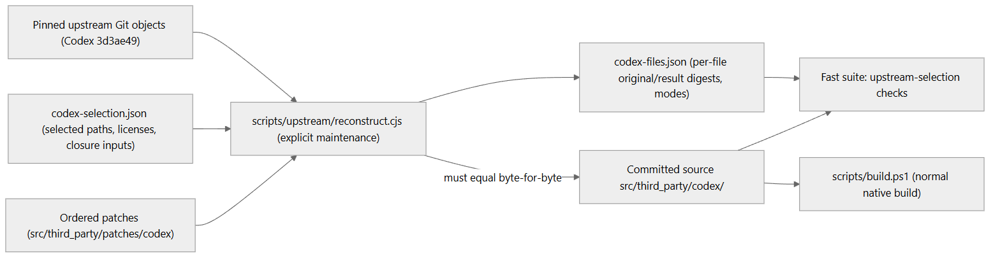
  *Shows how pinned upstream objects, the selection manifest and ordered patches reconstruct the committed Codex tree that normal builds consume.*

### [PR #7](https://github.com/iokaio/vcp/pull/7) — Qualify native Munarium datastore with Tantivy and DiskANN

- **Merged:** 2026-09-17 · **Work items:** P0-07 (informs P0-02) · **Size:** +318/−8, 16 files
- **What happened**
  - Extended the native baseline runner to build and test `munarium-datastore` with real Tantivy 0.22.1 and DiskANN 0.56.0 enabled.
  - Added a post-build dependency-closure gate (`scripts/upstream/dependency-closure.cjs`) that records normalized package versions and rejects hosted-server, provider and PostgreSQL dependency families.
  - Documented source/contract paths, filesystem/clock/identity effects and toolchain differences (`docs/development/munarium-baseline.md`, `src/third_party/components/munarium.md`).
- **Why**
  - The earlier Munarium baseline covered only its kernel and in-memory store, not the lexical/ANN libraries VCP's local memory would depend on.
  - VCP's local-first memory must not pull in hosted-service or database dependencies.
- **Decisions & records:** ADR-008 (local governed memory) annotated with the evidence. No Munarium source imported yet.
- **Evidence:** 200 native Windows tests passed (one upstream benchmark ignored); 148-package closure with forbidden families absent.
- **Diagram:** Not needed

### [PR #8](https://github.com/iokaio/vcp/pull/8) — Check Codex package ownership and effect source boundaries

- **Merged:** 2026-09-17 · **Work items:** P0-07 · **Size:** +1137/−7, 16 files
- **What happened**
  - Added `src/third_party/components/codex-boundaries.json`: ownership for all 154 Codex workspace packages (including four implicit members) in 21 groups, each mapped to a VCP gate and plan owner, plus 25 checked source anchors.
  - Added `scripts/upstream/check-boundaries.cjs`, failing on missing/duplicate ownership, wrong anchor ownership, invalid paths and stale pins/symbols.
  - Wrote `docs/development/codex-boundaries.md` describing required adapters for main/helper model calls, credentials, MCP, storage and in-app pause/resume; recorded Gemini G01/G02/G03/G06 candidate paths.
- **Why**
  - Buildable source existed, but there was no checked map of which upstream packages perform effects and which VCP component must replace or gate them.
- **Decisions & records:** Static coverage only; runtime admission and credential/telemetry removal deferred to P0-03/P0-05/P0-08. No Gemini Node engine imported.
- **Evidence:** Package set exactly matches independent `cargo metadata`; 33-regression fast suite passed.
- **Diagram:** Not needed

### [PR #9](https://github.com/iokaio/vcp/pull/9) — Trace native CLI requests, tool effects and provider failures

- **Merged:** 2026-09-17 · **Work items:** P0-07 · **Size:** +457/−2, 10 files
- **What happened**
  - Added `scripts/upstream/trace-cli.cjs` and `src/tests/support/cli-trace.cjs`: run the built Codex CLI against five loopback-only scripted provider fixtures.
  - An independent observer checks request counts, tool receipts, JSONL completion/failure events and resulting file bytes.
  - Cases: completion, read-only patch rejection, explicitly unsandboxed fixed patch, one HTTP 503 retry, HTTP 401 rejection.
- **Why**
  - Source/build checks never observed a real CLI turn; VCP needs to know exactly which requests and effects a turn produces before gating them.
  - The workspace-write probe was downgraded to read-only by the uninitialized Windows sandbox, so sandbox enforcement is explicitly not qualified.
- **Decisions & records:** Loopback observation does not prove absence of other traffic; binary hash records identity, not build attestation.
- **Evidence:** All five cases passed with eight observed loopback requests and no paid calls; binary SHA-256 recorded.
- **Diagram:** Yes — 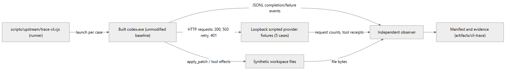
  *Shows the runner launching the real CLI against loopback provider fixtures, with an independent observer cross-checking requests, events and file effects.*

### [PR #10](https://github.com/iokaio/vcp/pull/10) — Qualify Rust compatibility with a recorded Codex patch

- **Merged:** 2026-09-17 · **Work items:** P0-07 · **Size:** +295/−28, 19 files
- **What happened**
  - First recorded source patch: `patches/codex/0001-chatgpt-recursion-limit.patch` raises `codex-chatgpt`'s recursion limit to 256, with a modification notice.
  - Qualification runner accepts an explicit immutable compiler experiment without changing default build settings.
  - Reconstruction hardened: command-scoped long-path config for the disposable index, provenance labels kept for unchanged files, verification rejects altered patch bytes.
- **Why**
  - Unmodified Codex failed to build under Munarium's Rust 1.98.0 (compiler query-depth limit, exit 101); a shared workspace needs one source tree building under both pins.
  - The first real patch exposed reconstruction gaps that a no-patch import could not reveal.
- **Decisions & records:** Patch-series convention established (`src/third_party/patches/codex/README.md`); ADR-013 updated. A single supported VCP compiler still not selected.
- **Evidence:** Patched CLI builds under Rust 1.98.0 and 1.95.0; 102 policy tests and all five CLI traces pass on both binaries; reconstruction matches 7,937 files with only `chatgpt/src/lib.rs` patched.
- **Diagram:** Not needed

### [PR #11](https://github.com/iokaio/vcp/pull/11) — ci: qualify the native baseline on win8core

- **Merged:** 2026-09-17 · **Work items:** P0-07 · **Size:** +132/−3, 7 files
- **What happened**
  - Added a hosted Windows CI job on the owner-provided `win8core` runner: cold build of committed source, patch/policy tests, five CLI traces, independent source reconstruction.
  - Long-path support made process-scoped; evidence uploads retain logs/manifests but not caches or binaries.
  - Fixed a source/output containment guard that failed on Windows 8.3 short paths by normalizing paths consistently.
- **Why**
  - Native evidence came from only one Windows machine; P0-07 required another environment.
- **Decisions & records:** none (runner addition only; later reversed for cost in PR #23).
- **Evidence:** Run 35279871627 passed on `win8core` and `ubuntu-8core`: 40 regressions, cold build 10m18s, 102 tests, five traces, exact 7,937-file reconstruction.
- **Diagram:** Not needed

### [PR #12](https://github.com/iokaio/vcp/pull/12) — docs: record hosted Windows qualification evidence

- **Merged:** 2026-09-17 · **Work items:** P0-07 · **Size:** +117/−6, 4 files
- **What happened**
  - Added `docs/evaluations/p0-07-hosted-windows.md` recording PR #11's hosted run: source/test-merge identity, commands, tool versions, counts, failure correction, evidence hashes.
  - Updated plan 01 and the traceability ledger to remove "another Windows environment" as outstanding.
- **Why**
  - Raw CI artifacts expire in 14 days; the reviewed identities and results needed a durable public record.
- **Decisions & records:** none.
- **Evidence:** Report cross-checked against CI logs and manifest hashes; repository checks and full CI passed.
- **Diagram:** Not needed

### [PR #13](https://github.com/iokaio/vcp/pull/13) — Import Munarium libraries into the shared native workspace

- **Merged:** 2026-09-18 · **Work items:** P0-07 · **Size:** +27607/−128, 117 files
- **What happened**
  - Imported three Munarium local-memory libraries (`munarium-core`, `munarium-datastore`, `munarium-store-mem`), retained tests and datastore contract fixtures as 70 attributed files under `src/third_party/munarium/`.
  - Registered them in the existing Codex Cargo workspace via patch `0002-munarium-workspace.patch`; shared lockfile keeps all 1,491 Codex package identities and adds 34.
  - Added `munarium-selection.json` / `munarium-files.json`, a 147-package native dependency reference, component build dispatch in `scripts/build.ps1`, and ownership/output protection for both trees.
  - Windows CI now tests Munarium and reconstructs both selections; reconstruction runs before compilation.
- **Why**
  - Munarium had only been qualified from a standalone checkout; VCP needs it as committed, reproducible source in one workspace per ADR-013.
- **Decisions & records:** ADR-013 extended to multiple vendored components; PostgreSQL and Snowball license texts added. Rust 1.95.0 and 1.98.0 remain component pins in one workspace.
- **Evidence:** Native Codex build + 102 tests, Munarium 200 tests with Tantivy/DiskANN; both reconstructions exact (7,937 + 70 files); junction-escape and dependency-drift rejection regressions. Hosted run found a missing-output-parent bug in reconstruction, fixed before merge.
- **Diagram:** Not needed

### [PR #14](https://github.com/iokaio/vcp/pull/14) — Qualify Gemini policy, skills and MCP boundaries on Windows

- **Merged:** 2026-09-18 · **Work items:** P0-07 · **Size:** +510/−21, 18 files
- **What happened**
  - Added `scripts/upstream/test-gemini.cjs`: prepares the pinned Gemini checkout (metadata generation, forced TypeScript rebuild) and requires all 402 assertions across eight policy, scheduler, tool, encoding, skill and MCP suites.
  - Runner verifies an immutable clean source, isolates child profiles/environment, rejects incomplete coverage and propagates failures; Windows CI runs it on `win8core`.
  - Documented source effects and adaptation requirements in `docs/development/gemini-baseline.md`.
- **Why**
  - Gemini comparison relied on ad hoc commands covering 213 assertions; VCP's skills/MCP planning (P0-09, P7) needs qualified reference behavior.
- **Decisions & records:** Gemini remains a reference/porting source; no Node engine imported. Synthetic profile is environment isolation, not an OS sandbox.
- **Evidence:** All 402 Gemini tests passed natively (Node 24.10.0, Vitest 3.2.4); 49-regression fast suite passed.
- **Diagram:** Not needed

### [PR #15](https://github.com/iokaio/vcp/pull/15) — Add verified local CPU embedding baseline

- **Merged:** 2026-09-18 · **Work items:** P0-07 (for P0-02 memory) · **Size:** +5625/−36, 46 files
- **What happened**
  - Added first original VCP crate `src/crates/vcp-embedding`: file-only CPU adapter using pinned Candle and Tokenizers, returning normalized 384-dimensional MiniLM vectors, with input/batch limits and explicit truncation reporting.
  - Added immutable asset inventory (`minilm-assets.json`) and explicit acquisition (`scripts/upstream/model-assets.cjs`) that verifies ten files outside the checkout; inference never downloads or falls back to a provider.
  - Added independent PyTorch/Transformers golden fixtures (`minilm-golden.json`) and `scripts/test-embeddings.ps1`; registered via patch `0003-local-embedding-workspace.patch`.
- **Why**
  - The selected memory libraries had no local embedding path; ADR-008 requires local, offline-capable memory without a hosted provider.
- **Decisions & records:** ADR-008 updated. New dependencies Candle 0.11.0 / Tokenizers 0.22.2 (licenses vendored); only preexisting package changed is `regex-automata` 0.4.13→0.4.14.
- **Evidence:** 1,536 vector values agree with reference within 1e-5 (max ≈1.77e-7); 141-package native graph checked; assets 91,578,299 bytes verified; Munarium 200 and Codex 102 tests still pass.
- **Diagram:** Not needed

### [PR #16](https://github.com/iokaio/vcp/pull/16) — Observe native review and compaction helper effects

- **Merged:** 2026-09-18 · **Work items:** P0-07 · **Size:** +426/−46, 16 files
- **What happened**
  - Extended the native CLI trace to nine cases, including successful and rejected review and compaction helper calls.
  - Scripted-provider usage recorded separately from parent CLI usage; unexpected requests preserved as failure evidence.
  - Added four source anchors to the boundary map and `docs/development/helper-effect-traces.md`.
- **Why**
  - The observer could miss model requests issued by helpers, which bypass normal turn accounting.
  - Findings: review helper consumes usage while the parent reports zero; compaction replaces prompt history and drops an earlier tool receipt — both matter for P0-03/P0-08 accounting, canonical history and pause.
- **Decisions & records:** Zero parent usage recorded as a baseline discrepancy, not accepted VCP accounting. Native preflight/case deadlines raised (60s/90s) after a CI timeout, without weakening assertions.
- **Evidence:** All nine native cases passed; 56-regression fast suite passed.
- **Diagram:** Not needed

### [PR #17](https://github.com/iokaio/vcp/pull/17) — Classify retained upstream effects and replacement owners

- **Merged:** 2026-09-18 · **Work items:** P0-07 · **Size:** +748/−91, 15 files
- **What happened**
  - Boundary inventory schema 2: every one of 158 packages must declare a conservative module effect ceiling and a primary VCP owner.
  - Classified 43 reviewed source entries (1 pure, 3 read-only, 39 effectful) including update/maintenance anchors; corrected ownership of the live core facade and feature telemetry.
  - Added `docs/development/upstream-effect-classes.md` and the P0-07 selection acceptance report `docs/evaluations/p0-07-selection-gate.md`.
- **Why**
  - Package ownership alone did not say which retained code is pure versus effectful, which determines where VCP gates are mandatory.
- **Decisions & records:** ADR-013 extended with effect classification. P0-07 set `implemented_unverified` pending hosted CI.
- **Evidence:** `check-boundaries.cjs` passes (158 packages, 23 groups, 43 entries); four classification regressions; fast suite passed.
- **Diagram:** Not needed

### [PR #18](https://github.com/iokaio/vcp/pull/18) — Qualify real local corpus indexes across process reopen

- **Merged:** 2026-09-18 · **Work items:** P0-02 (closes P0-07) · **Size:** +2868/−47, 41 files
- **What happened**
  - Added original `src/crates/vcp-memory-spike`: builds a 24-document, two-workspace fixture with MiniLM, Tantivy and DiskANN, then answers seven queries after repeated fresh-process reopen.
  - Filters foreign/obsolete records using the fixture's canonical view; compares ANN results against an independent exhaustive cosine oracle; observer rejects incomplete relevance, scope leakage and false rejections.
  - Added `scripts/test-local-memory.ps1`, `trace-local-memory.cjs`, patch `0004-local-corpus-workspace.patch`; fixed Cargo package discovery through equivalent relative paths.
- **Why**
  - Embeddings and datastore were qualified separately; nothing joined real vectors with persistent lexical/ANN artifacts.
- **Decisions & records:** P0-07 recorded complete after final green CI. ADR-013 updated for the new workspace member.
- **Evidence:** Eight native stages passed; recall@3 = 1 on all raw ANN queries (tiny fixture); corrupted manifests/wrong receipts rejected; 209-package graph uses previously reviewed deps.
- **Diagram:** Not needed

### [PR #19](https://github.com/iokaio/vcp/pull/19) — Integrate scoped governance into local corpus qualification

- **Merged:** 2026-09-18 · **Work items:** P0-02 · **Size:** +776/−52, 31 files
- **What happened**
  - Added `vcp-memory-spike/src/governance.rs`: records proposals through retained Munarium gates into a scoped in-memory backend, then filters real Tantivy/DiskANN candidates by resolved claims.
  - Explicit predecessor links preserve historical views; rejected corrections keep proposal/evidence and findings without hiding the accepted predecessor.
  - Fixture's `current` flags kept only as an independent oracle; patch `0005-local-governance-workspace.patch`.
- **Why**
  - Results were previously selected directly from fixture flags; ADR-008's governed memory needs current/historical truth to come from governance, not metadata.
- **Decisions & records:** ADR-008 updated. Backend is volatile and replayed per process — explicitly not durable governance recovery.
- **Evidence:** Eight native stages, eight Rust tests, seven query cases with recall@3 = 1; 1,566 locked package identities unchanged.
- **Diagram:** Yes — 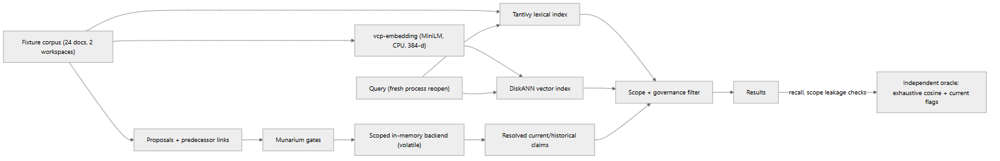
  *Shows embedding/index construction, the Munarium governance path producing resolved claims, and how claims plus scope filter lexical and ANN candidates, checked against an independent oracle.*

### [PR #20](https://github.com/iokaio/vcp/pull/20) — Qualify offline CPU embeddings with observed Windows isolation

- **Merged:** 2026-09-18 · **Work items:** P0-02 · **Size:** +909/−22, 22 files
- **What happened**
  - Added `test-embeddings.ps1 -Offline`: the real CPU embedding helper runs inside a zero-capability Windows AppContainer (`AppContainerFixture.cs`), checks vectors against references and rejects missing/corrupt asset copies.
  - A parent-owned local listener, two unrestricted controls, observed child tokens and isolation diagnostics jointly establish the offline result (`trace-offline-embeddings.cjs`, `qualify/network.rs`).
  - Gate wired into the `win8core` CI job.
- **Why**
  - Local inference existed but no observed OS-level network denial; "offline" needed positive evidence, not just absence of provider dependencies.
- **Decisions & records:** ADR-008 updated. Timeout or diagnostics alone cannot pass; missing prerequisites fail. Full-index AppContainer run hit a Tantivy canonicalization failure, retained unweakened.
- **Evidence:** 384-d vectors with max delta 1.77e-7; listener saw exactly two control connections and none from the contained child; all five profiles cleaned up.
- **Diagram:** Yes — 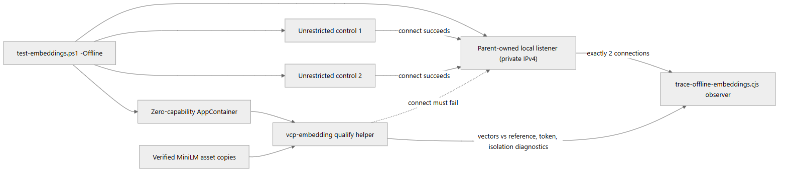
  *Shows the contained embedding helper, unrestricted controls and the parent listener used to prove network denial.*

### [PR #21](https://github.com/iokaio/vcp/pull/21) — Qualify local governed retrieval at declared corpus scales

- **Merged:** 2026-09-18 · **Work items:** P0-02 · **Size:** +1346/−120, 24 files
- **What happened**
  - Added scaling mode (`-Scale`) to `vcp-memory-spike` (`resources.rs`): 100/1,000/10,000-record builds with two fresh query processes per size.
  - Records native Windows memory, sampled disk usage and separate governance/oracle timings; 324 independently checked query rows (`trace-memory-resources.cjs`).
  - CI Windows gate runs the scale experiment.
- **Why**
  - P0-02 needed a declared resource envelope before committing to the local memory design.
- **Decisions & records:** ADR-008 records bounded P0-02 feasibility completion. Measurements expose costly volatile governance replay and whole-corpus candidate filtering — deferred to durable product integration and bounded candidate refill.
- **Evidence:** At 10,000 records: ~203 MB peak resident memory, 25.3 MB index data, 252–259 s governance replay per process; all 324 rows correct.
- **Diagram:** Not needed

### [PR #22](https://github.com/iokaio/vcp/pull/22) — Gate delegated controller starts through host continuation admission

- **Merged:** 2026-09-18 · **Work items:** P0-03 · **Size:** +1078/−63, 30 files
- **What happened**
  - Patch `0006-continuation-admission.patch`: added a host continuation-admission hook (`ext/extension-api/src/turn_admission.rs`, `core/src/session/turn_input.rs`) checked before turn publication and before consuming queued mailbox messages.
  - Default hook stays permissive, preserving upstream shutdown-drain behavior.
  - Added `scripts/upstream/test-lifecycle.cjs` and `build.ps1 -Mode LifecycleTests` with strict result observation (rejects empty/skipped/duplicate tests).
  - Plan revision 5 in `docs/plan/README.md` / `implementation-workflow.md`: group work into larger behavioral milestones instead of one PR per seam.
- **Why**
  - Delegated child input, review delegates and mailbox wakeups bypassed ordinary turn admission, so a future `/pause` could not stop them.
- **Decisions & records:** Adopted larger-milestone delivery (plan rev 5). Pre-existing PTY Ctrl+C failure recorded, not fixed; 8 MiB test stack declared as test prerequisite.
- **Evidence:** Ten native lifecycle cases (five drain compat, five continuation) with zero rejected provider requests; retained turn-input group 19 tests pass; reconstruction exact.
- **Diagram:** Not needed

### [PR #23](https://github.com/iokaio/vcp/pull/23) — Reduce automatic CI and use standard hosted runners

- **Merged:** 2026-09-18 · **Work items:** repository maintenance · **Size:** +125/−39, 11 files
- **What happened**
  - Switched CI from paid larger runners to free standard ones (`ubuntu-24.04`, `windows-2025`).
  - Only fast delivery checks run automatically; full native Windows qualification moved behind manual `workflow_dispatch` (two Cargo jobs, 180-minute timeout).
  - Evidence retention cut to 3 days (automatic) / 7 days (manual); `AGENTS.md`/`CLAUDE.md` now require local validation first, with CI as confirmation.
- **Why**
  - Expensive native qualification repeated on every PR update and push, on paid runners, despite VCP being public.
- **Decisions & records:** A green routine run is no longer native qualification evidence; restoring paid runners or automatic heavy runs needs a new maintainer instruction.
- **Evidence:** actionlint passed; local fast suite passed; native qualification on smaller runners left unverified until manually run.
- **Diagram:** Not needed

### [PR #24](https://github.com/iokaio/vcp/pull/24) — Add scoped lifecycle control and owned interruption

- **Merged:** 2026-09-18 · **Work items:** P0-03 · **Size:** +2021/−54, 35 files
- **What happened**
  - Added original crate `src/crates/vcp-lifecycle`: a thread-scoped host over retained Codex controllers combining admission, subtree holds, active interruption, owner-loss denial and explicit readmission.
  - Host registers controller-owned thread IDs; revisions carry an in-process instance identity, so stale/foreign revisions are rejected. Weak controller references avoid a cycle through the extension registry.
  - Hold seals a subtree, drains admitted starts, then owns interruption even if the caller drops its waiter; parent readmission preserves independent child holds; drain failures block readmission.
  - Patch `0007-scoped-lifecycle.patch` forwards thread IDs at all admission sites and adds `CodexThread::interrupt_for_host`.
- **Why**
  - Global turn admission cannot hold one child independently or coordinate root/child interruption, which `/pause` semantics (ADR-016) require.
- **Decisions & records:** First milestone under the larger-milestone plan. Volatile prototype; durable recovery, startup/effect fencing, process-tree stop and CLI `/pause` deferred.
- **Evidence:** 20 native lifecycle cases (seven host + scoped core regressions), 22 turn-input tests; boundary map 160 packages / 51 seams; reconstruction exact with seven patches.
- **Diagram:** Yes — 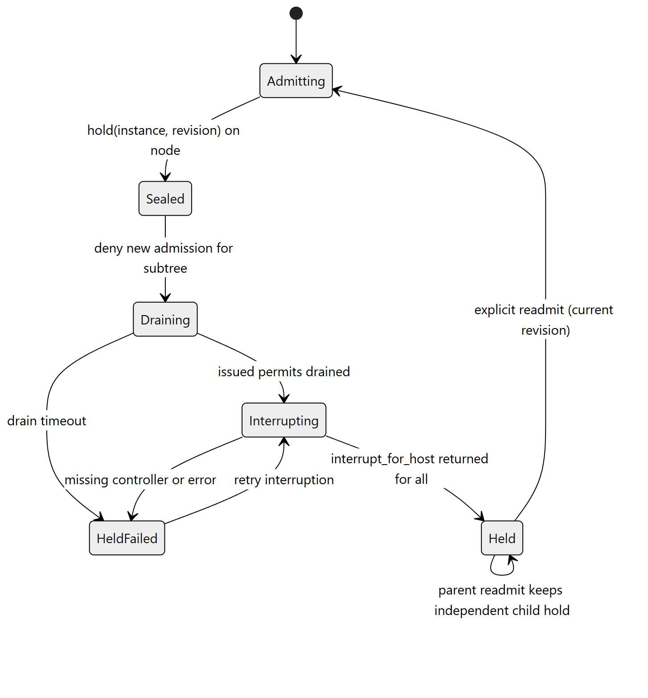
  *State machine of a subtree hold: seal, drain admitted permits, owned interruption, failure retention and explicit readmission.*

### [PR #25](https://github.com/iokaio/vcp/pull/25) — Plan bounded semantic decisions from the JEV exploration

- **Merged:** 2026-09-18 · **Work items:** docs (P6 planning) · **Size:** +1191/−18, 21 files
- **What happened**
  - Added the JEV research discussion as `docs/architecture/exploring-jev.md` with a research-status/adoption note.
  - Added proposed ADR-020 and `docs/architecture/decision-evaluation-design.md`: typed Boolean/Choice/Score advice with validation/abstention, nonrecursive evaluator selection, atomic admission, pause/recovery, provenance and held-out rollout gates.
  - Plan revision 6 maps this advice into P6 routing, escalation, review triage, optimization and qualification (`docs/plan/12-routing-and-optimization.md`).
- **Why**
  - The exploration was untracked, with no ownership and no separation between useful ideas and changes to confirmed product boundaries.
- **Decisions & records:** ADR-020 bounded semantic decisions (proposed); ADR-006/007 annotated. Deterministic behavior remains the baseline; remote advice only via the existing OpenRouter path and root ledger. Direct Jev access, new local model assets and background observers not selected.
- **Evidence:** Repository checks (links, task graph, ADR inventory now 20) passed; independent review fixed a consumer-commit pause/revocation race.
- **Diagram:** Not needed

### [PR #26](https://github.com/iokaio/vcp/pull/26) — Plan actual Jev through OpenRouter with Rust integration

- **Merged:** 2026-09-18 · **Work items:** docs (P6 planning) · **Size:** +332/−60, 12 files
- **What happened**
  - Plan revision 7 makes actual Jev via OpenRouter the leading specialized decision candidate, compared against deterministic rules and a conventional OpenRouter LLM fallback.
  - Revised ADR-020, the decision-evaluation design and P6 plans with a thin Rust integration and a gateway qualification contract (endpoint, schema, native probabilities, provider controls, billing, cancellation).
  - Kept Boolean probability, Choice/Score confidence and empirical calibration separate; fallback bounded, revision-checked and charged to the same ledger.
- **Why**
  - Jev became available on OpenRouter, while the prior plan assumed conventional LLM adapters.
- **Decisions & records:** ADR-020 and ADR-006 updated. Jev is a qualification candidate, not a default; no assumption that chat-completions model substitution works. LangChain is research reference only; direct TypeSafe transport out of scope.
- **Evidence:** Repository checks passed; primary-source research confirmed the listing but not VCP interoperability. No paid inference.
- **Diagram:** Not needed

### [PR #27](https://github.com/iokaio/vcp/pull/27) — Complete P0 lifecycle recovery and Windows execution qualification

- **Merged:** 2026-09-18 · **Work items:** P0-03, P0-05 · **Size:** +3342/−102, 52 files
- **What happened**
  - `vcp-lifecycle` gains `journal.rs` (exclusively locked checkpoint, SHA-256-chained frames, `sync_all` before ack; fail-closed reopen), `control.rs` (idempotent pause/resume by command ID, never auto-replayed) and `process.rs` (Windows Job Object ownership).
  - Patch `0008-lifecycle-recovery.patch`: one-use startup grants for `Session::new`, a private work gate (`extension-api/src/work_admission.rs`), and durable intent/receipt recording around Responses client requests and tool registry dispatch.
  - `examples/lifecycle-owner.rs` provides a private synthetic CLI (`/pause`, `/resume`, `/status`, `/crash`, `/process`, `/reconcile-process`); `vcp-process-fixture` plus AppContainer canaries qualify execution isolation.
- **Why**
  - The in-memory host could stop work but could not recover ownership after a crash or show native effect outcomes.
  - After a crash, the reopened host restores the same root/child identities, starts paused, and requires explicit reconciliation of unknown effects before resume.
- **Decisions & records:** ADR-004, ADR-005 and ADR-016 updated. The private checkpoint is disposable and does not select the production store (P0-04); realtime and remote memory summarization rejected for the gated client. Global helper wiring, canonical accounting and user CLI deferred to P0-08/P1–P3.
- **Evidence:** Local native runs: 29 lifecycle cases, 3 journal + 16 host tests, four fresh owner processes and three AppContainer/control stages; reconstruction 7,938 files matched.
- **Diagram:** Yes — 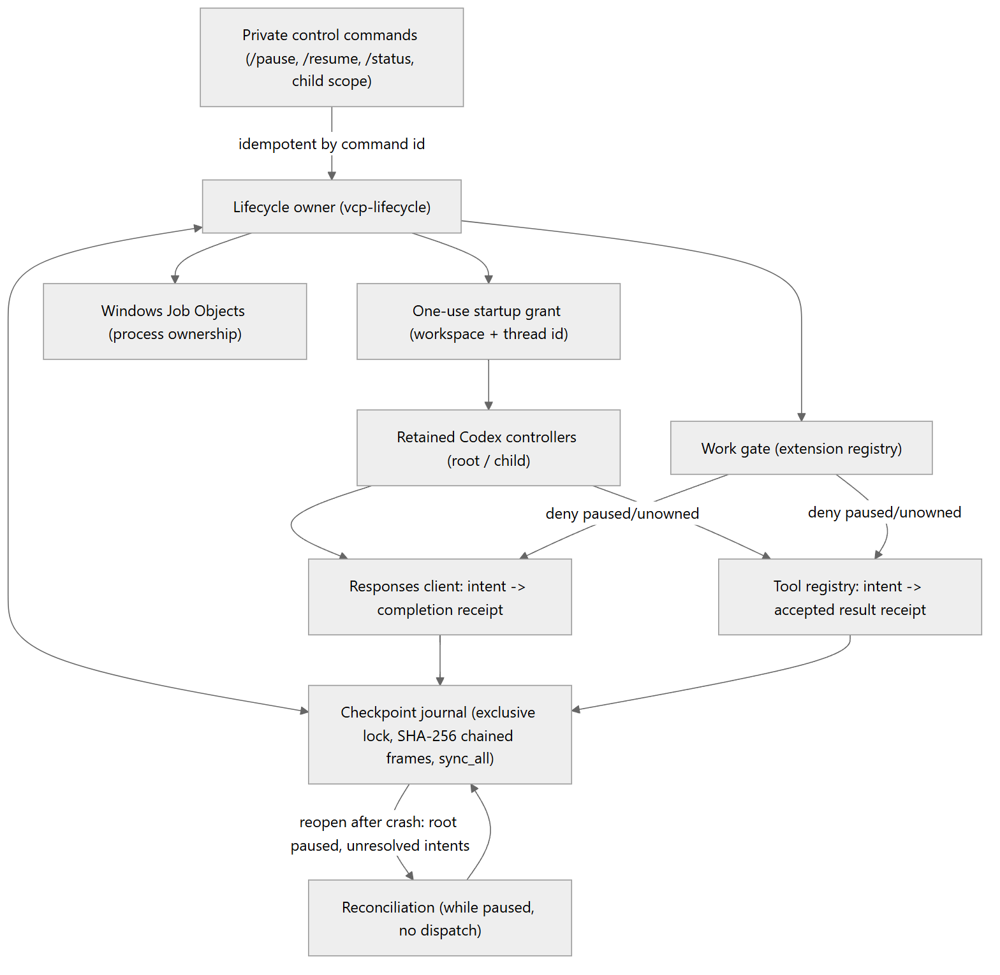
  *Shows the owner, checkpoint journal, startup grant and work gate around retained controllers, and the intent/receipt path used for crash reopen and reconciliation.*

### [PR #28](https://github.com/iokaio/vcp/pull/28) — Qualify P0 portable storage and authenticated snapshots

- **Merged:** 2026-09-18 · **Work items:** P0-04 · **Size:** +2163/−14, 43 files
- **What happened**
  - Added prototype crate `src/crates/vcp-storage-spike` (`store.rs`, `vault.rs`, `search.rs`) with SQLite / framed-file store parity and supervised crash barriers.
  - Full and incremental age-encrypted snapshots with independent Ed25519 writer trust, backend conversion, key rotation and replay rejection; Tantivy/DiskANN indexes rebuilt from restored inputs.
  - Checked-in public synthetic handoff fixture (`src/tests/fixtures/portability/`, ciphertext `.age` files) restored on a second Windows machine; `scripts/test-storage.ps1` and a manual `storage_only` CI option on standard Windows.
  - Codex patch 0009 adds the package to the vendored workspace; Go age v1.3.2 used as hash-checked interchange test tool only.
- **Why**
  - P0 had no evidence that durable state could be made portable while keeping cloud-bound bytes encrypted and writers authenticated — a feasibility risk for the storage/encryption ADRs.
- **Decisions & records:** ADR-003 canonical storage, ADR-015 portability and storage choice, ADR-019 cloud encryption and keys updated with evidence. Prototype formats only; power loss, hostile reparse races, key ceremonies and atomic activation explicitly not claimed (deferred to P1/P3/P5/P8). Fixture uses a deliberately compromised public identity.
- **Evidence:** 4 native contract groups, 8 forced crash/reopen cases, 24 packaging measurements, Go/Rust age interchange, Node signature verification; hosted second-Windows restore run passed.
- **Diagram:** Not needed

### [PR #29](https://github.com/iokaio/vcp/pull/29) — Complete P0 retained integration and feasibility handoff

- **Merged:** 2026-09-18 · **Work items:** P0-06, P0-08, P0-09 · **Size:** +2623/−108, 60 files
- **What happened**
  - `vcp-lifecycle` gains `integration.rs` / `ports.rs`: a synthetic host connecting durable shared request reservations and usage receipts, prepared file edits, native verification and local governed memory through the retained Codex coding loop.
  - Codex patch 0010 (`0010-integrated-host.patch`) touches `work_admission.rs`, tool registry, thread manager and client seams.
  - Attributed behavioral ports of Gemini CLI (`6a466a7e`) argument/scheduling policy, with pinned TypeScript comparisons (`compare-gemini-ports.cjs`) and license import.
  - Upstream-fix maintenance rehearsal (`rehearse-codex-fix.cjs`) and handoff dossier `docs/development/p0-handoff.md` naming concrete P1 source destinations.
- **Why**
  - Before production work, the prototypes needed a qualified path through the real retained loop: helpers keep host authority, interrupted requests keep liability, stale prepared edits preserve user changes.
  - Closes P0 feasibility (all nine P0 tasks) while stating that no installable application exists yet.
- **Decisions & records:** Candidate decisions recorded in ADR-001 runtime topology, ADR-008 local governed memory, ADR-013 upstream reuse and vendoring (substantive revision), plus ADR-003/015/019 touch-ups. Gemini code adapted behaviorally, not vendored.
- **Evidence:** 27 host/port tests, 29 retained lifecycle tests, recovery tests, retained CLI build on Rust 1.98.0/MSVC; exact reconstruction of 7,938 Codex files; no paid provider calls.
- **Diagram:** Not needed

### [PR #30](https://github.com/iokaio/vcp/pull/30) — Document historical plan effort assessment

- **Merged:** 2026-09-18 · **Work items:** docs · **Size:** +67/−0, 3 files
- **What happened**
  - Published `docs/plan-assessment.md` (revision-7 effort assessment), linked from `docs/README.md`; Word export ignored in `.gitignore`.
- **Why**
  - Preserve the existing sizing assessment with a note that it predates P0 completion and is neither a schedule nor acceptance evidence.
- **Decisions & records:** none.
- **Evidence:** Fast suite (links, task graph) passed.
- **Diagram:** Not needed

## Era 3 — P1 durable state, capture and accounting (#31–#33)

The P0 prototypes gave way to the canonical crates: domain, protocol, store and engine, with SQLite and framed-file backends. Every request and response is captured in full, spend is reserved before a request and settled after it, and history projections can be rebuilt. The retained Codex controller was placed under host admission.

### [PR #31](https://github.com/iokaio/vcp/pull/31) — Implement P1 durable state, capture, and storage foundation

- **Merged:** 2026-09-18 · **Work items:** P1-01–P1-04 (in progress) · **Size:** +6844/−17, 57 files
- **What happened**
  - New production crates replacing P0 prototypes: `vcp-domain` (task/artifact/effect/verification/workspace transitions, revisions), `vcp-protocol` (command/event/subscription codec, versioning), `vcp-engine` (authenticated idempotent `command_handler`, capture, bounded private subscriptions), `vcp-store` (transaction contract, artifact spool, migration, backends).
  - Equivalent SQLite and framed-files transaction contracts with a shared conformance suite; full binary capture of artifacts.
  - Backend conversion validates a new root before controlled activation and preserves the recovery source.
  - Codex patch 0011 registers the new crates in the vendored workspace only (no external dependency changes).
- **Why**
  - P1 needs canonical state and receipts before accounting and retained-controller integration can replace P0 prototypes.
- **Decisions & records:** none new; formats, limits and remaining acceptance in `docs/development/p1-foundation.md`. Forced-process failure on NTFS only, not power loss.
- **Evidence:** 24 native contracts incl. 8 process kills around commits, 6 around backend activation, SQLite contention, interrupted captures, lost-reply retries.
- **Diagram:** Yes — 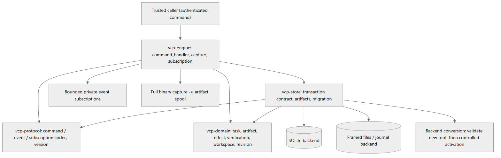
  *Shows the new vcp-engine / vcp-protocol / vcp-domain / vcp-store crates, their dependency direction and the two interchangeable store backends.*

### [PR #32](https://github.com/iokaio/vcp/pull/32) — Implement P1 canonical accounting and history projections

- **Merged:** 2026-09-18 · **Work items:** P1-05, P1-06 (in progress) · **Size:** +5004/−24, 43 files
- **What happened**
  - New `vcp-budget` crate: one root ledger with atomic child/daily admission, immutable usage adjustments and preserved unknown liabilities (`service.rs`, `arithmetic.rs`); domain types in `vcp-domain/src/accounting.rs`.
  - New `vcp-audit` crate: deterministic rebuildable projections and snapshot history enforcing current access and retention scope.
  - `vcp-store/src/accounting_contract.rs`: both backends validate accounting constraints; request artifact, task revision, reservation, event and command receipt commit together.
  - Projection activation commits version and input watermark atomically; Codex patch 0012 registers crates.
- **Why**
  - Durable commands existed but there was no canonical budget service or rebuildable history; spend must be admitted before a request and never lost on crash.
- **Decisions & records:** Synthetic prices, local-root/fixed-offset daily policy; history consumes retention masks but pruning/deletion deferred to P5.
- **Evidence:** 39 native contracts incl. 8 accounting and 4 projection process kills, fresh-process rebuild, budget races.
- **Diagram:** Not needed

### [PR #33](https://github.com/iokaio/vcp/pull/33) — Complete P1 canonical host integration and qualification

- **Merged:** 2026-09-18 · **Work items:** P1-01–P1-06 · **Size:** +3379/−86, 45 files
- **What happened**
  - `vcp-lifecycle/src/foundation/` (`worker.rs`, `process.rs`) connects the retained Codex controller to one canonical host owner.
  - Each HTTP attempt (root, helper, compaction, child) captures its final body, reserves shared funds and records send intent before transport; response and native output are captured before parsing/display limits.
  - Capture failures fence work, owner loss pauses tasks; reopen preserves uncertain effects and charges without automatic replay.
  - Codex patch 0013 modifies extension admission, HTTP client and Responses endpoint boundaries.
- **Why**
  - P1 libraries had to control real retained requests and native effects before their acceptance gates could close.
- **Decisions & records:** ADR-002 internal/public protocol, ADR-003 canonical storage, ADR-009 context and capture updated. P1 complete within documented foundation scope; OpenRouter, policy, context and CLI remain P2/P3.
- **Evidence:** 70 native P1 contracts, 31 host contracts, recovery and 29 lifecycle regressions; exact 7,938-file reconstruction.
- **Diagram:** Yes — 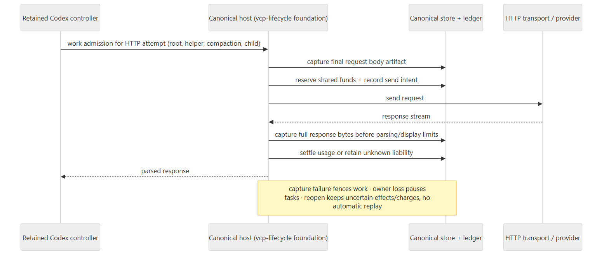
  *Shows capture → reserve/send-intent → transport → response capture → settle ordering between retained controller, canonical host, store and provider.*

## Era 4 — P2 context, provider, authority, tools and the coding loop (#34–#51)

The internal Windows coding slice was built boundary by boundary: sealed context, admission of OpenRouter requests, policies and scoped grants, and prepared file and process brokers including ConPTY. Authority changes are coordinated with in-flight work, and completion requires current verification evidence. The phase ended with a compaction-safe, verified coding loop and the first capped live provider smoke test.

### [PR #34](https://github.com/iokaio/vcp/pull/34) — feat(context): scoped repository observations and captured request seals

- **Merged:** 2026-09-18 · **Work items:** P2-01 (in progress) · **Size:** +2974/−10, 34 files
- **What happened**
  - New `vcp-repository` crate: explicit root/file versions, bounded Git and ignore discovery, path handling (junction exclusion), per-path `AGENTS.md` applicability.
  - New `vcp-context` crate: manifest and mandatory/optional selection, complete tool pairs, artifact-verified request seals.
  - Existing staged/unstaged/untracked edits preserved; malicious Git filters rejected. Codex patch 0014 registers crates.
- **Why**
  - Context preparation needs scoped native observations and reproducible captured views of exactly what was sent to a model.
- **Decisions & records:** ADR-009 context and capture updated. Linked worktrees, alternate metadata, includes, filters and extensions rejected; byte ceiling is an estimate; seals are not transport/tool/budget authority.
- **Evidence:** 19 native tests incl. real junction exclusion, malicious filter rejection, both artifact backends after reopen.
- **Diagram:** Not needed

### [PR #35](https://github.com/iokaio/vcp/pull/35) — feat(models): admit sealed OpenRouter requests through canonical host

- **Merged:** 2026-09-18 · **Work items:** P2-01, P2-02 (in progress) · **Size:** +3257/−39, 39 files
- **What happened**
  - New `vcp-models` crate: dated OpenRouter codec/catalog contract (`catalog.rs`, `request.rs`, `stream.rs`, `retry.rs`).
  - `vcp-lifecycle/.../worker/provider.rs` admits exact captured context through the retained HTTP client; validates completed function calls, settles observed cost, retains liability when cost/completion is unknown.
  - Source/steering changes reject before billable admission; host deadline bounds headers and streamed bodies including keepalives (Codex patch 0015).
- **Why**
  - The provider path had to consume the sealed context and canonical accounting rather than raw retained behavior.
- **Decisions & records:** ADR-006 model gateway and groups updated. Implicit transport retries disabled; predecessor-linked retry orchestration deferred to the coding driver. Live compatibility needs separately authorized spend.
- **Evidence:** 16 codec/context contracts + deadline regression; 33 integration contracts; recovery and lifecycle suites.
- **Diagram:** Not needed

### [PR #36](https://github.com/iokaio/vcp/pull/36) — Implement P2 authority policies and durable scoped approvals

- **Merged:** 2026-09-18 · **Work items:** P2-03 (in progress) · **Size:** +2342/−55, 40 files
- **What happened**
  - New pure `vcp-policy` crate for prepared-operation decisions; `vcp-domain/src/policy.rs` types.
  - Revisioned policy/trust/grant commands in `vcp-engine` and store contract; durable questions whose answer creates exactly one grant.
  - Questions and waiting state commit together; answers do not resume paused work; policy changes invalidate previously sealed provider context.
- **Why**
  - Tool authority had no canonical policy or reusable scoped grants.
- **Decisions & records:** ADR-005 autonomy and isolation updated. Pure decisions do not prove OS isolation; native broker enforcement deferred.
- **Evidence:** 47 policy contracts incl. SQLite/files reopen, process crashes, stale authority, conflicting answers.
- **Diagram:** Not needed

### [PR #37](https://github.com/iokaio/vcp/pull/37) — Implement P2 prepared native file tools and canonical dispatch

- **Merged:** 2026-09-19 · **Work items:** P2-03, P2-04 (in progress) · **Size:** +2756/−44, 42 files
- **What happened**
  - New `vcp-tools` crate prepares immutable read/list/search/patch operations bound to exact native source versions.
  - `vcp-repository/src/mutation.rs` and lifecycle `foundation/tools.rs` dispatch through the canonical owner with current policy checks and per-file intent/outcome artifacts.
  - Codex patch 0017 exposes pure exact preparation from the retained apply-patch parser and line-ending machinery.
  - Stale user edits preserved; later-file conflict reports partial application without rollback; valid exact grant avoids re-asking.
- **Why**
  - Policy decisions existed but nothing enforced them at a native file broker.
- **Decisions & records:** ADR-004 edits and execution updated. Writes use a held version-checked handle — explicitly not crash-atomic replacement.
- **Evidence:** 26 contracts + 65 retained patch tests; regressions for CRLF/UTF-16, long paths, junctions, hard links, case-only rename; found and fixed a native rename-buffer terminator defect.
- **Diagram:** Not needed

### [PR #38](https://github.com/iokaio/vcp/pull/38) — P2: broker prepared native processes with canonical authority

- **Merged:** 2026-09-19 · **Work items:** P2-03, P2-04 (in progress) · **Size:** +2028/−57, 32 files
- **What happened**
  - `vcp-tools/src/process.rs` + lifecycle `foundation/execution.rs`: prepared process broker with explicit executable profiles (direct, cmd, PowerShell), source and executable identity checks.
  - Canonical policy/questions/grants, durable intent and outcome artifacts, retained native Job Object launcher; filtered environments, enforced time/output limits.
  - Owned observer drains process receipts on close and retains input guards through cancellation.
- **Why**
  - Process launches still used the private P0 qualification interface rather than canonical authority.
- **Decisions & records:** ADR-004 and ADR-005 updated. Profiles are not a filesystem/network sandbox; unsupported isolation denies, reduced isolation needs explicit trusted config. An unresolved 30 s worker timeout is documented; reentry guard fails closed.
- **Evidence:** 28 contracts, 35 integration contracts; earlier qualification exposed directory-sharing, cmd quoting and owner-close receipt defects, now regressed.
- **Diagram:** Yes — 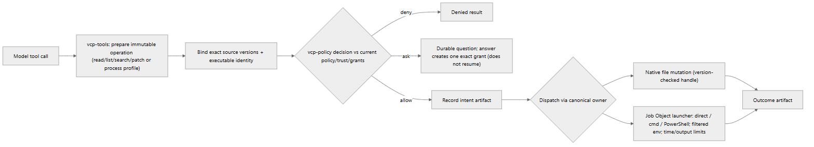
  *Shows how file and process tool calls are prepared, bound to versions, decided by policy (deny/ask/allow), and dispatched with intent/outcome artifacts.*

### [PR #39](https://github.com/iokaio/vcp/pull/39) — P2: add owned terminal execution with captured input and output

- **Merged:** 2026-09-19 · **Work items:** P2-04 (in progress) · **Size:** +929/−26, 27 files
- **What happened**
  - `vcp-lifecycle/src/process/pty.rs` and Codex patch 0018 (`utils/pty/src/win/owned.rs`) add an explicit owned ConPTY variant; upstream callers keep their behavior.
  - Terminal profiles connect to canonical process authority; initial input and dimensions bound into the operation; merged terminal output captured; deadlines/close stop the owned client tree.
- **Why**
  - The retained ConPTY launcher preserves descendants on normal root exit, which is incompatible with owned, bounded execution.
- **Decisions & records:** Requires `ReleasePseudoConsole` (Windows 11 24H2 / build 26100+). Output is merged stream with control sequences; cmd terminal conversion and interactive input/resizing disabled. WezTerm-derived MIT source notices retained.
- **Evidence:** 28 contracts + 65 patch tests, 3 retained ConPTY tests, reconstruction of 7,939 files.
- **Diagram:** Not needed

### [PR #40](https://github.com/iokaio/vcp/pull/40) — feat: enforce native process ceilings and opaque denial policy

- **Merged:** 2026-09-19 · **Work items:** P2-04, P2-03 · **Size:** +393/−14, 23 files
- **What happened**
  - Profiles bind a trusted simultaneous process limit (default 32, range 1–128) enforced by the owned Job Object before pipe or PTY execution; model arguments cannot raise it (Codex patch 0019 to `job.rs`).
  - Opaque operations respect scoped denials and declare all possible effect classes (`vcp-policy`).
- **Why**
  - Process profiles bounded time and output but not process count.
- **Decisions & records:** Ceiling is simultaneous membership, not cumulative spawn/CPU/memory or a sandbox.
- **Evidence:** Native fixtures show two-process job, failed excess-child marker, descendant file lock released after root exit, on both stores.
- **Diagram:** Not needed

### [PR #41](https://github.com/iokaio/vcp/pull/41) — feat: coordinate authority changes with owned work

- **Merged:** 2026-09-19 · **Work items:** P2-03 · **Size:** +728/−8, 19 files
- **What happened**
  - `foundation/authority.rs` + `worker/authority.rs`: policy, trust, grant, binding and steering changes coordinated with the owned lifecycle.
  - Idle owners use a quiescence-checked synchronous path; active changes fence admission, capture an unapplied intent, pause tasks, drain native/retained work, then commit the revision-checked command.
  - A dropped waiter does not abandon stopping; root/child continuation remains deliberate.
- **Why**
  - Authority must not change underneath in-flight tool or model work.
- **Decisions & records:** Workspace-wide stop even for scoped grant changes; invalid domain commands can leave work paused unapplied; interrupted external effects never auto-replayed.
- **Evidence:** Policy change during pipe execution and steering during PTY with zero Job Object members at acknowledgement; loopback streaming trace for partial capture and late usage on both stores.
- **Diagram:** Yes — 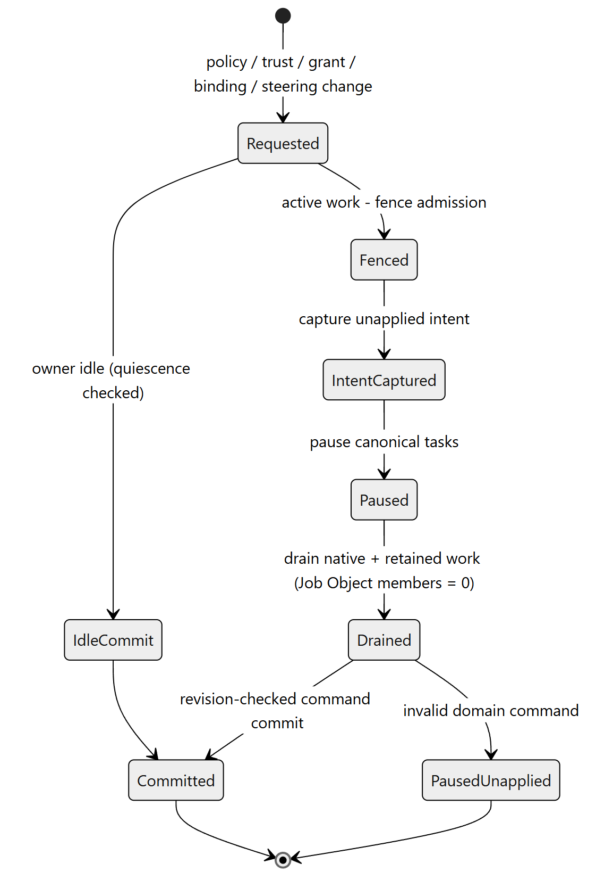
  *State machine of an authority change: idle fast path versus fence → capture intent → pause → drain → commit.*

### [PR #42](https://github.com/iokaio/vcp/pull/42) — feat: enforce trusted host tool ceilings and native preflight

- **Merged:** 2026-09-19 · **Work items:** P2-03 · **Size:** +603/−49, 19 files
- **What happened**
  - Explicit trusted host tool denials independent of user policy and grants; owner configuration validated before storage opens and immutable for the owner's lifetime.
  - Proposal evidence records rules used; file and process brokers preflight authority before revalidating files or pinning executables, then re-check before dispatch.
- **Why**
  - Needed a host-level ceiling that user grants or policy replacement cannot override.
- **Decisions & records:** Changing ceilings requires owner reopen; does not replace data access control or OS isolation.
- **Evidence:** Protected bytes preserved despite user grants; denied process dispatch leaves no marker or execution identity; 37 integration, 78 P1 contracts.
- **Diagram:** Not needed

### [PR #43](https://github.com/iokaio/vcp/pull/43) — feat: defer retained tools until accepted response completion

- **Merged:** 2026-09-19 · **Work items:** P2-05 · **Size:** +570/−19, 20 files
- **What happened**
  - Codex patch 0020 (`session/turn.rs`, `stream_events_utils.rs`, `work_admission.rs`) adds a host option to wait for an accepted completed response before constructing tool tasks; `CanonicalHost` enables it.
  - Failed/cancelled streams discard deferred calls while partial history and uncertain accounting stay captured.
- **Why**
  - Upstream streaming dispatch could execute tools from responses that later fail, before capture/accounting accepted them.
- **Decisions & records:** Retained default streaming behavior preserved for other callers; model-facing tools still denied pending prepared wrappers.
- **Evidence:** Fixture withholds terminal event after a completed tool item; completed, premature-EOF, host-rejected, interrupted cases on both stores plus default-mode control.
- **Diagram:** Not needed

### [PR #44](https://github.com/iokaio/vcp/pull/44) — feat(p2): connect canonical context and prepared coding tools

- **Merged:** 2026-09-19 · **Work items:** P2-01, P2-05 · **Size:** +1483/−23, 25 files
- **What happened**
  - `foundation/coding.rs` + `worker/coding.rs`: host automatically assembles current objective, scoped instructions and durable tool pairs (no more manually sealed context per request).
  - Registered read/list/search/patch/process wrappers connect the retained Codex loop to the prepared brokers.
  - Completed calls need captured, validated, accounted responses plus one-use identity/argument checks; unknown provider charges pause the root; shared request/deadline bounds cover helpers and survive reopen.
- **Why**
  - First end-to-end canonical coding loop: model-requested tools previously denied.
- **Decisions & records:** Newly discovered instruction scopes require fresh context before execution.
- **Evidence:** Seven scenarios on both stores; initial missing-cost failure exposed a missing root pause, fixed before qualification.
- **Diagram:** Not needed

### [PR #45](https://github.com/iokaio/vcp/pull/45) — Bind native verification and completion to current evidence

- **Merged:** 2026-09-19 · **Work items:** P2-06 · **Size:** +2002/−25, 30 files
- **What happened**
  - `vcp-tools/src/verification.rs` and lifecycle `foundation/verification.rs`: checks discovered from configured project manifests, expected acceptance tests required, complete execution evidence captured.
  - Completion checks current sources, authority and effects; durable verification intent; failed/not-run/stale distinctions; cited analysis completion; original-baseline restoration; late child-effect recheck.
  - Bounded streaming executable hashes let installed Node be qualified without raising source capture limits.
- **Why**
  - A process exit code did not establish that a task's changed files passed relevant checks; serialized success claims must not substitute.
- **Decisions & records:** Transient edits restored between observations undetectable; no atomic filesystem/store transaction over new entries.
- **Evidence:** 28-scenario native verification matrix across both stores; 42 integration, 83 P1 contracts.
- **Diagram:** Not needed

### [PR #46](https://github.com/iokaio/vcp/pull/46) — Connect retained verification to current cost evidence

- **Merged:** 2026-09-19 · **Work items:** P2-05, P2-06 · **Size:** +855/−29, 18 files
- **What happened**
  - Exposes `vcp_verify` model tool through the same completed-response, policy, capture and accounting boundaries; check definitions remain trusted owner config.
  - Verification must occupy its own response; mixed calls get durable unexecuted results.
  - `complete_coding_turn` selects the latest verification under the final-transition admission lock, rechecks sources/authority/evidence/effects, and captures an immutable cost refresh when only accounting changed.
- **Why**
  - Loop could run tools but not request verification or complete using its final response's cost; final model prose must not substitute for verification.
- **Decisions & records:** Internal owning-driver API; driver must call `complete_coding_turn` after retained work drains.
- **Evidence:** Matrix of passing/failed/omitted/mixed verification, later effects, workflow and read denials, comparing filesystem markers and HTTP counts to receipts.
- **Diagram:** Yes — 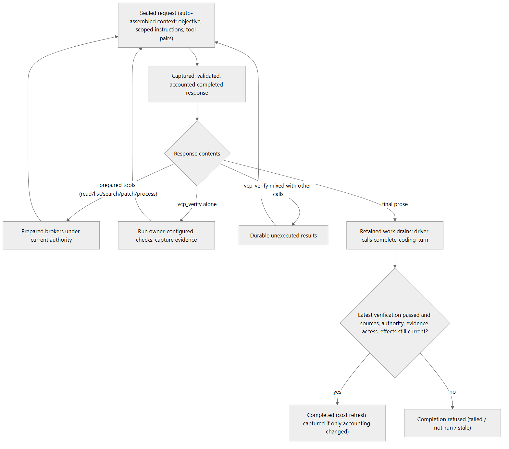
  *Shows the canonical coding loop from auto-assembled request through tool/verify branches to the evidence-gated completion decision (combines PR #44–#46).*

### [PR #47](https://github.com/iokaio/vcp/pull/47) — Preserve current state through retained context compaction

- **Merged:** 2026-09-19 · **Work items:** P2-08 · **Size:** +1400/−22, 22 files
- **What happened**
  - `vcp-context/src/compaction.rs`: deterministic previews of older complete tool pairs; `worker/coding/continuity.rs` wires them into configured retained-owner assembly.
  - Current objective, instructions, source manifests, effect outcomes, verification and accounting kept outside summaries; host measures actual encoded-request gain and captures projection provenance.
  - Reopen reconstructs original pairs under current authority; still-oversized requests pause before HTTP admission.
- **Why**
  - Long tool histories exhaust context; a historical preview must not replace current constraints or hide unresolved costs.
- **Decisions & records:** Estimates are conservative bytes, not tokens; full diff continuity and provider handoff deferred.
- **Evidence:** Four traces (SQLite/files × fitting/oversized) with reopens and unresolved charge; oversized continuation makes no extra HTTP request.
- **Diagram:** Not needed

### [PR #48](https://github.com/iokaio/vcp/pull/48) — Record completed native P2 authority acceptance

- **Merged:** 2026-09-19 · **Work items:** P2-03 (docs) · **Size:** +123/−19, 6 files
- **What happened**
  - Documents current preset/default authority matrix, maps pure and native acceptance evidence (`docs/evaluations/p2-policy-completion.md`), marks P2-03 complete.
- **Why**
  - Guides and ledger still described authority integration as future work after #36–#44 implemented it.
- **Decisions & records:** ADR-005 autonomy and isolation revised; general Windows sandbox stays P8-01, installed CLI stays P3.
- **Evidence:** 47 policy contracts rerun; other suites verified by matching source-input hashes rather than rerun.
- **Diagram:** Not needed

### [PR #49](https://github.com/iokaio/vcp/pull/49) — Qualify Cargo and documentation checks through native verification

- **Merged:** 2026-09-19 · **Work items:** P2-06 · **Size:** +364/−8, 11 files
- **What happened**
  - Process profile supplies explicit compiler settings and a disposable Cargo home; parent and model-supplied environment overrides not inherited.
  - Fixture `framework_verification.rs`: seeded defect → check fails, completion refused → repair → same check passes → completion, for Cargo and Node docs checks.
- **Why**
  - Adapter recognized Cargo plans but lacked native acceptance for a real Rust edit and documentation check.
- **Decisions & records:** Compiler execution uses explicit reduced isolation; no sandbox claim.
- **Evidence:** Four combinations (SQLite/files × Cargo/Node) passed in 140 s; 45 integration contracts.
- **Diagram:** Not needed

### [PR #50](https://github.com/iokaio/vcp/pull/50) — Enforce P2 parent instructions and add capped OpenRouter smoke

- **Merged:** 2026-09-19 · **Work items:** P2-01, P2-02 · **Size:** +1500/−701, 22 files
- **What happened**
  - `worker/coding/instructions.rs`: discovers parent `AGENTS.md` above the workspace while preserving workspace-root authority and deterministic order; snapshots checked at provider admission and verified completion.
  - Opt-in `scripts/test-openrouter-live.ps1` for `openai/gpt-5.6-luna` and `anthropic/claude-sonnet-5`, zero retries, aggregate cap ≤ $10; not wired into CI.
  - `AGENTS.md`/`CLAUDE.md` rewritten into the task-focused agent guidance.
- **Why**
  - Parent instructions could be stale, escaped or unauthorized; P2-02 required first live provider evidence under owner-authorized spend.
- **Decisions & records:** Jev deferred to P6 decision-adapter qualification; routine CI remains credential-free.
- **Evidence:** Live smoke passed both models at $0.0002058 observed (preflight max $0.0007872); targeted suites passed; fast-suite Codex reconstruction timed out (unrelated).
- **Diagram:** Not needed

### [PR #51](https://github.com/iokaio/vcp/pull/51) — Complete P2 reliable local coding implementation

- **Merged:** 2026-09-19 · **Work items:** P2-01–P2-08 · **Size:** +5151/−201, 62 files
- **What happened**
  - Controller-owned bounded provider retries with fresh reservations, predecessor links, retained uncertainty, absolute deadlines and cancellation fencing (Codex patch 0021).
  - `foundation/scheduler.rs`: trusted resource scheduling — shared reads, serialized conflicting effects, bounded concurrency/queues, native launch fencing.
  - `worker/recovery.rs` + `console.rs`: observation-only effect reconciliation, console-close vs forced-kill coverage, fresh resume validation, awaited SQLite shutdown before ownership release.
  - `vcp-context/src/handoff.rs`: validated portable handoff packets (state/base/diff/budget, provider-opaque omissions); honest empty-response handling.
- **Why**
  - Completion audit found remaining gaps (retries, scheduling, recovery, handoff) before P2 could close.
- **Decisions & records:** ADR-001, ADR-004, ADR-006, ADR-009 and ADR-016 history and pause updated. No installed CLI or general OS sandbox claim.
- **Evidence:** Context 30, provider 25, policy 47, tools 31, integration 60 contracts; retained deadline and PTY regressions; exact upstream reconstruction.
- **Diagram:** Not needed

## Era 5 — P3 native CLI, inspectors and continuation (#52–#56)

The engine became a user-facing `vcp` executable. It has JSONL and interactive modes, owner controls over a named pipe, paged evidence inspectors, and safe workspace continuation and rebinding. Agent guidance was revised to allow autonomous end-to-end delivery (#55).

### [PR #52](https://github.com/iokaio/vcp/pull/52) — Complete P3-01 native structured CLI and owner controls

- **Merged:** 2026-09-19 · **Work items:** P3-01 · **Size:** +6066/−68, 58 files
- **What happened**
  - New `vcp-cli` crate and native `vcp` executable: run/task-file, status/inspection, session resume/fork, live pause/cancel over the existing canonical owner and retained controller.
  - Startup validates local profiles, provider metadata, workspace binding, process/check profiles and exact budget caps before billable admission; caps persist before output, resume keeps the original cap.
  - Current-user-only Windows named pipes and bounded structured stdin deliver authenticated controls without a second writer; bounded JSONL output closes the owner on consumer loss.
  - `worker/coding/turns.rs` / `fork.rs`: verified completion and completed-turn fork boundaries — forks quote bounded history without replaying effects or importing authority.
- **Why**
  - P3-01 had only parser/owner-control scaffolding; the engine needed a real user-facing entry point.
- **Decisions & records:** Codex patch 0022 registers the crate; P3-02/03/04 left as separate items.
- **Evidence:** 80 P3 tests incl. real CLI subprocesses, Node JSONL consumer, budget denial, authenticated cancel with uncertain spend, broken-pipe pause; Clippy clean for CLI.
- **Diagram:** Yes — 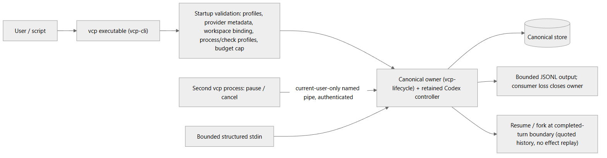
  *Shows the vcp executable, startup validation, single canonical owner, authenticated pipe controls, stdin, JSONL output and fork/resume.*

### [PR #53](https://github.com/iokaio/vcp/pull/53) — Implement P3-03 paged evidence inspectors

- **Merged:** 2026-09-19 · **Work items:** P3-03 · **Size:** +1046/−66, 21 files
- **What happened**
  - `vcp-audit/src/inspection.rs`: shared audit pages with canonical references, watermark-bound cursors, on-demand exact artifact bytes.
  - CLI adds `inspect --view chain`, `--limit`/`--cursor`, artifact `--offset`/`--length`; closed-store and live-owner queries enforce current access and retention with missing/pruned/incomplete/redacted markers.
- **Why**
  - Replace capped ad hoc CLI record lists with governed, paged evidence inspection.
- **Decisions & records:** ADR-009 updated. Inspector data replaces provisional P3-01 shape; JSONL envelope stays v1. Memory evidence deferred to P5-06/P3-05/P5-07.
- **Evidence:** 28 audit/CLI tests incl. exact comparison with HTTP request bytes via closed-store and live-owner paths.
- **Diagram:** Not needed

### [PR #54](https://github.com/iokaio/vcp/pull/54) — Complete P3-02 interactive terminal workflow

- **Merged:** 2026-09-19 · **Work items:** P3-02 (plus P2-07 fix) · **Size:** +2213/−18, 26 files
- **What happened**
  - `vcp-cli/src/terminal.rs`, `terminal/owner.rs`, `questions.rs`: native terminal workflow with live pause/resume, durable steering, scoped answers, cost/history/artifact navigation, sanitized Unicode, bounded input/rendering.
  - Redirected and JSONL modes unchanged.
  - Fixed P2-07 prerequisite: cancelled model producers now record termination after preserving uncertain charges, so same-process resume cannot be stranded; stale/expired approvals stay historical.
- **Why**
  - Interactive use needed a terminal UX over canonical task state; same-process resume exposed the stranded-producer bug.
- **Decisions & records:** No human Windows Terminal visual review claimed; workspace continuation left to P3-04.
- **Evidence:** 95 P3 tests incl. actual ConPTY workflows and native keyboard/resize/close; close vs forced-kill recovery passed.
- **Diagram:** Not needed

### [PR #55](https://github.com/iokaio/vcp/pull/55) — Clarify autonomous agent delivery and escalation rules

- **Merged:** 2026-09-19 · **Work items:** repository maintenance · **Size:** +76/−36, 2 files
- **What happened**
  - Rewrote `AGENTS.md` and `CLAUDE.md` (kept byte-identical) so autonomous implementation, prerequisite resolution, PR delivery and merge are the default for authorized work.
  - Narrowed escalation to genuine user decisions (product-outcome choices, trust-boundary weakening, destructive/irreversible actions, credentials/budget).
- **Why**
  - Agents were pausing for approval on ordinary engineering steps and prerequisite chains; the owner wanted end-to-end delivery while keeping explicit stop instructions, required checks, and separate authorization for releases, deployments and spending.
- **Decisions & records:** Agent operating rules (sections 0, 1, 18) changed; no ADR.
- **Evidence:** Instruction files verified byte-identical; documentation checks and `git diff --check` passed.
- **Diagram:** Not needed

### [PR #56](https://github.com/iokaio/vcp/pull/56) — Complete P3-04 workspace continuation and explicit rebind

- **Merged:** 2026-09-20 · **Work items:** P3-04 · **Size:** +2020/−73, 20 files
- **What happened**
  - Added CLI startup discovery of unfinished task trees without provider access, and a revision-bound task chooser (`vcp-cli/src/continuation.rs`); explicit selection and `resume --last` go through the shared reconciliation path.
  - Stale selections are rechecked under the canonical store lock before recovery mutates state; the summary keeps paused children, pending input, partial evidence, unsettled money and unknown effects.
  - New `binding.rs` physical root/Git identity checks reject replaced or moved workspace bindings; `rebind.rs` adds explicit rebind that keeps the original history/store, invalidates old authority and repairs interrupted descriptor writes.
  - Registry discovery rejects redirected paths; lifecycle gained a selected-reopen test harness.
- **Why**
  - Users need to resume interrupted work safely on restart; binding a workspace to the wrong or moved directory would let old authority act on the wrong files.
- **Decisions & records:** No ADR. Encrypted handoff, retention and memory retrieval were deferred to P3-05/P3-06 and their P5 prerequisites. Usage in `docs/development/p3-continuation.md`.
- **Evidence:** 49 CLI tests (including 10 executable and native ConPTY cases), plus audit, context, selected-reopen and fresh-process recovery tests, passed on native Windows.
- **Diagram:** Not needed

## Era 6 — P5 governed memory, search, retention and encrypted portability (#57–#65)

Munarium-derived governed memory was made durable and populated from real activity. It gained scoped Tantivy retrieval, bounded local embeddings with DiskANN, coherent generation publication and canonical hybrid retrieval. History controls with real erasure (ADR-021/022) and encrypted cross-machine portability (ADR-023) completed P3-05 and P3-06.

### [PR #57](https://github.com/iokaio/vcp/pull/57) — P5-01: durable governed memory and evidence history

- **Merged:** 2026-09-20 · **Work items:** P5-01 (prerequisite for P3-05) · **Size:** +5839/−12, 31 files
- **What happened**
  - New `vcp-memory` crate (gates, repository, projections, history, access, proof) and a `vcp-domain/src/memory.rs` model with six typed claim classes.
  - Claims pass the retained upstream (Munarium) gates plus VCP scope, evidence, verification and predecessor checks. Contradictions stay disputed. Corrections keep immutable history. Retries return the original canonical receipt with indexing pending.
  - `vcp-store` contract extended so both backends store proposals, resolutions, versions, head/sequence projections and retry results atomically. Derived heads can be rebuilt without replaying proposals.
  - Historical reads recheck current authority and retention. Generic `vcp-audit` inspectors cannot expose derived claim payloads.
  - Upstream workspace patch `0025-p5-memory-workspace.patch` and component inventory updated.
- **Why**
  - The P3-05 history and pruning CLI needed a durable, governed memory store. Memory must not become an unaudited side channel that bypasses authority or retention.
- **Decisions & records:** No new ADR. Details in `docs/development/p5-governed-memory.md`. Full upstream reconstruction was unavailable without the original candidate checkout; only the patch0025 exact checks ran.
- **Evidence:** 52 native Windows Rust tests passed, including ten governed scenarios run on both backends.
- **Diagram:** Not needed

### [PR #58](https://github.com/iokaio/vcp/pull/58) — P5-02: durable activity and evidence ingestion

- **Merged:** 2026-09-20 · **Work items:** P5-02 · **Size:** +6347/−36, 37 files
- **What happened**
  - Canonical activity now feeds a durable, bounded ingestion queue (`vcp-store/src/ingestion_contract.rs`). Cursor advancement and pending jobs commit together, and output identities and proposal receipts survive retries and process death.
  - `vcp-memory` gained `ingest`, `runner`, `extraction`, `extractors` and `preferences`. Deterministic extraction binds commands and check outcomes to retained evidence and captures only exact root-user preferences.
  - Optional model extraction validates captured and accounted Memory-role responses through the same governance boundary.
  - Host maintenance (`lifecycle/foundation/worker/memory.rs`) yields at task, turn and check boundaries and is fenced by pause and ownership. Inspectors show queue progress without starting work.
- **Why**
  - Memory has to be filled from real activity without duplicate claims after crashes and without competing with foreground work. P5-02 is a prerequisite for the P3 history and pruning work.
  - Crash testing found that progress could be falsely reported as caught up after processing emitted new activity. This PR fixes it and adds a guard.
- **Decisions & records:** No ADR. Search adapters and publication deferred to later P5 items. Details in `docs/development/p5-ingestion.md`.
- **Evidence:** 75 core tests and 26 canonical-host tests passed, plus six real process-kill/reopen barriers across both storage backends.
- **Diagram:** Yes — 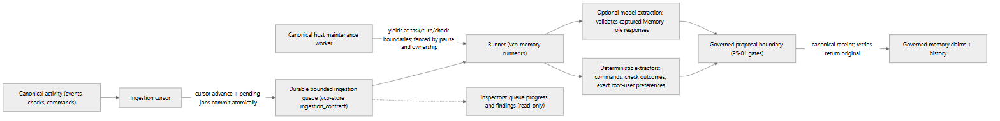
  *How canonical activity passes through the durable queue and extractors into governed memory proposals.*

### [PR #59](https://github.com/iokaio/vcp/pull/59) — P5-03: scoped lexical retrieval and canonical chunk inventory

- **Merged:** 2026-09-20 · **Work items:** P5-03 · **Size:** +2922/−8, 18 files
- **What happened**
  - Added an immutable Tantivy lexical adapter (`vcp-memory/src/lexical.rs`, `tokenizer.rs`) and a canonical source/claim inventory with stable exact-byte chunk identities (`search_record.rs`).
  - Exact workspace, task, root, path and symbol filters run before bounded ranking. The adapter returns only IDs and scores, and callers authorize against canonical state afterwards.
  - Private index builds are bounded, cancellable, validated on reopen, and reject Windows junction redirection.
  - Old workspace bindings are excluded from source eligibility. Source-task authorization now runs before pruned claim placeholders are resolved, which closes an identity-disclosure edge case.
- **Why**
  - Retrieval needs a derived index that cannot become a source of authority or leak data outside scope. The P3 history work depends on it.
- **Decisions & records:** No ADR. The existing Tantivy 0.22.1 pin is unchanged. Vectors (P5-04), publication (P5-05) and hybrid queries (P5-06) deferred.
- **Evidence:** 52 memory tests passed. On the held-out fixture, lexical recall@3 was 1.0 with precision 1.0 for lexical-labelled queries; semantic-only queries are reported separately (`docs/development/p5-lexical.md`).
- **Diagram:** Not needed

### [PR #60](https://github.com/iokaio/vcp/pull/60) — P5-04: bounded local embeddings and DiskANN

- **Merged:** 2026-09-20 · **Work items:** P5-04 · **Size:** +3290/−7, 22 files
- **What happened**
  - Added pinned local CPU embeddings (`vcp-memory/src/embedding.rs`) and immutable DiskANN vector components (`vector.rs`). Source-span identities bind the full embedding specification.
  - Native graph headers and mappings are validated before provider allocation. `local_resources.rs` adds a shared admission gate and resource observations.
  - Canonical hosts run bounded vector maintenance off the owner thread and honor pause and cancellation (`lifecycle/foundation/memory_vectors.rs`).
  - Added `scripts/upstream/trace-offline-vectors.cjs` to trace network behavior during offline embedding.
- **Why**
  - Semantic recall must run locally, within bounded resources, and must not reach the network or mix identities across embedding models.
- **Decisions & records:** No ADR. No model assets or experiment artifacts committed. Publication deferred to P5-05. Details in `docs/development/p5-vectors.md`.
- **Evidence:** 62 memory tests and four real-model host tests passed. A zero-capability AppContainer campaign denied embedding network access and matched exhaustive neighbors at recall@3 1.0.
- **Diagram:** Not needed

### [PR #61](https://github.com/iokaio/vcp/pull/61) — P5-05: coherent search publication and recovery

- **Merged:** 2026-09-20 · **Work items:** P5-05 · **Size:** +3902/−4, 20 files
- **What happened**
  - Lexical and vector components are published as one canonical generation (`vcp-memory/src/publication.rs`, `vcp-store/src/search_contract.rs`). Validated components, the active pointer and covered indexing intents become visible atomically.
  - Incomplete vector coverage is reported as a deficit. An empty eligible inventory has explicit complete-empty semantics.
  - Recovery rejects obsolete authority and deletion epochs, reports derivative corruption, and resolves lost replies from canonical receipts.
  - Windows directory and file guards block component swaps. Reader and physical-root snapshot leases (`snapshot_pin.rs`) prevent cleanup across owner reopen.
- **Why**
  - Separately built indexes must never be seen half-published or stale after deletion or authority changes, and must survive crashes during activation.
- **Decisions & records:** No ADR. Details in `docs/development/p5-publication.md`.
- **Evidence:** 103 regression tests passed, including 16 real process-kill scenarios across Files and SQLite and native host tests with real CPU embeddings.
- **Diagram:** Not needed

### [PR #62](https://github.com/iokaio/vcp/pull/62) — P5-06: Canonical hybrid retrieval and read-only memory search

- **Merged:** 2026-09-20 · **Work items:** P5-06 (prerequisite for P3-05) · **Size:** +4643/−65, 41 files
- **What happened**
  - Added `vcp-memory/src/retrieval.rs`. It returns bounded passages rebuilt from current canonical evidence, uses deterministic lexical/vector fusion, and reports provenance, freshness and explicit degradation.
  - Canonical eligibility constrains candidate collection. The host rechecks authority, deletion and the actual source files just before results reach the provider (`lifecycle/foundation/memory_query*.rs`).
  - New read-only `vcp memory search` CLI command with paused-owner inspection, cancellation across discovery, recovery and search, and admitted local query embedding.
- **Why**
  - History and retention controls need a retrieval path whose results cannot outlive deletion or authority changes. Index hits are treated as untrusted pointers.
- **Decisions & records:** No ADR. The report says embeddings ran in a zero-capability AppContainer while publication and retrieval consumed a validated vector handoff in a trusted process. It also keeps the failed single-process attempt (`docs/development/p5-retrieval.md`).
- **Evidence:** 123 regression tests passed. A fixture of 126 queries and 42 scope checks passed on both backends, with recall@3 1.0 for lexical, vector and fused retrieval. The report says small synthetic fixtures do not prove production-scale quality.
- **Diagram:** Yes — 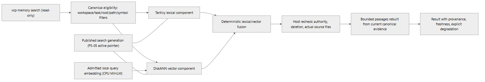
  *Query flow from canonical eligibility through the Tantivy and DiskANN components, fusion, and the host's final recheck to bounded passages.*

### [PR #63](https://github.com/iokaio/vcp/pull/63) — feat: complete P3-05 history controls and P5-07 retention

- **Merged:** 2026-09-20 · **Work items:** P3-05, P5-07 · **Size:** +9865/−115, 87 files
- **What happened**
  - CLI history controls (`vcp-cli/src/history.rs`, `vcp-audit/src/history_query.rs`): stable authorized history pages, governed memory inspection, exact pruning previews, and independent recall exclusion, compaction and purge.
  - Retention engine (`vcp-memory/src/retention*.rs`, `vcp-domain/src/retention_selector.rs`): typed selectors against a coherent canonical cut, with notification-only or explicit startup policies configured while paused.
  - Purge commits logical denial before physical cleanup, preserves protected recovery and accounting records and original receipt commitments, and resumes cleanup through sealed replay bases (`vcp-store/src/replay_base.rs`, `rewrite.rs`, `redaction_contract.rs`) on both backends.
  - Typed redaction in domain and protocol. Receipts distinguish local cleanup, pinned generations and retained backup obligations. Erased narratives stay erased when later billing arrives.
- **Why**
  - Users need real erasure. A logical tombstone cannot remove content from append-only journals or SQLite copies, and replaying original transactions during conversion would bring it back.
- **Decisions & records:** ADR-021 (sealed replay bases for retained-content rewrites; format-2 roots, format-1 opens unchanged). ADR-022 (exact retention selection and resumable local erasure; notification-only default, 30-day due threshold). Encrypted snapshot/handoff deferred to P5-09/P5-10.
- **Evidence:** 149 core tests and 34 canonical-host tests passed. Eight retention process kills and 16 generation-publication process kills passed on Files and SQLite. The PR makes no power-loss or cloud-erasure claim.
- **Diagram:** Not needed

### [PR #64](https://github.com/iokaio/vcp/pull/64) — P3-06: verified encrypted portability and environment controls

- **Merged:** 2026-09-20 · **Work items:** P3-06, P5-09, P5-10 · **Size:** +18328/−56, 85 files
- **What happened**
  - `vcp-store` gained independently enrolled recovery keys and writers (`keys.rs`, `trust_store.rs`), vault encryption and publication (`vault_crypto.rs`, `vault_publish.rs`, `portable_snapshot.rs`, `snapshot_jobs.rs`), and staged authenticated restore (`restore_stage.rs`, `restore_import.rs`, `restore_authority.rs`).
  - Restore writes into a separate canonical root and workspace. It preserves history, accounting and unfinished children, revokes machine authority, keeps the prior root, and leaves the result paused and untrusted. Lifecycle rebuilds or reuses search derivatives (`restore_search*.rs`).
  - Canonical-root selection moved to registry descriptors with workspace selection leases (`vcp-cli/src/selection.rs`, `storage.rs`).
  - CLI controls for key lifecycle, backup config/status/retry/cancel, storage conversion, restore preview/apply, rebind/trust, and path/capacity diagnostics (`doctor.rs`, `disk_space.rs`).
- **Why**
  - Users need to move work between Windows machines through a synced folder without exposing plaintext or carrying execution authority across machines.
  - Opening the new root layout over an existing workspace would have created an empty layout instead of migrating history. This drove the descriptor/lease design.
- **Decisions & records:** ADR-023 (canonical selection leases and descriptor activation; archive-provided paths never become roots; activation grants no execution authority). P3-01 through P3-06 declared complete. P5-08 and P8 remain separate.
- **Evidence:** A real two-machine OneDrive A→B→A campaign passed in both backend directions. Per backend it verified 37 events, 20 command receipts, 58 transaction receipts and 24 artifacts, and the original roots were unchanged. 18 CLI and 28 storage process-kill/tamper cases also passed.
- **Diagram:** Yes — 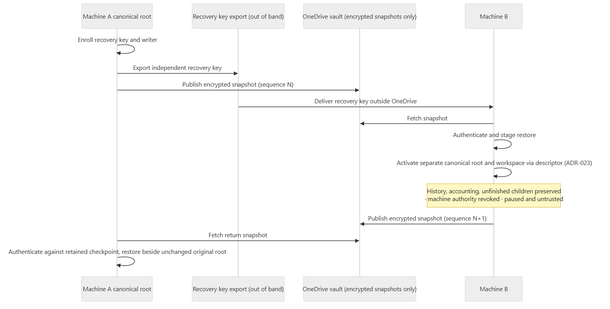
  *A→B→A handoff: the recovery key travels outside the vault, only encrypted snapshots enter OneDrive, and restores land paused and untrusted in separate roots.*

### [PR #65](https://github.com/iokaio/vcp/pull/65) — P5-08: integrated memory qualification and recent recall

- **Merged:** 2026-09-20 · **Work items:** P5-08 · **Size:** +1479/−7, 16 files
- **What happened**
  - Fixed a production gap: acknowledged recent memory was invisible until the next index publication. Retrieval now uses a bounded, authorized recent overlay with separate lexical ranks and freshness limits (`vcp-memory/src/retrieval.rs`).
  - Added a frozen comparison of three memory strategies (including governed memory and a Markdown baseline) with a grader and question set (`src/evals/memory/`, `examples/memory_comparison.rs`).
  - Added an encrypted cross-backend restore integration test covering sourced recall, persistent exclusion, revoked source authority and post-restore index rebuild.
- **Why**
  - Needed to close memory acceptance end to end and keep bounded memory acceptance separate from later routing, delegation and release qualification.
- **Decisions & records:** No ADR. The report explicitly makes no quality-advantage claim over Markdown. A provenance check failure was fixed by moving a generated compiler cache out of vendored source; the check was not relaxed. Details in `docs/evaluations/p5-08-integrated-memory.md`.
- **Evidence:** 72 comparison attempts. Governed and Markdown each found 12/12 relevant sources with zero stale or forbidden output. 95 memory regression tests passed.
- **Diagram:** Not needed

## Era 7 — P6 routing foundations, P7 skills and governed MCP (#66–#76)

This era laid deterministic routing and local optimizer foundations. It added skill discovery and a verified built-in catalog, then a fully governed MCP stack: duplex process, stdio, owned HTTP send boundary, remote HTTPS, resources and prompts, and exact numeric schemas. A store replay defect (#74) was fixed along the way.

### [PR #66](https://github.com/iokaio/vcp/pull/66) — Add governed routing and local optimization foundations

- **Merged:** 2026-09-20 · **Work items:** P6-01 – P6-05 (foundation) · **Size:** +11435/−68, 53 files
- **What happened**
  - `vcp-models`: immutable catalogs and policies (`routing.rs`, `routing/validation.rs`), deterministic eligibility and cost ordering (`routing/selection.rs`), a decision protocol codec (`decision.rs`) and bounded escalation (`escalation.rs`).
  - `vcp-lifecycle`: canonical routing state (`routing_state.rs`) with per-attempt model and price pinning, admission-time revalidation of policy, evidence, authority and root liability, and escalation with fresh handoffs (`worker/escalation.rs`, `worker/routing.rs`).
  - `vcp-cli/src/optimize*`: durable local optimizer report, interview, preview, apply and rollback. These run without a provider profile or model budget.
  - Native tests found a Windows stack mismatch. VCP now uses the retained engine's explicit 16 MiB bootstrap and worker stack (`main.rs`).
- **Why**
  - VCP had used one configured model with no canonical routing decisions. Routing must be deterministic and auditable. Retries keep their exact endpoint, and reopening without routing configuration cannot bypass a persisted routing policy.
- **Decisions & records:** No ADR. Decision protocol research is attributed in `docs/development/p6-decisions.md`. P6 remains in progress: live profile/evaluator qualification and some optimizer policy fields are deferred and need a separately authorized budget.
- **Evidence:** 41 offline model tests, 8 routing-state tests on both stores and 38 retained-host tests passed. A frozen selector experiment passed 54/54 assertions with zero model calls or spend.
- **Diagram:** Yes — 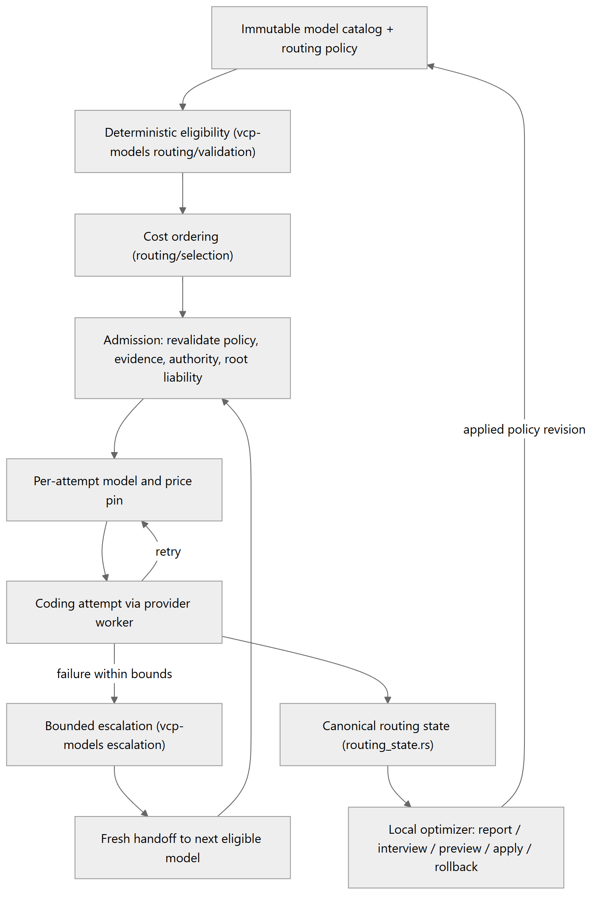
  *Catalog and policy flow through eligibility, cost ordering, admission, per-attempt pinning and bounded escalation, with the local optimizer feeding policy revisions back.*

### [PR #67](https://github.com/iokaio/vcp/pull/67) — feat(skills): add bounded discovery and canonical activation

- **Merged:** 2026-09-20 · **Work items:** P7-01 · **Size:** +4006/−20, 52 files
- **What happened**
  - New `vcp-extensions` crate (`discovery.rs`, `skill_manifest.rs`, `activation.rs`). It reads bounded native `skill.json` descriptors from explicitly registered roots and loads bodies and resources only on explicit activation.
  - Deterministic source precedence (workspace, then user, then built-in), current prerequisite checks and hash-pinned artifacts. Canonical skill revisions invalidate prepared work when selected content changes or a skill is disabled (`lifecycle/foundation/worker/skills.rs`).
  - Provider-free `vcp skills list` and `/skills` session controls.
  - Skill text stays below user and AGENTS instructions and is kept out of the developer role. The existing broker enforces read authority, including workspace aliases and containing roots.
- **Why**
  - Skills must add guidance without becoming a way to escalate authority or inject instructions, and must not require scanning home directories or importing foreign configuration.
- **Decisions & records:** ADR-024 (native skill packages and activation authority; skills never create tool or process grants). Upstream patch 0031. Built-in catalog (P7-02) and MCP (P7-03) deferred.
- **Evidence:** 40 retained-host tests passed across both stores. A frozen 4/128-package experiment passed with zero body or resource reads during discovery. One sandbox-only stall is recorded as an environment limitation, with no production workaround added.
- **Diagram:** Not needed

### [PR #68](https://github.com/iokaio/vcp/pull/68) — feat(skills): ship versioned built-in catalog and verified assets

- **Merged:** 2026-09-20 · **Work items:** P7-02 · **Size:** +6737/−35, 256 files
- **What happened**
  - Added 21 original built-in skill packages loaded from `skills/builtin` beside the executable. Only the catalog inventory is embedded in the binary (`vcp-extensions/src/catalog.rs`).
  - Packaging scripts (`scripts/package-skills.ps1`, `scripts/skills/*`) stage an exact allowlist and produce hash-verified asset archives.
  - Added 42 frozen normal and negative fixture projects under `src/evals/skills/builtin/projects/` covering C++, Dart, Go, .NET/PowerShell, JS/TS, Git, infrastructure, data and architecture, with coverage records.
- **Why**
  - VCP needs useful default skills without tampering risk. Missing assets produce a diagnostic, corrupt assets fail closed, and upgrades cannot silently reinterpret an already-active skill body.
- **Decisions & records:** ADR-025 (built-in skill asset identity; the executable directory is the only default location). Live usefulness and toolchain qualification remain open. This is qualification packaging, not an installer or release.
- **Evidence:** 336 frozen-project assertions, 14 executable workflows, and asset and archive contracts passed, plus all nine delivery gates.
- **Diagram:** Not needed

### [PR #69](https://github.com/iokaio/vcp/pull/69) — feat(mcp): add governed duplex process prerequisite

- **Merged:** 2026-09-20 · **Work items:** P7-03 (prerequisite) · **Size:** +1723/−5, 16 files
- **What happened**
  - Added owned, bounded stdin/stdout duplex transport (`vcp-lifecycle/src/process/duplex.rs`, `foundation/execution/duplex.rs`) and a `vcp-process-fixture` binary.
  - The canonical host pins and authorizes startup, records intent before launch, holds the process conflict claim until shutdown, and keeps uncertain outcomes without replay.
  - Extracted shared outcome handling from the existing process broker.
- **Why**
  - Local MCP servers are long-lived bidirectional processes. The existing one-shot process broker could not govern them. Production writes stay internal until per-call MCP authority exists.
- **Decisions & records:** No ADR. No new dependency. Protocol negotiation, servers, schemas, credentials and resources deferred.
- **Evidence:** Native tests covered real process trees, framed IO and budgets, cancellation, policy revocation and both backends (`docs/evaluations/p7-03-duplex.md`).
- **Diagram:** Not needed

### [PR #70](https://github.com/iokaio/vcp/pull/70) — feat(mcp): govern local stdio tool discovery and dispatch

- **Merged:** 2026-09-20 · **Work items:** P7-03 · **Size:** +6504/−91, 50 files
- **What happened**
  - Original sequential MCP `2025-11-25` codec and state machine in `vcp-extensions/src/mcp/` (client, identity, registration, schema). The core validates data and returns bytes; the host owns processes, deadlines and authority.
  - Canonical host MCP foundation (`lifecycle/foundation/mcp.rs`, `worker/mcp.rs`). Discovery and calls go through the process broker with immutable connection and schema identities, exact argument validation, current source permissions and durable effect receipts.
  - Terminal and model controls share one path (`vcp-cli/src/mcp.rs`). Lost responses keep unknown outcomes without replay.
  - Closed prune-to-write races, added a narrowly checked approval resume for an idle owned server, and cancel definitely-unsent proposals on conflict or abandonment.
- **Why**
  - External tool servers are untrusted. Calls need the same approval, authority, intent and recovery guarantees as native tools, and no third-party MCP SDK was added.
- **Decisions & records:** ADR-026 (governed sequential MCP stdio: one outstanding call per connection; sampling, roots and elicitation not advertised; integer-only numerics). HTTP, credentials and resources/prompts deferred.
- **Evidence:** 111 frozen native tests passed on Files and SQLite, including real servers, source deletion, callback faults, approvals, cancel/reopen and model-driven calls.
- **Diagram:** Yes — 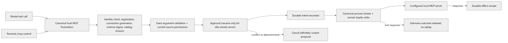
  *Path of a model or terminal MCP call through identity, validation, approval, durable intent and the process broker, with receipt and unknown-outcome branches.*

### [PR #71](https://github.com/iokaio/vcp/pull/71) — feat(mcp): fence HTTP transport and scoped credentials

- **Merged:** 2026-09-20 · **Work items:** P7-03 (prerequisite) · **Size:** +3367/−14, 26 files
- **What happened**
  - Added bounded JSON/SSE framing (`vcp-extensions/src/mcp/http.rs`) and scoped in-memory credential leases (`foundation/mcp/remote_authority.rs`).
  - Added an owned HTTP/1 transport (`vcp-lifecycle/src/remote_transport.rs`) whose write gate sits below TLS on the raw TCP stream. Owner holds or loss close even parked sockets. Credential revocation or generation change blocks later physical writes.
- **Why**
  - A request-level check is not enough: Rustls can keep encrypted output after reporting plaintext accepted. Revocation has to be enforced at the socket write.
- **Decisions & records:** ADR-027 (owned HTTP send boundary: one fresh connection and one send per POST; no redirects, pooling, proxy discovery or replay; not an exactly-once guarantee). Uses existing locked Hyper and Rustls through patch 0032, with no version changes. Remote MCP dispatch deferred.
- **Evidence:** 141 source-frozen native tests passed, including real TLS, buffered-write revocation and both stores.
- **Diagram:** Not needed

### [PR #72](https://github.com/iokaio/vcp/pull/72) — P7-03: govern remote MCP tools over HTTPS

- **Merged:** 2026-09-20 · **Work items:** P7-03 · **Size:** +5598/−232, 38 files
- **What happened**
  - Configured remote MCP tools now use canonical approval, source fences, durable intent and recovery over bounded HTTPS JSON/SSE (`foundation/mcp/remote.rs`, `remote_transport/streaming.rs`).
  - Each POST gets its own TLS socket and an exact request-flush observation. Callbacks reuse the parent claim with separately recorded sends.
  - Added scoped CLI credential references, immutable read-only Windows trust snapshots (`remote_transport/trust/windows.rs`) and protocol session handling (`mcp/http/session.rs`).
  - Server echoes and prepared-operation metadata are sanitized. Credentials and session IDs stay out of captures, including callback IDs and credential-bearing paths.
- **Why**
  - Remote tools add network recipients and secrets to the governed tool path. Lost replies must stay unknown rather than be replayed.
- **Decisions & records:** Builds on ADR-026 and ADR-027. Resources and prompts deferred.
- **Evidence:** 179 frozen native tests passed across eleven stages with unchanged source, covering real TLS, approval, pruning, cancel/restart and the model-facing wrapper. No hosted MCP service or paid calls were used.
- **Diagram:** Not needed

### [PR #73](https://github.com/iokaio/vcp/pull/73) — P7-03: govern MCP resources, prompts and scoped cache

- **Merged:** 2026-09-20 · **Work items:** P7-03 · **Size:** +4590/−279, 37 files
- **What happened**
  - Added explicit resource URI and prompt name allowlists, and identity-bound discovery, read and get over stdio and HTTPS (`vcp-extensions/src/mcp/content.rs`, `foundation/mcp/content.rs`), with CLI and model controls.
  - Added a scoped cache of prior resource observations. Cache hits recheck current authority and connection/catalog identity without network I/O and grant no authority.
  - Returned content remains external evidence. URIs are exact opaque selectors and are never dereferenced. Server prompt roles cannot become trusted instructions. Binary content is omitted.
  - Review fixes: closed an integer-profile parser bypass caused by serde feature unification, and decoded session secrets are rejected before prompt-operation capture.
- **Why**
  - Tools alone were not enough for MCP usefulness. Resources and prompts are an obvious route for prompt injection and data exfiltration, so they needed the same governance.
- **Decisions & records:** No new ADR. Broader numeric and schema support under ADR-026 deferred to the next increment.
- **Evidence:** 214 native tests passed across thirteen stages with unchanged source identity.
- **Diagram:** Not needed

### [PR #74](https://github.com/iokaio/vcp/pull/74) — P1-04: preserve literal JSON objects during store replay

- **Merged:** 2026-09-20 · **Work items:** P1-04 (defect fix) · **Size:** +869/−4, 16 files
- **What happened**
  - Added a bounded lexical reader (`vcp-protocol/src/persisted_json.rs`) that preserves literal object keys when decoding record and event values. Raw discriminator decoding for `Mutation` and `EventPage` keeps its existing field rules.
  - Serialization, canonical v1, journal and database formats, and receipt hashes are unchanged. An isolated prototype recovered twelve previously failing stores without rewriting them.
- **Why**
  - Defect: the store could acknowledge a record containing a literal serde-private JSON key and then fail to reopen, because generic `Value` decoding turned that object into a number or raw value. The production CLI feature graph (`arbitrary_precision`) reproduced it on Files and SQLite.
- **Decisions & records:** No ADR. Documented in `docs/development/p1-persisted-json.md`. Generic serde semantics for caller-defined types are unchanged. MCP numeric normalization is left to P7-03.
- **Evidence:** Focused protocol and store tests passed under default and arbitrary-precision builds, and a 182-test native campaign passed across ten stages.
- **Diagram:** Not needed

### [PR #75](https://github.com/iokaio/vcp/pull/75) — P7-03: preserve exact MCP numeric values and bounded schemas

- **Merged:** 2026-09-20 · **Work items:** P7-03 · **Size:** +4226/−505, 39 files
- **What happened**
  - MCP tools now accept exact decimal and exponent values, bounded local definitions, nullable scalars, dictionaries and schema composition (`mcp/schema/exact.rs`, `compiled.rs`).
  - `mcp-schema/2` binds this interpretation to connection and schema identities and keeps admitted values intact through stdio and HTTPS requests, receipts and later model context.
  - Numeric credential and session aliases are screened before proposal capture and in returned data.
  - The decision-response reader (`vcp-models/src/decision/unique_json.rs`) now keeps real numbers intact under serde feature unification.
- **Why**
  - The initial integer-only profile avoided float rounding but rejected useful schemas. Values must survive validation through dispatch and evidence without being approximated.
- **Decisions & records:** ADR-028 (exact MCP schema profile; supersedes only ADR-026's integer/schema restriction; supports a documented JSON Schema 2020-12 subset and rejects unsupported semantics). Depends on #74.
- **Evidence:** Frozen native campaign, all-target Clippy and delivery gates passed (`docs/evaluations/p7-03-numeric.md`).
- **Diagram:** Not needed

### [PR #76](https://github.com/iokaio/vcp/pull/76) — P7-03: complete MCP fault and authentication qualification

- **Merged:** 2026-09-20 · **Work items:** P7-03 (completion) · **Size:** +541/−5, 11 files
- **What happened**
  - Added qualification-only proposal barriers that stop after a valid reply and before durable receipt capture. They show cancellation and repeated host reopen keep the outcome unknown without replay, on both stores and both transports.
  - The native TLS peer confirms it wrote an HTTP 401 response. The host exposes no catalog, leaks no credential canaries and makes no recovery request.
- **Why**
  - These were the last P7-03 acceptance gaps for the documented MCP subset: interruption between reply and persistence, and authentication failure.
- **Decisions & records:** None. Controlled cancel/reopen is not claimed to cover OS process kill or power loss.
- **Evidence:** Frozen host regression campaign, production CLI check and Clippy passed (`docs/evaluations/p7-03-final-faults.md`).
- **Diagram:** Not needed

## Era 8 — P6 Markov analytics, escalation advice and routing qualification (#77–#104)

The Markov plan (#80) was carried out in stages. M1 added retained evidence, kernels, fits, rewards and replay (ADR-029–035). M2 added escalation advisory records, leases, accounting and shadow runs (ADR-036–039). M3 added read-only forecasts (ADR-040), and M4 was a pre-registered qualification. Live qualification under budget caps ended P6 with the candidates measured and rejected (ADR-041); automatic defaults stay off.

### [PR #77](https://github.com/iokaio/vcp/pull/77) — P6-02: add canonical routing shadow evaluator

- **Merged:** 2026-09-20 · **Work items:** P6-02 · **Size:** +4206/−45, 30 files
- **What happened**
  - An admitted coding route can now be observed by one separately budgeted native Decisions or conventional Chat shadow request (`lifecycle/foundation/decision/*`, `worker/decision.rs`). It never changes the selected coding model.
  - The worker revalidates the routing baseline and source context, applies current recipient, data and network policy, and records known or uncertain cost. Disabled, deterministic, unqualified, stale and budget-denied configurations do no evaluator I/O.
  - The CLI (`vcp-cli/src/decision.rs`) drives shadow work alongside the terminal and headless event pumps and joins cancellation before owner shutdown.
  - Evaluator credentials are memory-only and separately fenced. Production native Decisions stays unavailable without a qualified finite charge bound.
- **Why**
  - Model-based routing advice has to be evaluated safely next to real work before it can influence decisions.
- **Decisions & records:** No ADR. Documented in `docs/development/p6-decisions.md`. Controlled fixtures cannot enable production transport.
- **Evidence:** 162 native tests passed across 8 stages with unchanged source, plus the 9/9 fast suite.
- **Diagram:** Not needed

### [PR #78](https://github.com/iokaio/vcp/pull/78) — P6-03: add bounded escalation advice contract

- **Merged:** 2026-09-20 · **Work items:** P6-03 (partial) · **Size:** +672/−1, 6 files
- **What happened**
  - Added revision-bound escalation questions and a consumer in `vcp-models/src/escalation.rs`. It accepts only closed retry, replan, escalate and stop signals plus additive review.
  - Decision outcomes keep their question revision. Native answers must meet trusted integer probability and confidence thresholds, and conventional discrete answers need explicit local permission. Shadow answers are rejected, and a suggested stop can only constrain a transition that is otherwise ready.
- **Why**
  - The host needed a typed boundary before advisory mode could be enabled, so model advice can never override Rust-owned attempt, pin, eligibility, budget, authority, verification or completion gates.
- **Decisions & records:** None. Canonical advisory admission, persistence and live qualification deferred. Remote advice is not enabled.
- **Evidence:** 51 `vcp-models` tests, 35 contract tests and 54/54 frozen assertions passed with zero model calls.
- **Diagram:** Not needed

### [PR #79](https://github.com/iokaio/vcp/pull/79) — P6-03: admit finite escalation advisory capability

- **Merged:** 2026-09-20 · **Work items:** P6-03 (prerequisite) · **Size:** +102/−4, 5 files
- **What happened**
  - An exact owner-installed `Purpose::Escalation` / `Mode::Advisory` qualification can now prepare the typed advisory request under the existing byte, charge and single-attempt limits (`decision/admission.rs`).
- **Why**
  - Finite-operation admission is a prerequisite for scheduling advisory calls. Disabled and deterministic modes stay ineligible.
- **Decisions & records:** Public advisory configuration stays closed until canonical scheduling and persistence are wired.
- **Evidence:** 7 admission tests and a 164-test decision qualification passed.
- **Diagram:** Not needed

### [PR #80](https://github.com/iokaio/vcp/pull/80) — docs(plan): sequence Markov analysis and feature refactors

- **Merged:** 2026-09-20 · **Work items:** docs (plan revision 13) · **Size:** +827/−8, 14 files
- **What happened**
  - Added `docs/plan/21-markov-integration.md`, a sequenced supplement (M1 onward) with owners, prerequisites, refactors, migration and retention requirements, acceptance tests and qualification gates. Linked it from the P2, P5, P6, P7, P8 and P10 plan files and a pending-work ledger.
  - Added the owner-supplied research note `docs/research/markov.md` unchanged.
- **Why**
  - The Markov research suggestions were not scheduled. The plan orders them as retained evidence and local analysis first, then escalation integration, read-only optimizer reporting and qualified consumption. It also corrects research assumptions about resumable blocked tasks, budget probabilities and cycle-triggered actions.
- **Decisions & records:** Historical acceptance and the 68-task dependency graph are preserved. Detailed statistical ADRs are assigned to implementation. Documentation only; no spend authorized.
- **Evidence:** Repository contract checks passed (306 Markdown files, 1,896 links), as did the fast suite.
- **Diagram:** Not needed

### [PR #81](https://github.com/iokaio/vcp/pull/81) — P6-02: inspect retained task-transition evidence

- **Merged:** 2026-09-20 · **Work items:** P6-02 / Markov M1 · **Size:** +1057/−12, 16 files
- **What happened**
  - Added `routing_state/transitions.rs`, a bounded, authorized rebuild-on-read inspector exposed as `vcp optimize transitions` and `/optimize transitions`.
  - It rebuilds transitions from canonical task snapshots and consecutive revisions in engine events, keeps append order, shows gaps and censoring, and honors logical purge before cleanup.
- **Why**
  - Statistical fitting needs historical transitions. The existing optimizer counts only describe current rows; treating them as transitions would invent paths and let future outcomes leak into earlier windows.
- **Decisions & records:** ADR-029 (retained task-transition evidence; read-only observation boundary; no model, routing default or fitted-artifact format chosen). Action, reward and cohort evidence and numerical routines remain open M1 work.
- **Evidence:** 12 `routing_state` tests on both stores and 9 CLI optimize tests passed.
- **Diagram:** Not needed

### [PR #82](https://github.com/iokaio/vcp/pull/82) — P6-02: add bounded Markov analysis kernels

- **Merged:** 2026-09-20 · **Work items:** P6-02 (Markov M1 step 5) · **Size:** +803/−8, 9 files
- **What happened**
  - Added pure `vcp-models::markov` (`src/crates/vcp-models/src/markov.rs`): transition counting, observed-support smoothing, absorbing-chain expected visits/outcomes/rewards, log-space sequence likelihood.
  - Explicit state/work limits with typed failures for sparse, forbidden, nonabsorbing, ill-conditioned, non-finite and incomplete-reward inputs; near-singular matrices abstain.
  - Smoothing is restricted so it can never create an unobserved path to success.
  - Documented in `docs/development/markov-kernels.md`; M1 ledger in `docs/plan/21-markov-integration.md` updated.
- **Why**
  - M1 needed bounded, testable arithmetic before any historical fit could inform a consumer; deliberately no provider, dependency, persisted artifact or routing consumer.
- **Decisions & records:** No ADR; remaining M1 work (attribution, fit provenance, uncertainty, consumed-value replay) explicitly left open.
- **Evidence:** 9 markov tests (60 total in `vcp-models`); hand-computed matrices plus 32 fixed-seed matrices checked against an independent finite-horizon mass-propagation oracle.
- **Diagram:** Not needed

### [PR #83](https://github.com/iokaio/vcp/pull/83) — P6-02: inspect causal action evidence

- **Merged:** 2026-09-21 · **Work items:** P6-02 · **Size:** +2222/−17, 17 files
- **What happened**
  - Added read-only `canonical-action-observation/1` projection (`vcp-lifecycle/.../routing_state/observations.rs`) with separate turn, effect, attempt and verification evidence, exact admitted cohorts, retry lineage, revision-bound failure signatures and retention-aware gaps.
  - Exposed via CLI/terminal optimizer inspection (`vcp-cli/src/optimize/offline.rs`) and engine command handler.
  - New verification events retain the observed task revision; older events remain readable.
- **Why**
  - Markov fitting needs retained causal action units, not just task transitions; projection omits raw objectives, commands, diagnostics and provider responses and abstains on incomplete prefixes/identities.
- **Decisions & records:** ADR-030 causal action observations.
- **Evidence:** routing-state suite 16 passed (4 Files/SQLite action-evidence tests), CLI optimize 10, engine 10, fast suite 9.
- **Diagram:** Not needed

### [PR #84](https://github.com/iokaio/vcp/pull/84) — P6-02: attribute exact attempt charges

- **Merged:** 2026-09-21 · **Work items:** P6-02 · **Size:** +741/−30, 14 files
- **What happened**
  - New usage events carry a typed settlement reference (`vcp-budget/src/service.rs`).
  - Projection advanced to `canonical-action-observation/2`: per-attempt currency, debit/credit adjustments, current liability, completeness, and an exact terminal charge only when the retained prefix proves it.
  - Partial/legacy/pruned/uncertain inputs suppress point estimates; complete no-send release counts as zero; task/root rollups never added to component attempts.
- **Why**
  - Cumulative attempt accounting had no causal, retention-safe link to immutable settlements, so late corrections and unknown liabilities could not produce exact reward inputs.
- **Decisions & records:** ADR-031 exact attempt charge attribution.
- **Evidence:** routing-state 17 passed, budget accounting 10, CLI optimize 10, fast suite 9; no live-provider run.
- **Diagram:** Not needed

### [PR #85](https://github.com/iokaio/vcp/pull/85) — P6-02: build source-bound Markov fits

- **Merged:** 2026-09-21 · **Work items:** P6-02 · **Size:** +474/−7, 11 files
- **What happened**
  - Added `routing_state/fits.rs`: read-only first-order fit artifact recording source identity/digest, authority/deletion revisions, cutoff/window/scope, gap/censoring coverage, cohort, counts, algorithm, prior, sample gate, uncertainty method and policy/catalog identities.
  - Fits use only observed legal support and return closed abstention reasons (empty, sparse, nonabsorbing, invalid, numerical).
- **Why**
  - M1 had evidence and arithmetic but no portable candidate bound to exact source, scope and parameters; any source/authority/deletion/config change must yield a different artifact or denial.
- **Decisions & records:** ADR-032 rebuildable Markov fit artifacts; fits are always unqualified, unpersisted and cannot serve routing.
- **Evidence:** routing-state 18 passed including fit fixture on Files and SQLite; fast suite 9.
- **Diagram:** Not needed

### [PR #86](https://github.com/iokaio/vcp/pull/86) — P6-02: compare held-out Markov orders

- **Merged:** 2026-09-21 · **Work items:** P6-02 · **Size:** +772/−33, 12 files
- **What happened**
  - Added bounded first- vs second-order held-out likelihood comparison with supported-parameter penalty and deterministic first-order tie-break (`vcp-models::markov`).
  - Added first-order two-step frequency error; abstains on missing support, sparse rows, unsafe numerics, work-limit violations.
  - Unpersisted, source-bound comparison artifact over stable task-identity cohorts, splitting retained gaps (`routing_state/fits.rs`).
- **Why**
  - No out-of-sample evidence existed for choosing model order and no multi-step frequency check.
- **Decisions & records:** ADR-033 held-out Markov order comparison.
- **Evidence:** markov tests 11, routing-state 19, fast suite 9.
- **Diagram:** Not needed

### [PR #87](https://github.com/iokaio/vcp/pull/87) — P6-02: map exact attempt rewards

- **Merged:** 2026-09-21 · **Work items:** P6-02 · **Size:** +595/−14, 12 files
- **What happened**
  - Added `routing_state/rewards.rs`: each retained attempt maps once to an exact augmented model-cycle cohort preserving role, endpoint/model, policy, task class, root identity, escalation counters and currency.
  - Publishes exact counts/sum/range and an upward-rounded mean only when every cohort sample is complete; otherwise charged and reserved-liability totals stay separate.
- **Why**
  - Without explicit visit/reward mapping, analysis could mix roles or silently treat unknown liability as zero.
- **Decisions & records:** ADR-034 exact attempt reward mapping (ADR-031/033 touched up).
- **Evidence:** routing-state 20 passed; fast suite 9.
- **Diagram:** Not needed

### [PR #88](https://github.com/iokaio/vcp/pull/88) — P6-02: retain consumed reward values for replay

- **Merged:** 2026-09-21 · **Work items:** P6-02 (closes Markov M1) · **Size:** +527/−27, 15 files
- **What happened**
  - Added `routing_state/consumption.rs`: persists only the exact reward scalar selected by local optimization inspection, after a fresh authorized producer-artifact match.
  - Record binds consumer decision, producer/source/selection digests, task scope, currency/micros, policy and catalog, and references every selected task/attempt/settlement for retention closure.
  - Replay uses the immutable recorded scalar without refitting; stale, unknown, conflicting or cross-scope use is rejected.
  - Plan marks M1 complete; M2/P6-03 next.
- **Why**
  - Rebuilding a statistical artifact during replay could change a past decision, while persisting whole fits risks retaining stale or pruned source content.
- **Decisions & records:** ADR-035 consumed statistical value replay; ADR-029/030/032/034 updated.
- **Evidence:** routing-state 20 passed; fast suite 9.
- **Diagram:** Yes — 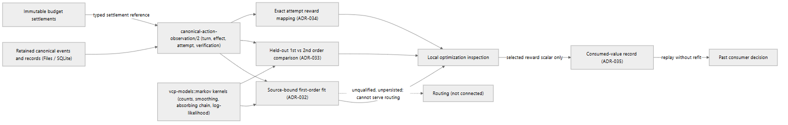
  *Shows how retained events and settlements feed action observations, fits, order comparison and reward mapping, and how only the consumed scalar is persisted for replay while fits stay disconnected from routing.*

### [PR #89](https://github.com/iokaio/vcp/pull/89) — P6-03: retain canonical escalation advisory records

- **Merged:** 2026-09-21 · **Work items:** P6-03 (Markov M2) · **Size:** +743/−10, 15 files
- **What happened**
  - Added `routing_state/advisory.rs` with immutable `vcp_escalation_advisory_request_v1` / `_result_v1` projections.
  - Requests accept only prepared `Purpose::Escalation` advisories, revalidated against canonical workspace/task revision, steering, authority and deletion epoch; deterministic IDs dedupe exact retries.
  - Results carry a closed disposition: `accepted_current` or `historical_stale` for late outcomes.
- **Why**
  - A canonical lifecycle seam was needed before remote scheduling or a local stall producer could consume escalation advice; without it retries could duplicate helper requests and late responses could look current.
- **Decisions & records:** ADR-036 canonical escalation advisory records (ADR-020 amended); records are inert — no transport, no advice enablement.
- **Evidence:** routing-state 21 passed; fast suite 9.
- **Diagram:** Not needed

### [PR #90](https://github.com/iokaio/vcp/pull/90) — P6-03: bound caller-owned advisory scheduling

- **Merged:** 2026-09-21 · **Work items:** P6-03 · **Size:** +788/−25, 12 files
- **What happened**
  - Added one revision-CAS `vcp_escalation_advisory_schedule_v1` lease per request with closed states pending/claimed/cancelled/completed.
  - `revalidate_dispatch` atomically cancels on pause, non-running state, changed input or deadline; only the claimant can mark interruption.
  - Reopening a claimed lease returns `Existing` and never authorizes a second send; completion requires the matching `accepted_current` result.
- **Why**
  - Persistence alone did not stop two callers sending the same request, and a background scheduler would compete with the canonical owner during pause/steering.
- **Decisions & records:** ADR-037 caller-owned advisory scheduling lease; still transport-free, no provider attempt or charge.
- **Evidence:** routing-state 22 passed; fast suite 9.
- **Diagram:** Yes — 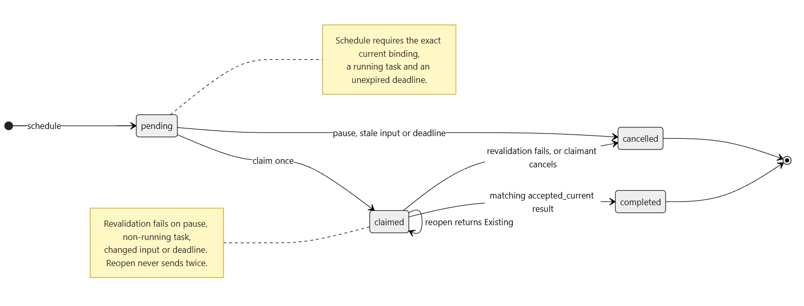
  *State machine of the advisory schedule lease: single claim, dispatch-time revalidation, no replay on reopen, completion only by a current result.*

### [PR #91](https://github.com/iokaio/vcp/pull/91) — P6-03: bind advisory helper accounting

- **Merged:** 2026-09-21 · **Work items:** P6-03 · **Size:** +477/−16, 12 files
- **What happened**
  - Active advisory claims bind immutably and idempotently to an unsubmitted canonical Helper attempt and its retained typed request artifact.
  - Submission, uncertain liability and settlement state are read directly from that attempt; binding references task/request/schedule/attempt/reservation/artifact dependencies.
- **Why**
  - Advisory transport must reuse the ordinary helper budget ledger rather than inventing a parallel charge model.
- **Decisions & records:** ADR-038 advisory helper accounting binding.
- **Evidence:** routing-state 23 passed; fast suite 9.
- **Diagram:** Not needed

### [PR #92](https://github.com/iokaio/vcp/pull/92) — fix(escalation): revalidate advisory completion inputs

- **Merged:** 2026-09-21 · **Work items:** P6-03 (fix) · **Size:** +158/−1, 3 files
- **What happened**
  - Schedule completion now checks the supplied binding against canonical workspace/task revisions and rechecks running state, input equality and expiry, including repeated completion calls.
- **Why**
  - Bug: a stored `accepted_current` result could complete a schedule after pause, input change or deadline expiry.
- **Decisions & records:** none (evaluation doc updated).
- **Evidence:** 24 routing-state tests incl. Files/SQLite regressions before/after completion; fast suite 9.
- **Diagram:** Not needed

### [PR #93](https://github.com/iokaio/vcp/pull/93) — fix(escalation): bind accounting to exact advisory identity

- **Merged:** 2026-09-21 · **Work items:** P6-03 (fix) · **Size:** +242/−4, 4 files
- **What happened**
  - Accounting binding and readback now require the exact canonical request-record digest and matching quote model/provider/configuration identity.
  - M2 plan records the concrete runtime integration sequence and acceptance conditions.
- **Why**
  - Bug: any retained artifact with the right schema/source was accepted, so a helper for a different request or evaluator could be bound.
- **Decisions & records:** none; clarifies retained artifact is request evidence, not gateway wire bytes.
- **Evidence:** 25 routing-state tests incl. adversarial bind and legacy-read cases on both stores.
- **Diagram:** Not needed

### [PR #94](https://github.com/iokaio/vcp/pull/94) — fix(retention): redact canonical advisory projections

- **Merged:** 2026-09-21 · **Work items:** P6-03 (fix, found in M2 integration testing) · **Size:** +325/−7, 8 files
- **What happened**
  - Retention (`vcp-memory/src/retention.rs`) now recognizes the four advisory document types.
  - Store (`vcp-store/src/redaction_contract.rs`, `vcp-domain/src/redaction.rs`) can rewrite them into typed content-free tombstones via the existing protected purge boundary, preserving identity, scope, original type/revision/digest, deletion epoch and references.
  - Ordinary writes cannot create or restore tombstones; unknown projections stay unsupported.
- **Why**
  - Advisory projections sat outside purge closure, leaving derived-content links unpurgeable.
- **Decisions & records:** ADR-039 advisory retention redaction.
- **Evidence:** two new Files/SQLite store redaction tests (forged redactions, ordinary-write rejection, reopen) plus existing redacted-receipt regression.
- **Diagram:** Not needed

### [PR #95](https://github.com/iokaio/vcp/pull/95) — feat(escalation): run canonical advisory shadow comparisons

- **Merged:** 2026-09-21 · **Work items:** P6-03 · **Size:** +1533/−70, 11 files
- **What happened**
  - Escalation-qualified shadow runs derive bounded requests from admitted failure evidence (`worker/decision/escalation_input.rs`; initial mappings: invalid tool output, failed verification), persist a claim, bind a finite-qualified helper reservation, submit once and retain canonical results with independent usage settlement.
  - Existing async driver/transport enforce source, qualification, credential, pause and deadline checks; a durable key prevents a second comparison per main admission.
  - Interrupted work closes its claim and retains submitted uncertainty; late responses stay historical; dependency links keep retention closure.
- **Why**
  - Standalone advisory records were never connected to the real caller-owned decision transport.
- **Decisions & records:** Host stays shadow-only — never alters admitted escalation, required checks or authority; native charge qualification, exact cycles and local producer deferred.
- **Evidence:** local TLS fixtures on both stores and evaluator protocols (success, qualification rejection, pause, interruption, late usage, no replay, retention lineage); no live provider call (`docs/evaluations/p6-advisory-runtime.md`).
- **Diagram:** Yes — 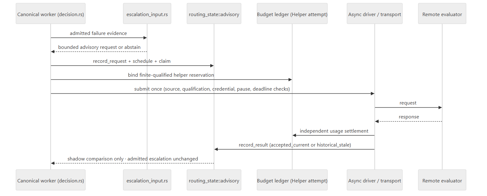
  *Sequence from admitted failure evidence through record/claim, helper reservation, single submission, settlement and result disposition, with the admitted action unchanged.*

### [PR #96](https://github.com/iokaio/vcp/pull/96) — feat(escalation): expose bounded exact-cycle evidence

- **Merged:** 2026-09-21 · **Work items:** P6-03 · **Size:** +643/−6, 9 files
- **What happened**
  - Added `routing_state/cycles.rs`: exact repetition detector over retained verification inputs and failure identities (three complete repeats, periods up to 8), resetting/abstaining on changed, incomplete, pruned or inaccessible evidence.
  - Exposed via `/optimize cycles` and the offline optimizer.
- **Why**
  - M2 requires deterministic exact-cycle evidence alongside advice; it makes no stall diagnosis and changes no routing.
- **Decisions & records:** none.
- **Evidence:** 3 algorithm tests, 2 CLI tests, both-store integration (read-only, reopen, logical purge), fast suite 9.
- **Diagram:** Not needed

### [PR #97](https://github.com/iokaio/vcp/pull/97) — feat(escalation): add frozen local statistical producer

- **Merged:** 2026-09-21 · **Work items:** P6-03 · **Size:** +860/−1, 7 files
- **What happened**
  - Added `vcp-models/src/stall.rs` (bounded second-order model) and `routing_state/local_stall.rs` producer over canonical failed-verification evidence.
  - Training counts are frozen; inference uses strictly later observations and never retrains; installation verifies parameters against retained evidence.
  - Appended history keeps a frozen model valid; changed or purged training sources invalidate it.
- **Why**
  - M2 needs a local statistical comparator to remote advice; exact-cycle facts are kept separate from the uncalibrated repeated-strategy suspicion.
- **Decisions & records:** none; no provider calls, accounting attempts or action changes.
- **Evidence:** 3 model tests, lifecycle reset test, both-store integration (append, forged-fit rejection, reopen, access, purge); fast suite 9.
- **Diagram:** Not needed

### [PR #98](https://github.com/iokaio/vcp/pull/98) — feat(escalation): integrate frozen local shadow execution

- **Merged:** 2026-09-21 · **Work items:** P6-03 · **Size:** +1163/−12, 9 files
- **What happened**
  - Added `worker/decision/local.rs`: owners explicitly fit/install/select a task-scoped model; inference runs outside the owner command loop and is revalidated before a source-linked result artifact is recorded.
  - Stable result identity prevents replay; CLI profile can select a retained fit pin independently of remote qualification.
  - Pause, steering, source change, pruning, selection change and deadlines fail closed; late results keep only historical skip metadata.
- **Why**
  - Connects the frozen local producer to the same canonical shadow lifecycle as remote advice, without provider requests or helper reservations.
- **Decisions & records:** none; M3 reporting and M4 qualification named as next.
- **Evidence:** both-store fixtures (no helper accounting, pause before/during compute, steering, reopen selection, no replay, actual purge); shared shadow regression and CLI validation.
- **Diagram:** Not needed

### [PR #99](https://github.com/iokaio/vcp/pull/99) — feat(optimize): add read-only action path forecasts

- **Merged:** 2026-09-21 · **Work items:** P6-05 (Markov M3) · **Size:** +1698/−13, 12 files
- **What happened**
  - Added `routing_state/forecasts.rs` and `/optimize forecasts` / `vcp optimize forecasts` over retained, complete canonical action episodes.
  - Historical cohorts expose transition support, expected visits/outcomes/costs, dominant loops and explicit exclusions; unknown costs remain unknown.
- **Why**
  - M3 requires inspectable forecasts with no dispatch or automatic policy change; predictions remain unqualified.
- **Decisions & records:** none; saved reports and drift/compaction diagnostics deferred to the next increment.
- **Evidence:** 2 arithmetic, 3 integration (Files/SQLite: late charges, access, reopen, purge, partial windows, sparse evidence), 2 CLI tests; fast suite 9.
- **Diagram:** Not needed

### [PR #100](https://github.com/iokaio/vcp/pull/100) — feat(optimize): retain source-linked forecasts and diagnostics

- **Merged:** 2026-09-21 · **Work items:** P6-05 (Markov M3) · **Size:** +2377/−28, 23 files
- **What happened**
  - Saved optimizer reports retain exact forecast and compaction snapshots (`forecast_reports.rs`); drift comparisons score traces under frozen baseline probabilities (`forecast_drift.rs`).
  - Compaction diagnostics (`compaction_diagnostics.rs`) require a summary linked to an actually submitted context.
  - Typed workspace source manifest (`vcp-domain/src/forecast.rs`, `vcp-store/src/forecast_contract.rs`) preserves aggregate access and selective source retention; generic aggregate artifact reads denied, specialized reads recheck every source task, hash, authority and deletion state.
- **Why**
  - Cross-task aggregate reports must not relax per-task artifact rules or resurrect purged sources; unqualified forecasts must not affect routing or budgets.
- **Decisions & records:** ADR-040 saved aggregate forecast provenance; legacy reports remain compatible.
- **Evidence:** drift/compaction unit tests, saved-report integration on both stores (selective cleanup, non-resurrection, interruption before atomic publish), 11 optimizer CLI tests.
- **Diagram:** Not needed

### [PR #101](https://github.com/iokaio/vcp/pull/101) — test(eval): qualify Markov candidates with frozen four-arm evidence

- **Merged:** 2026-09-21 · **Work items:** P6-04 (Markov M4) · **Size:** +1120/−9, 10 files
- **What happened**
  - Added frozen four-arm qualification runner (`vcp-models/examples/markov_qualification.rs`, `scripts/evals/markov-qualification.ps1`, `src/evals/markov/manifest.json`) for repeated-strategy suspicion.
  - Runs the production rules predicate and local statistical model; actual Jev and conventional OpenRouter arms recorded as not run.
  - Result (`docs/evaluations/p6-markov-qualification-result.json`) is a source-bound rejection with serving disabled.
- **Why**
  - M4 demands pre-registered evidence gates; manifest committed before evaluation, windows separated, serious abstentions counted as misses.
- **Decisions & records:** Measured rejection recorded — run fails declared evidence floors; routing cost assumptions and admission limits unchanged.
- **Evidence:** 12 escalation tests, 3 qualification tests, source/manifest/result consistency; no model calls.
- **Diagram:** Not needed

### [PR #102](https://github.com/iokaio/vcp/pull/102) — Wire P6 policy controls and capped qualification

- **Merged:** 2026-09-21 · **Work items:** P6-01–P6-05 (+ P2 provider-admission prerequisite) · **Size:** +6439/−184, 83 files
- **What happened**
  - Connected selected policy fields to real request boundaries: model/provider/group restrictions, strict pins, input/output limits (`vcp-models/src/routing/limits.rs`), qualified reasoning effort, retrieval bounds, escalation limits.
  - Added durable, evidence-bound owner complexity/capability declarations (`routing_state/declarations.rs`), consumed once and carried across same-steering requests.
  - Added frozen six-case task corpus with independent graders (`scripts/evals/p6-task-quality.cjs`), one-shot capped trial runner (`p6-live-runner.cjs`) and qualification-only probe binary `vcp-provider-conformance`.
  - Catalog now reserves conservative maxima for long-context/cache tariffs; fixed providers without tokenizer qualification reserve full input capacity. Upstream Codex patch 0034 adds conformance workspace.
- **Why**
  - Several selected policy fields never reached consumers, owner declarations had no producer, and live qualification lacked an independently graded, capped path; public endpoint inspection exposed tariff omissions.
- **Decisions & records:** Legacy absent-field policy encodings kept stable; live probe under $1 cap (of $25 authorized) returned HTTP 401 — $0.201640 retained as unresolved liability; P6 remains in progress.
- **Evidence:** models 74, CLI 64, routing-state 40 tests; native provider/routing checks on both stores (16 MiB test stack); fast suite 11; patch 0034 round-tripped over 7,939 retained files.
- **Diagram:** Not needed

### [PR #103](https://github.com/iokaio/vcp/pull/103) — Fix optional provider parameters and record P6 live retries

- **Merged:** 2026-09-21 · **Work items:** P6-01 (+ P2 provider-encoding prerequisite) · **Size:** +164/−7, 8 files
- **What happened**
  - Encoder (`vcp-models/src/request.rs`) sends `parallel_tool_calls` only when included in catalog-validated compatibility requirements; single-echo probe omits it and preflights tools/tool_choice/max_tokens.
  - Fresh capped probes passed tool-call and text-continuation checks for Claude 3 Haiku/Bedrock and Claude Haiku 4.5/Anthropic via OpenRouter; report `p6-live-provider-retry.md` keeps failed attempts and liabilities.
- **Why**
  - Authenticated retry failed OpenRouter's parameter filter because VCP unconditionally sent an unadvertised optional field.
- **Decisions & records:** Provider and byte-bound qualification stay false — responses omitted exact served-provider identity.
- **Evidence:** 75 model tests, local conformance peer test, two live two-request probes; six cumulative requests: $0.002055 settled plus $0.403280 unknown liability.
- **Diagram:** Not needed

### [PR #104](https://github.com/iokaio/vcp/pull/104) — Complete P6 qualification with measured rejection and bounded admission

- **Merged:** 2026-09-21 · **Work items:** P6-01–P6-05 · **Size:** +7596/−205, 65 files
- **What happened**
  - Exact provider attribution (`vcp-models/src/catalog/attribution.rs`) joining OpenRouter generation receipts to a unique catalog endpoint; offline requalification command (`bin/conformance/qualify.rs`).
  - Routing may use an explicitly unqualified byte estimate only when admission reserves full input capacity plus output/request maxima; native evaluator probes bounded (`decision/native_bound.rs`).
  - Read-only tasks get an observed integrity verification before completion (`worker/verification.rs`).
  - Frozen v2/v3 task corpora, profile/decision comparison and optimizer-evidence scripts; 36-task campaign run.
- **Why**
  - Remaining qualification needed exact provider evidence, conservative routed reservations and an auditable comparison; completes P6 via the plan's measured, rejected-candidate outcome.
- **Decisions & records:** ADR-041 provider evidence and conservative routing (supersedes fixed-provider-only fallback). Actual Jev and conventional evaluator measured and rejected; automatic defaults and remote advice stay disabled; all 18 routed slots not run; M7 deferred; P7/P8 remain release gates.
- **Evidence:** 36 fixed tasks (1 pass/35 fail, mostly strict answer format); 93 settled attempts $0.188138; total P6 spend $0.367683 settled + $0.403280 unresolved within $60 cap; models 78, lifecycle 76, routing-state 40 tests.
- **Diagram:** Not needed

## Era 9 — P7 developer workflows and visible child delegation (#105–#116)

Bundled skills were activated in runs, and developer workflows passed live generation acceptance after failed trials were kept on record. Bounded child delegation arrived with isolated worktrees, brokered three-way integration, deliberate cleanup and scoped stop isolation. Cursor and Claude Code research was kept but explicitly not adopted wholesale (#107, #109). The first P8 distribution candidate (#114) also landed in this window.

### [PR #105](https://github.com/iokaio/vcp/pull/105) — P7-02: activate bundled skills in runs and record qualification evidence

- **Merged:** 2026-09-21 · **Work items:** P7-02 · **Size:** +787/−1, 13 files
- **What happened**
  - Added repeatable `run --skill` (`vcp-cli/src/args.rs`, `app/execute.rs`) with bounded ID validation; unknown selections stop before provider dispatch.
  - Added one-shot paired live evaluation runner (`scripts/evals/builtin-live-runner.cjs`) with immutable inputs, explicit aggregate spend authorization, skill-context/cost checks and independent quality review.
  - Added native toolchain qualification script and report (`docs/evaluations/p7-02-native-toolchains.md`).
- **Why**
  - Noninteractive evaluation could not select a bundled skill before the first model request.
- **Decisions & records:** none; P7-02 remains in progress (live usefulness/generation open).
- **Evidence:** native fixtures 6 passed, 1 expected seeded failure, 35 not run; CLI contracts 8/8, executable activation 2/2; MSVC/CMake/Ninja C++ CTest passed; no paid calls.
- **Diagram:** Not needed

### [PR #106](https://github.com/iokaio/vcp/pull/106) — Add bounded child delegation and brokered result integration

- **Merged:** 2026-09-21 · **Work items:** P7-04, P7-05, P7-06 · **Size:** +11255/−45, 64 files
- **What happened**
  - Canonical child graph: `vcp-domain/src/agents.rs`, `vcp-engine/src/agents.rs` (`CreateChild` admission, dependency checks), `vcp-store/src/agents_contract.rs`; child reservations subdivide the shared root ledger.
  - `vcp-repository`: dirty Git/non-Git snapshots (`dirty_snapshot.rs`), registered isolated worktrees with native ownership checks (`worktree.rs`), three-way integration planning (`merge.rs`).
  - Lifecycle workers `agents_*.rs` for setup, delegation, owner controls, held recovery and integration through the parent file broker with integration receipts (`vcp-tools/src/integration.rs`).
  - Terminal/JSONL child controls (`vcp-cli/src/delegation.rs`, `agents_view.rs`); upstream patch 0035 for merge workspace.
- **Why**
  - Owners need bounded, inspectable, pausable child tasks whose changes integrate conflict-aware without silent shared writes; a child result must never substitute for verification of the integrated parent.
- **Decisions & records:** Child process execution blocked without qualified filesystem enforcement; no worktree deletion; stale coding fixture fixed to qualify the parallel-call capability it asserts.
- **Evidence:** both-store tests incl. native partial-write failure, concurrent human edits, cancellation during copying, abandoned startup, exact-model enforcement, shared budgets, PTY delegation/pause; interrupted broad host suite not claimed as passing.
- **Diagram:** Yes — 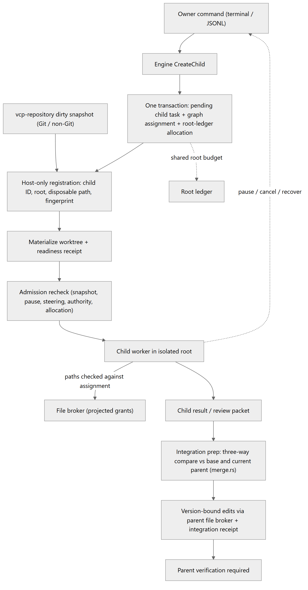
  *Shows child admission in one transaction, snapshot registration and materialization, brokered child execution, and integration back into the parent with required parent verification.*

### [PR #107](https://github.com/iokaio/vcp/pull/107) — Preserve Cursor research and proposed follow-up sequence

- **Merged:** 2026-09-21 · **Work items:** docs · **Size:** +1467/−0, 3 files
- **What happened**
  - Added `docs/research/cursor.md` and `docs/plan/22-cursor-improvements.md` with a reading-map pointer in `docs/plan/README.md`.
  - Corrected two source observations (packaged review/debug skill, existing Git metadata guards) and separated the historical research baseline from current P7 progress.
- **Why**
  - Keep competitive research and a proposed integration sequence in version control.
- **Decisions & records:** Proposals explicitly unadopted — no runtime change, task-graph edge or release prerequisite.
- **Evidence:** documentation link/anchor and task-graph checks passed.
- **Diagram:** Not needed

### [PR #108](https://github.com/iokaio/vcp/pull/108) — Retain P7-02 SQL and generation qualification follow-ups

- **Merged:** 2026-09-21 · **Work items:** P7-02 · **Size:** +647/−6, 19 files
- **What happened**
  - Added in-memory SQLite migration checks (`scripts/evals/builtin-toolchain-sql.cjs`).
  - Added frozen cart-generation cohort (`src/evals/skills/builtin/generation-v1/`) with paired preparation, cost-bound runner, independent oracle and qualification-only Rust launcher; generation contracts registered in the fast gate.
  - Removed generated .NET fixture `obj` directories and ignored future `bin/obj` output.
- **Why**
  - Finish uncommitted P7-02 evaluation follow-ups and clean generated artifacts.
- **Decisions & records:** Launcher build provenance recorded as `owner_supplied_unverified`; Node permission controls noted as not an adversarial sandbox.
- **Evidence:** 14 fast-gate stages pass; SQL 5/5 and generation 5/5 on pinned Node 26.9.0 (runtime-specific case skips on Node 24); no live calls.
- **Diagram:** Not needed

### [PR #109](https://github.com/iokaio/vcp/pull/109) — docs: align developer workflow improvements with remaining P7/P8 work

- **Merged:** 2026-09-21 · **Work items:** docs (P7-02/04/05/06, P8 scope alignment) · **Size:** +1531/−591, 9 files
- **What happened**
  - Rewrote `docs/plan/22-cursor-improvements.md` and added `docs/plan/23-claudecode-improvements.md`, checking both against current source and evidence.
  - Selected a bounded set of developer workflows: bounded search and ranged reads, simple read-only helpers, worktree readiness and deliberate cleanup, evidence-backed review/debug guidance, trusted long foreground checks, and correct Windows output.
  - Linked each selected item from its owning task section (plans 13, 14, 15, 21), the traceability ledger and the plan index. Added the supplied Claude Code research as `docs/research/claudecode.md` without changes.
- **Why**
  - The Cursor and Claude Code drafts gave broad new feature work to foundations that were already complete, and overstated how complete delegation was. Improvements had to fit inside still-open tasks instead of reopening closed ones.
- **Decisions & records:** Deferred larger indexes, rewind/queue/plan systems, background processes, cache optimization and additional orchestration; deferred candidates do not become release requirements. All 68 task IDs and the 56-task release closure are preserved.
- **Evidence:** The repository contract passed (364 Markdown files, 2,154 links), the fast suite passed 14/14, and the research files kept their original SHA-256 hashes.
- **Diagram:** Not needed

### [PR #110](https://github.com/iokaio/vcp/pull/110) — P7-02: bounded developer workflows and qualification controls

- **Merged:** 2026-09-21 · **Work items:** P7-02 · **Size:** +3391/−168, 77 files
- **What happened**
  - `vcp-tools`: added bounded regex/path search and one-based ranged reads with byte ceilings (`read.rs`), trusted foreground check durations beyond 120 s, and explicit UTF-8/UTF-16LE output presentation (`process/output.rs`).
  - Updated the built-in architecture, review-debug and testing skills to use these contracts while keeping source evidence, raw process outcomes and missing-check status.
  - Broker cancellation/revalidation, native Windows long-check and reopen coverage on both stores (`long_verification.rs`, `process_broker.rs`), plus frozen debug/generation eval runners and continuation controls under `scripts/evals/`.
  - The existing `regex` dependency is now used by `vcp-tools`, recorded through the reconstructed Codex lockfile patch `0036-p7-navigation-workspace.patch`.
  - `vcp-models/stream.rs`: keeps valid final usage (accounting) when patch arguments end in terminal placeholders or completed tool arguments fail schema validation. Rejected calls stay non-executable.
- **Why**
  - P7-02 needed practical coding workflows that stay inside VCP's bounded, auditable tool contracts.
  - An owner-approved live trial (18 attempts, $45 cap) failed. It exposed lost accounting evidence on malformed tool calls and unclear read-range errors.
- **Decisions & records:** No new dependency (only a lockfile edge through patch 36). Failed live evidence is kept in `docs/evaluations/p7-02-live-attempt.md`: 10 cases failed and 8 were not run, $0.806560 of liability is unresolved, and no case was retried. P7-02 remains in progress.
- **Evidence:** Unit, contract and native tests passed (67 CLI unit tests, 42 frozen skill cases, 20 no-call qualification controls), and the native coding matrix passed on both stores with reopen. Both live generation arms passed only 6/44 oracle checks.
- **Diagram:** Not needed

### [PR #111](https://github.com/iokaio/vcp/pull/111) — docs: add Ioka Discord invitation to README

- **Merged:** 2026-09-21 · **Work items:** repository maintenance · **Size:** +2/−0, 1 file
- **What happened**
  - Added the owner-supplied Ioka Discord invite under "Contributing and community" in `README.md`.
- **Why**
  - The owner asked for a community discussion channel link in the README.
- **Decisions & records:** none
- **Evidence:** The repository suite and `git diff --check` passed.
- **Diagram:** Not needed

### [PR #112](https://github.com/iokaio/vcp/pull/112) — P7-02: complete workflow and live generation acceptance

- **Merged:** 2026-09-22 · **Work items:** P7-02 · **Size:** +1894/−67, 44 files
- **What happened**
  - Clarified tool and profile guidance in the built-in skills (`javascript-typescript`), and added verification of the embedded skill catalog's identity so stale packaged assets are detected.
  - The CLI's 4,096-token output ceiling is now enforced during request preparation.
  - `vcp-models/stream.rs` now accepts a completed response whose last HTTP chunk ends in an optional `[DONE]`-sentinel prefix, and only for the retained client's validated terminal prefix. General EOF parsing still rejects contradictory bytes.
  - Added a debug-v2 eval, a toolchain qualification script, and the completion report `docs/evaluations/p7-02-completion.md`.
- **Why**
  - Live trials failed on missing tool guidance, inexact generated arithmetic, stale packaged assets and a spurious stream rejection. Fixing these was needed to close the P7-02 generation gate honestly.
- **Decisions & records:** The workflow gate was closed through independent offline review. No statistical superiority of the skill and no general toolchain support are claimed. The earlier $0.806560 liability stays separately unresolved.
- **Evidence:** In the corrected Luna run, the baseline and skill arms both passed 44/44 oracle checks ($0.024136). Qwen Next scored 43/44 baseline and 44/44 with the skill; Qwen 30B failed. 20 provider regressions and the fast suite passed.
- **Diagram:** Not needed

### [PR #113](https://github.com/iokaio/vcp/pull/113) — Implement bounded child delegation, cleanup and recoverable terminal controls

- **Merged:** 2026-09-22 · **Work items:** P7-04, P7-05, P7-06 · **Size:** +6504/−161, 56 files
- **What happened**
  - Child work now carries explicit workspace ownership, bounded read-only helper defaults, revision-bound structured review findings (`vcp-repository/review_findings.rs`) and integration evidence (`agents_integration.rs`, `merge.rs`).
  - Deliberate cleanup (`vcp-repository/cleanup.rs`, `worker/agents_cleanup.rs`) with cleanup receipts. Transitive workspace dependencies block deleting a child root too early.
  - Terminal controls (`vcp-cli/terminal`, `agents_view.rs`) keep child status, history and uncertain costs across pause and owner loss.
  - Race fix: a late provider callback against an already durably aborted capture is ignored only for the exact uncertain, reconciliation-pending attempt, and only after both the writer and the parser are gone. Real capture failures still fence admission.
  - Qualification runners (`delegation-terminal-runner.cjs`, `delegation-live-runner.cjs`, live adapter example) freeze synthetic inputs, bound execution, keep every failed attempt and validate current-parent results.
- **Why**
  - Visible delegation required child workspaces to be safely removable and auditable without deleting state that other work still depends on.
  - An actual provider interruption exposed the callback/abort race.
- **Decisions & records:** Formal review-usefulness and the broader interruption/consumer-loss schedule were left open. Canonical unknown charges stay reserved. See `docs/development/p7-child-workspaces.md`.
- **Evidence:** 7/7 rebuilt CLI terminal cases and the fast suite (17/17) passed. Live Luna generation passed 44/44 while preserving a dirty workspace and a concurrent human edit. Both Luna review arms failed the usefulness gate, and Qwen hit HTTP 429 and its request limit.
- **Diagram:** Yes — 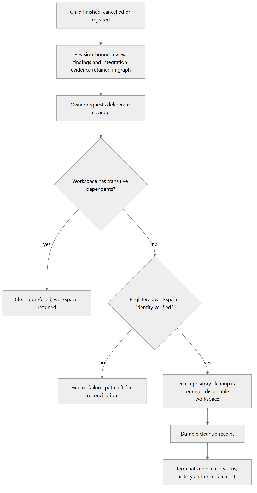
  *Shows how finished child work moves to deliberate cleanup, with refusal when dependents exist, identity checks, and a durable cleanup receipt.*

### [PR #114](https://github.com/iokaio/vcp/pull/114) — Add Windows distribution candidate and native recovery qualification

- **Merged:** 2026-09-22 · **Work items:** P8-01, P8-02, P8-03, P8-04 · **Size:** +2151/−9, 20 files
- **What happened**
  - Packaging scripts: `package.ps1`, `package-inventory.cjs` (exact payload inventory), `package-models.ps1` (explicit model provisioning) and recorded build provenance. Together they produce an unsigned Windows ZIP candidate.
  - Standalone installer `package-install.ps1` handles install, upgrade, rollback and uninstall while preserving workspace, history, keys and vault data. It rejects unowned or redirected roots, incompatible formats, unexpected payloads and persistent locks. An interrupted install or upgrade leaves bounded, recoverable state.
  - Executable qualification matrix (`p8-qualification-manifest.json`, `p8-qualification-runner.cjs`).
  - A both-store cleanup supervisor test (`child_cleanup_receipt_fault.rs`) kills a real process after removal but before the receipt is published, then checks that recovery keeps the canonical intent and history.
- **Why**
  - P8 release qualification needed a real distributable artifact and a native recovery/history matrix instead of source-tree testing.
- **Decisions & records:** Partial qualification only: no signing, no cross-format migration and no publication. Independent second-machine encrypted recovery was kept as a required, not-run gap. Documented in `docs/development/p8-distribution.md`.
- **Evidence:** The native matrix had 21 passed, 0 failed and 1 not run. The ZIP installed into Unicode paths containing spaces, and uninstall left all four data sentinels unchanged. CPU embedding reference cases took 5.5–5.9 s.
- **Diagram:** Yes — 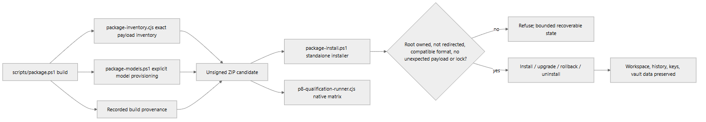
  *Shows the packaging pipeline (inventory, models, provenance), the ZIP candidate, the installer's refusal guards and its data-preserving lifecycle.*

### [PR #115](https://github.com/iokaio/vcp/pull/115) — fix(p7-05): correct review grading and bound reasoning model runs

- **Merged:** 2026-09-22 · **Work items:** P7-05 · **Size:** +873/−49, 24 files
- **What happened**
  - The review grader now resolves evidence references against retained bytes, task scope and source revision. It reports detected, qualified, unqualified, duplicate and false-positive findings separately.
  - Shared production review guidance and child guidance now cover source causality, complete contract validation, fixed request budgets and unavailable checks. Review output must be plain JSON with numeric reproductions.
  - Trusted profiles (`vcp-cli/settings.rs`) accept explicit total output up to 16,384 tokens and provider response timeouts up to 360 s. Defaults stay at 4,096 tokens and 120 s. Added provider-timeout and retry regressions (`provider_retries.rs`).
- **Why**
  - The grader rejected valid opaque evidence IDs and punctuated citations, and counted incomplete evidence as false positives.
  - Qwen 3.8's reasoning output used up the token allowance, and review responses exceeded the timeout.
- **Decisions & records:** Provider capacity, deadline clamping, accounting, strict tool validation and the zero-retry evaluation policy stay enforced. Historical-annotation compatibility is opt-in, for offline regrading only. P7-05 stays in progress.
- **Evidence:** Luna and Qwen 3.8 review pairs both found 2/2 defects with zero false positives. Generation passed 44/44 for both. The final pair cost $0.246186; the campaign total is $1.247562 settled plus $34.13 reserved within a $100 cap.
- **Diagram:** Not needed

### [PR #116](https://github.com/iokaio/vcp/pull/116) — fix(p7): isolate child stops and qualify delegation recovery

- **Merged:** 2026-09-22 · **Work items:** P7-04, P7-05, P7-06 · **Size:** +3420/−100, 25 files
- **What happened**
  - Pausing or cancelling one child stays local only when live ownership, the independent runtime hold and canonical child/root state all agree. The full unknown request liability is kept. Unexpected disconnects and owner loss still pause the root.
  - New qualification suites for budget races, graph dispatch and siblings, native write crashes between writes and receipts, integration pause/cancel schedules, stale-result recovery, and noisy/quiet child output loss on both stores (`child_budget_race.rs`, `child_graph_dispatch.rs`, `child_write_crash.rs`, `child_output_owner.rs`).
  - Added the frozen CR-03 exploration comparison (`delegation-exploration.cjs`) with canonical citation and token accounting.
- **Why**
  - Stopping one child also paused its root, which blocked unrelated siblings.
  - P7-04/05/06 needed connected fault-schedule evidence to be completed.
- **Decisions & records:** Both corrected V2 exploration arms passed, but the simpler baseline is still preferred: the helper added cost and latency with no usefulness gain. Arbitrary child process execution still requires a qualified filesystem sandbox. The owner directed local-only validation and skipped machine handoff.
- **Evidence:** The Windows delegation matrix passed all 7 stages (259 tests, 7 ignored). The broader host run had 141 passes and 2 fixture failures; these were fixed and rerun, and the original failures are kept on record.
- **Diagram:** Yes — 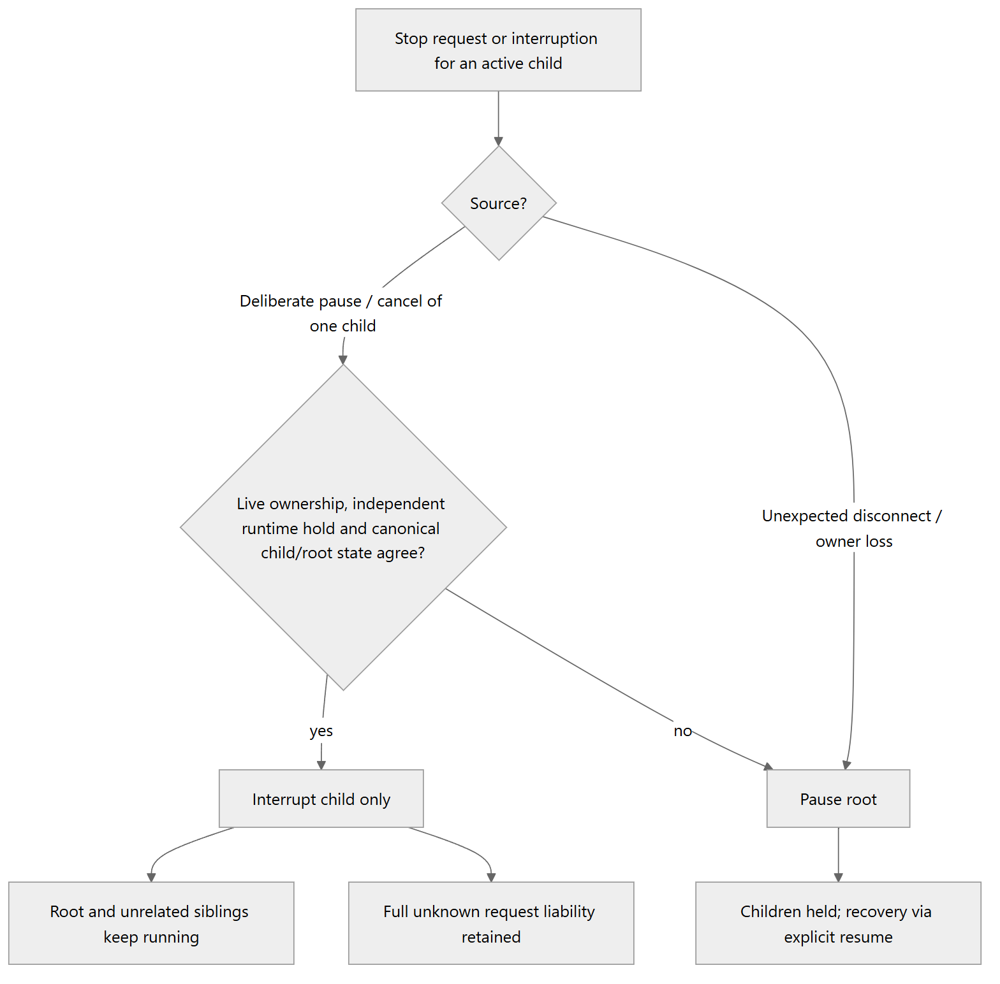
  *Shows when a child pause or cancel stays local and when it falls back to pausing the root.*

## Era 10 — P8 package, recovery and release qualification, and owner-directed closure (#117–#133)

A production Windows package was frozen and qualified: recovery gaps, sensitive surfaces, seeded boundary traces, memory and optimizer state across restore, and capped paid owner campaigns. Defects were fixed as they surfaced. Some acceptance remained unmet or not run, and the owner directed closing P8 anyway to unblock P9 (ADR-042). Failed and unrun evidence was left as it was.

### [PR #117](https://github.com/iokaio/vcp/pull/117) — fix(p8): qualify local Windows package and upstream maintenance

- **Merged:** 2026-09-22 · **Work items:** P8-01–P8-04 (partial), P8-06 · **Size:** +3392/−491, 105 files
- **What happened**
  - Native launch (`vcp-lifecycle/process/launch.rs`) suppresses Windows critical-error dialogs in a thread-local scope that restores the previous setting, so malformed executables no longer block on an OS dialog.
  - MCP credentials (`vcp-cli/mcp.rs`) are validated once before task acceptance and kept in memory only until installation, so configuration diagnostics are no longer lost.
  - Exact-package tests for retained oversized output, independent encrypted snapshot validation with local cross-backend restore, long foreground check and pause, and MCP setup diagnostics (`packaged_*.rs`).
  - Fixed Git path normalization in `package.ps1`.
  - P8-06: an independently reconstructed Codex upstream update across `src/third_party/codex` (sandbox, exec and config areas), with all 36 existing patches unchanged and boundaries updated.
- **Why**
  - Native qualification found the two Windows CLI defects. P8-06 required a rehearsed upstream maintenance cycle.
- **Decisions & records:** Only P8-06 closes; P8-01 through P8-05 stay open. Two matrix rows without complete receipts, and an MCP case without an exit receipt, are not counted as passes. Reports: `p8-local-qualification-2026-09-22.md`, `p8-upstream-maintenance-2026-09-22.md`.
- **Evidence:** 17 fast groups, 5 new packaged regressions, final-ZIP install/uninstall and 44 recorded native matrix rows.
- **Diagram:** Not needed

### [PR #118](https://github.com/iokaio/vcp/pull/118) — docs(p8): close local receipts and prepare release acceptance

- **Merged:** 2026-09-22 · **Work items:** P8-01–P8-05 · **Size:** +490/−1, 7 files
- **What happened**
  - Reran the two native cases that lacked receipts (both passed, 72.7 s). A new aggregate joins 46 passing executable cases and keeps the owner-skipped independent-machine case as not run.
  - Added an acceptance-gap reconciliation for P8-01–04, a P8-05 release scorecard mapping all 56 first-release tasks and FR/I/U dispositions to evidence, and an owner acceptance packet with an uncompleted form.
- **Why**
  - Release acceptance needed a single evidence-to-requirement view and an actionable owner packet.
- **Decisions & records:** P8-05 moves to in progress. Missing owner thresholds are called out explicitly.
- **Evidence:** Both native cases exited 0 with verified hashes. The repository contract passed (384 Markdown files, 2,270 links).
- **Diagram:** Not needed

### [PR #119](https://github.com/iokaio/vcp/pull/119) — test(p8): qualify bounded local recovery gaps

- **Merged:** 2026-09-22 · **Work items:** P8-02 · **Size:** +1161/−29, 10 files
- **What happened**
  - Added six competing-root restore scenarios in `restore_crash.rs`: durable barrier/kill observations, timestamp inversion, invalid-candidate refusal, exact retry and guarded child cleanup.
  - Real SQLite `SQLITE_FULL` triggered through a page ceiling, plus test-only Files short-write boundaries (`vcp-store/disk_exhaustion_tests.rs`). These check writer fencing, preservation of acknowledged state, quarantined tails and exactly-once retry.
  - Damaged lexical generations are rebuilt with identical ranked hits on reopen, while damaged canonical data is refused on both stores (`vcp-memory/tests/publication.rs`).
- **Why**
  - Existing receipts did not cover interrupted restore activation with an existing predecessor, capacity errors, or corruption on a fresh reopen.
- **Decisions & records:** Disk exhaustion is injected or bounded, not a physically full volume, and that gap stays explicit. A boundary map (`p8-local-recovery-boundary-map-2026-09-22.md`) was written first so only the missing cases were added.
- **Evidence:** 4 targeted Rust tests across 13 fault scenarios, each run under a 600 s deadline. The fast suite passed.
- **Diagram:** Not needed

### [PR #120](https://github.com/iokaio/vcp/pull/120) — P8-02/P8-03: qualify local recovery and fix MCP reopen fencing

- **Merged:** 2026-09-23 · **Work items:** P8-02, P8-03 · **Size:** +4711/−27, 32 files
- **What happened**
  - Fix: at startup, the owner now accepts the exact verified, acknowledged partial process-output descriptor left by an MCP disconnect. Pending, failed, orphaned and provider captures stay fenced (`worker.rs`, `acknowledged_partial_capture.rs`).
  - 40 selected process-kill cases (MCP, model dispatch), capacity faults, offline divergence, hostile native/MCP content (`content_authority.rs`), and a real interrupted cloud hydration followed by an exact-package restore.
  - Security and history checks: generated credentials and keys are excluded from captured and exported surfaces, age/signature verification is independent, and packaged MCP compaction, fresh-owner identity/access and purge were checked on both stores.
- **Why**
  - After an MCP disconnect, the next owner treated canonically acknowledged partial output as an unresolved capture and fenced every new task.
- **Decisions & records:** Added a sensitive-surface map (`p8-sensitive-surface-map-2026-09-22.md`). The candidate stays an unsigned debug build, and physical full-volume exhaustion and production lifecycle remain open.
- **Evidence:** Focused native regressions, exact-package receipts and 17 fast groups passed.
- **Diagram:** Not needed

### [PR #121](https://github.com/iokaio/vcp/pull/121) — P8-01/P8-04: freeze production candidate and record bounded qualification

- **Merged:** 2026-09-23 · **Work items:** P8-01, P8-04 (P8-05 fixture prep) · **Size:** +2633/−2, 61 files
- **What happened**
  - Added `scripts/build-production.ps1` to freeze an optimized Windows production executable and unsigned package.
  - Reusable production runners for startup, distribution, recovery and interactive qualification, plus an envelope verifier.
  - Added the synthetic owner-acceptance fixture set `src/evals/release/p8-owner-v3` (U01–U03 workspaces, hidden truth/oracles, a restricted page-check launcher) and a threshold proposal.
- **Why**
  - Earlier P8 evidence came from debug builds. Release claims need artifact-specific results from the production binary.
- **Decisions & records:** No production Rust changes. A newly found defect was recorded: a fresh restore to a nonexistent destination with no declared sync roots fails before authentication. Retained-history startup was slow. Automatic approval review rejected the paid interactive launch.
- **Evidence:** 24/24 startup checks (about 36 s inspect and about 70 s history listing at 785 commits), 16 distribution commands with 32 assertions, and 70 recovery steps on both stores. Fixture oracle: reference 37/37, incomplete baseline 9/37.
- **Diagram:** Not needed

### [PR #122](https://github.com/iokaio/vcp/pull/122) — P8: fix fresh restore and startup latency; record qualification results

- **Merged:** 2026-09-23 · **Work items:** P8-01–P8-05 · **Size:** +2258/−107, 28 files
- **What happened**
  - Fixed fresh restore without configured sync roots (`vcp-cli/restore.rs`) while keeping staging and explicit sync exclusions.
  - Startup latency: serialized state sizes are counted without building a second JSON tree, decoded records are borrowed, and one history store owner is shared across queries and retention notices (`vcp-store/contract.rs`, `vcp-cli/app.rs`).
  - Rebuilt the production artifact. Added owner runner, integration and state-oracle supervisors (`scripts/evals/p805-*`), a v2 page-check launcher, and a repair to the interactive PTY framing and closed-pipe handling.
- **Why**
  - These fix the two defects PR #121 found and let the paid owner campaign run against a qualified artifact.
- **Decisions & records:** Automated checks are not treated as owner acceptance. Of six paid owner tasks ($1.197932), three completed and three paused at the 16-request cap. The first interactive trial failed on harness framing, and its $16 reservation is held as unknown.
- **Evidence:** At 785 commits, inspect dropped from about 36 s to 13 s and history listing from about 70 s to 13 s on both stores. `vcp-store` 76 tests passed. Exact package: 74 recovery steps passed.
- **Diagram:** Not needed

### [PR #123](https://github.com/iokaio/vcp/pull/123) — docs: expand VS Code extension UI design and correct mocks

- **Merged:** 2026-09-23 · **Work items:** docs (P4 design) · **Size:** +4241/−0, 55 files
- **What happened**
  - Added `docs/design/requirements.md` (about 1,100 lines), a P4 construction contract covering native vs webview placement, SDK capability gates, reconnect and command reconciliation, responsive layout, accessibility, editor-buffer races, evidence retention and acceptance tests.
  - Added 13 HTML/PNG UI mocks (overview, session states, agents, receipts, inspector, memory/history, optimize, delegate/cleanup, status bar). Twelve approved corrections use canonical names, and superseded versions are kept with `-draft` suffixes.
- **Why**
  - P4 needed a concrete UI contract before implementation, and several earlier mocks needed corrections.
- **Decisions & records:** Documentation and static mocks only; no extension behavior. Requirements section 14 explains each mock correction.
- **Evidence:** Visual inspection of the rendered mocks, 25 PNG/source pairs verified, and the repository contract passed (402 Markdown files, 2,402 links).
- **Diagram:** Not needed

### [PR #124](https://github.com/iokaio/vcp/pull/124) — Connect production local memory build/query and advance P8 qualification

- **Merged:** 2026-09-23 · **Work items:** P8 (P5 memory path in production) · **Size:** +2548/−50, 25 files
- **What happened**
  - Added `vcp memory build --assets` and `vcp memory query --assets` (`vcp-cli/memory.rs`, `args.rs`), backed by a narrow, exclusive local-memory owner (`vcp-lifecycle/foundation/local_memory.rs`). They keep paused tasks paused, need no provider profile and retain resource observations. `memory search` stays read-only.
  - Both-store production tests (`memory_local.rs`, `memory_optimizer.rs`): real-model publication/reopen, finite ANN vs exact distances, cross-workspace isolation, retention invalidation, and optimizer/stale-preview interaction.
  - Owner-campaign preparation now binds the qualified v2 launcher without authorizing spending. The Markov ledger records M5/M6/M8 deferrals and the remaining partial scope of M9.
- **Why**
  - Production CLI could provision embedding assets but could not build vector generations or embed a query.
- **Decisions & records:** The production AppContainer offline observation failed because its token cannot open ancestor-directory handles required by the repository guard. The product check was not relaxed, and the failure is recorded. P9 keeps its P8-05 prerequisite.
- **Evidence:** Native and real-model memory tests passed on both stores with the optimized executable, and 17 fast groups passed.
- **Diagram:** Not needed

### [PR #125](https://github.com/iokaio/vcp/pull/125) — Qualify seeded P8 controller, retention and accounting traces

- **Merged:** 2026-09-23 · **Work items:** P8 (Markov M9) · **Size:** +1707/−4, 9 files
- **What happened**
  - Fixed-seed campaigns against real APIs on Files and SQLite, each with its own state, visibility and arithmetic oracles, replayable failing prefixes and exact coverage counts: `seeded_traces.rs` (controller), `vcp-memory/tests/seeded_retention.rs`, and `vcp-budget/tests/seeded_accounting.rs`.
  - Added 3 manifest rows to `p8-qualification-manifest.json`.
- **Why**
  - M9 had numerical seeds but no generated boundary traces for the controller, retention or accounting.
- **Decisions & records:** Tests and evidence only. Provider, fork and process-kill traces stay separate M9 scope, and the matrix remains incomplete (47 rows not run).
- **Evidence:** 624 controller actions, 224 retention operations with 8 authenticated cross-backend restores, and 534 budget operations across 48 episodes. Late charges were neither lost nor double-counted.
- **Diagram:** Not needed

### [PR #126](https://github.com/iokaio/vcp/pull/126) — Qualify seeded provider and child recovery boundaries

- **Merged:** 2026-09-23 · **Work items:** P8 (Markov M9) · **Size:** +1909/−3, 10 files
- **What happened**
  - Three bounded native suites (`seeded_provider.rs`, `seeded_child_graph.rs`) with independent wire, identity, scope and liability oracles: provider retry turns, retry-pause/reopen traces and child graph operations on both stores.
  - Recovery checks separate held attachments from unfinished-capture startup fences.
- **Why**
  - P8/M9 lacked seeded evidence for provider retry and child recovery.
- **Decisions & records:** No production code changes and no paid calls. Exploratory fixture failures and their contract-based corrections are kept. The matrix has 3 passed and 50 unselected.
- **Evidence:** 128 provider turns (252 requests), 8 retry-pause/reopen traces (58 requests) and 160 child operations passed, with identical source hashes before and after.
- **Diagram:** Not needed

### [PR #127](https://github.com/iokaio/vcp/pull/127) — Qualify packaged memory and optimizer state across restore

- **Merged:** 2026-09-23 · **Work items:** P8 · **Size:** +996/−0, 6 files
- **What happened**
  - An ignored native test (`memory_restore.rs`) and a hash-bound runner (`p8-memory-restore.ps1`) use the extracted production executable and real MiniLM assets, restoring Files→SQLite and SQLite→Files.
- **Why**
  - No current-package scenario combined governed memory, optimizer state, exclusions and authenticated restore.
- **Decisions & records:** Restore keeps historical memory, evidence, exclusions, optimizer answers and receipts, but resets authority and policy. Search correctly suppresses claims tied to the old physical repository binding: applicability is not transferred automatically, and inventory diagnostics explain why.
- **Evidence:** Both directions passed in 12.11 s, runner controls passed 6/6, and the fast suite passed.
- **Diagram:** Not needed

### [PR #128](https://github.com/iokaio/vcp/pull/128) — P8: qualify approved campaign and fix verification evidence lookup

- **Merged:** 2026-09-23 · **Work items:** P8-05 · **Size:** +225/−12, 5 files
- **What happened**
  - The owner runner now reads verification evidence from the context view instead of the outputs view. A regression test covers stale and tampered evidence.
  - Recorded the approved six-task campaign, a one-shot live pause/resume observation, and current-package distribution checks (`p8-approved-campaign-2026-09-23.md`).
- **Why**
  - The runner wrongly rejected a completed generation task because it looked for evidence in the wrong view.
- **Decisions & records:** The original failed result and the frozen runner are kept. No paid retries. Interactive billing stays unknown with $16 reserved.
- **Evidence:** Owner-runner tests passed 12/12. Both generation outputs passed 37/37 supplemental checks. Two owner attempts passed formal controls, three paused at the request cap and one hit the validator defect.
- **Diagram:** Not needed

### [PR #129](https://github.com/iokaio/vcp/pull/129) — P6-03/P2-08: expose remaining shared-root request allowance

- **Merged:** 2026-09-23 · **Work items:** P6-03, P2-08 · **Size:** +293/−22, 6 files
- **What happened**
  - New `worker/coding/request_allowance.rs` adds a captured, refreshed observation of the shared-root remaining request allowance to the coding context. It also adds guidance to batch independent tools, keep searches bounded and leave room for a final answer.
  - Reuses the existing admission calculation: every canonical root attempt counts, including children and retries, and the minimum configured limit stays authoritative.
- **Why**
  - Owner-campaign tasks paused at the 16-request cap because models never saw how many requests remained.
- **Decisions & records:** The observation includes the receiving request and grants no permission. Caps, retry policy, deadlines and completion requirements are unchanged. No live improvement is claimed.
- **Evidence:** 4 focused native tests passed on both stores, covering HTTP context and provenance, retry with unresolved predecessor liability, reopen, and refusal from an exhausted root.
- **Diagram:** Not needed

### [PR #130](https://github.com/iokaio/vcp/pull/130) — P8: record corrected production candidate and install checks

- **Merged:** 2026-09-23 · **Work items:** P8-01, P8-05 · **Size:** +82/−2, 3 files
- **What happened**
  - Recorded the production package that includes the request-allowance fix, with exact source, executable, ZIP and receipt hashes (`p8-allowance-package-2026-09-23.md`).
  - Prepared six new owner fixtures without calls or reservations.
- **Why**
  - Paid results must stay tied to the executable they ran on. The corrected build needed its own identity and smoke evidence.
- **Decisions & records:** Earlier paid results stay attached to their original executable. P8 counts and the P9 prerequisite are unchanged.
- **Evidence:** The native release build had stable inputs. The fresh-install smoke test (help, version, diagnostics, missing-profile refusal) passed and all data sentinels were preserved.
- **Diagram:** Not needed

### [PR #131](https://github.com/iokaio/vcp/pull/131) — P8: prepare exact one-shot profile renewal with budget guards

- **Merged:** 2026-09-23 · **Work items:** P8-05 · **Size:** +262/−1, 4 files
- **What happened**
  - New `scripts/evals/p8-profile-renewal.cjs` validate/run coordinator for a reviewed two-request, no-retry, $12 probe. It binds the executable, spec, catalog, helper code and campaign snapshot.
  - Reserves under the existing $100 ceiling before dispatch, prevents replay, keeps unknown and unreaped liabilities, and joins the canonical ledger, attempts and reservations before settling. Credential-bearing output stays out of logs.
- **Why**
  - The previous coordinator created inputs and dispatched in one step, so it could not run an exact, pre-reviewed proposal.
- **Decisions & records:** Cooperative exclusive scheduling and conservative retention of prelaunch reservations are documented. Execution requires separate authority.
- **Evidence:** 8 unpaid safety controls, the fast suite, and read-only accounting against a retained probe.
- **Diagram:** Not needed

### [PR #132](https://github.com/iokaio/vcp/pull/132) — docs(p8): record renewal outcome and corrected package checks

- **Merged:** 2026-09-23 · **Work items:** P8-05 · **Size:** +46/−0, 1 file
- **What happened**
  - Recorded install/upgrade/rollback evidence for the corrected package (16 commands, 32 assertions passed).
  - Recorded the one-shot provider renewal's transport failure, with unresolved canonical liability and the $12 reservation retained.
- **Why**
  - To record the outcome truthfully before any further campaign.
- **Decisions & records:** No retry and no owner-task launch. P8 acceptance stays open.
- **Evidence:** The proposal was validated before its single execution, and the distribution campaign passed.
- **Diagram:** Not needed

### [PR #133](https://github.com/iokaio/vcp/pull/133) — Close P8 by owner direction and unblock P9

- **Merged:** 2026-09-23 · **Work items:** P8-01–P8-05 (closure), P9 sequencing · **Size:** +296/−12, 10 files
- **What happened**
  - Added ADR-042, which closes P8-01 through P8-05 in the ledger on explicit owner instruction and makes P9 the next phase: protocol, then authenticated local server/attachment, then a TypeScript SDK tested against the compiled server, then P4-01.
  - Added the contained-qualification design (`docs/development/p8-contained-qualification.md`) and a synthetic campaign regression. The regression shows exact-budget acceptance, atomic refusal one micro-USD over the ceiling, and rejection of concurrent admission.
- **Why**
  - P8 still blocked P9 even though the owner had explicitly directed closing it and moving on.
- **Decisions & records:** ADR-042 overrides the P8-before-P9 gate of ADR-002 and ADR-012 for this continuation. Dependency IDs are unchanged. It does not relabel failed or unrun evidence and does not change ADR-018's truthful-evidence rule. The failed renewal, the $12 hold, and outstanding package, environment and quality scoring stay explicit gaps.
- **Evidence:** Coordinator suites passed 21 tests. Repository validation passed after the ADR count was updated from 41 to 42.
- **Diagram:** Not needed

## Era 11 — P9 public protocol, local attachment and TypeScript SDK (#134–#152)

A versioned JSON-RPC public protocol was built with generated TypeScript types and durable command identity. Durable controller leases, a controlled stdio bootstrap and authenticated named-pipe reconnect followed (ADR-044). The engine gained owned local execution, forks, durable run start, capability-gated fields, and governed diff, memory, export and retention methods (ADR-045–054). The phase closed with the `@vcp/sdk` TypeScript SDK (ADR-055).

### [PR #134](https://github.com/iokaio/vcp/pull/134) — P9-01: public protocol, generated types and durable command identity

- **Merged:** 2026-09-23 · **Work items:** P9-01 · **Size:** +8882/−10, 31 files
- **What happened**
  - `vcp-protocol`: canonical v1.0 Rust DTOs (`methods.rs`, `errors.rs`), bounded JSON-RPC 2.0 line framing (`jsonrpc.rs`), and version/capability negotiation (`handshake.rs`).
  - Schema pipeline: the `vcp-protocol-schema` bin (schemars, behind an optional feature) exports draft-07 JSON Schema. The dependency-free `scripts/protocol/generate-types.cjs` translates it into `src/packages/protocol-ts`, and drift is checked by hash.
  - `vcp-engine`: `rpc.rs` dispatcher advertising only its six implemented methods, `public.rs` with a domain-separated public command digest for durable command identity, and `query.rs` with bounded authenticated scoped queries extracted below the CLI.
  - Added Codex patch 37 for the single new lockfile edge.
- **Why**
  - After the P8 closure, VCP needed a versioned public wire contract that reuses the existing engine/store boundary. Same-command retries had to survive restart without repeating effects.
- **Decisions & records:** ADR-043 covers public protocol schemas and reconnect identity. Transport IDs are kept separate from durable command IDs, and the digest binds actor, method, scope, preconditions and parameters. Schema registration does not imply capability or authority. The Codex app-server protocol and ACP were rejected as the canonical contract. Authenticated attachment, the live server and the SDK were deferred to P9-02/03.
- **Evidence:** 58 protocol/engine tests passed. Generated types compiled with TypeScript 5.9.3, an independent draft-07 validator agreed on all 13 fixtures, and the fast suite passed 18/18.
- **Diagram:** Yes — 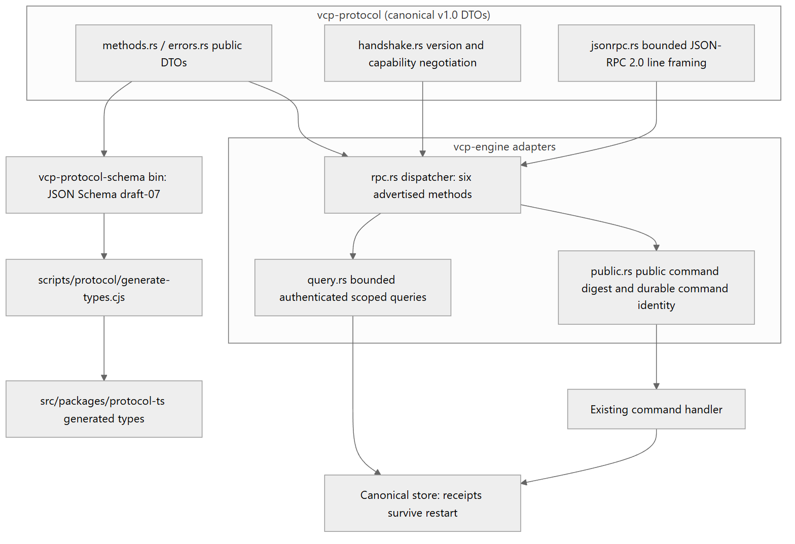
  *Shows the vcp-protocol DTOs, framing and handshake, the schema-to-TypeScript generation path, and the engine adapters that commit through the existing command handler and canonical store.*

### [PR #135](https://github.com/iokaio/vcp/pull/135) — P9-02: durable controller leases and RPC host dispatch

- **Merged:** 2026-09-23 · **Work items:** P9-02 (prerequisite increment) · **Size:** +2023/−32, 11 files
- **What happened**
  - Session-scoped canonical controller leases (`vcp-domain/controller.rs`, `vcp-engine/controller.rs`) with generation-bound host-local tokens, explicit release/recovery, and access-checked command receipts.
  - The store (`vcp-store/contract.rs`) validates reachable lease states and protects the reserved typed-record keys during writes and replay.
  - Extracted the `RpcHost` trait in `rpc.rs` so a future `vcp-lifecycle` adapter can own live execution and authority draining without reversing crate dependencies. The direct engine adapter and its six-method profile are kept.
  - Documented the design in `docs/development/local-attachment.md`.
- **Why**
  - Local attachment needs durable controller identity before any transport can grant mutation authority.
- **Decisions & records:** The `Access` key namespace `controller-<64 hex>` is reserved; a conflicting generic record fails closed and is never rewritten. Transfer means explicit release followed by acquisition, with no timeout takeover. Replaying an acquisition returns its receipt without recreating ownership. Restart invalidates tokens, and recovery never resumes tasks. The PR does not advertise an authenticated server.
- **Evidence:** 150 tests across domain, protocol, engine and store passed, including 5 both-backend controller scenarios and 7 store lease contracts.
- **Diagram:** Yes — 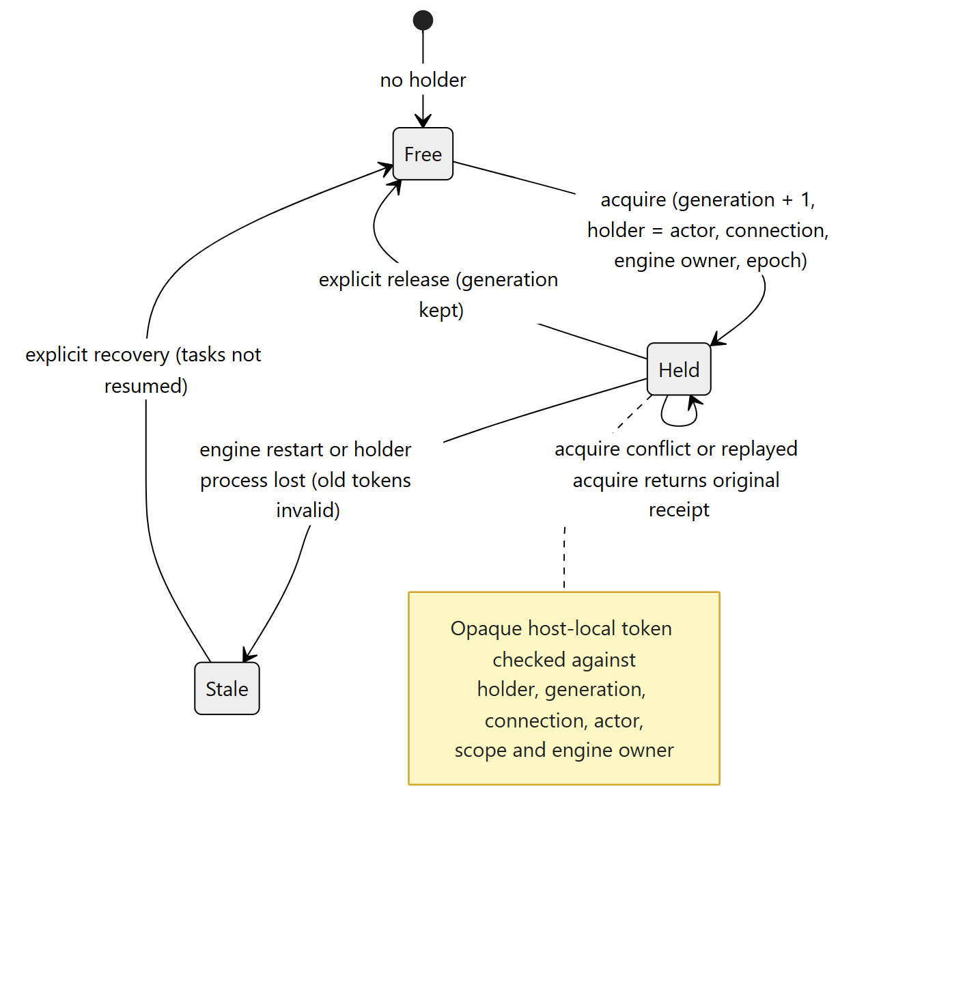
  *Shows the lease states (free, held, stale) with acquire, release, restart and recovery transitions, and the token binding checks.*

### [PR #136](https://github.com/iokaio/vcp/pull/136) — feat(lifecycle): bind public RPC to controller ownership and draining

- **Merged:** 2026-09-23 · **Work items:** P9-02 · **Size:** +2572/−44, 15 files
- **What happened**
  - Added `PublicConnection` (`vcp-lifecycle/src/foundation/worker/public_connection.rs`) and `public_rpc.rs`, binding public RPC steering to the retained lifecycle host.
  - Steering now seals admission, pauses tasks, drains owner work and revalidates the controller before committing the original durable command (`vcp-engine/src/public.rs`); opaque engine admission/pause proofs and shared concurrent owner drains introduced.
  - Disconnect pauses, drains and releases the lease while keeping observers and the canonical writer alive; startup fencing rejects late root attachment and requires reopening after interruption.
  - Fixed a pre-existing P8 fixture race (two clock reads widened a catalog window by 1 ms) in `p8-profile-renewal.test.cjs`.
- **Why**
  - Public clients must not be able to commit steering after losing controller authority or while retained work is still running; dropping a request waiter must not abandon or duplicate completion.
  - Interrupted authority intent is recorded without claiming a successful receipt, preserving truthful durable history.
- **Decisions & records:** No new ADR; no server capability advertised yet. Authenticated transports, live cursor delivery and remaining methods deferred within P9-02.
- **Evidence:** 68 engine/protocol + 30 lifecycle tests on native Windows/Rust 1.95; synthetic provider streams exercised dropped callers, controller loss, capture-capacity failure and exactly-one receipt on both stores.
- **Diagram:** Yes — 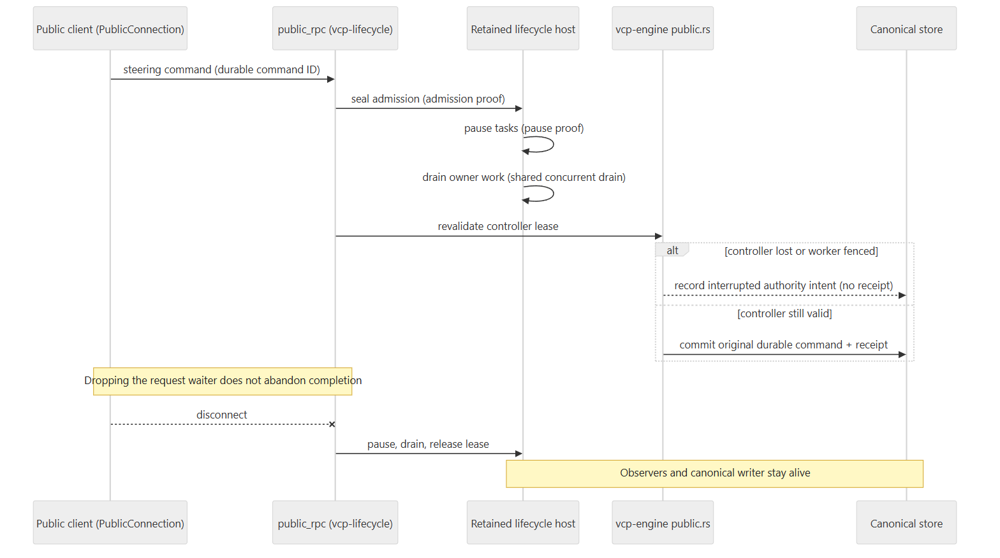
  *Shows seal → pause → drain → controller revalidation before the durable steering commit, and disconnect handling that keeps observers and the writer alive.*

### [PR #137](https://github.com/iokaio/vcp/pull/137) — feat(cli): add controlled Windows stdio attachment and controller RPC

- **Merged:** 2026-09-23 · **Work items:** P9-02 · **Size:** +3776/−65, 28 files
- **What happened**
  - New `vcp-cli/src/local/` module: `windows_launch.rs`, `windows_identity.rs`, `framed.rs`, `server.rs` — a native bridge launches a credential-free `local-server` over controlled Windows stdio.
  - Bridge pins executable and actual process identities, uses an exact inherited-handle allowlist, and passes the bootstrap challenge only over private pipes (never args/env/files).
  - Server opens an existing validated workspace under the real writer lock; does not start a provider or resume work.
  - Four optional controller wire methods (acquire/release/recover) added in `vcp-protocol/src/methods.rs` and `vcp-engine/src/controller.rs`; regenerated `protocol-ts` schema/types and v1 fixture.
  - Bounded frames, queues and shutdown waits; transport EOF synchronously invalidates admission before async cleanup.
- **Why**
  - A TypeScript client cannot establish the Windows inherited-handle trust contract with an ordinary child launch; a native helper must own launch and authentication so workspace content cannot choose the executable.
  - Controller ownership must be explicit, not implied by attaching.
- **Decisions & records:** ADR-044 controlled local process bootstrap (added). Named-pipe reconnect and live event recovery deferred.
- **Evidence:** 71 engine/protocol and 11 public-host tests; 5 tests against the compiled `vcp` binary (replay/release, writer exclusion, EOF cleanup, malformed bootstrap, oversized input); native handle-inheritance/process-pin tamper tests.
- **Diagram:** Not needed (covered by PR #138 topology diagram).

### [PR #138](https://github.com/iokaio/vcp/pull/138) — P9-02: authenticated Windows pipe attachment and reconnect

- **Merged:** 2026-09-23 · **Work items:** P9-02 · **Size:** +1872/−419, 11 files
- **What happened**
  - Added `vcp-cli/src/local/windows_pipe.rs`: optional named-pipe transport with current-user ACL, remote-client rejection and kernel peer authentication before protocol dispatch.
  - Controlled launch authenticates the pipe and acknowledges lifetime handoff before detaching the child guard; reconnect uses a server pin and random ticket held only in client memory.
  - Separate controller and observer tickets with role ceilings; all clients share one canonical writer; controller loss fences and drains while observers stay readable.
  - Server retains its idle writer 30 s after the last connection, then exits; framing (`framed.rs`) now preserves prefetched bytes and cancels stalled pumps, shared with stdio.
  - Test fixtures consolidated into `tests/support/local_fixture.rs`; new `local_pipe.rs`.
- **Why**
  - Stdio lifetime is tied to one bridge connection; clients (later the SDK and VS Code) need to reconnect to the same server without persisting credentials or implicitly regaining control.
- **Decisions & records:** ADR-044 extended with named-pipe handoff, ticket roles and idle lifetime. Authentication never acquires a lease or resumes execution.
- **Evidence:** 20 local unit tests, 5 compiled stdio + 3 compiled named-pipe tests (both stores, bad pins/tickets/role escalation, real 30 s idle expiry); foreign-user process not exercised.
- **Diagram:** Yes — 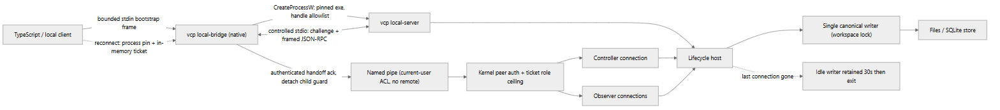
  *Shows the native bridge launch, stdio-to-pipe handoff, ticket-based controller/observer reconnect and the single shared canonical writer with 30 s idle retention.*

### [PR #139](https://github.com/iokaio/vcp/pull/139) — P9-02: connected task inspection, pause and cancellation

- **Merged:** 2026-09-23 · **Work items:** P9-02 · **Size:** +1843/−53, 11 files
- **What happened**
  - Authenticated clients can inspect tasks and pause/cancel current work without dropping their connection or controller lease (`vcp-engine/src/public.rs`, `rpc.rs`).
  - Live host validates task/turn scope and revisions, fences retained descendants through the shared CLI stop path (`worker/control.rs`), commits the caller's durable identity and owns interruption after acceptance.
  - Turn controls target the latest provable canonical turn; task selection uses creation history rather than opaque-ID ordering; inspection retains pending approvals and conservative effect status with output bounds.
  - Root stop also seals an outstanding constructor before a retained thread attaches.
- **Why**
  - Stop controls must reuse the CLI's proven stop semantics so API and CLI cannot diverge; duplicates must return the original receipt without another hold, and unknown effects/provider liabilities must stay retained.
- **Decisions & records:** none (documented in `docs/development/local-attachment.md`).
- **Evidence:** 76 engine/protocol, 13 public-host, 7 compiled production-process tests plus the both-store CLI control regression.
- **Diagram:** Not needed

### [PR #140](https://github.com/iokaio/vcp/pull/140) — P9-02: preserve durable identity through canonical resume

- **Merged:** 2026-09-23 · **Work items:** P9-02 · **Size:** +1876/−250, 16 files
- **What happened**
  - Added `worker/public_resume.rs`: trusted resume revalidation preserving the caller's command ID and original intent; same-key retry returns the durable receipt before releasing holds, reconciling effects or collecting MCP proofs.
  - New acceptance requires current controller authority, answered actionable questions, current environment/budget, reconciled effects and completed retained interruption.
  - Question-freshness predicates moved from `vcp-cli/src/questions.rs` into `vcp-engine/src/questions.rs` for CLI/API sharing.
  - Fixed release/disconnect/steering cleanup to close idle owned MCP connections before waiting on scheduler leases.
- **Why**
  - Canonical resume is the prerequisite for server-owned execution; resume must not duplicate effects or bypass unresolved questions/liabilities.
- **Decisions & records:** none; `session/resume` not yet advertised on the transport.
- **Evidence:** 80 engine/protocol and 19 public-host tests; both-store concurrent replay, stale authority, unknown-effect liability and exact real MCP approvals.
- **Diagram:** Not needed

### [PR #141](https://github.com/iokaio/vcp/pull/141) — feat(p9): own local execution and bounded observation recovery

- **Merged:** 2026-09-23 · **Work items:** P9-02 · **Size:** +6659/−258, 61 files
- **What happened**
  - Configured local servers can resume a paused root through an owned retained session (`vcp-cli/src/local/execution.rs`, `execution_profile.rs`); CLI and server share event ownership and completion handling (`vcp-cli/src/execution.rs`, `session.rs`).
  - Added atomic session snapshots (`vcp-engine/src/snapshot.rs`), bounded connection-owned event replay (`subscription.rs`, `worker/public_events.rs`), scoped artifact range reads and exact root usage totals (`public_reads.rs`).
  - `worker/capture_recovery.rs`: an interrupted provider response is readable after restart only with exact canonical capture/accounting acknowledgement; unresolved liability still blocks execution.
  - Canonical shutdown now precedes retained thread shutdown; bridge reports failed child exits without forwarding private diagnostics.
- **Why**
  - Reconnect/restart must never repeat accepted execution, and observers need recoverable, bounded snapshot+event streams rather than unbounded live delivery.
- **Decisions & records:** ADR-045 owned local execution (added). P8 remains closed per ADR-042; no provider/environment gaps converted to passing evidence.
- **Evidence:** 89 engine/protocol and 10 audit-history tests; exact budget-service settlement/unknown-liability restart on both stores; schema regeneration and strict TypeScript check.
- **Diagram:** Not needed

### [PR #142](https://github.com/iokaio/vcp/pull/142) — feat(p9): expose scoped workspace and retained inspectors

- **Merged:** 2026-09-23 · **Work items:** P9-02 · **Size:** +1411/−3, 13 files
- **What happened**
  - Observer workspace lookup (`worker/public_workspace.rs`) verifies the exact authenticated host/root and reports trust/revisions without creating receipts, leases, bindings or execution; initialization advertises the binding's host ID.
  - Context/routing evidence inspectors (`vcp-engine/src/public_evidence.rs`) return bounded artifact references with scoped, revision-bound pagination.
  - Current authorization and retention re-applied per page; missing/aborted/redacted content stays marked incomplete, while required exclusions (auth headers, recovery material) do not make evidence "partial".
- **Why**
  - Clients need read-only access to retained evidence without gaining authority; artifact bytes stay behind the existing hash-verifying range API.
- **Decisions & records:** none.
- **Evidence:** 92 engine/protocol tests; 2 both-store live-host workspace tests; 2 compiled process tests (stale cursors after real commit, snapshot replay).
- **Diagram:** Not needed

### [PR #143](https://github.com/iokaio/vcp/pull/143) — feat(p9): create atomic metadata session forks

- **Merged:** 2026-09-23 · **Work items:** P9-02 · **Size:** +1949/−17, 20 files
- **What happened**
  - Exposed `session/fork`: a current source controller atomically creates an ancestry-linked session and pending root from a retained completed turn (`vcp-engine/src/fork.rs`, `vcp-protocol/src/command/fork.rs`).
  - Store admits only a narrowly validated two-event/two-insert genesis transaction (`vcp-store/src/fork_contract.rs`); receipt stays source-scoped with deterministic target correlation.
  - Forks inherit no execution authority, budgets, approvals or provider liability.
- **Why**
  - Forking must not leave partial or duplicate sessions under collisions, historical selection or replay, and must not smuggle authority into the new session.
- **Decisions & records:** ADR-046 atomic metadata session forks (added).
- **Evidence:** 94 engine/protocol and 76 store tests incl. 13 forged-transaction cases; compiled authenticated-process fork test on Files and SQLite.
- **Diagram:** Not needed

### [PR #144](https://github.com/iokaio/vcp/pull/144) — feat(p9): accept and execute durable public runs

- **Merged:** 2026-09-23 · **Work items:** P9-02 · **Size:** +3588/−64, 28 files
- **What happened**
  - `turn/start` supported through configured local execution (`vcp-engine/src/public_start.rs`, `worker/public_start.rs`, `vcp-cli/src/local/execution/start.rs`).
  - Task, turn, input capture, empty ledger and original receipt commit atomically before construction; only fresh acceptance mints the controller-bound startup ticket that activates the root and submits the turn.
  - Optional private `root_task` launch selection fixes the root before host creation, matched against pinned profile and effective budget.
  - Original request ceilings and absolute deadlines enforced by shared admission across reconnect, profile changes and CLI resume.
- **Why**
  - Retries or restarts must return the original receipt without another constructor or effect; missing creation evidence must not remove budget/deadline limits.
- **Decisions & records:** ADR-047 durable public run start (added).
- **Evidence:** 98 engine/protocol, 30 live public-host and 91 CLI unit tests; 3 compiled-process cases (both-store start with restart replay, connected pause/resume, named-pipe owner loss/reconnect); synthetic loopback providers only.
- **Diagram:** Yes — 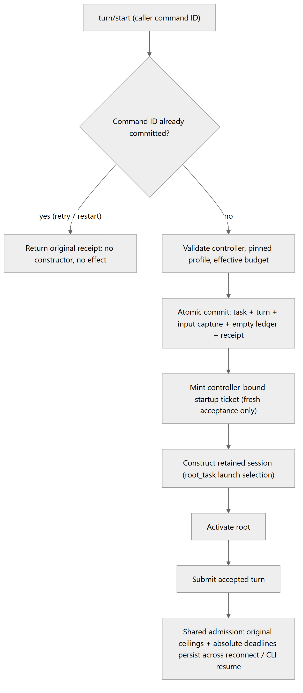
  *Shows replay short-circuit versus atomic acceptance, startup-ticket minting, root activation and persistent admission limits.*

### [PR #145](https://github.com/iokaio/vcp/pull/145) — P9-02: qualify pending approval reconnect

- **Merged:** 2026-09-23 · **Work items:** P9-02 · **Size:** +712/−12, 12 files
- **What happened**
  - Added negotiated `approval/source-revisions/1` capability with optional generated effect/policy revision fields on task and snapshot responses.
  - Compiled Windows-pipe fixture: real policy-gated patch approval, controller drop, reconnect/reacquire, stale/unauthorized answers rejected, accepted denial replayed by durable identity.
- **Why**
  - Bug found: pending-input results omitted revisions required by `approval/respond`, so an API client could not answer from public state.
  - Fields are capability-gated to keep strict v1.0 decoding for older clients.
- **Decisions & records:** ADR-048 capability-gated result fields (added) — establishes the compatibility policy reused by later capability profiles.
- **Evidence:** 100 engine/protocol tests; compiled `local_pending_input` both-store scenario; schema regeneration/drift and strict TypeScript.
- **Diagram:** Not needed

### [PR #146](https://github.com/iokaio/vcp/pull/146) — P9-02: retained diff inspection and interrupted-client recovery

- **Merged:** 2026-09-23 · **Work items:** P9-02 · **Size:** +2005/−9, 24 files
- **What happened**
  - Registered file tools retain a typed `vcp-public-diff/1` capture (`vcp-domain/src/public_diff.rs`, `worker/tools.rs`); `diff/read` validates effect linkage and private source proof and returns bounded artifact bytes (`vcp-engine/src/public_diff.rs`).
  - Diff documents describe a proposal and are stable after later workspace edits; retention, incomplete-source and corruption fail closed.
  - Compiled qualification of two transport scenarios: durable acceptance before an unread response survives a pinned-server crash with same-key replay; an abandoned output reader loses controller on timeout while observers remain usable.
  - Upstream Codex lockfile change recorded as reconstructible patch `0038-p9-public-diff-workspace.patch` (existing base64 0.22.1 reused).
- **Why**
  - API clients need to review the exact prepared change by canonical tool-effect identity, not the current workspace state.
- **Decisions & records:** ADR-049 retained public diff evidence (added); third-party patch 0038 in `src/third_party/patches/codex/`.
- **Evidence:** 90 domain/engine and 30 lifecycle-host tests; compiled pending approval/diff and crash/abandoned-reader tests on Files and SQLite; full 7,940-file reconstruction verification passed.
- **Diagram:** Not needed

### [PR #147](https://github.com/iokaio/vcp/pull/147) — P9-02: governed memory inspection and CLI parity

- **Merged:** 2026-09-23 · **Work items:** P9-02 · **Size:** +2324/−5, 20 files
- **What happened**
  - `memory/inspect` reads authorized claim/version history via the governed memory API (`worker/public_memory.rs`, `vcp-protocol/src/memory.rs`), gated by negotiated `memory/inspection-state/1`.
  - Read-only scope derived from authenticated actor/session and task fingerprint; version filtering after claim authorization; no search, indexing, model call or mutation.
  - Added compiled CLI/API execution parity test (`local_execution_parity.rs`): identical accounting/effect/verification outcomes on both stores.
- **Why**
  - Expose memory governance state to clients without widening authority; legacy method-only clients get a capability error before dispatch; bounded sizes fail explicitly instead of truncating.
- **Decisions & records:** ADR-050 governed public memory inspection (added).
- **Evidence:** 107 engine/protocol tests; compiled observer fixture across retained/disputed/pruned/purged states with unchanged canonical digests; CLI/API parity with exactly three synthetic requests.
- **Diagram:** Not needed

### [PR #148](https://github.com/iokaio/vcp/pull/148) — P9-02: authenticated retained memory queries

- **Merged:** 2026-09-23 · **Work items:** P9-02 · **Size:** +1712/−60, 22 files
- **What happened**
  - `memory/query` returns artifact or governed claim/version sources via `worker/public_memory_query.rs`, gated by `memory/query-sources/1`; results keep digests/ranges, scope, governance status and explicit degradation/truncation.
  - Reuses the CLI lexical search runner without indexing, model loading or canonical writes.
  - New opaque search entry in `vcp-memory/src/retrieval.rs`/`publication.rs` uses the capture's pinned snapshot while keeping generation components private.
- **Why**
  - Bug found: a compiled mixed-task fixture showed existing generation recovery rejected task-scoped readers; the fix preserves task restriction through final authorization while existing generation-view APIs still reject restricted readers.
- **Decisions & records:** ADR-051 authenticated public memory query (added).
- **Evidence:** 110 engine/protocol tests; compiled both-store observer fixture with mixed-task isolation and unchanged canonical state; model-inference asset gate remained unrun.
- **Diagram:** Not needed

### [PR #149](https://github.com/iokaio/vcp/pull/149) — P9-02: explicit governed memory review

- **Merged:** 2026-09-23 · **Work items:** P9-02 · **Size:** +5888/−236, 30 files
- **What happened**
  - Clients submit typed memory candidates, inspect pending review after reconnect and resolve under the current controller lease (`vcp-memory/src/review.rs`, `vcp-domain/src/memory_review.rs`, `vcp-store/src/memory_review_contract.rs`, `vcp-protocol/src/memory_governance.rs`).
  - Pending submissions create no recall version; accept runs existing governance (may end disputed/rejected); decision, governed result, version/index intent and public receipt commit together.
  - Original prose request shape refused by the host rather than interpreted; negotiated via `memory/governance/1`; source-driven purge erases candidate/decision payloads while keeping identity (`redaction_contract.rs`).
- **Why**
  - Adds the manual review path the memory design already allowed, without changing automatic ingestion gates; actor/scope/authority stay host-owned.
- **Decisions & records:** ADR-052 explicit public memory review (added).
- **Evidence:** 112 engine/protocol and 93 domain/store tests; compiled named-pipe fixture on both stores (61.91 s) covering all four decision outcomes, replay and legacy refusal.
- **Diagram:** Not needed

### [PR #150](https://github.com/iokaio/vcp/pull/150) — P9-02: scoped local session export

- **Merged:** 2026-09-23 · **Work items:** P9-02 · **Size:** +3134/−3, 24 files
- **What happened**
  - `session/export` (profile `session/export-local/1`) creates a bounded local payload plus visibility manifest under the controller; both outputs and the public receipt commit atomically (`vcp-audit/src/session_export.rs`, `vcp-store/src/export_contract.rs`, `vcp-engine/src/public_export.rs`).
  - Exports event metadata and optionally exact retained artifact octets; arbitrary event data/payloads explicitly omitted, `complete` stays false; no output path or upload grant accepted.
  - Readers reject outputs after source, policy, authority or retention changes; retention graph (`vcp-memory/src/retention_exports.rs`) follows acceptance to both output spools for deletion closure.
- **Why**
  - Reviews found three defects fixed here: allocation before limit check (now capped borrowing serialization), missing immediate lifecycle hold on interrupted capture spool, and derived export bytes missing from source-deletion closure.
- **Decisions & records:** ADR-053 scoped local session export (added).
- **Evidence:** 15 audit tests incl. 5 both-store export cases; 2 compiled production-bridge tests on both stores; 13-test combined audit/export/retention gate.
- **Diagram:** Not needed

### [PR #151](https://github.com/iokaio/vcp/pull/151) — P9-02: scoped forgetting and local API acceptance

- **Merged:** 2026-09-23 · **Work items:** P9-02 (accepted) · **Size:** +4738/−110, 30 files
- **What happened**
  - `memory/retention/1` profile: read-only frozen previews/pages and job inspection plus controller-only `memory/forget` (`worker/public_retention.rs`, `vcp-memory/src/retention_public.rs`, `vcp-protocol/src/memory_retention.rs`).
  - Shared retention workflow with an authenticated task ceiling at preview/apply/replay/cleanup; foreign dependencies reject the whole selection.
  - Public receipt commits with logical deletion and the durable cleanup job; retries reconcile and continue the same job without another deletion epoch; MCP work held before acceptance and drained before cleanup.
  - Explicit bounds (`retention_limits.rs`): 2 previews/connection, 60 s, 1 MiB, 8,192 identities; pages ≤128 targets/240 KiB; 16 MiB pre-allocation hashing bound.
  - Plan/traceability record P9-02 acceptance.
- **Why**
  - Final non-editor P9-02 adapter; forgetting must survive abandoned waiters and controller loss without automatically resuming work.
- **Decisions & records:** ADR-054 scoped public retention (added). Editor-specific methods remain unadvertised until P4.
- **Evidence:** 32 protocol tests; 2 compiled bridge tests on both stores (61.41 s); lifecycle test with 4 real MCP scenarios; independent reviews' findings fixed.
- **Diagram:** Not needed

### [PR #152](https://github.com/iokaio/vcp/pull/152) — P9-03: TypeScript SDK with compiled-server qualification

- **Merged:** 2026-09-23 · **Work items:** P9-03 (accepted) · **Size:** +2626/−11, 44 files
- **What happened**
  - New private ESM package `@vcp/sdk` 0.1.0 (`src/packages/sdk-ts/`) built on generated `@vcp/protocol` types/schema: `client.ts`, `local.ts`, `codec.ts`, `validation.ts`, `subscriptions.ts`, `errors.ts`, plus 7 example modules.
  - Launches/reattaches through the native bridge with attachment tickets in opaque in-memory handles; typed result envelopes, explicit durable command identities, receipt reconciliation, pull-based events/snapshots.
  - No automatic mutation retry, controller acquisition, input response or resume; bounded frames, queues and deadlines; cancelled calls keep their wire slot until response/deadline.
  - CI installs pinned SDK tooling and runs runtime/example tests.
- **Why**
  - Provide the typed consumer surface the VS Code extension (P4-01) depends on, without adding implicit authority or retries.
- **Decisions & records:** ADR-055 TypeScript local SDK (added); `docs/development/typescript-sdk.md`. No npm publication.
- **Evidence:** 29 SDK tests incl. clean offline install; 4 compiled Windows server tests on both stores (64.34 s) incl. 128-call admission pressure and delayed-delivery reconciliation; import verified in VS Code 1.138.0's embedded Node 24.18.1.
- **Diagram:** Not needed (layering shown in PR #153 diagram).

## Era 12 — P4 VS Code extension (#153–#163)

The extension connects through the SDK as an observer first (ADR-056). It then qualified trust, moved roots and reload (ADR-057), task views and durable actions (ADR-058), and versioned buffer edits that never overwrite human typing (ADR-059). The inspector back-ends followed: history and memory queries, policy and routing, optimizer commands, and the encrypted publisher (ADR-060–063). The governed inspector UI completed P4-04 (ADR-064), followed by actual VSIX installation, upgrade recovery and large-history startup qualification for P4-05. All five P4 items are accepted in the documented Windows/VS Code envelope; that does not imply signed releases, Marketplace publication or remote-editor support.

### [PR #153](https://github.com/iokaio/vcp/pull/153) — feat(vscode): connect workspace view through the local SDK

- **Merged:** 2026-09-23 · **Work items:** P4-01 · **Size:** +1529/−8, 34 files
- **What happened**
  - New `src/packages/vscode/` extension: Workspace view with observer-only Connect/Refresh/Disconnect (`engine_connection.ts`, `commands.ts`, `connection_view.ts`, `workspace_map.ts`, `trust.ts`).
  - Selects an existing root by URI; executable/data paths read only from User settings; displays engine identity, trust and pending decisions; invalidates stale connections without acquiring control or resuming work.
  - Staging script packages the SDK and canonical schema without repository runtime links; CI builds and tests the extension.
- **Why**
  - Begin P4 after P9-01..03 completed; keep the editor an observer until trust/rebind and reload semantics are qualified.
- **Decisions & records:** ADR-056 editor observer connection (added); `docs/development/editor-connection.md`. Full P4-01 acceptance left open.
- **Evidence:** 16 extension tests; actual VS Code 1.138.0 extension host in Restricted Mode against both stores with canonical state unchanged; host run exposed and fixed an unsupported manifest selector.
- **Diagram:** Yes — 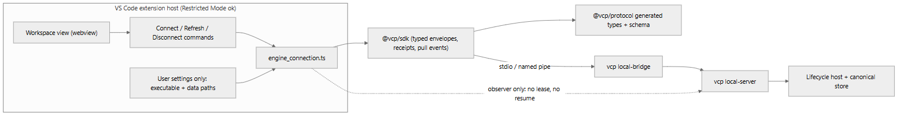
  *Shows the VS Code extension → @vcp/sdk → native bridge → local server chain and the observer-only boundary.*

### [PR #154](https://github.com/iokaio/vcp/pull/154) — P4-01: expose durable workspace root and binding revision

- **Merged:** 2026-09-23 · **Work items:** P4-01 · **Size:** +306/−16, 19 files
- **What happened**
  - Added capability-gated `root_id` and `binding_revision` to `workspace/open` (`vcp-protocol/src/methods.rs`, `vcp-engine/src/rpc.rs`, `worker/public_workspace.rs`); regenerated schema/TypeScript.
  - Editor workspace map and view consume both values, requiring the capability and rejecting missing/null values; decimal strings preserve 64-bit precision.
- **Why**
  - The editor map could see the canonical path but not the engine's root identity or binding revision needed for later trust/rebind and moved-root handling.
- **Decisions & records:** none (follows ADR-048 capability-gating); older v1 clients keep original shape.
- **Evidence:** lifecycle, protocol (32), SDK (30) and extension (16) tests; native VS Code `local_editor` on both stores in restricted mode.
- **Diagram:** Not needed

### [PR #155](https://github.com/iokaio/vcp/pull/155) — P4-01: qualify trust, moved roots and observer reload

- **Merged:** 2026-09-24 · **Work items:** P4-01 (accepted) · **Size:** +1758/−195, 44 files
- **What happened**
  - Editor sends revision-checked engine trust commands and reconciles moved roots via native rebind (`sdk-ts/src/rebind.ts`, `vscode/src/recovery.ts`, `worker/public_rpc.rs`).
  - Authenticated observer connections restored across VS Code reload without persisting credentials or taking another client's controller lease (`windows_pipe.rs`, `local/mod.rs`).
  - Legacy native bootstrap readiness kept via explicit opt-in.
- **Why**
  - Complete P4-01 acceptance: trust revocation of queued work, moved-root identity preservation, and reload with pending input and another controller.
- **Decisions & records:** ADR-057 editor trust and observer recovery (added). Limit: observer-only servers keep a 30 s idle window, so controller reconnection may need retry.
- **Evidence:** extension 26, SDK 33, protocol 32, native pipes 5 tests; actual VS Code 1.138.0 reload harness (isolated dev driver with persistent storage, since `extensionTestsPath` uses in-memory storage).
- **Diagram:** Not needed

### [PR #156](https://github.com/iokaio/vcp/pull/156) — feat(editor): complete P4-02 task views and durable actions

- **Merged:** 2026-09-24 · **Work items:** P4-02 (accepted) · **Size:** +3714/−37, 39 files
- **What happened**
  - Added `task/presentation` (`vcp-engine/src/public_presentation.rs`, `worker/public_presentation.rs`) with generated protocol/SDK support.
  - Extension task and child views (`task_session.ts`, `task_projection.ts`, `task_panel.ts`, `task_actions.ts`) follow canonical snapshots/events, resync after dropped subscriptions and show bounded objectives, questions, model provenance, commentary, evidence and ledger cost.
  - Controller actions use opaque handles and durable command IDs so duplicate clicks, stale approvals, lost replies and profile switches preserve authority.
  - Native launcher rejects restricted-token launches, validates runtime assets and isolates shared storage.
- **Why**
  - Deliver the editor task surface on top of engine-canonical state; launcher fixes addressed startup error dialogs seen during qualification.
- **Decisions & records:** ADR-058 editor task presentation (added); `docs/development/editor-tasks.md` records qualification boundaries (e.g., positive approval covered by SDK, mid-RPC lost replies by portable tests).
- **Evidence:** extension 69, SDK 33, protocol 32 tests; 2 actual VS Code 1.138.0 native scenarios incl. both-store CLI parity, dropped subscriptions, stale/duplicate actions and reload.
- **Diagram:** Not needed

### [PR #157](https://github.com/iokaio/vcp/pull/157) — feat(editor): qualify versioned buffer edits (P4-03)

- **Merged:** 2026-09-24 · **Work items:** P4-03 (accepted) · **Size:** +6724/−92, 56 files
- **What happened**
  - Negotiated editor API (`vcp-protocol/src/editor.rs`, `vcp-engine/src/editor.rs`, `worker/public_editor/`) binding changes to document-open identity, version, text hash, native disk/root identity and current engine authority.
  - Per-file durable dispatch intent and observed receipts (applied/rejected/unknown); typing conflicts preserve user text; partial application stays partial; reload reads outcomes without replay.
  - Extension adds transient drafts/native previews, explicit execution-task launch, per-profile command journals and observation retirement (`editor_buffers.ts`, `editor_changes.ts`, `editor_journal.ts`, `editor_workflow.ts`).
  - Persisted editor records moved to schema v2 (`vcp-store/src/editor_contract.rs`) so pre-editor readers reject the store and generic projection deletion is refused; disk-only verification fencing in `verification.rs`.
- **Why**
  - URI+version alone cannot identify an observation across close/reopen/reload; edits must never overwrite concurrent human typing or be replayed after lost replies.
- **Decisions & records:** ADR-059 versioned editor edits (added); persisted-compatibility boundary via schema v2; VSIX install/update deferred to P4-05; actual older-binary downgrade not run.
- **Evidence:** extension 108, engine 72, store 11 tests; actual VS Code 1.138.0 typing-race/undo/BOM/CRLF primitive qualification; full staged workflow on both stores (82.69 s).
- **Diagram:** Yes — 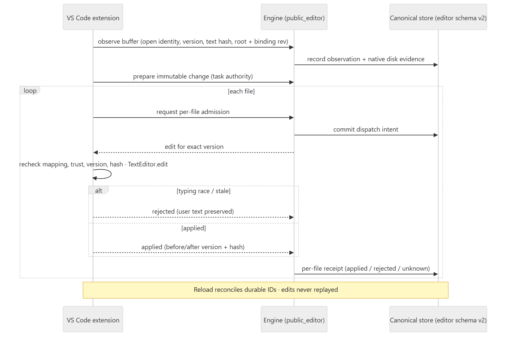
  *Shows observation binding, immutable preparation, per-file admission with durable dispatch intent, version-checked application and receipts.*

### [PR #158](https://github.com/iokaio/vcp/pull/158) — P4-04: expose governed history and memory query pages

- **Merged:** 2026-09-24 · **Work items:** P4-04 · **Size:** +3083/−21, 32 files
- **What happened**
  - Negotiated observer methods `history/query` and `memory/history` (`worker/public_history.rs`, `worker/public_memory_history.rs`, `vcp-protocol/src/history.rs`, `memory_history.rs`) with generated wire types and SDK mappings.
  - Event rows carry bounded metadata and artifact availability; memory versions keep current evidence/retention states; session-scoped history includes taskless events but excludes foreign artifacts and inaccessible tasks.
  - Every continuation rechecks authority and access; cursors keep stable ordering without preserving revoked access (`vcp-audit/src/history_query.rs`).
- **Why**
  - Query prerequisite for P4-04 inspectors: editors need paged history without bypassing scope or retention.
- **Decisions & records:** ADR-060 governed inspector queries (added); `docs/development/editor-inspectors.md`.
- **Evidence:** native both-store history/memory tests; compiled-host SDK parity with read-only qualification; 33 SDK and 108 extension tests.
- **Diagram:** Not needed

### [PR #159](https://github.com/iokaio/vcp/pull/159) — P4-04: expose scoped policy and routing inspection

- **Merged:** 2026-09-24 · **Work items:** P4-04 · **Size:** +5173/−694, 30 files
- **What happened**
  - Negotiated observer methods `policy/read` and `routing/status` (`worker/public_policy.rs`, `worker/public_routing_inspection.rs`, `vcp-protocol/src/policy_inspection.rs`, `routing_inspection.rs`) with bounded pages and current scope/revision checks.
  - Policy observations separate stored constraints, effective constraints and grant provenance; scoped observers cannot read shared grant identities or invocation payloads.
  - Routing observations separate persisted policy from host-effective ceilings and require current catalog-source scope/retention; SDK validates the unsigned 16-bit routing quality field.
- **Why**
  - Editors must inspect policy and routing without inheriting host-owner authority; neither route captures reports, changes policy or dispatches work.
- **Decisions & records:** ADR-061 policy/routing inspection (added).
- **Evidence:** Files/SQLite policy and routing tests; compiled-host SDK parity with unchanged canonical state; generated-schema checks.
- **Diagram:** Not needed

### [PR #160](https://github.com/iokaio/vcp/pull/160) — feat: expose reconciled optimizer commands (P4-04)

- **Merged:** 2026-09-24 · **Work items:** P4-04 · **Size:** +5775/−48, 40 files
- **What happened**
  - Optional `routing/optimizer/1` profile: governed report capture/read, exact apply/rollback previews and policy publication (`routing_state/public_optimizer.rs`, `worker/public_optimizer/`, `vcp-protocol/src/routing_optimizer.rs`).
  - Report/artifact publication and the caller-bound receipt commit atomically; commands require current controller ownership; observers read only authorized session reports.
  - Preview/publication enforce current trust, binding, policy, preferences and host ceilings; a CLI policy change invalidates stale previews; accepted commands replay before consulting the connection-local preview cache; 64 KiB page/preview bounds with cooperative cancellation.
- **Why**
  - Inspector optimizer actions must reconcile after editor reloads and lost replies without bypassing provider admission fences.
- **Decisions & records:** ADR-062 editor optimizer commands (added). Public replay does not dedupe with legacy CLI command IDs.
- **Evidence:** protocol 26+3, engine 73, lifecycle projection tests; configured adapter on both stores (apply/rollback, concurrent CLI publication, controller replacement); process-kill qualification; compiled CLI/SDK run with zero provider requests.
- **Diagram:** Not needed

### [PR #161](https://github.com/iokaio/vcp/pull/161) — feat: expose scoped encrypted publisher commands (P4-04)

- **Merged:** 2026-09-24 · **Work items:** P4-04 · **Size:** +4064/−93, 43 files
- **What happened**
  - `backup/publisher/1` status/create/read/retry/cancel (`worker/public_backup.rs`, `vcp-protocol/src/backup_publisher.rs`, `vcp-cli/src/backup/publisher.rs`) with caller/session-bound intent before capture and exact receipt replay.
  - Background work rechecks controller/trust/binding authority through capture, encryption and copy admission (`backup_manager.rs`, `backup_run.rs`); cancellation preserves already-admitted publication and cleanup facts.
  - Explicit native controller-launch profile loads independently enrolled recovery material; key bytes stay native, key file and single-link Git executable are pinned (`vcp-repository/src/git.rs`); observer reconnect never loads keys.
  - SDK example `encrypted-publisher.ts` and native qualification test added.
- **Why**
  - P4-04 could not send editor-directed encrypted exports through the existing publisher with durable receipts and editor lease fencing.
- **Decisions & records:** ADR-063 editor encrypted publisher (added). Acceptance means durable intent, not completion; cloud transfer and public restore verification not observed; revocation cannot retract exported bytes.
- **Evidence:** protocol, engine (73) and lifecycle adapter tests; actual CLI/SDK Files+SQLite qualification (65.06 s) with encrypted/signed known-head verification, zero provider calls; repository link check (442 Markdown files, 2,582 links).
- **Diagram:** Not needed

### [PR #162](https://github.com/iokaio/vcp/pull/162) — feat(vscode): complete governed inspectors (P4-04)

- **Merged:** 2026-09-24 · **Work items:** P4-04 (accepted) · **Size:** +3525/−35, 38 files
- **What happened**
  - Added nine governed editor inspector views backed by the engine APIs. Paging and artifact ranges reauthorize reads; task, trust, retention, visibility and connection changes invalidate transient content and actions.
  - Optimizer and pruning reviews retain exact engine revisions. Durable commands save their identity before submission and reconcile across reload without replay.
  - Encrypted publication requires explicit native profile selection and distinguishes local publication, cloud transfer and restore evidence.
- **Why**
  - The API prerequisites in #158–#161 needed actual editor presentation, guarded actions and native renderer qualification before P4-04 could be accepted.
- **Decisions & records:** ADR-064 governed editor inspectors; [inspector acceptance](../development/editor-inspectors.md#p4-04-acceptance). Windows/VS Code 1.138.0 qualified. Initial optimizer authoring exposes three fields; full policy review remains available. Missing pruning job references cannot be recreated from command acceptance alone.
- **Evidence:** 157 extension tests and 18 fast checks; actual editor/engine on both stores: observer paging, retention invalidation, preview expiry, reload and controller preservation (161.29 s), optimizer apply/stale rejection/rollback (76.08 s), and encrypted publication with independent vault verification and receipt recovery (104.99 s). Local publication does not establish cloud transfer or restore activation; the final wrong-job guard has focused portable coverage.
- **Diagram:** Not needed (observer layering remains as shown in #153).

### [PR #163](https://github.com/iokaio/vcp/pull/163) — feat(vscode): qualify packaging and native startup (P4-05)

- **Merged:** 2026-09-24 · **Work items:** P4-05 (accepted) · **Size:** +3267/−108, 29 files
- **What happened**
  - Added a real Windows VSIX built with pinned VSCE, an allowlisted SDK/schema bundle, independent archive inventory and required license/notice files. The engine remains separately installed and selected only through a trusted absolute User setting.
  - Fixed retained-history startup exceeding the old 10-second bound: native launch now has a 60-second aggregate readiness deadline and SDK launch 65 seconds. Attach/authentication bounds remain unchanged; failed or cancelled startup terminates only its newly owned child.
  - Qualified actual installation, reload/restart, rejected update with a usable original, successor installation, engine replacement, missing-engine diagnostics and uninstall while preserving canonical state and independent key-material bytes.
- **Why**
  - Installed-directory fixtures did not prove VSIX delivery. A 130-version history also exposed slow canonical replay that prevented native/SDK readiness despite valid state.
- **Decisions & records:** ADR-012 selects the separate native package/VSIX mechanism; [packaging acceptance, artifact hashes and recovery sequence](../development/editor-packaging.md). Windows x64 10.0.26200.0 and VS Code 1.138.0 only; unsigned local candidates, no Marketplace publication or formal release-build provenance. The 0.1.1 successor uses the same source and GUI engine replacement the same native build at another path; neither proves arbitrary binary downgrade safety.
- **Evidence:** 158 extension tests, 35 SDK tests and 18 fast checks; actual VSIX lifecycle on both stores (317.91 s), installed editor typing/partial-edit/save/undo/reload races (124.18 s), and actual native-installer interruption/recovery/incompatible-state rejection/uninstall passed. The 130-version startup/early-disconnect probe passed on both stores (265.92 s, warm OS cache); a subsequent error-only cleanup refinement passed its real-child regression, followed by final native attachment (5), pipe/reconnect (5) and ordinary inspector tests. The large-history probe was not rerun against the final artifact hash.
- **Diagram:** Not needed (the updated overview records completion; #153 and #157 retain the connection and edit boundaries).
